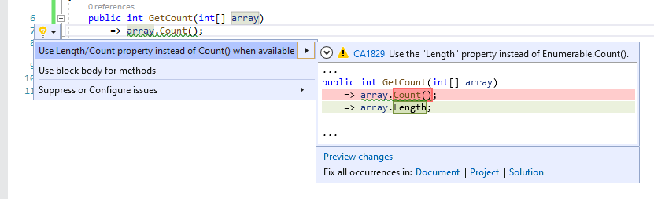

# CA1829: Use Length/Count property instead of Enumerable.Count method

| Property                            | Value                                                        |
|-------------------------------------|--------------------------------------------------------------|
| **Rule ID**                         | CA1829                                                       |
| **Title**                           | Use Length/Count property instead of Enumerable.Count method |
| **Category**                        | [Performance](performance-warnings.md)                       |
| **Fix is breaking or non-breaking** | Non-breaking                                                 |
| **Enabled by default in .NET 7**    | No                                                           |

## Cause

The <xref:System.Linq.Enumerable.Count%2A> LINQ method was used on a type that supports an equivalent, more efficient `Length` or `Count` property.

## Rule description

This rule flags the <xref:System.Linq.Enumerable.Count%2A> LINQ method calls on collections of types that have equivalent, but more efficient `Length` or `Count` property to fetch the same data. `Length` or `Count` property does not enumerate the collection, hence is more efficient.

This rule flags <xref:System.Linq.Enumerable.Count%2A> calls on the following collection types with `Length` property:

- <xref:System.Array?displayProperty=fullName>
- <xref:System.Collections.Immutable.ImmutableArray%601?displayProperty=fullName>

This rule flags <xref:System.Linq.Enumerable.Count%2A> calls on the following collection types with the `Count` property:

- <xref:System.Collections.ICollection?displayProperty=fullName>
- <xref:System.Collections.Generic.ICollection%601?displayProperty=fullName>
- <xref:System.Collections.Generic.IReadOnlyCollection%601?displayProperty=fullName>

The analyzed collection types may be extended in the future to cover more cases.

## How to fix violations

To fix a violation, replace the <xref:System.Linq.Enumerable.Count%2A> method call with use of the `Length` or `Count` property access. For example, the following two code snippets show a violation of the rule and how to fix it:

```csharp
using System.Collections.Generic;
using System.Linq;

class C
{
    public int GetCount(int[] array)
        => array.Count();

    public int GetCount(ICollection<int> collection)
        => collection.Count();
}
```

```csharp
using System.Collections.Generic;

class C
{
    public int GetCount(int[] array)
        => array.Length;

    public int GetCount(ICollection<int> collection)
        => collection.Count;
}
```

> [!TIP]
> A code fix is available for this rule in Visual Studio. To use it, position the cursor on the violation and press <kbd>Ctrl</kbd>+<kbd>.</kbd> (period). Choose **Use Length/Count property instead of Count() when available** from the list of options that's presented.
>
> 

## When to suppress warnings

It's safe to suppress a violation of this rule if you're not concerned about the performance impact from unnecessary collection enumeration to compute the count.

## Suppress a warning

If you just want to suppress a single violation, add preprocessor directives to your source file to disable and then re-enable the rule.

```csharp
#pragma warning disable CA1829
// The code that's violating the rule is on this line.
#pragma warning restore CA1829
```

To disable the rule for a file, folder, or project, set its severity to `none` in the [configuration file](../configuration-files.md).

```ini
[*.{cs,vb}]
dotnet_diagnostic.CA1829.severity = none
```

For more information, see [How to suppress code analysis warnings](../suppress-warnings.md).

## Related rules

- [CA1826: Use property instead of Linq Enumerable method](ca1826.md)
- [CA1827: Do not use Count/LongCount when Any can be used](ca1827.md)
- [CA1828: Do not use CountAsync/LongCountAsync when AnyAsync can be used](ca1828.md)

## See also

- [Performance rules](performance-warnings.md)
