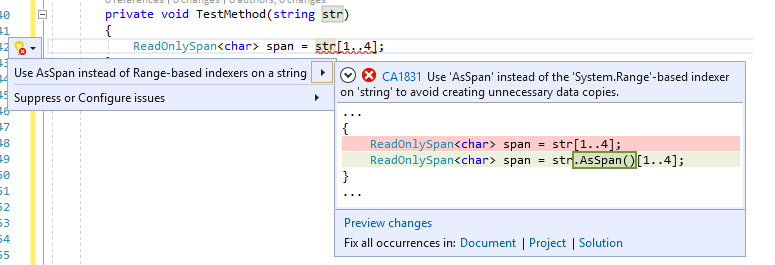

# CA1831: Use AsSpan instead of Range-based indexers for string when appropriate

| Property                            | Value                                                                  |
|-------------------------------------|------------------------------------------------------------------------|
| **Rule ID**                         | CA1831                                                                 |
| **Title**                           | Use AsSpan instead of Range-based indexers for string when appropriate |
| **Category**                        | [Performance](performance-warnings.md)                                 |
| **Fix is breaking or non-breaking** | Non-breaking                                                           |
| **Enabled by default in .NET 9**    | As warning                                                             |

## Cause

A range-indexer is used on a string and the value is implicitly assigned to `ReadOnlySpan<char>`.

## Rule description

This rule fires when you use a range-indexer on a string and assign it to a span type. The range indexer on a <xref:System.Span%601> is a non-copying <xref:System.Span%601.Slice%2A?#System_Span_1_Slice_System_Int32_System_Int32_> operation, but for the range indexer on a string, the method <xref:System.String.Substring%2A?#System_String_Substring_System_Int32_System_Int32_> will be used instead of <xref:System.Span%601.Slice%2A?#System_Span_1_Slice_System_Int32_System_Int32_>. This produces a copy of the requested portion of the string. This copy is usually unnecessary when it's implicitly used as a <xref:System.ReadOnlySpan%601> or <xref:System.ReadOnlyMemory%601> value. If a copy isn't intended, use the <xref:System.MemoryExtensions.AsSpan%2A?#System_MemoryExtensions_AsSpan_System_String_AsSpan> method to avoid the unnecessary copy. If the copy is intended, either assign it to a local variable first or add an explicit cast. The analyzer only reports when an implicit cast is used on the result of the range indexer operation.

### Detects

Implicit conversion:

`ReadOnlySpan<char> slice = str[a..b];`

### Does not detect

Explicit conversion:

`ReadOnlySpan<char> slice = (ReadOnlySpan<char>)str[a..b];`

## How to fix violations

To fix a violation of this rule, use <xref:System.MemoryExtensions.AsSpan%2A?#System_MemoryExtensions_AsSpan_System_String_AsSpan> instead of the <xref:System.Range>-based indexer on the string to avoid creating unnecessary data copies.

```csharp
public void TestMethod(string str)
{
    // The violation occurs
    ReadOnlySpan<char> slice = str[1..3];
    ...
}
```

```csharp
public void TestMethod(string str)
{
    // The violation fixed with AsSpan extension method
    ReadOnlySpan<char> slice = str.AsSpan()[1..3];
    ...
}
```

> [!TIP]
> A code fix is available for this rule in Visual Studio. To use it, position the cursor on the violation and press <kbd>Ctrl</kbd>+<kbd>.</kbd> (period). Choose **Use AsSpan instead of the Range-based indexer on a string** from the list of options that's presented.
>
> 

You can also add an explicit cast to avoid this warning.

```csharp
public void TestMethod(string str)
{
    // The violation occurs.
    ReadOnlySpan<char> slice = str[1..3];
    ...
}
```

```csharp
public void TestMethod(string str)
{
    // The violation avoided with explicit casting.
    ReadOnlySpan<char> slice = (ReadOnlySpan<char>)str[1..3];
    ...
}
```

## When to suppress warnings

It's safe to suppress a violation of this rule if creating a copy is intended.

## Suppress a warning

If you just want to suppress a single violation, add preprocessor directives to your source file to disable and then re-enable the rule.

```csharp
#pragma warning disable CA1831
// The code that's violating the rule is on this line.
#pragma warning restore CA1831
```

To disable the rule for a file, folder, or project, set its severity to `none` in the [configuration file](../configuration-files.md).

```ini
[*.{cs,vb}]
dotnet_diagnostic.CA1831.severity = none
```

To disable this entire category of rules, set the severity for the category to `none` in the [configuration file](../configuration-files.md).

```ini
[*.{cs,vb}]
dotnet_analyzer_diagnostic.category-Performance.severity = none
```

For more information, see [How to suppress code analysis warnings](../suppress-warnings.md).

## Related rules

- [CA1832: Use AsSpan or AsMemory instead of Range-based indexers for getting ReadOnlySpan or ReadOnlyMemory portion of an array](ca1832.md)
- [CA1833: Use AsSpan or AsMemory instead of Range-based indexers for getting Span or Memory portion of an array](ca1833.md)

## See also

- [Performance rules](performance-warnings.md)
