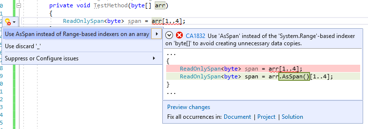

# CA1832: Use AsSpan or AsMemory instead of Range-based indexers for getting ReadOnlySpan or ReadOnlyMemory portion of an array

|                                     | Value                                  |
| ----------------------------------- | -------------------------------------- |
| **Rule ID**                         | CA1832                                 |
| **Category**                        | [Performance](performance-warnings.md) |
| **Fix is breaking or non-breaking** | Non-breaking                           |
| **Enabled by default in .NET 7**    | No                                     |

## Cause

When using a range-indexer on an array and implicitly assigning the value to <xref:System.ReadOnlySpan%601> or <xref:System.ReadOnlyMemory%601>.

## Rule description

The range indexer on a <xref:System.Span%601> is a non-copying <xref:System.Span%601.Slice%2A?#System_Span_1_Slice_System_Int32_System_Int32_> operation. But for the range indexer on an array, the method <xref:System.Runtime.CompilerServices.RuntimeHelpers.GetSubArray%2A> will be used instead of <xref:System.Span%601.Slice%2A?#System_Span_1_Slice_System_Int32_System_Int32_>, which produces a copy of the requested portion of the array. This copy is usually unnecessary when it's implicitly used as a <xref:System.ReadOnlySpan%601> or <xref:System.ReadOnlyMemory%601> value. If a copy isn't intended, use the <xref:System.MemoryExtensions.AsSpan%2A?#System_MemoryExtensions_AsSpan__1___0___> or <xref:System.MemoryExtensions.AsMemory%2A?#System_MemoryExtensions_AsMemory__1___0___>  method to avoid the unnecessary copy. If the copy is intended, either assign it to a local variable first or add an explicit cast.

The analyzer only reports when an implicit cast is used on the result of the range indexer operation.

### Detects

Implicit conversions:

- `ReadOnlySpan<SomeT> slice = arr[a..b];`
- `ReadOnlyMemory<SomeT> slice = arr[a..b];`

### Does not detect

Explicit conversions:

- `ReadOnlySpan<SomeT> slice = (ReadOnlySpan<SomeT>)arr[a..b];`
- `ReadOnlyMemory<SomeT> slice = (ReadOnlyMemory<SomeT>)arr[a..b];`

## How to fix violations

To fix a violation of this rule, use the <xref:System.MemoryExtensions.AsSpan%2A?#System_MemoryExtensions_AsSpan__1___0___> or <xref:System.MemoryExtensions.AsMemory%2A?#System_MemoryExtensions_AsMemory__1___0___>  extension method to avoid creating unnecessary data copies.

```csharp
class C
{
    public void TestMethod(byte[] arr)
    {
        // The violation occurs for both statements below
        ReadOnlySpan<byte> tmp1 = arr[0..2];
        ReadOnlyMemory<byte> tmp3 = arr[5..8];
        ...
    }
}
```

```csharp
class C
{
    public void TestMethod(byte[] arr)
    {
        // The violations fixed with AsSpan or AsMemory accordingly
        ReadOnlySpan<byte> tmp1 = arr.AsSpan()[0..2];
        ReadOnlyMemory<byte> tmp3 = arr.AsMemory()[5..8];
        ...
    }
}
```

> [!TIP]
> A code fix is available for this rule in Visual Studio. To use it, position the cursor on the violation and press <kbd>Ctrl</kbd>+<kbd>.</kbd> (period). Choose **Use AsSpan instead of the Range-based indexer on an array** from the list of options that's presented.
>
> 

You can also avoid this warning by adding an explicit cast.

```csharp
class C
{
    public void TestMethod(byte[] arr)
    {
        // The violation occurs
        ReadOnlySpan<byte> tmp1 = arr[0..2];
        ReadOnlyMemory<byte> tmp3 = arr[5..8];
        ...
    }
}
```

```csharp
class C
{
    public void TestMethod(byte[] arr)
    {
        // The violation fixed with explicit casting
        ReadOnlySpan<byte> tmp1 = (ReadOnlySpan<byte>)arr[0..2];
        ReadOnlyMemory<byte> tmp3 = (ReadOnlyMemory<byte>)arr[5..8];
        ...
    }
}
```

## When to suppress warnings

It's safe to suppress a violation of this rule if creating a copy is intended.

## Suppress a warning

If you just want to suppress a single violation, add preprocessor directives to your source file to disable and then re-enable the rule.

```csharp
#pragma warning disable CA1832
// The code that's violating the rule is on this line.
#pragma warning restore CA1832
```

To disable the rule for a file, folder, or project, set its severity to `none` in the [configuration file](../configuration-files.md).

```ini
[*.{cs,vb}]
dotnet_diagnostic.CA1832.severity = none
```

For more information, see [How to suppress code analysis warnings](../suppress-warnings.md).

## Related rules

- [CA1831: Use AsSpan instead of Range-based indexers for string when appropriate](ca1831.md)
- [CA1833: Use AsSpan or AsMemory instead of Range-based indexers for getting Span or Memory portion of an array](ca1833.md)

## See also

- [Performance rules](performance-warnings.md)
