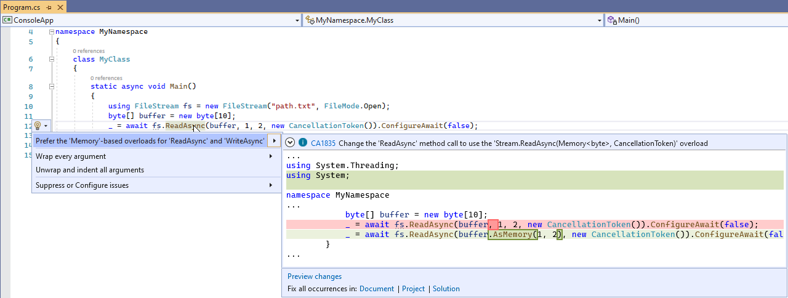

# CA1835: Prefer the memory-based overloads of ReadAsync/WriteAsync methods in stream-based classes

| | Value |
|-|-|
| **Type name** |PreferStreamAsyncMemoryOverloads|
| **Rule ID** |CA1835|
| **Category** |[Performance](performance-warnings.md)|
| **Fix is breaking or non-breaking** |Non-breaking|

## Cause

This rule locates awaited invocations of the byte-array-based method overloads for `ReadAsync` and `WriteAsync`, and suggests using the memory-based method overloads instead, because they are more efficient.

## Rule description

The memory-based method overloads have a more efficient memory usage than the byte array-based ones.

The rule works on `ReadAsync` and `WriteAsync` invocations of any class that inherits from <xref:System.IO.Stream>.

The rule only works when the method is preceded by the `await` keyword.

|Detected method|Suggested method|
|-|-|
|<xref:System.IO.Stream.ReadAsync(System.Byte[],System.Int32,System.Int32,System.Threading.CancellationToken)>|<xref:System.IO.Stream.ReadAsync(System.Memory{System.Byte},System.Threading.CancellationToken)>|
|<xref:System.IO.Stream.ReadAsync(System.Byte[],System.Int32,System.Int32)>|<xref:System.IO.Stream.ReadAsync(System.Memory{System.Byte},System.Threading.CancellationToken)> with `CancellationToken` set to `default` in C#, or `Nothing` in Visual Basic.|
|<xref:System.IO.Stream.WriteAsync(System.Byte[],System.Int32,System.Int32,System.Threading.CancellationToken)>|<xref:System.IO.Stream.WriteAsync(System.ReadOnlyMemory{System.Byte},System.Threading.CancellationToken)>|
|<xref:System.IO.Stream.WriteAsync(System.Byte[],System.Int32,System.Int32)>|<xref:System.IO.Stream.WriteAsync(System.ReadOnlyMemory{System.Byte},System.Threading.CancellationToken)> with `CancellationToken` set to `default` in C#, or `Nothing` in Visual Basic.|

> [!IMPORTANT]
> Make sure to pass the `offset` and `count` integer arguments to the created `Memory` or `ReadOnlyMemory` instances.

> [!NOTE]
> Rule CA1835 is available in all .NET versions where the memory-based overloads are available:
>
> - .NET Standard 2.1 and above.
> - .NET Core 2.1 and above.

## How to fix violations

You can either fix them manually, or you can opt to let Visual Studio do it for you, by hovering over the light bulb that shows up next to the method invocation, and selecting the suggested change. Example:



The rule can detect a variety of violations for the `ReadAsync` and `WriteAsync` methods. Here are examples of the cases that the rule can detect:

### Example 1

Invocations of `ReadAsync`, without and with a `CancellationToken` argument:

```cs
using System;
using System.IO;
using System.Threading;

class MyClass
{
    public async void MyMethod(CancellationToken ct)
    {
        using (FileStream s = new FileStream("path.txt", FileMode.Create))
        {
            byte[] buffer = new byte[s.Length];
            await s.ReadAsync(buffer, 0, buffer.Length);
            await s.ReadAsync(buffer, 0, buffer.Length, ct);
        }
    }
}
```

Fix:

```cs
using System;
using System.IO;
using System.Threading;

class MyClass
{
    public async void MyMethod(CancellationToken ct)
    {
        using (FileStream s = new FileStream("path.txt", FileMode.Create))
        {
            byte[] buffer = new byte[s.Length];
            await s.ReadAsync(buffer.AsMemory(0, buffer.Length));
            await s.ReadAsync(buffer.AsMemory(0, buffer.Length), ct);
        }
    }
}
```

### Example 2

Invocations of `WriteAsync`, without and with a `CancellationToken` argument:

```cs
using System;
using System.IO;
using System.Threading;

class MyClass
{
    public async void MyMethod(CancellationToken ct)
    {
        using (FileStream s = File.Open("path.txt", FileMode.Open))
        {
            byte[] buffer = { 0xBA, 0x5E, 0xBA, 0x11, 0xF0, 0x07, 0xBA, 0x11 };
            await s.WriteAsync(buffer, 0, buffer.Length);
            await s.WriteAsync(buffer, 0, buffer.Length, ct);
        }
    }
}
```

Fix:

```cs
using System;
using System.IO;
using System.Threading;

class MyClass
{
    public async void MyMethod()
    {
        using (FileStream s = File.Open("path.txt", FileMode.Open))
        {
            byte[] buffer = { 0xBA, 0x5E, 0xBA, 0x11, 0xF0, 0x07, 0xBA, 0x11 };
            await s.WriteAsync(buffer.AsMemory(0, buffer.Length));
            await s.WriteAsync(buffer.AsMemory(0, buffer.Length), ct);
        }
    }
}
```

### Example 3

Invocations with `ConfigureAwait`:

```cs
using System;
using System.IO;
using System.Threading;

class MyClass
{
    public async void MyMethod()
    {
        using (FileStream s = File.Open("path.txt", FileMode.Open))
        {
            byte[] buffer1 = { 0xBA, 0x5E, 0xBA, 0x11, 0xF0, 0x07, 0xBA, 0x11 };
            await s.WriteAsync(buffer1, 0, buffer1.Length).ConfigureAwait(false);

            byte[] buffer2 = new byte[s.Length];
            await s.ReadAsync(buffer2, 0, buffer2.Length).ConfigureAwait(true);
        }
    }
}
```

Fix:

```cs
using System;
using System.IO;
using System.Threading;

class MyClass
{
    public async void MyMethod()
    {
        using (FileStream s = File.Open("path.txt", FileMode.Open))
        {
            byte[] buffer1 = { 0xBA, 0x5E, 0xBA, 0x11, 0xF0, 0x07, 0xBA, 0x11 };
            await s.WriteAsync(buffer1.AsMemory(0, buffer1.Length)).ConfigureAwait(false);

            byte[] buffer2 = new byte[s.Length];
            await s.ReadAsync(buffer2.AsMemory(0, buffer.Length)).ConfigureAwait(true);
        }
    }
}
```

## Non-violations

Following are some examples of invocations where the rule will **not** be fired.

The return value is saved in a `Task` variable instead of being awaited:

```cs
using System;
using System.IO;
using System.Threading;
using System.Threading.Tasks;

class MyClass
{
    public void MyMethod()
    {
        byte[] buffer = { 0xBA, 0x5E, 0xBA, 0x11, 0xF0, 0x07, 0xBA, 0x11 };
        using (FileStream s = new FileStream("path.txt", FileMode.Create))
        {
            Task t = s.WriteAsync(buffer, 0, buffer.Length);
        }
    }
}
```

The return value is returned by the wrapping method instead of being awaited:

```cs
using System;
using System.IO;
using System.Threading;
using System.Threading.Tasks;

class MyClass
{
    public Task MyMethod(FileStream s, byte[] buffer)
    {
        return s.WriteAsync(buffer, 0, buffer.Length);
    }
}
```

The return value is used to call `ContinueWith`, which is the method being awaited:

```cs
using System;
using System.IO;
using System.Threading;
using System.Threading.Tasks;

class MyClass
{
    public void MyMethod()
    {
        byte[] buffer = { 0xBA, 0x5E, 0xBA, 0x11, 0xF0, 0x07, 0xBA, 0x11 };
        using (FileStream s = new FileStream("path.txt", FileMode.Create))
        {
            await s.WriteAsync(buffer, 0, buffer.Length).ContinueWith(c => { /* ... */ });
        }
    }
}
```

## When to suppress warnings

It's safe to suppress a violation of this rule if you're not concerned about improving performance when reading or writing buffers in stream-based classes.

## See also

- [Performance rules](performance-warnings.md)
