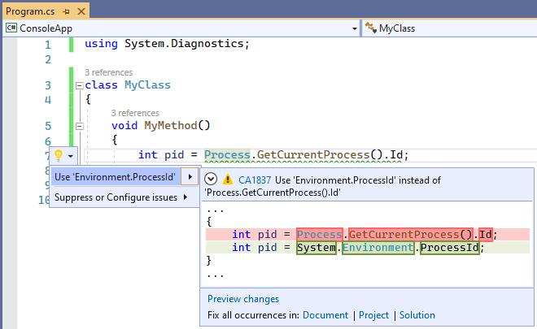

# CA1837: Use Environment.ProcessId instead of Process.GetCurrentProcess().Id

|                                     | Value                                  |
| ----------------------------------- | -------------------------------------- |
| **Rule ID**                         | CA1837                                 |
| **Category**                        | [Performance](performance-warnings.md) |
| **Fix is breaking or non-breaking** | Non-breaking                           |
| **Enabled by default in .NET 7**    | No                                     |

## Cause

This rule locates calls to `System.Diagnostics.Process.GetCurrentProcess().Id` and suggests using `System.Environment.ProcessId` instead, because it is more efficient.

## Rule description

`System.Diagnostics.Process.GetCurrentProcess().Id` is expensive:

- It allocates a <xref:System.Diagnostics.Process> instance, usually just to get the `Id`.
- The <xref:System.Diagnostics.Process> instance needs to be disposed, which has a performance impact.
- It's easy to forget to call <xref:System.Diagnostics.Process.Dispose> on the <xref:System.Diagnostics.Process> instance.
- If nothing else besides `Id` uses the `Process` instance, then the linked size grows unnecessarily by increasing the graph of types referenced.
- It is somewhat difficult to discover or find this API.

`System.Environment.ProcessId` avoids all the above.

> [!NOTE]
> Rule CA1837 is available starting on .NET 5.0.

## How to fix violations

The violation can either be fixed manually, or, in some cases, using Quick Actions to fix code in Visual Studio.

The following two code snippets show a violation of the rule and how to fix it:

```csharp
using System.Diagnostics;

class MyClass
{
    void MyMethod()
    {
        int pid = Process.GetCurrentProcess().Id;
    }
}
```

```vb
Imports System.Diagnostics

Class MyClass
    Private Sub MyMethod()
        Dim pid As Integer = Process.GetCurrentProcess().Id
    End Function
End Class
```

```csharp
using System.Diagnostics;

class MyClass
{
    void MyMethod()
    {
        int pid = System.Environment.ProcessId;
    }
}
```

```vb
Imports System.Diagnostics

Class MyClass
    Private Sub MyMethod()
        Dim pid As Integer = System.Environment.ProcessId
    End Function
End Class
```

> [!TIP]
> A code fix is available for this rule in Visual Studio. To use it, position the cursor on the violation and press <kbd>Ctrl</kbd>+<kbd>.</kbd> (period). Choose **Use 'Environment.ProcessId' instead of 'Process.GetCurrentProcess().Id'** from the list of options that's presented.
>
> 

## When to suppress warnings

It's safe to suppress a violation of this rule if you're not concerned about the performance impact from unnecessary allocation and eventual disposal of a <xref:System.Diagnostics.Process> instance.

## Suppress a warning

If you just want to suppress a single violation, add preprocessor directives to your source file to disable and then re-enable the rule.

```csharp
#pragma warning disable CA1837
// The code that's violating the rule is on this line.
#pragma warning restore CA1837
```

To disable the rule for a file, folder, or project, set its severity to `none` in the [configuration file](../configuration-files.md).

```ini
[*.{cs,vb}]
dotnet_diagnostic.CA1837.severity = none
```

For more information, see [How to suppress code analysis warnings](../suppress-warnings.md).

## See also

- [Performance rules](performance-warnings.md)
