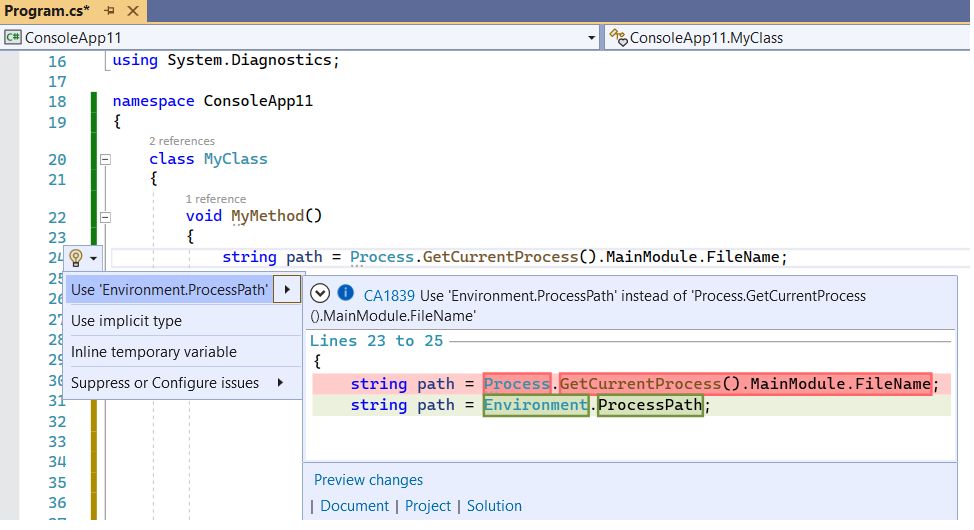

# CA1839: Use Environment.ProcessPath instead of Process.GetCurrentProcess().MainModule.FileName

| | Value |
|-|-|
| **Rule ID** |CA1839|
| **Category** |[Performance](performance-warnings.md)|
| **Fix is breaking or non-breaking** |Non-breaking|

## Cause

Using `Process.GetCurrentProcess().MainModule.FileName` for getting the path to the file that launched the process instead of <xref:System.Environment.ProcessPath?displayProperty=nameWithType>.

## Rule description

`System.Diagnostics.Process.GetCurrentProcess().MainModule.FileName` is expensive:

- It allocates a <xref:System.Diagnostics.Process> and <xref:System.Diagnostics.ProcessModule> instance, usually just to get the `FileName`.
- The <xref:System.Diagnostics.Process> instance needs to be disposed, which has a performance impact.
- It's easy to forget to call <xref:System.Diagnostics.Process.Dispose> on the <xref:System.Diagnostics.Process> instance.
- If nothing else besides `FileName` uses the `Process` instance, then the linked size grows unnecessarily by increasing the graph of types referenced.
- It is somewhat difficult to discover or find this API.

`System.Environment.ProcessPath` avoids all of these downsides and produces the same information.

> [!NOTE]
> <xref:System.Environment.ProcessPath?displayProperty=fullName> is available starting in .NET 6.

## How to fix violations

The violation can either be fixed manually, or, in some cases, using Quick Actions to fix code in Visual Studio.

The following two code snippets show a violation of the rule and how to fix it:

```csharp
using System.Diagnostics;

class MyClass
{
    void MyMethod()
    {
        string path = Process.GetCurrentProcess().MainModule.FileName; // Violation occurs
    }
}
```

```vb
Imports System.Diagnostics

Class MyClass
    Private Sub MyMethod()
        Dim path As String = Process.GetCurrentProcess().MainModule.FileName ' Violation occurs.
    End Function
End Class
```

```csharp
using System.Diagnostics;

class MyClass
{
    void MyMethod()
    {
        string path = System.Environment.ProcessPath; // Violation fixed
    }
}
```

```vb
Imports System.Diagnostics

Class MyClass
    Private Sub MyMethod()
        Dim path As String = System.Environment.ProcessPath ' Violation fixed.
    End Function
End Class
```

> [!TIP]
> A code fix is available for this rule in Visual Studio. To use it, position the cursor on the violation and press **Ctrl**+**.** (period). Choose **Use 'Environment.ProcessPath'** from the list of options that's presented.
>
> 

## When to suppress warnings

It's safe to suppress a violation of this rule if you're not concerned about the performance impact from unnecessary allocation and eventual disposal of the <xref:System.Diagnostics.Process> and <xref:System.Diagnostics.ProcessModule> instances.

## See also

- [Performance rules](performance-warnings.md)
- [Use 'Environment.ProcessId' instead of 'Process.GetCurrentProcess().Id'](ca1837.md)
- [Use 'Environment.CurrentManagedThreadId' instead of 'Thread.CurrentThread.ManagedThreadId'](ca1840.md)
