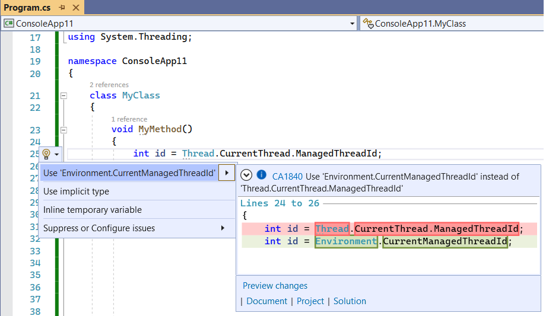

# CA1840: Use Environment.CurrentManagedThreadId instead of Thread.CurrentThread.ManagedThreadId

| | Value |
|-|-|
| **Rule ID** |CA1840|
| **Category** |[Performance](performance-warnings.md)|
| **Fix is breaking or non-breaking** |Non-breaking|

## Cause

Using `Thread.CurrentThread.ManagedThreadId` for getting the current managed thread ID instead of <xref:System.Environment.CurrentManagedThreadId?displayProperty=fullName>.

## Rule description

<xref:System.Environment.CurrentManagedThreadId?displayProperty=fullName> is a compact and efficient replacement of the `Thread.CurrentThread.ManagedThreadId` pattern.

## How to fix violations

The violation can either be fixed manually, or, in some cases, using Quick Actions to fix code in Visual Studio.

The following two code snippets show a violation of the rule and how to fix it:

```csharp
using System.Threading;

class MyClass
{
    void MyMethod()
    {
        int id = Thread.CurrentThread.ManagedThreadId; // Violation occurs
    }
}
```

```vb
Imports System.Threading

Class MyClass
    Private Sub MyMethod()
        Dim id As Integer = Thread.CurrentThread.ManagedThreadId ' Violation occurs.
    End Function
End Class
```

```csharp
using System.Threading;

class MyClass
{
    void MyMethod()
    {
        int id = System.Environment.CurrentManagedThreadId; // Violation fixed
    }
}
```

```vb
Imports System.Threading

Class MyClass
    Private Sub MyMethod()
        Dim id As Integer = System.Environment.CurrentManagedThreadId ' Violation fixed.
    End Function
End Class
```

> [!TIP]
> A code fix is available for this rule in Visual Studio. To use it, position the cursor on the violation and press **Ctrl**+**.** (period). Choose **Use 'Environment.CurrentManagedThreadId'** from the list of options that's presented.
>
> 

## When to suppress warnings

It's safe to suppress a violation of this rule if you're not concerned about the performance impact from using `Thread.CurrentThread.ManagedThreadId`.

## See also

- [Performance rules](performance-warnings.md)
- [Use 'Environment.ProcessId' instead of 'Process.GetCurrentProcess().Id'](ca1837.md)
- [Use 'Environment.ProcessPath' instead of 'Process.GetCurrentProcess().MainModule.FileName'](ca1839.md)
