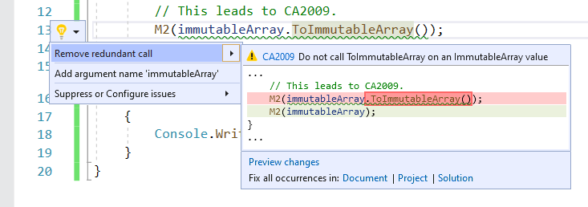

# CA2009: Do not call ToImmutableCollection on an ImmutableCollection value

| | Value |
|-|-|
| **Rule ID** |CA2009|
| **Category** |[Reliability](reliability-warnings.md)|
| **Fix is breaking or non-breaking** |Non-breaking|

## Cause

`ToImmutable` method was unnecessarily called on an immutable collection from <xref:System.Collections.Immutable> namespace.

## Rule description

<xref:System.Collections.Immutable> namespace contains types that define immutable collections. This rule analyzes the following immutable collection types:

- <xref:System.Collections.Immutable.ImmutableArray%601?displayProperty=fullName>
- <xref:System.Collections.Immutable.ImmutableList%601?displayProperty=fullName>
- <xref:System.Collections.Immutable.ImmutableHashSet%601?displayProperty=fullName>
- <xref:System.Collections.Immutable.ImmutableSortedSet%601?displayProperty=fullName>
- <xref:System.Collections.Immutable.ImmutableDictionary%602?displayProperty=fullName>
- <xref:System.Collections.Immutable.ImmutableSortedDictionary%602?displayProperty=fullName>

These types define extension methods that create a new immutable collection from an existing <xref:System.Collections.Generic.IEnumerable%601> collection.

- <xref:System.Collections.Immutable.ImmutableArray%601> defines <xref:System.Collections.Immutable.ImmutableArray.ToImmutableArray%2A>.
- <xref:System.Collections.Immutable.ImmutableList%601> defines <xref:System.Collections.Immutable.ImmutableList.ToImmutableList%2A>.
- <xref:System.Collections.Immutable.ImmutableHashSet%601> defines <xref:System.Collections.Immutable.ImmutableHashSet.ToImmutableHashSet%2A>.
- <xref:System.Collections.Immutable.ImmutableSortedSet%601> defines <xref:System.Collections.Immutable.ImmutableSortedSet.ToImmutableSortedSet%2A>.
- <xref:System.Collections.Immutable.ImmutableDictionary%602> defines <xref:System.Collections.Immutable.ImmutableDictionary.ToImmutableDictionary%2A>.
- <xref:System.Collections.Immutable.ImmutableSortedDictionary%602> defines <xref:System.Collections.Immutable.ImmutableSortedDictionary.ToImmutableSortedDictionary%2A>.

These extension methods are designed to convert a mutable collection to an immutable collection. However, the caller might accidentally pass in an immutable collection as input to these methods. This can represent a performance and/or a functional issue.

- Performance issue: Unnecessary boxing, unboxing, and/or runtime type checks on an immutable collection.
- Potential functional issue: Caller assumed to be operating on a mutable collection, when it actually had an immutable collection.

## How to fix violations

To fix violations, remove the redundant `ToImmutable` call on an immutable collection. For example, the following two code snippets show a violation of the rule and how to fix them:

```csharp
using System;
using System.Collections.Generic;
using System.Collections.Immutable;

public class C
{
    public void M(IEnumerable<int> collection, ImmutableArray<int> immutableArray)
    {
        // This is fine.
        M2(collection.ToImmutableArray());

        // This leads to CA2009.
        M2(immutableArray.ToImmutableArray());
    }

    private void M2(ImmutableArray<int> immutableArray)
    {
        Console.WriteLine(immutableArray.Length);
    }
}
```

```csharp
using System;
using System.Collections.Generic;
using System.Collections.Immutable;

public class C
{
    public void M(IEnumerable<int> collection, ImmutableArray<int> immutableArray)
    {
        // This is fine.
        M2(collection.ToImmutableArray());

        // This is now fine.
        M2(immutableArray);
    }

    private void M2(ImmutableArray<int> immutableArray)
    {
        Console.WriteLine(immutableArray.Length);
    }
}
```

> [!TIP]
> A code fix is available for this rule in Visual Studio. To use it, position the cursor on the violation and press **Ctrl**+**.** (period). Choose **Remove redundant call** from the list of options that's presented.
>
> 

## When to suppress warnings

Do not suppress violations from this rule, unless you're not concerned about the performance impact from unnecessary allocations of immutable collections.

## See also

- [Reliability rules](reliability-warnings.md)
- [Performance rules](performance-warnings.md)
