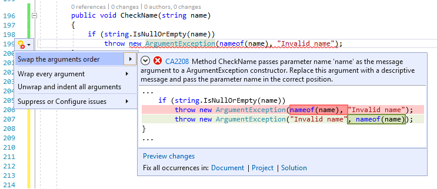

# CA2208: Instantiate argument exceptions correctly

| | Value |
|-|-|
| **Rule ID** |CA2208|
| **Category** |[Usage](usage-warnings.md)|
| **Fix is breaking or non-breaking** |Non-breaking|

## Cause

When a method has a parameter, and it throws an exception type that is, or derives from, <xref:System.ArgumentException>, it is expected to call a constructor accepting a `paramName` parameter correctly. Possible causes include the following situations:

- A call is made to the default (parameterless) constructor of an exception type that is, or derives from, <xref:System.ArgumentException> that has a constructor accepting a `paramName` parameter.

- An incorrect string argument is passed to a parameterized constructor of an exception type that is, or derives from, <xref:System.ArgumentException>.

- One of the parameters' names is passed for the `message` argument of the constructor of exception type that is, or derives from, <xref:System.ArgumentException>.

## Rule description

Instead of calling the default constructor, call one of the constructor overloads that allows a more meaningful exception message to be provided. The exception message should target the developer and clearly explain the error condition and how to correct or avoid the exception.

The signatures of the one and two string constructors of <xref:System.ArgumentException> and its derived types are not consistent with respect to the position `message` and `paramName` parameters. Make sure these constructors are called with the correct string arguments. The signatures are as follows:

- [`ArgumentException(string message)`](<xref:System.ArgumentException.%23ctor(System.String)>)
- [`ArgumentException(string message, string paramName)`](<xref:System.ArgumentException.%23ctor(System.String,System.String)>)
- [`ArgumentNullException(string paramName)`](<xref:System.ArgumentNullException.%23ctor(System.String)>)
- [`ArgumentNullException(string paramName, string message)`](<xref:System.ArgumentNullException.%23ctor(System.String,System.String)>)
- [`ArgumentOutOfRangeException(string paramName)`](<xref:System.ArgumentOutOfRangeException.%23ctor(System.String)>)
- [`ArgumentOutOfRangeException(string paramName, string message)`](<xref:System.ArgumentOutOfRangeException.%23ctor(System.String,System.String)>)
- [`DuplicateWaitObjectException(string parameterName)`](<xref:System.DuplicateWaitObjectException.%23ctor(System.String)>)
- [`DuplicateWaitObjectException(string parameterName, string message)`](<xref:System.DuplicateWaitObjectException.%23ctor(System.String,System.String)>)

## How to fix violations

To fix a violation of this rule, call a constructor that takes a message, a parameter name, or both, and make sure the arguments are proper for the type of <xref:System.ArgumentException> being called.

> [!TIP]
> A code fix is available in Visual Studio for incorrectly positioned parameter names. To use it, position the cursor on the warning row and press **Ctrl**+**.** (period). Choose **Swap the arguments order** from the list of options that's presented.
>
> 
>
> If a parameter name instead of a message is passed to the <xref:System.ArgumentException.%23ctor(System.String)> method, the fixer provides the option to switch to the two-argument constructor instead.
>
> 

## When to suppress warnings

It's safe to suppress a warning from this rule only if a parameterized constructor is called with the correct string arguments.

## Configure code to analyze

Use the following option to configure which parts of your codebase to run this rule on.

- [Include specific API surfaces](#include-specific-api-surfaces)

You can configure this option for just this rule, for all rules, or for all rules in this category (Design). For more information, see [Code quality rule configuration options](../code-quality-rule-options.md).

[!INCLUDE[api-surface](~/includes/code-analysis/api-surface.md)]

By default, the CA2208 rule applies to all API surfaces (public, internal, and private).

## Example

The following code shows a constructor that incorrectly instantiates an instance of <xref:System.ArgumentNullException>.

:::code language="csharp" source="snippets/csharp/all-rules/ca2208.cs" id="snippet1":::

:::code language="vb" source="snippets/vb/all-rules/ca2208-instantiate-argument-exceptions-correctly_1.vb" id="snippet1":::

The following code fixes the previous violation by switching the constructor arguments.

:::code language="csharp" source="snippets/csharp/all-rules/ca2208.cs" id="snippet2":::

:::code language="vb" source="snippets/vb/all-rules/ca2208-instantiate-argument-exceptions-correctly_1.vb" id="snippet2":::

## Related rules

- [CA1507: Use nameof in place of string](ca1507.md)
