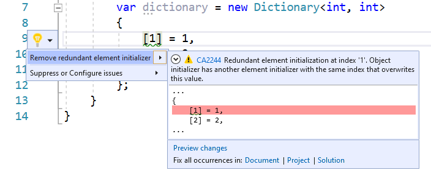

# CA2244: Do not duplicate indexed element initializations

| Property                            | Value                                            |
|-------------------------------------|--------------------------------------------------|
| **Rule ID**                         | CA2244                                           |
| **Title**                           | Do not duplicate indexed element initializations |
| **Category**                        | [Usage](usage-warnings.md)                       |
| **Fix is breaking or non-breaking** | Non-breaking                                     |
| **Enabled by default in .NET 9**    | As suggestion                                    |

## Cause

An object initializer has more than one indexed element initializer with the same constant index. All but the last initializer are redundant.

## Rule description

[Object initializers](../../../csharp/programming-guide/classes-and-structs/object-and-collection-initializers.md#object-initializers) let you assign values to any accessible fields or properties of an object at creation time without having to invoke a constructor followed by lines of assignment statements.

Indexed element initializers in object initializers must initialize unique elements. A duplicate index will overwrite a previous element initialization.

## How to fix violations

To fix violations, remove all the redundant indexed element initializers that are overwritten by any of the subsequent element initializer(s). For example, the following code snippet shows a violation of the rule and couple of potential fixes:

```csharp
using System.Collections.Generic;

class C
{
    public void M()
    {
        var dictionary = new Dictionary<int, int>
        {
            [1] = 1, // CA2244
            [2] = 2,
            [1] = 3
        };
    }
}
```

```csharp
using System.Collections.Generic;

class C
{
    public void M()
    {
        var dictionary = new Dictionary<int, int>
        {
            [2] = 2,
            [1] = 3
        };
    }
}
```

```csharp
using System.Collections.Generic;

class C
{
    public void M()
    {
        var dictionary = new Dictionary<int, int>
        {
            [1] = 1,
            [2] = 2
        };
    }
}
```

> [!TIP]
> A code fix is available for this rule in Visual Studio. To use it, position the cursor on the violation and press <kbd>Ctrl</kbd>+<kbd>.</kbd> (period). Choose **Remove redundant element initializer** from the list of options that's presented.
>
> 

## When to suppress warnings

Do not suppress violations for this rule.

## See also

- [Usage rules](usage-warnings.md)
