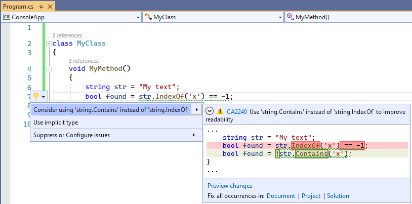

# CA2249: Consider using String.Contains instead of String.IndexOf

|                                     | Value                      |
| ----------------------------------- | -------------------------- |
| **Rule ID**                         | CA2249                     |
| **Category**                        | [Usage](usage-warnings.md) |
| **Fix is breaking or non-breaking** | Non-breaking               |

## Cause

This rule locates calls to <xref:System.String.IndexOf%2A> where the result is used to check for the presence or absence of a substring, and suggests using <xref:System.String.Contains%2A> instead, to improve readability.

## Rule description

When <xref:System.String.IndexOf%2A> is used to check if the result is equal to `-1` or greater or equal than `0`, the call can be safely substituted with <xref:System.String.Contains%2A> without an impact on performance.

Depending on the <xref:System.String.IndexOf%2A> overload being used, the suggested fix could get a `comparisonType` argument added:

| Overload                                                 | Suggested fix                                              |
| -------------------------------------------------------- | ---------------------------------------------------------- |
| `String.IndexOf(char)`                                   | `String.Contains(char)`                                    |
| `String.IndexOf(string)`                                 | `String.Contains(string, StringComparison.CurrentCulture)` |
| `String.IndexOf(char, StringComparison.Ordinal)`         | `String.Contains(char)`                                    |
| `String.IndexOf(string, StringComparison.Ordinal)`       | `String.Contains(string)`                                  |
| `String.IndexOf(char, NON StringComparison.Ordinal)`\*   | `String.Contains(char, NON StringComparison.Ordinal)`\*    |
| `String.IndexOf(string, NON StringComparison.Ordinal)`\* | `String.Contains(string, NON StringComparison.Ordinal)`\*  |

\* Any `StringComparison` enum value other than `StringComparison.Ordinal`:

- <xref:System.StringComparison.CurrentCulture>
- <xref:System.StringComparison.CurrentCultureIgnoreCase>
- <xref:System.StringComparison.InvariantCulture>
- <xref:System.StringComparison.InvariantCultureIgnoreCase>
- <xref:System.StringComparison.OrdinalIgnoreCase>

## How to fix violations

The violation can either be fixed manually, or, in some cases, using Quick Actions to fix code in Visual Studio.

## Examples

The following two code snippets show all possible violations of the rule in C# and how to fix them:

```csharp
using System;

class MyClass
{
    void MyMethod()
    {
        string str = "My text";
        bool found;

        // No comparisonType in char overload, so no comparisonType added in resulting fix
        found = str.IndexOf('x') == -1;
        found = str.IndexOf('x') >= 0;

        // No comparisonType in string overload, adds StringComparison.CurrentCulture to resulting fix
        found = str.IndexOf("text") == -1;
        found = str.IndexOf("text") >= 0;

        // comparisonType equal to StringComparison.Ordinal, removes the argument
        found = str.IndexOf('x', StringComparison.Ordinal) == -1;
        found = str.IndexOf('x', StringComparison.Ordinal) >= 0;

        found = str.IndexOf("text", StringComparison.Ordinal) == -1;
        found = str.IndexOf("text", StringComparison.Ordinal) >= 0;

        // comparisonType different than StringComparison.Ordinal, preserves the argument
        found = str.IndexOf('x', StringComparison.OrdinalIgnoreCase) == -1;
        found = str.IndexOf('x', StringComparison.CurrentCulture) >= 0;

        found = str.IndexOf("text", StringComparison.InvariantCultureIgnoreCase) == -1;
        found = str.IndexOf("text", StringComparison.InvariantCulture) >= 0;

        // Suggestion message provided, but no automatic fix offered, must be fixed manually
        int index = str.IndexOf("text");
        if (index == -1)
        {
            Console.WriteLine("'text' Not found.");
        }
    }
}
```

```csharp
using System;

class MyClass
{
    void MyMethod()
    {
        string str = "My text";
        bool found;

        // No comparisonType in char overload, so no comparisonType added in resulting fix
        found = !str.Contains('x');
        found = str.Contains('x');

        // No comparisonType in string overload, adds StringComparison.CurrentCulture to resulting fix
        found = !string.Contains("text", StringComparison.CurrentCulture);
        found = string.Contains("text", StringComparison.CurrentCulture);

        // comparisonType equal to StringComparison.Ordinal, removes the argument
        found = !string.Contains('x');
        found = string.Contains('x');

        found = !string.Contains("text");
        found = string.Contains("text");

        // comparisonType different than StringComparison.Ordinal, preserves the argument
        ;found = !string.Contains('x', StringComparison.OrdinalIgnoreCase)
        found = string.Contains('x', StringComparison.CurrentCulture);

        found = !string.Contains("text", StringComparison.InvariantCultureIgnoreCase);
        found = string.Contains("text", StringComparison.InvariantCulture);

        // This case had to be manually fixed
        if (!str.Contains("text"))
        {
            Console.WriteLine("'text' Not found.");
        }
    }
}
```

> [!TIP]
> A code fix is available for this rule in Visual Studio. To use it, position the cursor on the violation and press **Ctrl**+**.** (period). Choose **Consider using 'string.Contains' instead of 'string.IndexOf'** from the list of options that's presented.
>
> 

## When to suppress warnings

It's safe to suppress a violation of this rule if improving code readability is not a concern.

## See also

- [Usage rules](usage-warnings.md)
