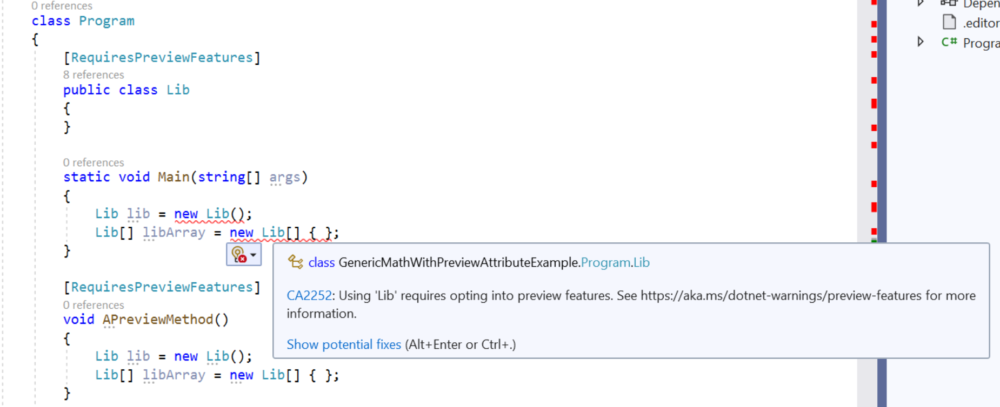
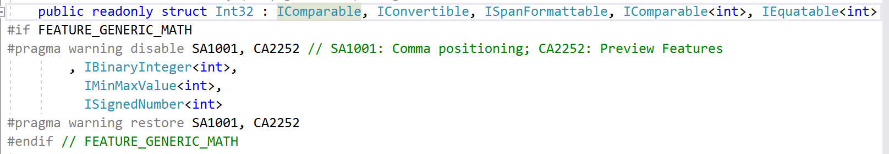
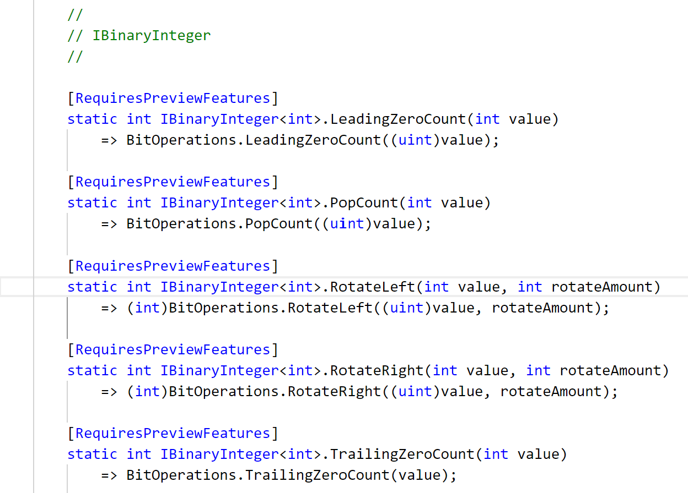

# CA2252: Opt in to preview features before using them

|                                     | Value                                |
| ----------------------------------- | ------------------------------------ |
| **Rule ID**                         | CA2252                               |
| **Category**                        | [Microsoft.Usage](usage-warnings.md) |
| **Fix is breaking or non-breaking** | Non-breaking                         |

## Cause

A client uses preview APIs or types in their assembly without explicitly opting in either locally or at the module or assembly level.

## Rule description

When an API or assembly that's decorated with the <xref:System.Runtime.Versioning.RequiresPreviewFeaturesAttribute> attribute is consumed, this rule checks if the call site has opted in to preview features. A call site has opted in to preview features if one of the following applies:

- It is within the scope of a `RequiresPreviewFeaturesAttribute` annotation.
- It is part of an assembly or module that has already opted in to preview features.

The following image shows an example of the CA2252 diagnostic.

> 

Here, `Lib` is a preview type that's constructed in the `Main` method. `Main` itself is not annotated as a preview method, so diagnostics are produced on the two constructors calls inside `Main`.

## How to fix violations

There are two ways to fix violations:

- Bring a call site within the scope of an annotation by annotating its parent with `RequiresPreviewFeaturesAttribute`. In the previous example, `APreviewMethod` is annotated with the `RequiresPreviewFeatures` attribute, so the analyzer ignores preview type usage inside `APreviewMethod`. It follows that callers of `APreviewMethod` will have to perform a similar exercise.

- You can also opt in to preview features at an assembly or module level. This indicates to the analyzer that preview type usage in the assembly is desired and, as a consequence, no errors will be produced by this rule. This is the preferred way to consume preview dependencies. To enable preview features inside the entire assembly, set the [EnablePreviewFeatures](../../../core/project-sdk/msbuild-props.md#enablepreviewfeatures) property in a `.csproj` file:

```csharp
  <PropertyGroup>
    <EnablePreviewFeatures>true</EnablePreviewFeatures>
  </PropertyGroup>
```

## When to suppress errors

Suppressing errors from this rule is only recommended for advanced use cases where diagnostics on APIs need to explicitly disabled. In this case, you must be willing to take on the responsibility of marking preview APIs appropriately. For example, consider a case where an existing type implements a new preview interface. Since the entire type cannot be marked as preview (for backwards compatibility), the diagnostic around the type definition can be disabled locally. Further, you need to mark the preview interface implementations as preview. Now, the existing type can be used as before, but calls to the new interface methods will get diagnostics. *System.Private.CoreLib.csproj* uses this technique to expose generic math features on numeric types such as `Int32`, `Double`, and `Decimal`.
The following images show how to disable the CA2252 analyzer locally.

> 

> 

## See also

- [EnablePreviewFeatures and GenerateRequiresPreviewFeaturesAttribute](../../../core/project-sdk/msbuild-props.md#enablepreviewfeatures)
- [Preview feature design document](https://github.com/dotnet/designs/blob/main/accepted/2021/preview-features/preview-features.md)
