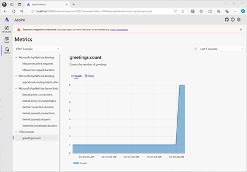

# Networking metrics in .NET

[Metrics](../../../core/diagnostics/metrics.md) are numerical measurements reported over time. They are typically used to monitor the health of an app and generate alerts.

Starting with .NET 8, the `System.Net.Http` and the `System.Net.NameResolution` components are instrumented to publish metrics using .NET's new [System.Diagnostics.Metrics API](../../../core/diagnostics/metrics.md).
These metrics were designed in cooperation with [OpenTelemetry](https://opentelemetry.io/) to make sure they're consistent with the standard and work well with popular tools like [Prometheus](https://prometheus.io/) and [Grafana](https://grafana.com/).
They are also [multi-dimensional](../../../core/diagnostics/metrics-instrumentation.md#multi-dimensional-metrics), meaning that measurements are associated with key-value pairs called tags (a.k.a. attributes or labels) that allow data to be categorized for analysis.

> [!TIP]
> For a comprehensive list of all built-in instruments together with their attributes, see [System.Net metrics](../../../core/diagnostics/built-in-metrics-system-net.md).

## Collect System.Net metrics

There are two parts to using metrics in a .NET app:

* **Instrumentation:** Code in .NET libraries takes measurements and associates these measurements with a metric name. .NET and ASP.NET Core include many built-in metrics.
* **Collection:** A .NET app configures named metrics to be transmitted from the app for external storage and analysis. Some tools might perform configuration outside the app using configuration files or a UI tool.

This section demonstrates various methods to collect and view System.Net metrics.

### .NET Aspire

The simplest solution for collecting metrics for ASP.NET applications is to use [.NET Aspire](/dotnet/aspire/get-started/aspire-overview) which is a set of extensions to .NET to make it easy to create and work with distributed applications. One of the benefits of using .NET Aspire is that telemetry is built in, using the OpenTelemetry libraries for .NET. The default project templates for .NET Aspire contain a `ServiceDefaults` project, part of which is to setup and configure OTel. The Service Defaults project is referenced and initialized by each service in a .NET Aspire solution.

The Service Defaults project template includes the OTel SDK, ASP.NET, HttpClient and Runtime Instrumentation packages, and those are configured in the [`Extensions.cs`](https://github.com/dotnet/aspire/blob/main/src/Aspire.ProjectTemplates/templates/aspire-servicedefaults/Extensions.cs) file.  For exporting telemetry .NET Aspire includes the OTLP exporter by default so that it can provide telemetry visualization using the Aspire Dashboard.

The Aspire Dashboard is designed to bring telemetry observation to the local debug cycle, which enables developers to not only ensure that the applications are producing telemetry, but also use that telemetry to diagnose those applications locally. Being able to observe the calls between services is proving to be just as useful at debug time as in production. The .NET Aspire dashboard is launched automatically when you F5 the `AppHost` Project from Visual Studio or `dotnet run` the `AppHost` project.

[](../../../core/diagnostics/media/aspire-dashboard-metrics.png#lightbox)

For more details on .NET Aspire see:

- [Aspire Overview](/dotnet/aspire/get-started/aspire-overview)
- [Telemetry in Aspire](/dotnet/aspire/fundamentals/telemetry)
- [Aspire Dashboard](/dotnet/aspire/fundamentals/dashboard/explore)

### Reusing Service Defaults project without .NET Aspire Orchestration

Probably the easiest way to configure OTel for ASP.NET projects is to use the Aspire Service Defaults project, even if not using the rest of .NET Aspire such as the AppHost for orchestration. The Service Defaults project is available as a project template via Visual Studio or `dotnet new`. It configures OTel and sets up the OTLP exporter. You can then use the [OTel environment variables](https://github.com/open-telemetry/opentelemetry-dotnet/tree/main/src/OpenTelemetry.Exporter.OpenTelemetryProtocol#exporter-configuration) to configure the OTLP endpoint to send telemetry to, and provide the resource properties for the application.

The steps to use *ServiceDefaults* outside .NET Aspire are:

- Add the *ServiceDefaults* project to the solution using Add New Project in Visual Studio, or use `dotnet new aspire-servicedefaults --output ServiceDefaults`
- Reference the *ServiceDefaults* project from your ASP.NET application. In Visual Studio use "Add -> Project Reference" and select the *ServiceDefaults* project"
- Call its OpenTelemetry setup function as part of your application builder initialization.

``` csharp
var builder = WebApplication.CreateBuilder(args);
builder.ConfigureOpenTelemetry();

var app = builder.Build();

app.MapGet("/", () => "Hello World!");

app.Run();
```

For a full walkthrough, see [Example: Use OpenTelemetry with OTLP and the standalone Aspire Dashboard](../../../core/diagnostics/observability-otlp-example.md).

### Collecting metrics manually

For a walkthrough of how to collect metrics, as well as distributed traces without using Aspire Service Defaults, see  [Example: Use OpenTelemetry with Prometheus, Grafana, and Jaeger](../../../core/diagnostics/observability-prgrja-example.md). 

## Enrichment

*Enrichment* is the addition of custom tags (a.k.a. attributes or labels) to a metric. This is useful if an app wants to add a custom categorization to dashboards or alerts built with metrics.
The [`http.client.request.duration`](../../../core/diagnostics/built-in-metrics-system-net.md#metric-httpclientrequestduration) instrument supports enrichment by registering callbacks with the <xref:System.Net.Http.Metrics.HttpMetricsEnrichmentContext>.
Note that this is a low-level API and a separate callback registration is needed for each `HttpRequestMessage`.

A simple way to do the callback registration at a single place is to implement a custom <xref:System.Net.Http.DelegatingHandler>.
This will allow you to intercept and modify the requests before they are forwarded to the inner handler and sent to the server:

:::code language="csharp" source="snippets/metrics/Program.cs" id="snippet_Enrichment":::

If you're working with [`IHttpClientFactory`](../../../core/extensions/httpclient-factory.md), you can use <xref:Microsoft.Extensions.DependencyInjection.HttpClientBuilderExtensions.AddHttpMessageHandler%2A> to register the `EnrichmentHandler`:

:::code language="csharp" source="snippets/metrics/Program.cs" id="snippet_EnrichmentWithFactory":::

> [!NOTE]
> For performance reasons, the enrichment callback is only invoked when the `http.client.request.duration` instrument is enabled, meaning that something should be collecting the metrics.
> This can be `dotnet-monitor`, Prometheus exporter, a [`MeterListener`](../../../core/diagnostics/metrics-collection.md#create-a-custom-collection-tool-using-the-net-meterlistener-api), or a `MetricCollector<T>`.

## `IMeterFactory` and `IHttpClientFactory` integration

HTTP metrics were designed with isolation and testability in mind. These aspects are supported by the use of <xref:System.Diagnostics.Metrics.IMeterFactory>, which enables publishing metrics by a custom <xref:System.Diagnostics.Metrics.Meter> instance in order to keep Meters isolated from each other.
By default, all metrics are emitted by a global <xref:System.Diagnostics.Metrics.Meter> internal to the `System.Net.Http` library. This behavior can be overriden by assigning a custom <xref:System.Diagnostics.Metrics.IMeterFactory> instance to <xref:System.Net.Http.SocketsHttpHandler.MeterFactory?displayProperty=nameWithType> or <xref:System.Net.Http.HttpClientHandler.MeterFactory?displayProperty=nameWithType>.

> [!NOTE]
> The <xref:System.Diagnostics.Metrics.Meter.Name?displayProperty=nameWithType> is `System.Net.Http` for all metrics emitted by `HttpClientHandler` and `SocketsHttpHandler`.

When working with [`Microsoft.Extensions.Http`](https://www.nuget.org/packages/microsoft.extensions.http) and [`IHttpClientFactory`](../../../core/extensions/httpclient-factory.md) on .NET 8+, the default `IHttpClientFactory` implementation automatically picks the `IMeterFactory` instance registered in the <xref:Microsoft.Extensions.DependencyInjection.IServiceCollection> and assigns it to the primary handler it creates internally.

> [!NOTE]
> Starting with .NET 8, the <xref:Microsoft.Extensions.DependencyInjection.HttpClientFactoryServiceCollectionExtensions.AddHttpClient%2A> method automatically calls <xref:Microsoft.Extensions.DependencyInjection.MetricsServiceExtensions.AddMetrics%2A> to initialize the metrics services and register the default <xref:System.Diagnostics.Metrics.IMeterFactory> implementation with <xref:Microsoft.Extensions.DependencyInjection.IServiceCollection>. The default <xref:System.Diagnostics.Metrics.IMeterFactory> caches <xref:System.Diagnostics.Metrics.Meter> instances by name, meaning that there will be one <xref:System.Diagnostics.Metrics.Meter> with the name `System.Net.Http` per <xref:Microsoft.Extensions.DependencyInjection.IServiceCollection>.

### Test metrics

The following example demonstrates how to validate built-in metrics in unit tests using xUnit, `IHttpClientFactory`, and `MetricCollector<T>` from the [`Microsoft.Extensions.Diagnostics.Testing`](https://www.nuget.org/packages/Microsoft.Extensions.Diagnostics.Testing) NuGet package:

:::code language="csharp" source="snippets/metrics/Program.cs" id="snippet_Testing":::

## Metrics vs. EventCounters

Metrics are [more feature-rich](../../../core/diagnostics/compare-metric-apis.md#systemdiagnosticsmetrics) than EventCounters, most notably because of their multi-dimensional nature. This multi-dimensionality lets you create sophisticated queries in tools like Prometheus and get insights on a level that's not possible with EventCounters.

Nevertheless, as of .NET 8, only the `System.Net.Http` and the `System.Net.NameResolutions` components are instrumented using Metrics, meaning that if you need counters from the lower levels of the stack such as `System.Net.Sockets` or `System.Net.Security`, you must use EventCounters.

Moreover, there are some semantical differences between Metrics and their matching EventCounters.
For example, when using `HttpCompletionOption.ResponseContentRead`, the [`current-requests` EventCounter](../../../core/diagnostics/available-counters.md) considers a request to be active until the moment when the last byte of the request body has been read.
Its metrics counterpart [`http.client.active_requests`](../../../core/diagnostics/built-in-metrics-system-net.md#metric-httpclientactive_requests) doesn't include the time spent reading the response body when counting the active requests.

## Need more metrics?

If you have suggestions for other useful information that could be exposed via metrics, create a [dotnet/runtime issue](https://github.com/dotnet/runtime/issues/new).
