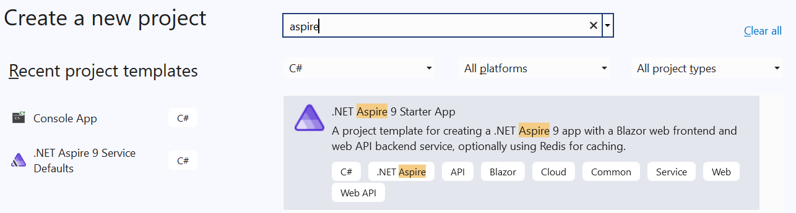

# Networking metrics in .NET

[Metrics](../../../core/diagnostics/metrics.md) are numerical measurements reported over time. They're typically used to monitor the health of an app and generate alerts.

Starting with .NET 8, the `System.Net.Http` and the `System.Net.NameResolution` components are instrumented to publish metrics using .NET's new [System.Diagnostics.Metrics API](../../../core/diagnostics/metrics.md).
These metrics were designed in cooperation with [OpenTelemetry](https://opentelemetry.io/) to make sure they're consistent with the standard and work well with popular tools like [Prometheus](https://prometheus.io/) and [Grafana](https://grafana.com/).
They're also [multi-dimensional](../../../core/diagnostics/metrics-instrumentation.md#multi-dimensional-metrics), meaning that measurements are associated with key-value pairs called tags (also known as attributes or labels). Tags enable the categorization of the measurement to help analysis.

> [!TIP]
> For a comprehensive list of all built-in instruments together with their attributes, see [System.Net metrics](../../../core/diagnostics/built-in-metrics-system-net.md).

## Collect System.Net metrics

To take advantage of the built-in metrics instrumentation, a .NET app needs to be configured to collect these metrics. This typically means transforming them for external storage and analysis, for example, to monitoring systems.

There are several ways to collect networking metrics in .NET.

- For a quick overview using a simple, self-contained example, see [Collect metrics with dotnet-counters](#collect-metrics-with-dotnet-counters).
- For **production-time** metrics collection and monitoring, you can use [Grafana with OpenTelemetry and Prometheus](#view-metrics-in-grafana-with-opentelemetry-and-prometheus) or [Azure Monitor  Application Insights](../../../core/diagnostics/observability-applicationinsights.md). However, these tools might be inconvenient to use at development time because of their complexity.
- For **development-time** metrics collection and troubleshooting, we recommend using [.NET Aspire](#collect-metrics-with-net-aspire), which provides a simple but extensible way to kickstart metrics and distributed tracing in your application and to diagnose issues locally.
- It's also possible to [reuse the Aspire Service Defaults](#reuse-service-defaults-project-without-net-aspire-orchestration) project without the Aspire orchestration, which is a handy way to introduce the OpenTelemetry tracing and metrics configuration APIs into your ASP.NET project.

### Collect metrics with dotnet-counters

[`dotnet-counters`](../../../core/diagnostics/dotnet-counters.md) is a cross-platform command line tool for ad-hoc examination of .NET metrics and first-level performance investigation.

For the sake of this tutorial, create an app that sends HTTP requests to various endpoints in parallel.

```dotnetcli
dotnet new console -o HelloBuiltinMetrics
cd ..\HelloBuiltinMetrics
```

Replace the contents of `Program.cs` with the following sample code:

:::code language="csharp" source="snippets/metrics/Program.cs" id="snippet_ExampleApp":::

Make sure `dotnet-counters` is installed:

```dotnetcli
dotnet tool install --global dotnet-counters
```

Start the HelloBuiltinMetrics app.

```dotnetcli
dotnet run -c Release
```

Start `dotnet-counters` in a separate CLI window and specify the process name and the meters to watch, then press a key in the HelloBuiltinMetrics app so it starts sending requests. As soon as measurements start landing, `dotnet-counters` continuously refreshes the console with the latest numbers:

```console
dotnet-counters monitor --counters System.Net.Http,System.Net.NameResolution -n HelloBuiltinMetrics
```


### Collect metrics with .NET Aspire

[!INCLUDE[Aspire Telemetry Overview](./includes/aspire-telemetry-overview.md)]

#### Quick walkthrough

1. Create a **.NET Aspire 9 Starter App** by using `dotnet new`:

    ```dotnetcli
    dotnet new aspire-starter-9 --output AspireDemo
    ```

    Or in Visual Studio, create a new project and select the **.NET Aspire 9 Starter App** template:

    

1. Open `Extensions.cs` in the `ServiceDefaults` project, and scroll to the `ConfigureOpenTelemetry` method. Notice the `AddHttpClientInstrumentation()` call subscribing to the networking meters.

    :::code language="csharp" source="snippets/tracing/ConnectionTracingDemo.ServiceDefaults/Extensions.cs" id="snippet_Metrics" highlight="4":::

    Note that on .NET 8+, `AddHttpClientInstrumentation()` can be replaced by manual meter subscriptions:

    ```csharp
    .WithMetrics(metrics =>
    {
        metrics.AddAspNetCoreInstrumentation()
            .AddMeter("System.Net.Http")
            .AddMeter("System.Net.NameResolution")
            .AddRuntimeInstrumentation();
    })
    ```

1. Run the `AppHost` project. This should launch the Aspire Dashboard.

1. Navigate to the Weather page of the `webfrontend` app to generate an `HttpClient` request towards `apiservice`. Refresh the page several times to send multiple requests.

1. Return to the Dashboard, navigate to the **Metrics** page, and select the `webfrontend` resource. Scrolling down, you should be able to browse the built-in `System.Net` metrics.

    [](media/aspire-metrics.png#lightbox)

For more information on .NET Aspire, see:

- [Aspire Overview](/dotnet/aspire/get-started/aspire-overview)
- [Telemetry in Aspire](/dotnet/aspire/fundamentals/telemetry)
- [Aspire Dashboard](/dotnet/aspire/fundamentals/dashboard/explore)

### Reuse Service Defaults project without .NET Aspire orchestration

[!INCLUDE[Aspire Service Defaults](./includes/aspire-service-defaults.md)]

### View metrics in Grafana with OpenTelemetry and Prometheus

To see how to connect an example app with Prometheus and Grafana, follow the walkthrough in [Using OpenTelemetry with Prometheus, Grafana, and Jaeger](../../../core/diagnostics/observability-prgrja-example.md).

In order to stress `HttpClient` by sending parallel requests to various endpoints, extend the example app with the following endpoint:

:::code language="csharp" source="../../../core/diagnostics/snippets/OTel-Prometheus-Grafana-Jaeger/csharp/Program.cs" id="Snippet_ClientStress":::

Create a Grafana dashboard by selecting the **+** icon on the top toolbar then selecting **Dashboard**. In the dashboard editor that appears, enter **Open HTTP/1.1 Connections** in the **Title** box and the following query in the PromQL expression field:

```
sum by(http_connection_state) (http_client_open_connections{network_protocol_version="1.1"})
```

Select **Apply** to save and view the new dashboard. It displays the number of active vs idle HTTP/1.1 connections in the pool.

[](../../../core/diagnostics/media/grafana-http11-connections.png#lightbox)

## Enrichment

*Enrichment* is the addition of custom tags (also known as attributes or labels) to a metric. This is useful if an app wants to add a custom categorization to dashboards or alerts built with metrics.
The [`http.client.request.duration`](../../../core/diagnostics/built-in-metrics-system-net.md#metric-httpclientrequestduration) instrument supports enrichment by registering callbacks with the <xref:System.Net.Http.Metrics.HttpMetricsEnrichmentContext>.
Note that this is a low-level API and a separate callback registration is needed for each `HttpRequestMessage`.

A simple way to do the callback registration at a single place is to implement a custom <xref:System.Net.Http.DelegatingHandler>.
This allows you to intercept and modify the requests before they're forwarded to the inner handler and sent to the server:

:::code language="csharp" source="snippets/metrics/Program.cs" id="snippet_Enrichment":::

If you're working with [`IHttpClientFactory`](../../../core/extensions/httpclient-factory.md), you can use <xref:Microsoft.Extensions.DependencyInjection.HttpClientBuilderExtensions.AddHttpMessageHandler%2A> to register the `EnrichmentHandler`:

:::code language="csharp" source="snippets/metrics/Program.cs" id="snippet_EnrichmentWithFactory":::

> [!NOTE]
> For performance reasons, the enrichment callback is only invoked when the `http.client.request.duration` instrument is enabled, meaning that something should be collecting the metrics.
> This can be `dotnet-monitor`, Prometheus exporter, a [`MeterListener`](../../../core/diagnostics/metrics-collection.md#create-a-custom-collection-tool-using-the-net-meterlistener-api), or a `MetricCollector<T>`.

## `IMeterFactory` and `IHttpClientFactory` integration

HTTP metrics were designed with isolation and testability in mind. These aspects are supported by the use of <xref:System.Diagnostics.Metrics.IMeterFactory>, which enables publishing metrics by a custom <xref:System.Diagnostics.Metrics.Meter> instance in order to keep Meters isolated from each other.
By default, a global <xref:System.Diagnostics.Metrics.Meter> is used to emit all metrics. This <xref:System.Diagnostics.Metrics.Meter> internal to the `System.Net.Http` library. This behavior can be overridden by assigning a custom <xref:System.Diagnostics.Metrics.IMeterFactory> instance to <xref:System.Net.Http.SocketsHttpHandler.MeterFactory?displayProperty=nameWithType> or <xref:System.Net.Http.HttpClientHandler.MeterFactory?displayProperty=nameWithType>.

> [!NOTE]
> The <xref:System.Diagnostics.Metrics.Meter.Name?displayProperty=nameWithType> is `System.Net.Http` for all metrics emitted by `HttpClientHandler` and `SocketsHttpHandler`.

When working with [`Microsoft.Extensions.Http`](https://www.nuget.org/packages/microsoft.extensions.http) and [`IHttpClientFactory`](../../../core/extensions/httpclient-factory.md) on .NET 8+, the default `IHttpClientFactory` implementation automatically picks the `IMeterFactory` instance registered in the <xref:Microsoft.Extensions.DependencyInjection.IServiceCollection> and assigns it to the primary handler it creates internally.

> [!NOTE]
> Starting with .NET 8, the <xref:Microsoft.Extensions.DependencyInjection.HttpClientFactoryServiceCollectionExtensions.AddHttpClient%2A> method automatically calls <xref:Microsoft.Extensions.DependencyInjection.MetricsServiceExtensions.AddMetrics%2A> to initialize the metrics services and register the default <xref:System.Diagnostics.Metrics.IMeterFactory> implementation with <xref:Microsoft.Extensions.DependencyInjection.IServiceCollection>. The default <xref:System.Diagnostics.Metrics.IMeterFactory> caches <xref:System.Diagnostics.Metrics.Meter> instances by name, meaning that there's one <xref:System.Diagnostics.Metrics.Meter> with the name `System.Net.Http` per <xref:Microsoft.Extensions.DependencyInjection.IServiceCollection>.

### Test metrics

The following example demonstrates how to validate built-in metrics in unit tests using xUnit, `IHttpClientFactory`, and `MetricCollector<T>` from the [`Microsoft.Extensions.Diagnostics.Testing`](https://www.nuget.org/packages/Microsoft.Extensions.Diagnostics.Testing) NuGet package:

:::code language="csharp" source="snippets/metrics/Program.cs" id="snippet_Testing":::

## Metrics vs. EventCounters

Metrics are [more feature-rich](../../../core/diagnostics/compare-metric-apis.md#systemdiagnosticsmetrics) than EventCounters, most notably because of their multi-dimensional nature. This multi-dimensionality lets you create sophisticated queries in tools like Prometheus and get insights on a level that's not possible with EventCounters.

Nevertheless, as of .NET 8, only the `System.Net.Http` and the `System.Net.NameResolutions` components are instrumented using Metrics, meaning that if you need counters from the lower levels of the stack such as `System.Net.Sockets` or `System.Net.Security`, you must use EventCounters.

Moreover, there are some semantic differences between Metrics and their matching EventCounters.
For example, when using `HttpCompletionOption.ResponseContentRead`, the [`current-requests` EventCounter](../../../core/diagnostics/available-counters.md) considers a request to be active until the moment when the last byte of the request body has been read.
Its metrics counterpart [`http.client.active_requests`](../../../core/diagnostics/built-in-metrics-system-net.md#metric-httpclientactive_requests) doesn't include the time spent reading the response body when counting the active requests.

## Need more metrics?

If you have suggestions for other useful information that could be exposed via metrics, create a [dotnet/runtime issue](https://github.com/dotnet/runtime/issues/new).
