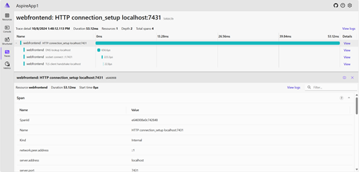

# Networking distributed traces in .NET

[Distributed tracing](../../../core/diagnostics/distributed-tracing.md) is a diagnostic technique that helps engineers localize failures and performance issues within applications, especially those that may be distributed across multiple machines or processes. This technique tracks requests through an application correlating together work done by different application components and separating it from other work the application may be doing for concurrent requests. For example, a request to a typical web service might be first received by a load balancer, then forwarded to a web server process, which then makes several queries to a database. Using distributed tracing allows engineers to distinguish if any of those steps failed, how long each step took, and potentially logging messages produced by each step as it ran.

The tracing system in .NET is designed to work with OpenTelemetry (OTel), and uses OTel to export the data to monitoring systems. Tracing in .NET is implemented using `System.Diagnostics.Activity` class along with `System.Diagnostics.ActivitySource` for collection, these correspond to `spans` in OTel. OpenTelemetry is defining an industry-wide standard for naming of tracing spans and their attributes, these are known as [semantic conventions](https://opentelemetry.io/docs/concepts/semantic-conventions). .NET telemetry is using the semantic conventions that have already been defined, and are working to add missing ones to the spec(s).

While the `System.Net` apis create activities, they rely on [OpenTelemetry instrumentation libraries](https://github.com/open-telemetry/opentelemetry-specification/blob/main/specification/glossary.md#instrumentation-library) to populate the `Activity` with the trace tags/attributes, primarily `[OpenTelemetry.Instrumentation.Http](https://github.com/open-telemetry/opentelemetry-dotnet-contrib/blob/main/src/OpenTelemetry.Instrumentation.Http)`.

In .NET 9, we have started to move the functionality to emit the tags/attributes to the networking libraries, starting with the Http libraries.  

> [!TIP]
> For a comprehensive list of all built-in tracing together with their tags/attributes, see [System.Net Tracing](../../../core/diagnostics/TBD).

## Collect System.Net traces

There are several parts to using distributed tracing in a .NET app:

* **Instrumentation:** Code in .NET libraries create an `ActivitySource` with a name, and then creates `Activity` objects to track work performed. The Activity objects are only created if there are listeners to the ActivitySource.
* **OpenTelemetry:** The OTel SDK listens to named ActivitySources and create spans to represent the work tracked by the Activity.
* **Instrumentation Packages:** Work with the OTel SDK to add additional attributes to the Activity based on the work being performed, implementing the OTel semantic conventions  
* **Exporters:** Integrate the OTel SDK with specific monitoring systems such as OTLP (an OTel standard wire format), Open Source monitoring solutions such as Jaeger or Zipkin, or commercial offerings such as Azure Monitor Application Insights.

This section demonstrates various methods to collect and view System.Net traces.

### .NET Aspire

The simplest solution for collecting traces for ASP.NET applications is to use [.NET Aspire](/dotnet/aspire/get-started/aspire-overview) which is a set of extensions to .NET to make it easy to create and work with distributed applications. One of the benefits of using .NET Aspire is that telemetry is built in, using the OpenTelemetry libraries for .NET. The default project templates for .NET Aspire contain a `ServiceDefaults` project, part of which is to setup and configure OTel. The Service Defaults project is referenced and initialized by each service in a .NET Aspire solution.

The Service Defaults project template includes the OTel SDK, ASP.NET, HttpClient and Runtime Instrumentation packages, and those are configured in the [`Extensions.cs`](https://github.com/dotnet/aspire/blob/main/src/Aspire.ProjectTemplates/templates/aspire-servicedefaults/Extensions.cs) file.  For exporting telemetry .NET Aspire includes the OTLP exporter by default so that it can provide telemetry visualization using the Aspire Dashboard.

The Aspire Dashboard is designed to bring telemetry observation to the local debug cycle, which enables developers to not only ensure that the applications are producing telemetry, but also use that telemetry to diagnose those applications locally. Being able to observe the calls between services is proving to be just as useful at debug time as in production. The .NET Aspire dashboard is launched automatically when you F5 the `AppHost` Project from Visual Studio or `dotnet run` the `AppHost` project.

[](../../../core/diagnostics/media/aspire-dashboard.png#lightbox)

For more details on .NET Aspire see:

- [Aspire Overview](/dotnet/aspire/get-started/aspire-overview)
- [Telemetry in Aspire](/dotnet/aspire/fundamentals/telemetry)
- [Aspire Dashboard](/dotnet/aspire/fundamentals/dashboard/explore)

### Reusing Service Defaults project without .NET Aspire Orchestration

Probably the easiest way to configure OTel for ASP.NET projects is to use the Aspire Service Defaults project, even if not using the rest of .NET Aspire such as the AppHost for orchestration. The Service Defaults project is available as a project template via Visual Studio or `dotnet new`. It configures OTel and sets up the OTLP exporter. You can then use the [OTel environment variables](https://github.com/open-telemetry/opentelemetry-dotnet/tree/main/src/OpenTelemetry.Exporter.OpenTelemetryProtocol#exporter-configuration) to configure the OTLP endpoint to send telemetry to, and provide the resource properties for the application.

The steps to use *ServiceDefaults* outside .NET Aspire are:

- Add the *ServiceDefaults* project to the solution using Add New Project in Visual Studio, or use `dotnet new aspire-servicedefaults --output ServiceDefaults`
- Reference the *ServiceDefaults* project from your ASP.NET application. In Visual Studio use "Add -> Project Reference" and select the *ServiceDefaults* project"
- Call its OpenTelemetry setup function as part of your application builder initialization.

``` csharp
var builder = WebApplication.CreateBuilder(args);
builder.ConfigureOpenTelemetry();

var app = builder.Build();

app.MapGet("/", () => "Hello World!");

app.Run();
```

For a full walkthrough, see [Example: Use OpenTelemetry with OTLP and the standalone Aspire Dashboard](../../../core/diagnostics/observability-otlp-example.md).


### Collecting traces manually

For a walkthrough of how to collect distributed traces, as well as metrics without using Aspire Service Defaults, see  [Example: Use OpenTelemetry with Prometheus, Grafana, and Jaeger](../../../core/diagnostics/observability-prgrja-example.md). 

## Experimental connection spans in .NET 9

.NET 9 adds a handful of new spans for collecting detailed connection information:

| Activity Source | Description |
| --- | --- |
| Experimental.System.Net.NameResolution | Tracks DNS resolution for anything using the .NET DNS api's such as HttpClient |
| Experimental.System.Net.Sockets | Tracks socket connection activity |
| Experimental.System.Net.Security | Tracks TLS handshake for inbound and outbound connections |
| Experimental.System.Net.Http.Connections | Tracks the Connection pool for HttpClient |

These spans are available starting with .NET 9. The ActivitySource Names start with `Experimental` as these spans are not yet included in the OpenTelemetry Semantic conventions, and may be changed as we learn more about how well they work in production. 

These spans are probably too verbose for use 24x7 in production scenarios with high workloads - they are somewhat noisy and this level of data is not normally needed. However if you are trying to diagnose connection issues or get a deeper understanding of how network and connection latency is affecting your services, then they provide insight that is hard to collect by other means. 

Note: When enabled, the http connection span is linked to from HttpClient request spans. As an http connection can be long lived, this could result in many links to the connection span from each of the request spans. Some APM monitoring tools aggresively walk links between spans to build up their views and so including this span may cause issues when the tools were not designed to account for large numbers of links.

### Walkthrough: Using the experimental spans in .NET 9

This walkthough uses an Aspire Application such as the __.NET Aspire Starter App__.

1. Modify each of the service projects to use .NET 9 by updating the `TargetFramework` to `net9.0` in each of the service's __.csproj__ files. The AppHost project does not need to be updated as it does not emit telemetry.
2. Similarly modify the `TargetFramework` to `net9.0` in the __ServiceDefaults__ project
3. Add the `ActivitySource` names to the initialization code in __Extensions.cs__ in the Service Defaults project:

``` csharp
    public static IHostApplicationBuilder ConfigureOpenTelemetry(this IHostApplicationBuilder builder)
    {
        builder.Logging.AddOpenTelemetry(logging =>
        {
            logging.IncludeFormattedMessage = true;
            logging.IncludeScopes = true;
        });

        builder.Services.AddOpenTelemetry()
            .WithMetrics(metrics =>
            {
                metrics.AddAspNetCoreInstrumentation()
                    .AddHttpClientInstrumentation()
                    .AddRuntimeInstrumentation();
            })
            .WithTracing(tracing =>
            {
                tracing.AddAspNetCoreInstrumentation()
                    // Uncomment the following line to enable gRPC instrumentation (requires the OpenTelemetry.Instrumentation.GrpcNetClient package)
                    //.AddGrpcClientInstrumentation()
                    .AddSource("System.Net.Http")
                    .AddSource("Experimental.System.Net.NameResolution")
                    .AddSource("Experimental.System.Net.Sockets")
                    .AddSource("Experimental.System.Net.Security")
                    .AddSource("Experimental.System.Net.Http.Connections");
                    // .AddHttpClientInstrumentation();
            });

        builder.AddOpenTelemetryExporters();

        return builder;
    }
```

In this example, the `AddHttpClientInstrumentation()` has been replaced with the built-in instrumentation to HttpClient in .NET 9 using `.AddSource("System.Net.Http")`.

When http requests are made with this instrumentation enabled, the HttpClient span will have the following changes:

[](media/aspire-httpclient-get.png#lightbox)

- If a connection needs to be established, or waiting for a connection from the connection pool, then an additional __Http wait_for_connection__ span will be shown which represents the delay for waiting for a connection to be made. This helps to understand delays between the HttpClient request being made in code, and when the destination server actually recieves and processes the request. In the picture above:
  - The selected span is the HttpClient request.
  - The one below it is the delay waiting for a connection to be established.
  - The lasts span in yellow is from the destination processing the request.
- The HttpClient span will have a link to the http connection setup span which shows the activity to create the http connection used by the request. 

[](aspire-http-connections.png#lightbox)

The http connection setup span is a separate span with its own TraceId as its lifetime is independent from each individual HttpClient request. Many HttpClient requests can be made over the same http connection, and if its already established and available (http 1.1 supports sequential requests over the same connection, http 2 & 3 enable parallel requests) then the request can reuse that connection. This span will have child spans for DNS lookup, TCP socket connecting and the TLS handshake as applicable.

## Extending Traces

There are a couple of approaches that can be taken to augment the existing tracing functionality from System.Net.

### Adding attributes to the Activity

The instrumentation libraries augment the built-in support for tracing by adding additional tags/attributes to the Activity. You need to do this before the Activity is completed. Techniques for accessing the Activity include:
* Using `Activity.Current` in code that is included in the scope of the Activity
* Using `DiagnosticSource` to get callbacks for when networking activity is occuring - this is how the OTel Instrumentation Libraries are implemented. For an example see [HttpHandlerDiagnosticListener.cs](https://github.com/open-telemetry/opentelemetry-dotnet-contrib/blob/main/src/OpenTelemetry.Instrumentation.Http/Implementation/HttpHandlerDiagnosticListener.cs) in the [Http instrumentation library](https://github.com/open-telemetry/opentelemetry-dotnet-contrib/blob/main/src/OpenTelemetry.Instrumentation.Http/README.md).

### Httpclient Instrumentation Enrichment API

Another approach when using the Http Instrumentation Library, is using the [Enrich HttpClient API](https://github.com/open-telemetry/opentelemetry-dotnet-contrib/blob/main/src/OpenTelemetry.Instrumentation.Http/README.md#enrich-httpclient-api).

## Need more tracing?

If you have suggestions for other useful information that could be exposed via tracing, create a [dotnet/runtime issue](https://github.com/dotnet/runtime/issues/new).
