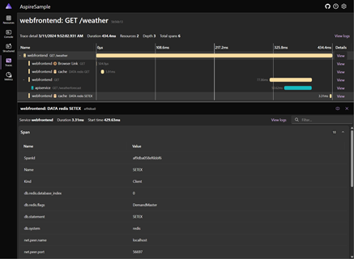
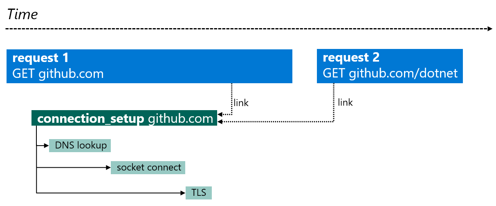
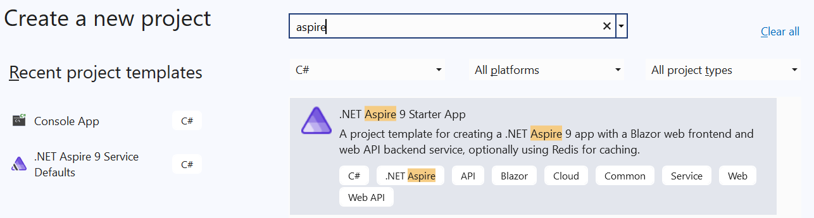
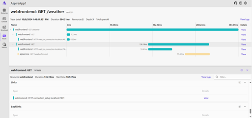
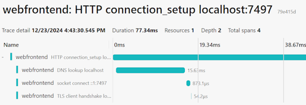

# Distributed tracing in System.Net libraries

[Distributed tracing](../../../core/diagnostics/distributed-tracing.md) is a diagnostic technique that helps engineers localize failures and performance issues within applications, especially those that are distributed across multiple machines or processes. This technique tracks requests through an application by correlating together work done by different components and separating it from other work the application might be doing for concurrent requests. For example, a request to a typical web service might be first received by a load balancer and then forwarded to a web server process, which then makes several queries to a database. Distributed tracing allows engineers to distinguish if any of those steps failed and how long each step took. It can also log messages produced by each step as it ran.

The tracing system in .NET is designed to work with OpenTelemetry (OTel), and uses OTel to export the data to monitoring systems. Tracing in .NET is implemented using the <xref:System.Diagnostics> APIs, where a unit of work is represented by the <xref:System.Diagnostics.Activity?displayProperty=nameWithType> class, which corresponds to an OTel [span](https://opentelemetry.io/docs/concepts/signals/traces/#spans). OpenTelemetry defines an industry-wide standard naming scheme for spans (activities) together with their attributes (tags), known as [semantic conventions](https://opentelemetry.io/docs/concepts/semantic-conventions). The .NET telemetry uses existing semantic conventions wherever possible.

> [!NOTE]
> The terms *span* and *activity* are synonymous in this article. In context of .NET code, they refer to a <xref:System.Diagnostics.Activity?displayProperty=nameWithType> instance. Don't confuse the OTel span with <xref:System.Span%601?displayProperty=nameWithType>.

> [!TIP]
> For a comprehensive list of all built-in activities together with their tags/attributes, see [Built-in activities in .NET](../../../core/diagnostics/distributed-tracing-builtin-activities.md).

## Instrumentation

To emit traces, the <xref:System.Net> libraries are [instrumented](../../../core/diagnostics/distributed-tracing-instrumentation-walkthroughs.md#add-basic-instrumentation) with built-in <xref:System.Diagnostics.ActivitySource> sources, which create <xref:System.Diagnostics.Activity> objects to track the work performed. Activities are only created if there are listeners subscribed to the <xref:System.Diagnostics.ActivitySource>.

The built-in instrumentation evolved with .NET versions.

- On .NET 8 and earlier, the instrumentation is limited to the creation of an empty [HTTP client request activity](../../../core/diagnostics/distributed-tracing-builtin-activities.md#http-client-request). This means that users have to rely on the [`OpenTelemetry.Instrumentation.Http`](https://github.com/open-telemetry/opentelemetry-dotnet-contrib/tree/1ca05685cbad63d3fa813b9cab49be341048e69e/src/OpenTelemetry.Instrumentation.Http#httpclient-and-httpwebrequest-instrumentation-for-opentelemetry) library to populate the activity with the information (for example, tags) needed to emit useful traces.
- .NET 9 extended the instrumentation by emitting the name, status, exception info, and the most important tags according to the OTel [HTTP client semantic conventions](https://opentelemetry.io/docs/specs/semconv/http/http-spans/#http-client) on the HTTP client request activity. This means that on .NET 9+, the `OpenTelemetry.Instrumentation.Http` dependency can be omitted, unless more advanced features like [enrichment](#enrichment) are required.
- .NET 9 also introduced [experimental connection tracing](#experimental-connection-tracing), adding new activities across the `System.Net` libraries to support diagnosing connection issues.

## Collect System.Net traces

At the [lowest level](../../../core/diagnostics/distributed-tracing-collection-walkthroughs.md#collect-traces-using-custom-logic), trace collection is supported via the <xref:System.Diagnostics.ActivitySource.AddActivityListener%2A> method, which registers <xref:System.Diagnostics.ActivityListener> objects containing user-defined logic.

However, as an application developer, you would likely prefer to rely on the rich ecosystem built upon the features provided by the [OpenTelemetry .NET SDK](https://opentelemetry.io/docs/languages/net/) to collect, export, and monitor traces.

- To get a fundamental understanding on trace collection with OTel, see our guide on [collecting traces using OpenTelemetry](../../../core/diagnostics/distributed-tracing-collection-walkthroughs.md#collect-traces-using-opentelemetry).
- For **production-time** trace collection and monitoring, you can use OpenTelemetry with [Prometheus, Grafana, and Jaeger](../../../core/diagnostics/observability-prgrja-example.md) or with [Azure Monitor and Application Insights](../../../core/diagnostics/observability-applicationinsights.md). However, these tools are quite complex and might be inconvenient to use at development time.
- For **development-time** trace collection and monitoring, we recommend using [.NET Aspire](#collect-traces-with-net-aspire) which provides a simple but extensible way to kickstart distributed tracing in your application and to diagnose issues locally.
- It's also possible to [reuse the Aspire Service Defaults](#reuse-service-defaults-project-without-net-aspire-orchestration) project without the Aspire orchestration. This is a handy way to introduce and configure OpenTelemetry tracing and metrics in your ASP.NET projects.

### Collect traces with .NET Aspire

[!INCLUDE[Aspire Telemetry Overview](./includes/aspire-telemetry-overview.md)]

[](../../../core/diagnostics/media/aspire-dashboard.png#lightbox)

For more information on .NET Aspire, see:

- [Aspire Overview](/dotnet/aspire/get-started/aspire-overview)
- [Telemetry in Aspire](/dotnet/aspire/fundamentals/telemetry)
- [Aspire Dashboard](/dotnet/aspire/fundamentals/dashboard/explore)

### Reuse Service Defaults project without .NET Aspire Orchestration

[!INCLUDE[Aspire Service Defaults](./includes/aspire-service-defaults.md)]

## Experimental connection tracing

When troubleshooting `HttpClient` issues or bottlenecks, it might be crucial to see where time is being spent when sending HTTP requests. Often, the problem occurs during HTTP connection establishment, which typically breaks down to DNS lookup, TCP connection, and TLS handshake.

.NET 9 introduced experimental connection tracing adding an `HTTP connection setup` span with three child spans representing the DNS, TCP, and TLS phases of the connection establishment. The HTTP part of the connection tracing is implemented within <xref:System.Net.Http.SocketsHttpHandler>, meaning that the activity model has to respect the underlying connection pooling behavior.

> [!NOTE]
> In <xref:System.Net.Http.SocketsHttpHandler>, connections and requests have independent lifecycles. A [pooled connection](../http/httpclient-guidelines.md#pooled-connections) can live for a long time and serve many requests. When making a request, if there's no connection immediately available in the connection pool, the request is added to a request queue to wait for an available connection. There's no direct relationship between waiting requests and connections. The connection process might have started when another connection became available for use, in which case the freed connection is used. As a result, the `HTTP connection setup` span isn't modeled as a child of the `HTTP client request` span; instead, span links are used.

.NET 9 introduced the following spans to enable collecting detailed connection information:

| Name | <xref:System.Diagnostics.ActivitySource> | Description |
|---|---|---|
| [`HTTP wait_for_connection`](../../../core/diagnostics/distributed-tracing-builtin-activities.md#http-client-request-wait-for-connection-experimental) | `Experimental.System.Net.Http.Connections` | A child span of the `HTTP client request` span that represents the time interval the request is waiting for an available connection in the request queue. |
| [`HTTP connection_setup`](../../../core/diagnostics/distributed-tracing-builtin-activities.md#http-connection-setup-experimental) | `Experimental.System.Net.Http.Connections` | Represents the establishment of the HTTP connection. A separate trace root span with its own `TraceId`. `HTTP client request` spans might contain links to `HTTP connection_setup`. |
| [`DNS lookup`](../../../core/diagnostics/distributed-tracing-builtin-activities.md#dns-lookup-experimental) | `Experimental.System.Net.NameResolution` | DNS lookup performed by the <xref:System.Net.Dns> class. |
| [`socket connect`](../../../core/diagnostics/distributed-tracing-builtin-activities.md#socket-connect-experimental) | `Experimental.System.Net.Sockets` | Establishment of a <xref:System.Net.Sockets.Socket> connection. |
| [`TLS handshake`](../../../core/diagnostics/distributed-tracing-builtin-activities.md#tls-handshake-experimental) | `Experimental.System.Net.Security` | TLS client or server handshake performed by <xref:System.Net.Security.SslStream>. |

> [!NOTE]
> The corresponding `ActivitySource` names start with the prefix `Experimental`, as these spans might be changed in future versions as we learn more about how well they work in production.

These spans are too verbose for use 24x7 in production scenarios with high workloads - they're noisy and this level of instrumentation isn't normally needed. However, if you're trying to diagnose connection issues or get a deeper understanding of how network and connection latency is affecting your services, then they provide insight that's hard to collect by other means.

When the `Experimental.System.Net.Http.Connections` ActivitySource is enabled, *the `HTTP client request` span contains a link to the `HTTP connection_setup` span corresponding to the connection serving the request*. As an HTTP connection can be long lived, this could result in many links to the connection span from each of the request activities. Some APM monitoring tools aggressively walk links between spans to build up their views, and so including this span can cause issues when the tools weren't designed to account for large numbers of links.

The following diagram illustrates the behavior of the spans and their relationship:

[](media/connection-link.png#lightbox)

### Walkthrough: Using the experimental connection tracing in .NET 9

This walkthrough uses a [.NET 9 Aspire Starter App](/dotnet/aspire/get-started/build-your-first-aspire-app) to demonstrate connection tracing, but it should be easy to set it up with [other monitoring tools](#collect-systemnet-traces) as well. The key step is to enable the ActivitySources.

1. Create a **.NET Aspire 9 Starter App** by using `dotnet new`:

    ```dotnetcli
    dotnet new aspire-starter-9 --output ConnectionTracingDemo
    ```

    Or in Visual Studio:

    

1. Open `Extensions.cs` in the `ServiceDefaults` project, and edit the `ConfigureOpenTelemetry` method adding the ActivitySources for connection in the tracing configuration callback:

    :::code language="csharp" source="snippets/tracing/ConnectionTracingDemo.ServiceDefaults/Extensions.cs" id="snippet_ConnectionTracing":::

1. Start the solution. This should open the [.NET Aspire Dashboard](/dotnet/aspire/fundamentals/dashboard/overview).

1. Navigate to the Weather page of the `webfrontend` app to generate an `HttpClient` request towards `apiservice`.

1. Return to the Dashboard and navigate to the **Traces** page. Open the `webfrontend: GET /weather` trace.

   [](media/aspire-httpclient-get.png#lightbox)

When HTTP requests are made with the connection instrumentation enabled, you should see the following changes to the client request spans:

- If a connection needs to be established, or if the app is waiting for a connection from the connection pool, then an additional [`HTTP wait_for_connection`](../../../core/diagnostics/distributed-tracing-builtin-activities.md#http-client-request-wait-for-connection-experimental) span is shown, which represents the delay for waiting for a connection to be made. This helps to understand delays between the `HttpClient` request being made in code, and when the processing of the request actually starts. In the previous image:
  - The selected span is the HttpClient request.
  - The span below represents the time the request spends waiting for a connection to be established.
  - The last span in yellow is from the destination processing the request.
- The HttpClient span will have a link to the [`HTTP connection_setup`](../../../core/diagnostics/distributed-tracing-builtin-activities.md#http-connection-setup-experimental) span, which represents the activity to create the HTTP connection used by the request.

[](media/aspire-connection_setup.png#lightbox)

[As mentioned previously](#experimental-connection-tracing), the [`HTTP connection_setup`](../../../core/diagnostics/distributed-tracing-builtin-activities.md#http-connection-setup-experimental) span is a separate span with its own `TraceId`, as its lifetime is independent from each individual client request. This span typically has child spans [`DNS lookup`](../../../core/diagnostics/distributed-tracing-builtin-activities.md#dns-lookup-experimental), (TCP) [`socket connect`](../../../core/diagnostics/distributed-tracing-builtin-activities.md#socket-connect-experimental), and [`TLS client handshake`](../../../core/diagnostics/distributed-tracing-builtin-activities.md#tls-handshake-experimental).

## Enrichment

In some cases, it's necessary to augment the existing `System.Net` tracing functionality. Typically this means injecting additional tags/attributes to the built-in activities. This is called *enrichment*.

### Enrichment API in the OpenTelemetry instrumentation library

To add additional tags/attributes to the HTTP client request activity, the simplest approach is to use the [`HttpClient` enrichment APIs](https://github.com/open-telemetry/opentelemetry-dotnet-contrib/blob/main/src/OpenTelemetry.Instrumentation.Http/README.md#enrich-httpclient-api) of the OpenTelemetry HttpClient and HttpWebRequest instrumentation library. This requires taking a dependency on the [`OpenTelemetry.Instrumentation.Http`](https://www.nuget.org/packages/OpenTelemetry.Instrumentation.Http) package.

### Manual enrichment

It's possible to implement the enrichment of the `HTTP client request` activity manually. For this you need to access <xref:System.Diagnostics.Activity.Current%2A?displayProperty=nameWithType> in the code that is running in the scope of the request activity, before the activity is finished. This can be done by implementing an `IObserver<DiagnosticListener>` and subscribing it to <xref:System.Diagnostics.DiagnosticListener.AllListeners%2A> to get callbacks for when networking activity is occurring. In fact, this is how the [OpenTelemetry HttpClient and HttpWebRequest instrumentation library](#enrichment-api-in-the-opentelemetry-instrumentation-library) is implemented. For a code example, see the subscription code in [`DiagnosticSourceSubscriber.cs`](https://github.com/open-telemetry/opentelemetry-dotnet-contrib/blob/bfdf02928ea7f958c481493bc1adc238472b9b9c/src/Shared/DiagnosticSourceSubscriber.cs#L44) and the underlying implementation in [HttpHandlerDiagnosticListener.cs](https://github.com/open-telemetry/opentelemetry-dotnet-contrib/blob/bfdf02928ea7f958c481493bc1adc238472b9b9c/src/OpenTelemetry.Instrumentation.Http/Implementation/HttpHandlerDiagnosticListener.cs) where the notifications are delegated to.

## Need more tracing?

If you have suggestions for other useful information that could be exposed via tracing, create a [dotnet/runtime issue](https://github.com/dotnet/runtime/issues/new).
