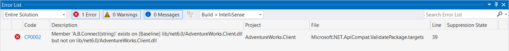
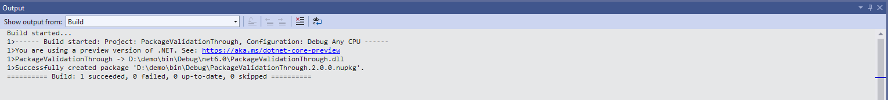

# Validate against a baseline package version

Package Validation can help you validate your library project against a previously released, stable version of your package. To enable package validation, add the `PackageValidationBaselineVersion` or `PackageValidationBaselinePath` property to your project file.

Package validation detects any breaking changes on any of the shipped target frameworks. It also detects if any target framework support has been dropped.

For example, consider the following scenario. You're working on the AdventureWorks.Client NuGet package and you want to make sure that you don't accidentally make breaking changes. You configure your project to instruct package validation tooling to run API compatibility checks against the previous version of the package.

```xml
<Project Sdk="Microsoft.NET.Sdk">

  <PropertyGroup>
    <TargetFramework>net6.0</TargetFramework>
    <PackageVersion>2.0.0</PackageVersion>
    <EnablePackageValidation>true</EnablePackageValidation>
    <PackageValidationBaselineVersion>1.0.0</PackageValidationBaselineVersion>
  </PropertyGroup>

</Project>
```

A few weeks later, you're tasked with adding support for a connection timeout to your library. The `Connect` method currently looks like this:

```csharp
public static HttpClient Connect(string url)
{
    // ...
}
```

Since a connection timeout is an advanced configuration setting, you reckon that you can just add an optional parameter:

```csharp
public static HttpClient Connect(string url, TimeSpan timeout = default)
{
    // ...
}
```

However, when you try to pack, it throws an error.

```cmd
D:\demo>dotnet pack
Microsoft (R) Build Engine version 17.0.0-preview-21460-01+8f208e609 for .NET
Copyright (C) Microsoft Corporation. All rights reserved.

  Determining projects to restore...
  All projects are up-to-date for restore.
  You are using a preview version of .NET. See: https://aka.ms/dotnet-core-preview
  PackageValidationThrough -> D:\demo\bin\Debug\net6.0\PackageValidationThrough.dll
  Successfully created package 'D:\demo\bin\Debug\PackageValidationThrough.2.0.0.nupkg'.
C:\Program Files\dotnet\sdk\6.0.100-rc.1.21463.6\Sdks\Microsoft.NET.Sdk\targets\Microsoft.NET.Compatibility.Common.targets(32,5): error CP0002: Member 'A.B.Connect(string)' exists on [Baseline] lib/net6.0/PackageValidationThrough.dll but not on lib/net6.0/PackageValidationThrough.dll [D:\demo\PackageValidationThrough.csproj]
```



You realize that while this is not a [source breaking change](../../standard/library-guidance/breaking-changes.md#source-breaking-change), it is a [binary breaking change](../../standard/library-guidance/breaking-changes.md#binary-breaking-change). You solve this problem by adding a new overload instead of adding a parameter to the existing method:

```csharp
public static HttpClient Connect(string url)
{
    return Connect(url, Timeout.InfiniteTimeSpan);
}

public static HttpClient Connect(string url, TimeSpan timeout)
{
    // ...
}
```

Now when you pack the project, it succeeds.


