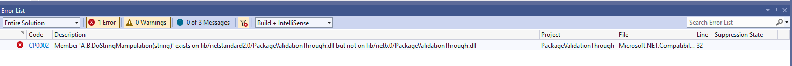
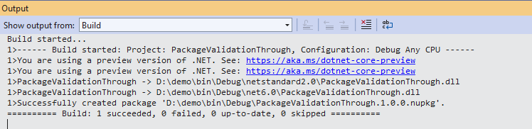

# Validate compatible frameworks

Packages containing compatible frameworks need to ensure that code compiled against one can run against another. Examples of compatible framework pairs are:

* .NET Standard 2.0 and .NET 6
* .NET 5 and .NET 6

In both of these cases, consumers can build against .NET Standard 2.0 or NET 5 and run on .NET 6. If your binaries are not compatible between these frameworks, consumers could end up with compile-time or run-time errors.

Package validation catches these errors at pack time. Here is an example scenario:

Suppose you're writing a game that manipulates strings. You need to support both .NET Framework and .NET (.NET Core) consumers. Originally, your project targeted .NET Standard 2.0, but now you want to take advantage of `Span<T>` in .NET 6 to avoid unnecessary string allocations. To do that, you want to multi-target for .NET Standard 2.0 and .NET 6.

You've written the following code:

```csharp
#if NET6_0_OR_GREATER
    public void DoStringManipulation(ReadOnlySpan<char> input)
    {
        // use spans to do string operations.
    }
#else
    public void DoStringManipulation(string input)
    {
        // Do some string operations.
    }
#endif
```

You then try to pack the project (using either `dotnet pack` or Visual Studio), and it fails with the following error:

```
D:\demo>dotnet pack
Microsoft (R) Build Engine version 17.0.0-preview-21460-01+8f208e609 for .NET
Copyright (C) Microsoft Corporation. All rights reserved.

  Determining projects to restore...
  All projects are up-to-date for restore.
  You are using a preview version of .NET. See: https://aka.ms/dotnet-core-preview
  You are using a preview version of .NET. See: https://aka.ms/dotnet-core-preview
  PackageValidationThrough -> D:\demo\bin\Debug\netstandard2.0\PackageValidationThrough.dll
  PackageValidationThrough -> D:\demo\bin\Debug\net6.0\PackageValidationThrough.dll
  Successfully created package 'D:\demo\bin\Debug\PackageValidationThrough.1.0.0.nupkg'.
C:\Program Files\dotnet\sdk\6.0.100-rc.1.21463.6\Sdks\Microsoft.NET.Sdk\targets\Microsoft.NET.Compatibility.Common.targets(32,5): error CP0002: Member 'A.B.DoStringManipulation(string)' exists on lib/netstandard2.0/PackageValidationThrough.dll but not on lib/net6.0/PackageValidationThrough.dll [D:\demo\PackageValidationThrough.csproj]
```



You realize that instead of excluding `DoStringManipulation(string)` for .NET 6, you should just provide an additional `DoStringManipulation(ReadOnlySpan<char>)` method for .NET 6:

```csharp
#if NET6_0_OR_GREATER
    public void DoStringManipulation(ReadOnlySpan<char> input)
    {
        // use spans to do string operations.
    }
#endif
    public void DoStringManipulation(string input)
    {
        // Do some string operations.
    }
```

You try to pack the project again, and it succeeds.



You can enable *strict mode* for this validator by setting the `EnableStrictModeForCompatibleFrameworksInPackage` property in your project file. Enabling strict mode changes some rules and executes some other rules when getting the differences. This is useful when you want both sides you're comparing to be strictly the same on their surface area and identity.
