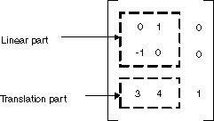
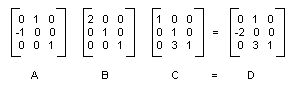

# System.Drawing.Drawing2D.Matrix class

[!INCLUDE [context](includes/context.md)]

The <xref:System.Drawing.Drawing2D.Matrix> class encapsulates a 3-by-3 affine matrix that represents a geometric transform.

In GDI+, you can store an affine transformation in a <xref:System.Drawing.Drawing2D.Matrix> object. Because the third column of a matrix that represents an affine transformation is always (0, 0, 1), you specify only the six numbers in the first two columns when you construct a <xref:System.Drawing.Drawing2D.Matrix> object. The statement `Matrix myMatrix = new Matrix(0, 1, -1, 0, 3, 4)` constructs the matrix shown in the following figure.

[!INCLUDE[System.Drawing.Common note](./includes/system-drawing-common.md)]

## Composite transformations

A composite transformation is a sequence of transformations, one followed by the other. Consider the matrices and transformations in the following list:

| Matrix   | Transformation                            |
|----------|-------------------------------------------|
| Matrix A | Rotate 90 degrees                         |
| Matrix B | Scale by a factor of 2 in the x direction |
| Matrix C | Translate 3 units in the y direction      |

If you start with the point (2, 1) - represented by the matrix [2 1 1] - and multiply by A, then B, then C, the point (2, 1) will undergo the three transformations in the order listed.

`[2 1 1]ABC = [-2 5 1]`

Rather than store the three parts of the composite transformation in three separate matrices, you can multiply A, B, and C together to get a single 3×3 matrix that stores the entire composite transformation. Suppose `ABC = D`. Then a point multiplied by D gives the same result as a point multiplied by A, then B, then C.

`[2 1 1]D = [-2 5 1]`

The following illustration shows the matrices A, B, C, and D.

The fact that the matrix of a composite transformation can be formed by multiplying the individual transformation matrices means that any sequence of affine transformations can be stored in a single <xref:System.Drawing.Drawing2D.Matrix> object.

> [!CAUTION]
> The order of a composite transformation is important. In general, rotate, then scale, then translate is not the same as scale, then rotate, then translate. Similarly, the order of matrix multiplication is important. In general, ABC is not the same as BAC.

The <xref:System.Drawing.Drawing2D.Matrix> class provides several methods for building a composite transformation: <xref:System.Drawing.Drawing2D.Matrix.Multiply%2A>, <xref:System.Drawing.Drawing2D.Matrix.Rotate%2A>, <xref:System.Drawing.Drawing2D.Matrix.RotateAt%2A>, <xref:System.Drawing.Drawing2D.Matrix.Scale%2A>, <xref:System.Drawing.Drawing2D.Matrix.Shear%2A>, and <xref:System.Drawing.Drawing2D.Matrix.Translate%2A>. The following example creates the matrix of a composite transformation that first rotates 30 degrees, then scales by a factor of 2 in the y direction, and then translates 5 units in the x direction:

:::code language="csharp" source="./snippets/System.Drawing.Drawing2D/Matrix/Overview/csharp/Class1.cs" id="Snippet11":::
:::code language="vb" source="./snippets/System.Drawing.Drawing2D/Matrix/Overview/vb/Class1.vb" id="Snippet11":::
