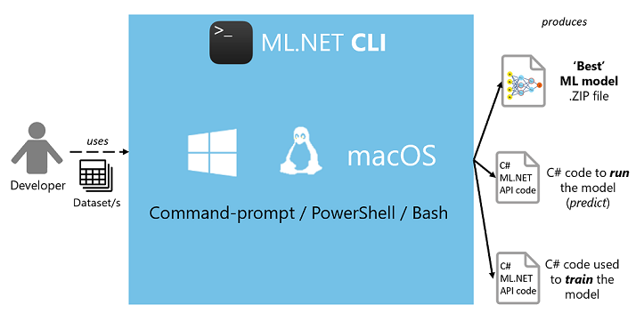
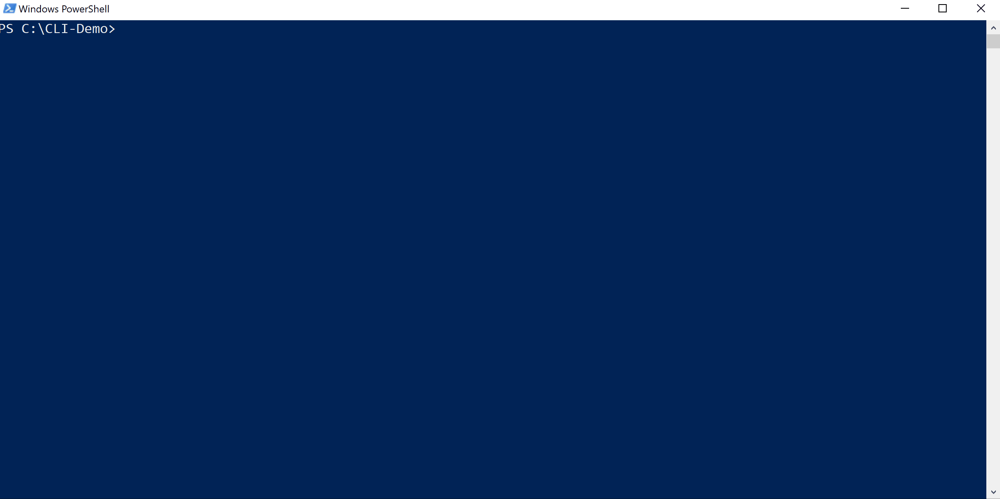
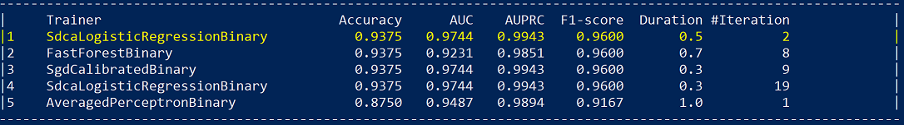
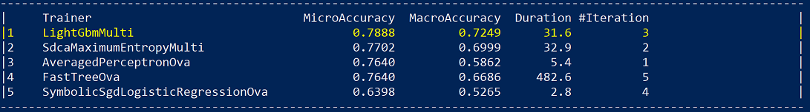
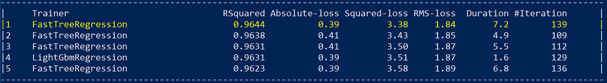

# Automate model training with the ML.NET CLI

The ML.NET CLI automates model generation for .NET developers.

To use the ML.NET API by itself, (without the ML.NET AutoML CLI) you need to choose a trainer (implementation of a machine learning algorithm for a particular task), and the set of data transformations (feature engineering) to apply to your data. The optimal pipeline will vary for each dataset and selecting the optimal algorithm from all the choices adds to the complexity. Even further, each algorithm has a set of hyperparameters to be tuned. Hence, you can spend weeks and sometimes months on machine learning model optimization trying to find the best combinations of feature engineering, learning algorithms, and hyperparameters.

The ML.NET CLI simplifies this process using automated machine learning (AutoML). 

> [!NOTE]
> This topic refers to ML.NET **CLI** and ML.NET **AutoML**, which are currently in Preview, and material may be subject to change.

## What is the ML.NET Command-line Interface (CLI)?

The ML.NET CLI is a dotnet global tool. Once installed you give it a machine learning task and a training dataset, and it generates an ML.NET model, as well as the C# code to run to use the model in your application.

As shown in the figure below, it is simple to generate a high quality ML.NET model (serialized model .zip file) plus the sample C# code to run/score that model. In addition, the C# code to create/train that model is also generated, so that you can research and iterate on the algorithm and settings used for that generated "best model".



You can generate those assets from your own datasets without coding by yourself, so it also improves your productivity even if you already know ML.NET.

Currently, the ML Tasks supported by the ML.NET CLI are:

- `binary-classification`
- `multiclass-classification`
- `regression`
- Future: other machine learning tasks such as `recommendation`, `ranking`, `anomaly-detection`, `clustering`

Example of usage:

```console
mlnet auto-train --task binary-classification --dataset "customer-feedback.tsv" --label-column-name Sentiment
```



You can run it the same way on *Windows PowerShell*, *macOS/Linux bash, or *Windows CMD*. However, tabular auto-completion (parameter suggestions) won't work on *Windows CMD*.

## Output assets generated

The CLI `auto-train` command generates the following assets in the output folder:

- A serialized model .zip ("best model") ready to use for running predictions.
- C# solution with:
  - C# code to run/score that generated model (to make predictions in your end-user apps with that model).
  - C# code with the training code used to generate that model (for learning purposes or model retraining).
- Log file with information of all iterations/sweeps across the multiple algorithms evaluated, including their detailed configuration/pipeline.

The first two assets can directly be used in your end-user apps (ASP.NET Core web app, services, desktop app, etc.) to make predictions with that generated ML model.

The third asset, the training code, shows you what ML.NET API code was used by the CLI to train the generated model, so you can retrain your model and investigate and iterate on which specific trainer/algorithm and hyperparameters were selected by the CLI and AutoML under the covers.

## Understanding the quality of the model

When you generate a 'best model' with the CLI tool, you see quality metrics (such as accuracy, and R-Squared) as appropriate for the ML task you are targeting.

Here we summarize those metrics grouped by ML task so you can understand the quality of your auto-generated 'best model'.

### Metrics for Binary Classification models

The following displays the binary classification ML task metrics list for the top five models found by the CLI:



Accuracy is a popular metric for classification problems, however accuracy is not always the best metric to select the best model from as explained in the references below. There are cases where you need to evaluate the quality of your model with additional metrics.

To explore and understand the metrics that are output by the CLI, see [Evaluation metrics for binary classification](resources/metrics.md#evaluation-metrics-for-binary-classification).

### Metrics for Multi-class Classification models

The following displays the multi-class classification ML task metrics list for the top five models found by the CLI:



To explore and understand the metrics that are output by the CLI, see [Evaluation metrics for multiclass classification](resources/metrics.md#evaluation-metrics-for-multi-class-classification).

### Metrics for Regression and Recommendation models

A regression model fits the data well if the differences between the observed values and the model's predicted values are small and unbiased. Regression can be evaluated with certain metrics.

You will see a similar list of metrics for the best top five quality models found by the CLI. In this particular case related to a regression ML task:



To explore and understand the metrics that are output by the CLI, see [Evaluation metrics for regression](resources/metrics.md#evaluation-metrics-for-regression-and-recommendation).

## See also

- [How to install the ML.NET CLI tool](how-to-guides/install-ml-net-cli.md)
- [Tutorial: Analyze sentiment using the ML.NET CLI](tutorials/sentiment-analysis-cli.md)
- [ML.NET CLI command reference](reference/ml-net-cli-reference.md)
- [Telemetry in ML.NET CLI](resources/ml-net-cli-telemetry.md)
