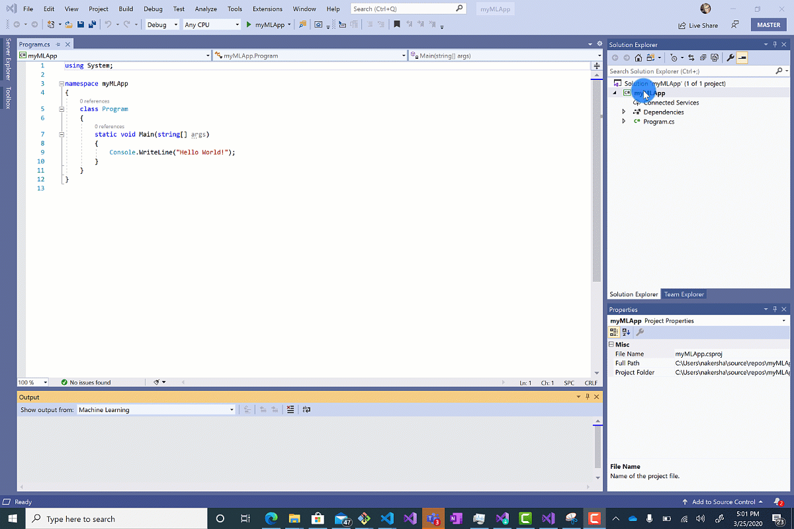
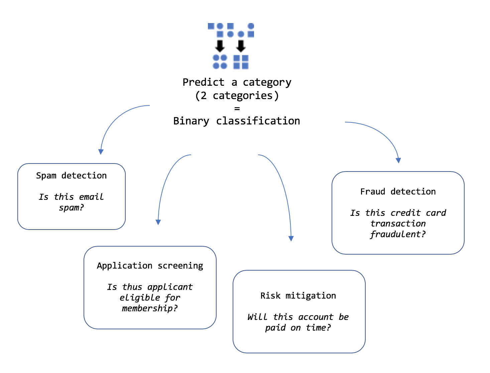
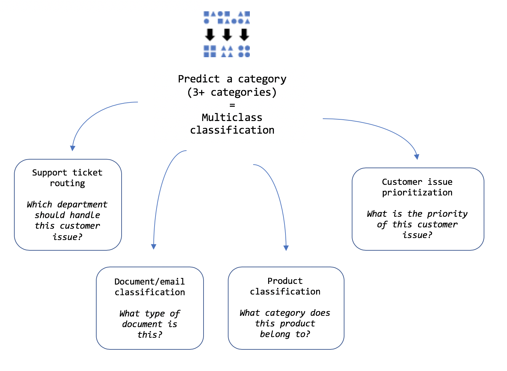
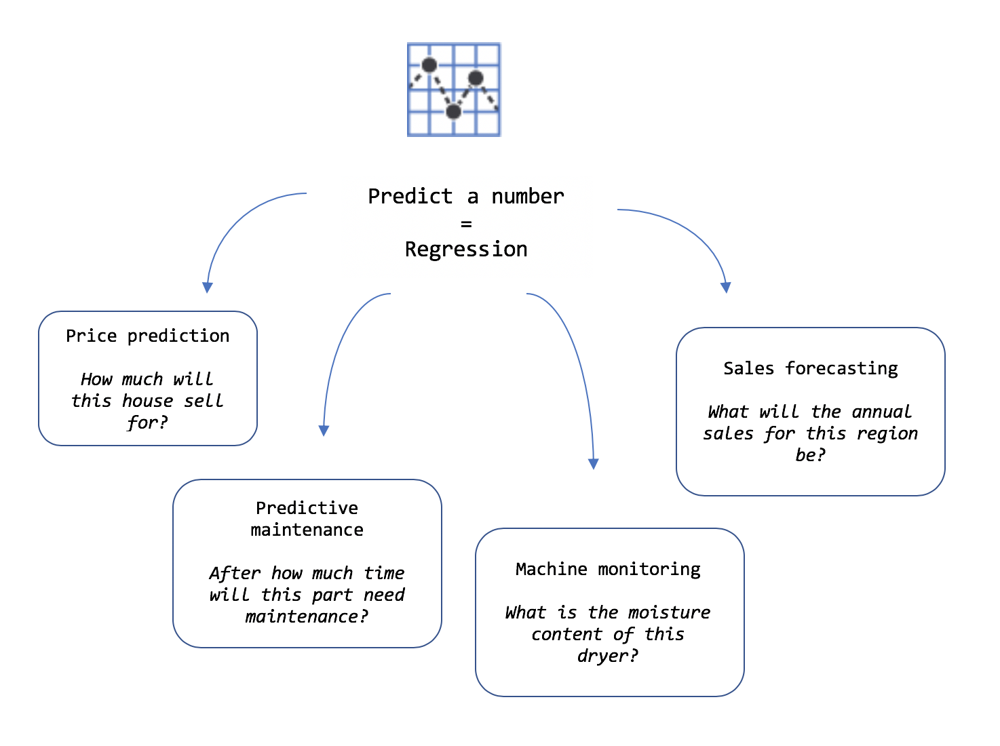
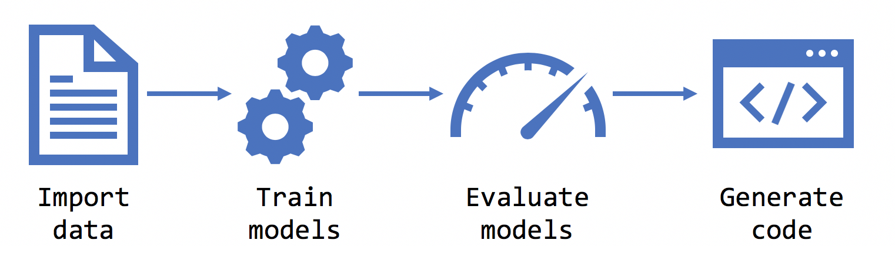
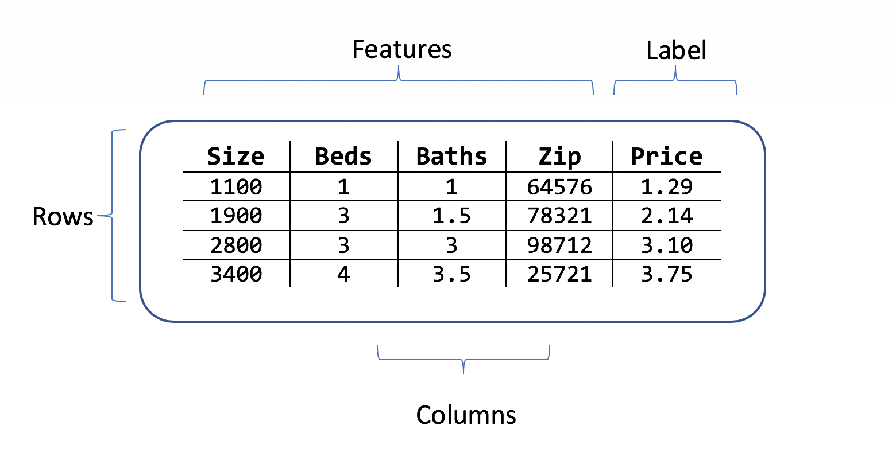

# What is Model Builder and how does it work?

ML.NET Model Builder is an intuitive graphical Visual Studio extension to build, train, and deploy custom machine learning models.

Model Builder uses automated machine learning (AutoML) to explore different machine learning algorithms and settings to help you find the one that best suits your scenario.

You don't need machine learning expertise to use Model Builder. All you need is some data, and a problem to solve. Model Builder generates the code to add the model to your .NET application.

> [!NOTE]
> Model Builder is currently in Preview.

## Scenarios

You can bring many different scenarios to Model Builder, to generate a machine learning model for your application.

A scenario is a description of the type of prediction you want to make using your data. For example:

- predict future product sales volume based on historical sales data
- classify sentiments as positive or negative based on customer reviews
- detect whether a banking transaction is fraudulent
- route customer feedback issues to the correct team in your company

## Choose a model type

In Model Builder, you need to select a machine learning model type. The type of model depends on what sort of prediction you are trying to make.

For scenarios that predict a number, the machine learning model type is called `regression`.

For scenarios that predict a category, the model type is `classification`. There are two types of classification:

- where there are only 2 categories: `binary classification`.
- where there are three or more categories: `multiclass classification`.

### Which model type is right for me?

#### Predict a category (when there are only two categories)

Binary classification is used to categorize data into two categories (yes/no; pass/fail; true/false; positive/negative).

Sentiment analysis can be used to predict positive or negative sentiment of customer feedback. It is an example of a binary classification model type.

If your scenario requires classification into two categories, you can use this template with your own dataset.

#### Predict a category (when there are three or more categories)

Multiclass classification can be used to categorize data into three or more classes.

Issue classification can be used to categorize customer feedback (for example, on GitHub) issues using the issue title and description. It is an example of the multi-class classification model type.

You can use the issue classification template for your scenario if you want to categorize data into three or more categories.

#### Predict a number

Regression is used to predict numbers.

Price prediction can be used to predict house prices using location, size, and other characteristics of the house. It is an example of a regression model type.

You can use the price prediction template for your scenario if you want to predict a numerical value with your own dataset.

#### Custom scenario (choose your model type)

The custom scenario allows you to manually choose your model type.

## Data

Once you have chosen your model type, Model Builder asks you to provide a dataset. The data is used to train, evaluate, and choose the best model for your scenario.

### Choose the output to predict (label)

A dataset is a table of rows of training examples, and columns of attributes. Each row has:

- a **label** (the attribute that you want to predict)
- **features** (attributes that are used as inputs to predict the label).

For the house-price prediction scenario, the features could be:

- the square footage of the house
- the number of bedrooms and bathrooms
- the zip code

The label is the historical house price for that row of square footage, bedroom, and bathroom values and zip code.

### Example datasets

If you don't have your own data yet, try out one of these datasets:

|Scenario|Model Type|Data|Label|Features|
|-|-|-|-|-|
|Price prediction|regression|[taxi fare data](https://github.com/dotnet/machinelearning-samples/blob/master/datasets/taxi-fare-train.csv)|Fare|Trip time, distance|
|Anomaly detection|binary classification|[product sales data](https://github.com/dotnet/machinelearning-samples/blob/master/samples/csharp/getting-started/AnomalyDetection_Sales/SpikeDetection/Data/product-sales.csv)|Product Sales|Month|
|Sentiment analysis|binary classification|[website comment data](https://raw.githubusercontent.com/dotnet/machinelearning/master/test/data/wikipedia-detox-250-line-data.tsv)|Label (0 when negative sentiment, 1 when positive)|Comment, Year|
|Fraud detection|binary classification|[credit card data](https://github.com/dotnet/machinelearning-samples/blob/master/samples/csharp/getting-started/BinaryClassification_CreditCardFraudDetection/CreditCardFraudDetection.Trainer/assets/input/creditcardfraud-dataset.zip)|Class (1 when fraudulent, 0 otherwise)|Amount, V1-V28 (anonymized features)|
|Text classification|multiclass classification|[GitHub issue data](https://github.com/dotnet/machinelearning-samples/blob/master/samples/csharp/end-to-end-apps/MulticlassClassification-GitHubLabeler/GitHubLabeler/Data/corefx-issues-train.tsv)|Area|Title, Description|

## Train

Once you select your scenario, data, and label, Model Builder trains the model.

### What is training?

Training is an automatic process by which Model Builder teaches your model how to answer questions for your scenario. Once trained, your model can make predictions with input data that it has not seen before. For example, if you are predicting house prices and a new house comes on the market, you can predict its sale price.

Because Model Builder uses automated machine learning (AutoML), it does not require any input or tuning from you during training.

## Evaluate

Evaluation is the process of using the trained model to make predictions with new test data, and then measuring how good the predictions are.

Model Builder splits the training data into a training set and a test set. The training data (80%) is used to train your model and the test data (20%) is held back to evaluate your model. Model Builder uses metrics to measure how good the model is. The specific metrics used are dependent on the type of model. For more information, see [model evaluation metrics](resources/metrics.md).

## Improve

If your model performance score is not as good as you want it to be, you can:

- Train for a longer period of time. With more time, the automated machine learning engine to try more algorithms and settings.

- Add more data. Sometimes the amount of data is not sufficient to train a high-quality machine learning model.

- Balance your data. For classification tasks, make sure that the training set is balanced across the categories. For example, if you have four classes for 100 training examples, and the two first classes (tag1 and tag2) are used for 90 records, but the other two (tag3 and tag4) are only used on the remaining 10 records, the lack of balanced data may cause your model to struggle to correctly predict tag3 or tag4.

## Code

After the evaluation phase, Model Builder outputs a model file, and code that you can use to add the model to your application. ML.NET models are saved as a zip file. The code to load and use your model is added as a new project in your solution. Model Builder also adds a sample console app that you can run to see your model in action.

In addition, Model Builder outputs the code that generated the model, so that you can understand the steps used to generate the model. You can also use the model training code to retrain your model with new data.

## What's next?

[Install](how-to-guides/install-model-builder.md) the Model Builder Visual Studio extension

Try [price prediction or any regression scenario](tutorials/predict-prices-with-model-builder.md)
