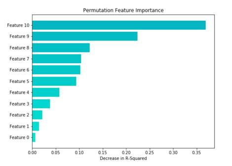

# Determine the feature importance of models with Permutation Feature Importance in ML.NET

When creating machine learning models, it is often not enough to simply make predictions. Often, machine learning developers, decision makers, and those affected by the models need to understand how machine learning models make decisions and which features contribute to their performance. `Permutation Feature Importance` (PFI) is a model explainability tool that is used internally at Microsoft to help machine learning developers better understand the feature importance of models.

PFI is a technique to determine **global feature importance** in a trained machine learning model, motivated by Breiman in the ["Random Forests" paper, section 10](https://www.stat.berkeley.edu/~breiman/randomforest2001.pdf). PFI measures feature importance by asking the question, "What would the effect on the model be if the values for a feature were set to a random* value?". The advantage of the PFI method is that it is model agnostic — it works with any model that can be evaluated — and it can use any dataset, not just the training set, to compute feature importance. You can use PFI like so to produce feature importances like this graph:



```csharp
// Compute the feature importance using PFI
var permutationMetrics = mlContext.Regression.PermutationFeatureImportance(model.LastTransformer, model.Transform(data), "MedianHomeValue");

// Get the feature names from the training set
var featureNames =
    data.Schema.AsEnumerable()
    .Select(column => column.Name) // Get the column names
    .Where(name => name != "MedianHomeValue") // Drop the Label
    .ToArray();

// Write out the feature names and their importance to the model's Mean R-squared value
for (int i = 0; i < featureNames.Length;i++)
{
    Console.WriteLine($"{featureNames[i]}\t{permutationMetrics[i].RSquared.Mean:G4}");
}
```

For a sample using PFI to analyze the feature importance of a model, see [the dotnet/machinelearning GitHub repository](https://github.com/dotnet/machinelearning/tree/master/docs/samples/Microsoft.ML.Samples/Dynamic/PermutationFeatureImportance).

/* Well, not random exactly, but permuted across the set of examples.
