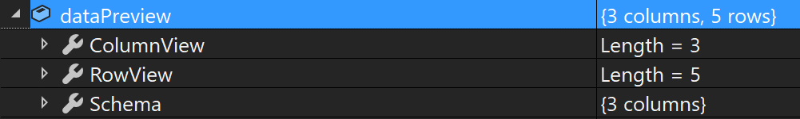
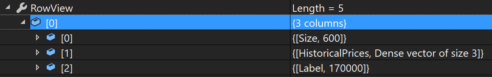

# Inspect intermediate data during processing

Learn how to inspect intermediate data during loading, processing, and model training steps in ML.NET. Intermediate data is the output of each stage in the machine learning pipeline.

Intermediate data like the one represented below which is loaded into an [`IDataView`](xref:Microsoft.ML.IDataView) can be inspected in various ways in ML.NET.

```csharp
HousingData[] housingData = new HousingData[]
{
    new HousingData
    {
        Size = 600f,
        HistoricalPrices = new float[] { 100000f ,125000f ,122000f },
        CurrentPrice = 170000f
    },
    new HousingData
    {
        Size = 1000f,
        HistoricalPrices = new float[] { 200000f, 250000f, 230000f },
        CurrentPrice = 225000f
    },
    new HousingData
    {
        Size = 1000f,
        HistoricalPrices = new float[] { 126000f, 130000f, 200000f },
        CurrentPrice = 195000f
    },
    new HousingData
    {
        Size = 850f,
        HistoricalPrices = new float[] { 150000f,175000f,210000f },
        CurrentPrice = 205000f
    },
    new HousingData
    {
        Size = 900f,
        HistoricalPrices = new float[] { 155000f, 190000f, 220000f },
        CurrentPrice = 210000f
    },
    new HousingData
    {
        Size = 550f,
        HistoricalPrices = new float[] { 99000f, 98000f, 130000f },
        CurrentPrice = 180000f
    }
};
```

## Convert IDataView to IEnumerable

One of the quickest ways to inspect an [`IDataView`](xref:Microsoft.ML.IDataView) is to convert it to an [`IEnumerable`](xref:System.Collections.Generic.IEnumerable%601). To convert an [`IDataView`](xref:Microsoft.ML.IDataView) to [`IEnumerable`](xref:System.Collections.Generic.IEnumerable%601) use the [`CreateEnumerable`](xref:Microsoft.ML.DataOperationsCatalog.CreateEnumerable*) method.

To optimize performance, set `reuseRowObject` to `true`. Doing so will lazily populate the same object with the data of the current row as it's being evaluated as opposed to creating a new object for each row in the dataset.

```csharp
// Create an IEnumerable of HousingData objects from IDataView
IEnumerable<HousingData> housingDataEnumerable =
    mlContext.Data.CreateEnumerable<HousingData>(data, reuseRowObject: true);

// Iterate over each row
foreach (HousingData row in housingDataEnumerable)
{
    // Do something (print out Size property) with current Housing Data object being evaluated
    Console.WriteLine(row.Size);
}
```

## Accessing specific indices with IEnumerable

If you only need access to a portion of the data or specific indices, use [`CreateEnumerable`](xref:Microsoft.ML.DataOperationsCatalog.CreateEnumerable*) and set the `reuseRowObject` parameter value to `false` so a new object is created for each of the requested rows in the dataset. Then, convert the [`IEnumerable`](xref:System.Collections.Generic.IEnumerable%601) to an array or list.

> [!WARNING]
> Converting the result of [`CreateEnumerable`](xref:Microsoft.ML.DataOperationsCatalog.CreateEnumerable*) to an array or list will load all the requested [`IDataView`](xref:Microsoft.ML.IDataView) rows into memory which may affect performance.

Once the collection has been created, you can perform operations on the data. The code snippet below takes the first three rows in the dataset and calculates the average current price.

```csharp
// Create an Array of HousingData objects from IDataView
HousingData[] housingDataArray =
    mlContext.Data.CreateEnumerable<HousingData>(data, reuseRowObject: false)
        .Take(3)
        .ToArray();

// Calculate Average CurrentPrice of First Three Elements
HousingData firstRow = housingDataArray[0];
HousingData secondRow = housingDataArray[1];
HousingData thirdRow = housingDataArray[2];
float averageCurrentPrice = (firstRow.CurrentPrice + secondRow.CurrentPrice + thirdRow.CurrentPrice) / 3;
```

## Inspect values in a single column

At any point in the model building process, values in a single column of an [`IDataView`](xref:Microsoft.ML.IDataView) can be accessed using the [`GetColumn`](xref:Microsoft.ML.Data.ColumnCursorExtensions.GetColumn*) method. The [`GetColumn`](xref:Microsoft.ML.Data.ColumnCursorExtensions.GetColumn*) method returns all of the values in a single column as an [`IEnumerable`](xref:System.Collections.Generic.IEnumerable%601).

```csharp
IEnumerable<float> sizeColumn = data.GetColumn<float>("Size").ToList();
```

## Inspect IDataView values one row at a time

[`IDataView`](xref:Microsoft.ML.IDataView) is lazily evaluated. To iterate over the rows of an [`IDataView`](xref:Microsoft.ML.IDataView) without converting to an [`IEnumerable`](xref:System.Collections.Generic.IEnumerable%601) as demonstrated in previous sections of this document, create a [`DataViewRowCursor`](xref:Microsoft.ML.DataViewRowCursor) by using the [`GetRowCursor`](xref:Microsoft.ML.IDataView.GetRowCursor*) method and passing in the [DataViewSchema](xref:Microsoft.ML.DataViewSchema) of your [`IDataView`](xref:Microsoft.ML.IDataView) as a parameter. Then, to iterate over rows, use the [`MoveNext`](xref:Microsoft.ML.DataViewRowCursor.MoveNext*) cursor method along with [`ValueGetter`](xref:Microsoft.ML.ValueGetter%601) delegates to extract the respective values from each of the columns.

> [!IMPORTANT]
> For performance purposes, vectors in ML.NET use [`VBuffer`](xref:Microsoft.ML.Data.VBuffer%601) instead of native collection types (that is, `Vector`,`float[]`).

```csharp
// Get DataViewSchema of IDataView
DataViewSchema columns = data.Schema;

// Create DataViewCursor
using (DataViewRowCursor cursor = data.GetRowCursor(columns))
{
    // Define variables where extracted values will be stored to
    float size = default;
    VBuffer<float> historicalPrices = default;
    float currentPrice = default;

    // Define delegates for extracting values from columns
    ValueGetter<float> sizeDelegate = cursor.GetGetter<float>(columns[0]);
    ValueGetter<VBuffer<float>> historicalPriceDelegate = cursor.GetGetter<VBuffer<float>>(columns[1]);
    ValueGetter<float> currentPriceDelegate = cursor.GetGetter<float>(columns[2]);

    // Iterate over each row
    while (cursor.MoveNext())
    {
        //Get values from respective columns
        sizeDelegate.Invoke(ref size);
        historicalPriceDelegate.Invoke(ref historicalPrices);
        currentPriceDelegate.Invoke(ref currentPrice);
    }
}
```

## Preview result of pre-processing or training on a subset of the data

> [!WARNING]
> Do not use `Preview` in production code because it is intended for debugging and may reduce performance.

The model building process is experimental and iterative. To preview what data would look like after pre-processing or training a machine learning model on a subset of the data, use the [`Preview`](xref:Microsoft.ML.DebuggerExtensions.Preview*) method which returns a [`DataDebuggerPreview`](xref:Microsoft.ML.Data.DataDebuggerPreview). The result is an object with `ColumnView` and `RowView` properties which are both an [`IEnumerable`](xref:System.Collections.Generic.IEnumerable%601) and contain the values in a particular column or row. Specify the number of rows to apply the transformation to with the `maxRows` parameter.



The result of inspecting an [`IDataView`](xref:Microsoft.ML.IDataView) would look similar to the following:


