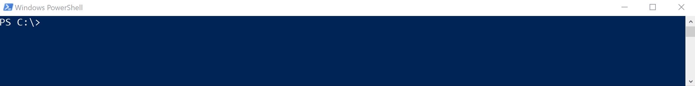

# How to install the ML.NET Command-Line Interface (CLI) tool

The ML.NET CLI (command-line interface) is a tool you can run on any command-prompt (Windows, Mac, or Linux) for generating good quality ML.NET models and source code based on training datasets you provide.

> [!NOTE]
> This topic refers to ML.NET CLI and ML.NET AutoML, which are currently in Preview, and material may be subject to change.

## Pre-requisites

- [.NET Core 2.2 SDK](https://dotnet.microsoft.com/download/dotnet-core/2.2)

- (Optional) [Visual Studio 2017 or 2019](https://visualstudio.microsoft.com/vs/)

You can either run the generated C# code projects with Visual Studio F5 or with `dotnet run` (.NET Core CLI).

Note: If after installing [.NET Core 2.2 SDK](https://dotnet.microsoft.com/download/dotnet-core/2.2) the `dotnet tool` command is not working, sign out from Windows and sign in again.

## Install

The ML.NET CLI is installed like any other dotnet Global Tool. You use the `dotnet tool install` .NET Core CLI command. 

The following example shows how to install the ML.NET CLI in the default NuGet feed location:

```console
dotnet tool install -g mlnet
```

If the tool can't be installed (that is, if it is not available at the default NuGet feed), error messages are displayed. Check that the feeds you expected are being checked.

If installation is successful, a message is displayed showing the command used to call the tool and the version installed, similar to the following example:

```console
You can invoke the tool using the following command: mlnet
Tool 'mlnet' (version 'X.X.X') was successfully installed.
```

You can confirm the installation was successful by typing the following command:

```console
mlnet
```

You should see the help for available commands for the mlnet tool such as the 'auto-train' command.

## Install a specific release version

If you're trying to install a pre-release version or a specific version of the tool, you can specify the [framework](../../standard/frameworks.md) using the following format:

```console
dotnet tool install -g mlnet --framework <FRAMEWORK>
```

You can also check if the package is properly installed by typing the following command:

```console
dotnet tool list -g
```

## Uninstall the CLI package

Type the following command to uninstall the package from your local machine:

```console
dotnet tool uninstall mlnet -g
```

## Update the CLI package

Type the following command to update the package from your local machine:

```console
dotnet tool update -g mlnet
```

## Set up CLI suggestions (tab-based auto-completion)

Since the ML.NET CLI is based on `System.CommandLine`, it has built-in support for tab completion.

An example of how tab auto completion works is shown in the following animation:



'Tab-based auto-completion' (parameter suggestions) works on *Windows PowerShell* and *macOS/Linux bash* but it won't work on *Windows CMD*.

To enable it, in the current preview version, the end user has to take a few steps once per shell, outlined below. Once this is done, completions will work for all apps written using `System.CommandLine` such as the ML.NET CLI.

On the machine where you'd like to enable completion, you'll need to do two things.

1. Install the `dotnet-suggest` global tool by running the following command:

    ```console
    dotnet tool install dotnet-suggest -g
    ```

2. Add the appropriate shim script to your shell profile. You may have to create a shell profile file. The shim script will forward completion requests from your shell to the `dotnet-suggest` tool, which delegates to the appropriate `System.CommandLine`-based app.

    - For bash, add the contents of [dotnet-suggest-shim.bash](https://github.com/dotnet/System.CommandLine/blob/master/src/System.CommandLine.Suggest/dotnet-suggest-shim.bash) to `~/.bash_profile`.

    - For PowerShell, add the contents of [dotnet-suggest-shim.ps1](https://github.com/dotnet/System.CommandLine/blob/master/src/System.CommandLine.Suggest/dotnet-suggest-shim.ps1) to your PowerShell profile. You can find the expected path to your PowerShell profile by running the following command in your console:

    ```console
    echo $profile
    ``` 

(For other shells, [look for](https://github.com/dotnet/System.CommandLine/issues?q=is%3Aissue+is%3Aopen+label%3A%22shell+suggestion%22) or open an [issue](https://github.com/dotnet/System.CommandLine/issues).)

## Installation directory

The ML.NET CLI can be installed in the default directory or in a specific location. The default directories are:

| OS          | Path                          |
|-------------|-------------------------------|
| Linux/macOS | `$HOME/.dotnet/tools`         |
| Windows     | `%USERPROFILE%\.dotnet\tools` |

These locations are added to the user's path when the SDK is first run, so Global Tools installed there can be called directly.

Note: the Global Tools are user-specific, not machine global. Being user-specific means you cannot install a Global Tool that is available to all users of the machine. The tool is only available for each user profile where the tool was installed.

Global Tools can also be installed in a specific directory. When installed in a specific directory, the user must ensure the command is available, by including that directory in the path, by calling the command with the directory specified, or calling the tool from within the specified directory.
In this case, the .NET Core CLI doesn't add this location automatically to the PATH environment variable.

## See also

- [Tutorial on 'Getting Started with ML.NET CLI tool'](../tutorials/mlnet-cli.md)
- [How to automatically train models with the ML.NET CLI tool](../automate-training-with-cli.md)
- [ML.NET CLI auto-train command reference guide](../reference/ml-net-cli-reference.md) 
- [Telemetry in ML.NET CLI](../resources/ml-net-cli-telemetry.md)
