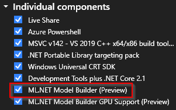

# How to install ML.NET Model Builder

Learn how to install ML.NET Model Builder to add machine learning to your .NET applications.

> [!NOTE]
> Model Builder is currently in Preview.

## Prerequisites

- Visual Studio 2019 or Visual Studio 2022 Preview 4 or later
- .NET Core 3.1 SDK or later.

## Limitations

- ML.NET Model Builder Extension currently only works on Visual Studio on Windows.
- Microsoft SQL Server Data Tools for Visual Studio 2017 is not supported

## Install Model Builder

ML.NET Model builder can be is built into Visual Studio.

1. Open the Visual Studio Installer and select to modify your current version of Visual Studio.

1. Check the **ML.NET Model Builder (Preview)** item is selected

    

## Uninstall Model Builder

1. Open the Visual Studio Installer and select to modify your current version of Visual Studio.

1. Uncheck the **ML.NET Model Builder (Preview)** item is selected

    

## Upgrade

The upgrade process is similar to the installation process. Either download the latest version from [Visual Studio Marketplace](https://marketplace.visualstudio.com/items?itemName=MLNET.07) or use the Extensions Manager in Visual Studio.
