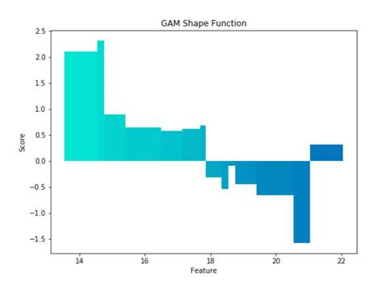

# Use Generalized Additive Models and shape functions for model explainability in ML.NET

When creating machine learning models, it is often not enough to simply make predictions. Often, machine learning developers, decision makers, and those affected by the models need to understand how machine learning models make decisions and which features contribute to their performance. **Generalized Additive Models (GAMs)** are used internally at Microsoft for model explainability to help machine learning developers create high-capacity models that can be easily interpreted by others.

GAMs are a class of **interpretable models** that are linear models where the terms are nonlinear functions, called "shape functions" of a single variable. As linear models, they are easily interpreted but because the models learn functions of features instead of a single weight, they can model more complex relationships than a simple linear model. The resulting GAM predictor has an intercept term that represents the average prediction over the training set, and shape functions that represent the deviation from the average prediction. The shape functions can be inspected by eye to see the response of the model to different values of a feature, and visualized like the following graph that is created at the end of the code example. The GAM trainer in ML.NET is implemented using shallow gradient boosted trees (for example tree stumps) to learn nonparametric shape functions, and is based on the method described in [Intelligible Models for Classification and Regression](https://www.cs.cornell.edu/~yinlou/papers/lou-kdd12.pdf) by Lou, Caruana, and Gehrke.

```csharp
// Train the Generalized Additive Model
var fitPipeline = pipeline.Fit(data);
var gamModel = fitPipeline.LastTransformer.Model;

// The intercept for Generalize Additive Models represent the average prediction for the training data
var intercept = gamModel.Intercept;
Console.WriteLine($"Average predicted cost: {intercept:0.00}");

// Get the feature names from the training set
var featureNames = data.Schema.AsEnumerable()
    .Select(column => column.Name) // Get the column names
    .Where(name => name != "MedianHomeValue") // Drop the Label
    .ToArray();

// Get the index of a variable from the training data
var myFeatureIndex = featureNames.ToList().FindIndex(str => str.Equals("MyFeature"));

// The shape functions represent the deviation from the average prediction as a function of the feature value
// It is represented by a discrete set of bins
// First, get the array of bin upper bounds from the model for this feature
var myFeatureBins = gamModel.GetFeatureBinUpperBounds(myFeatureIndex);
// Then get the array of bin weights; these are the effect size for each bin
var myFeatureWeights = gamModel.GetFeatureWeights(myFeatureIndex);

// Write out the shape function for the feature (see the following figure for what this looks like)
for (int i = 0; i < myFeatureBins.Length; i++)
{
    Console.WriteLine($"x < {myFeatureBins[i]:0.00} => {myFeatureWeights[i]:0.000}");
}
```



For a sample of how to train a GAM model and inspect and interpret the results, see [the dotnet/machinelearning GitHub repository](https://github.com/dotnet/machinelearning/blob/master/docs/samples/Microsoft.ML.Samples/Dynamic/GeneralizedAdditiveModels.cs).