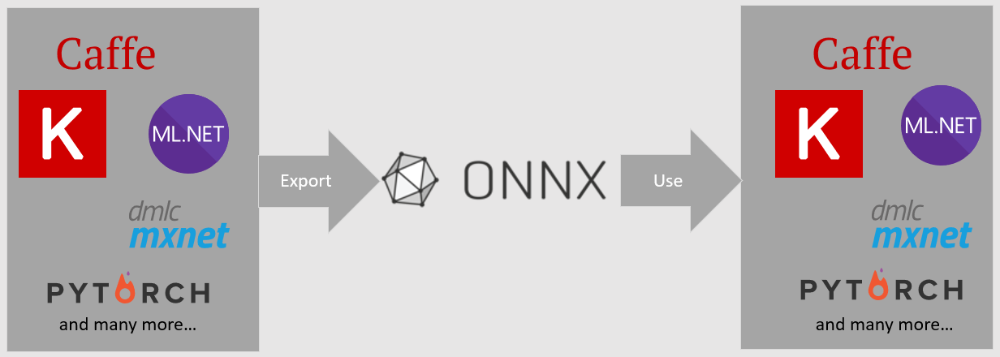

# Use ONNX Models in ML.NET

## What is ONNX?

The Open Neural Network Exchange (ONNX) is an open source format for AI models. ONNX supports interoperability between frameworks. This means you can train a model in one of the many popular machine learning frameworks like PyTorch, convert it into ONNX format and consume the ONNX model in a different framework like ML.NET. To learn more, visit the [ONNX website](https://onnx.ai/).

## What can you use ONNX models for in ML.NET?

In ML.NET, you can:

- Convert ML.NET models to ONNX
- Inference using pretrained ONNX models

## Convert ML.NET models to ONNX

ML.NET supports converting models trained in ML.NET to ONNX. Note that not all transforms and trainers are exportable to ONNX. Check the [data transforms](../resources/transforms.md) and [trainers](../how-to-choose-an-ml-net-algorithm.md) guides to see whether the transforms and trainers are exportable to ONNX.

To convert an ML.NET model to ONNX, use the [ConvertToOnnx](xref:Microsoft.ML.OnnxExportExtensions.ConvertToOnnx*) method.

For more details on converting ML.NET models to ONNX, see the [save and load ML.NET models guide](./save-load-machine-learning-models-ml-net.md#save-an-onnx-model-locally).

## Inference using pretrained ONNX models

### Get models

One place to get pretrained ONNX models from is the [onnx/models](https://github.com/onnx/models) repository.

If you want to train your own models, you can use any of the frameworks that support exporting to ONNX. 
