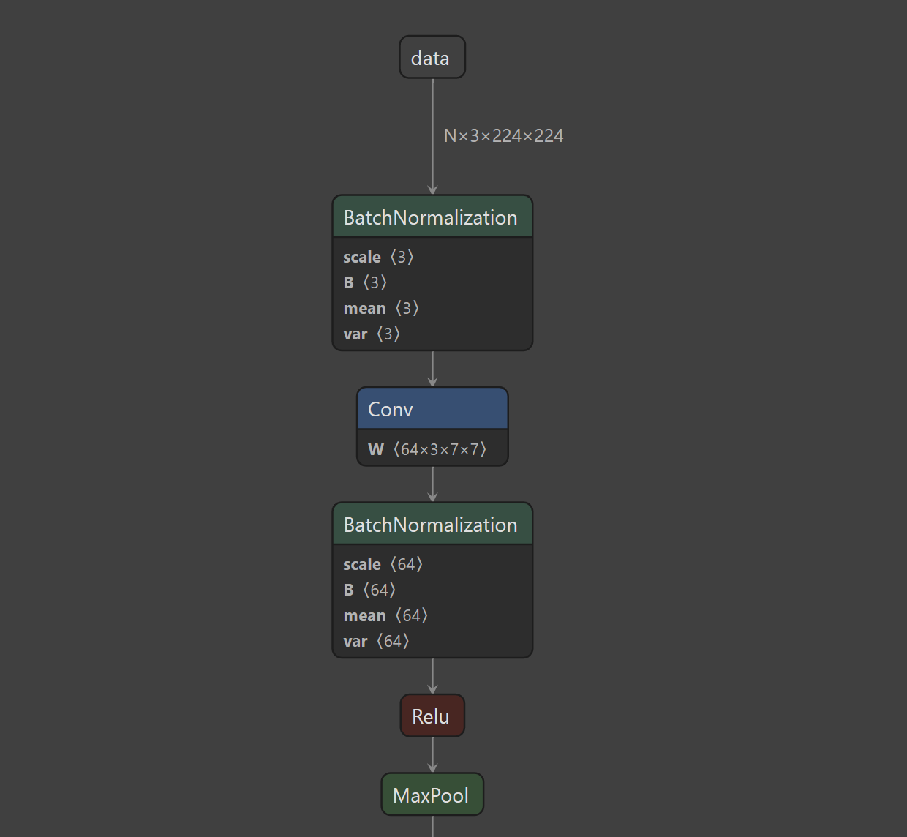
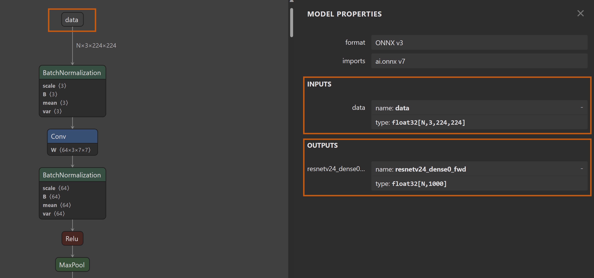

# Use ONNX Models in ML.NET

In this article you will learn what ONNX is and how you can use it in ML.NET. 

## What is ONNX?

The Open Neural Network Exchange (ONNX) is an open source format for AI models. ONNX supports interoperability between frameworks. This means you can train a model in one of the many popular machine learning frameworks like PyTorch, convert it into ONNX format and consume the ONNX model in a different framework like ML.NET. To learn more, visit the [ONNX website](https://onnx.ai/).


## What can you use ONNX models for in ML.NET?

In ML.NET, you can:

- Convert ML.NET models to ONNX
- Inference using pretrained ONNX models

## Convert ML.NET models to ONNX

ML.NET supports converting models trained in ML.NET to ONNX. Note that not all transforms and trainers are exportable to ONNX. Check the [data transforms](../resources/transforms.md) and [trainers](../how-to-choose-an-ml-net-algorithm.md) guides to see whether the transforms and trainers are exportable to ONNX.

To convert an ML.NET model to ONNX, use the [ConvertToOnnx](xref:Microsoft.ML.OnnxExportExtensions.ConvertToOnnx*) method.

For more details on converting ML.NET models to ONNX, see the [save and load ML.NET models guide](./save-load-machine-learning-models-ml-net.md#save-an-onnx-model-locally).

## Inference using pretrained ONNX models

### Get ONNX model

You can obtain an ONNX model in several ways:

- Pretrained models from [onnx/models](https://github.com/onnx/models) repository.
- Train a model using one of the supported frameworks and export to ONNX.
- Train a model using [Azure Machine Learning](/azure/machine-learning/how-to-use-automl-onnx-model-dotnet) and export to ONNX. 
- Train a model using [Azure Custom Vision](/azure/cognitive-services/custom-vision-service/export-your-model) and export to ONNX.

### Inspect model inputs and outputs

To determine the model schema containing input and output information, use [Netron](https://github.com/lutzroeder/netron#install).  

For this sample, I'm using a pretrained [ResNet50 v2](https://github.com/onnx/models/blob/main/vision/classification/resnet/model/resnet50-v2-7.onnx) model from the *onnx/models* repo:

1. Open Netron.
1. Load your model into Netron. 

    If succesful, you should see a graph diagram containing the nodes / layers that represent your model. 

    

    For brevity, only a part of the model is displayed in the screenshot.

1. Select the first node in the graph. For this model, it's `data`. 

    

    The Model Properties dialog appears. This dialog contains information about the inputs and outputs of the model. For this model, they are:

    | Input/Output | Name | Type | Dimensions |   
    | --- | --- | --- | --- | 
    | Input | *data* | `float32[]` | `[N, 3, 224, 224]` |
    | Output | *resnetv24_dense0_fwd* | `float32[]` | `[N, 1000]` | 

    The model expects an image as input.  That image is represented as a float32 array with dimentions which map to the following:

      - **N** - Batch size. Number of images to process. In ML.NET, this number is always 1. 
      - **3** - RGB channels
      - **224** - Image height
      - **224** - Image width

    The output is a float32 array representing the probability scores for each of the classes with dimensions that map to the following:

    - **N** - Batch size. Similar to the input.
    - **1000** - Number of classes the model was originally trained on.

    > ![NOTE]
    > This is a relatively simple example with only one input and one output. More complex models for tasks like object detection or Natural Language Processing (NLP) may contain more than one input. The same general concepts carry over to those models as well.

Once you know what your schema is, you can then define it in code. 

### Define schema in ML.NET

There are multiple ways in which you can define the model schema in ML.NET:

- Classes
- ShapeDictionary

#### Use classes

Using the same ResNet50v2 model, you can use .NET classes to define the model inputs and outputs.

##### ONNX model input

```csharp
public class ONNXInput
{
    [ColumnName("data")]
    [VectorType(1, 3, 224, 224)]
    public float[] Data
}
```

For the model input, a new class with a single `float[]` field `Data` representing the input image. The field is decorated with the `ColumnName` and `VectorType` attributes. If you have more than one input, you'd add additional fields to your class. 

The `ColumnName` is optional. It maps the actual name specified by the model, *data*, to the field name *Data*, which is in line with C# naming coventions.  

The `VectorType` attribute tells ML.NET that this field is a vector of the specified size. 

> ![NOTE]
> ML.NET does not support multi-dimentional arrays. All arrays are represented as 1-dimensional. Therefore, for the *Data* field, is a 1D array of size 150,528 (1 x 3 x 224 x 224).

##### ONNX model output

```csharp
public class OnnxOutput
{
    [ColumnName("resnetv24_dense0_fwd")]
    [VectorType(1, 1000)]
    public float[] Scores
}
```

Similar to the input, you can use classes to define the model output. In this case, a new class with a single `float[]` field `Scores` represents the output scores for each of the classes. `Scores` is also decorated with the `ColumnName` and `VectorType` attributes. If you have more than one output, you'd add additional fields to your class. 

The `ColumnName` is optional. It maps the actual name specified by the model, *resnetv24_dense0_fwd*, to the field name *Scores*, which is in line with C# naming coventions.

The `VectorType` attribute tells ML.NET that this field is a vector of the specified size. 

For more information on defining input and output schemas with classes, see the [load data in ML.NET guide](./load-data-ml-net.md#create-the-data-model).

#### Use ShapeDictionary

If you prefer not to use classes to define your model schema, you can use the ShapeDictionary. 


#### Working with unknown dimensions

ML.NET supports up to one unknown dimension. Unknown dimensions can be specified with the -1. For example, in the ResNet50 v2 sample, the batch size is an unknown or variable dimension. Therefore, you could represent that in the VectorType attribute or ShapeDictionary as *-1,3,224,224*.

### Create ONNX model pipeline


