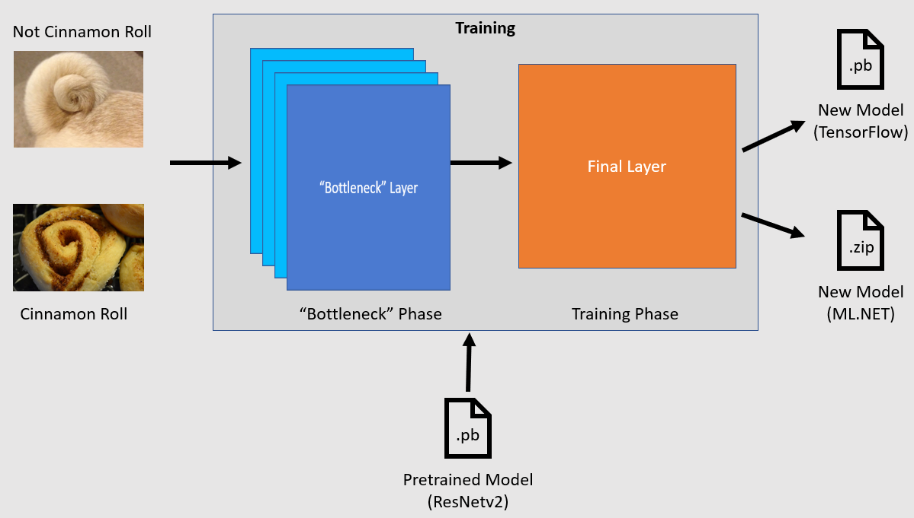
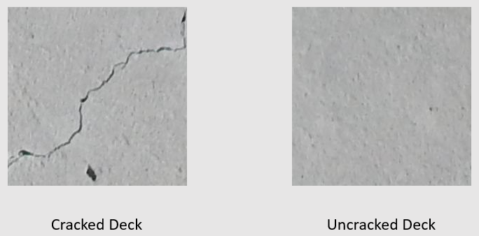

# Tutorial: Automated visual inspection using transfer learning with the ML.NET Image Classification API

Learn how to train a custom deep learning model using transfer learning, a pretrained TensorFlow model and the ML.NET Image Classification API to classify images of concrete surfaces as cracked or uncracked.

In this tutorial, you learn how to:
> [!div class="checklist"]
>
> - Understand the problem
> - Learn about ML.NET Image Classification API
> - Understand the pretrained model
> - Use transfer learning to train a custom TensorFlow image classification model
> - Classify images with the custom model

## Prerequisites

- [Visual Studio 2022](https://visualstudio.microsoft.com/downloads/).

## Image classification transfer learning sample overview

This sample is a C# .NET Core console application that classifies images using a pretrained deep learning TensorFlow model. The code for this sample can be found on the [samples browser](/samples/dotnet/machinelearning-samples/mlnet-image-classification-transfer-learning/).

## Understand the problem

Image classification is a computer vision problem. Image classification takes an image as input and categorizes it into a prescribed class. Image classification models are commonly trained using deep learning and neural networks. See [Deep learning vs. machine learning](/azure/machine-learning/concept-deep-learning-vs-machine-learning) for more information.

Some scenarios where image classification is useful include:

- Facial recognition
- Emotion detection
- Medical diagnosis
- Landmark detection

This tutorial trains a custom image classification model to perform automated visual inspection of bridge decks to identify structures that are damaged by cracks.

## ML.NET Image Classification API

ML.NET provides various ways of performing image classification. This tutorial applies transfer learning using the Image Classification API. The Image Classification API makes use of [TensorFlow.NET](https://github.com/SciSharp/TensorFlow.NET), a low-level library that provides C# bindings for the TensorFlow C++ API.

## What is transfer learning?

Transfer learning applies knowledge gained from solving one problem to another related problem.

Training a deep learning model from scratch requires setting several parameters, a large amount of labeled training data, and a vast amount of compute resources (hundreds of GPU hours). Using a pretrained model along with transfer learning allows you to shortcut the training process.

## Training process

The Image Classification API starts the training process by loading a pretrained TensorFlow model. The training process consists of two steps:

1. Bottleneck phase
2. Training phase



### Bottleneck phase

During the bottleneck phase, the set of training images is loaded and the pixel values are used as input, or features, for the frozen layers of the pretrained model. The frozen layers include all of the layers in the neural network up to the penultimate layer, informally known as the bottleneck layer. These layers are referred to as frozen because no training will occur on these layers and operations are pass-through. It's at these frozen layers where the lower-level patterns that help a model differentiate between the different classes are computed. The larger the number of layers, the more computationally intensive this step is. Fortunately, since this is a one-time calculation, the results can be cached and used in later runs when experimenting with different parameters.

### Training phase

Once the output values from the bottleneck phase are computed, they are used as input to retrain the final layer of the model. This process is iterative and runs for the number of times specified by model parameters. During each run, the loss and accuracy are evaluated. Then, the appropriate adjustments are made to improve the model with the goal of minimizing the loss and maximizing the accuracy. Once training is finished, two model formats are output. One of them is the `.pb` version of the model and the other is the `.zip` ML.NET serialized version of the model. When working in environments supported by ML.NET, it is recommended to use the `.zip` version of the model. However, in environments where ML.NET is not supported, you have the option of using the `.pb` version.

## Understand the pretrained model

The pretrained model used in this tutorial is the 101-layer variant of the Residual Network (ResNet) v2 model. The original model is trained to classify images into a thousand categories. The model takes as input an image of size 224 x 224 and outputs the class probabilities for each of the classes it's trained on. Part of this model is used to train a new model using custom images to make predictions between two classes.

## Create console application

Now that you have a general understanding of transfer learning and the Image Classification API, it's time to build the application.

1. Create a C# **Console Application** called "DeepLearning_ImageClassification_Binary". Click the **Next** button.

1. Choose .NET 6 as the framework to use. Click the **Create** button.

1. Install the **Microsoft.ML** NuGet Package:

    [!INCLUDE [mlnet-current-nuget-version](../../../includes/mlnet-current-nuget-version.md)]

    1. In Solution Explorer, right-click on your project and select **Manage NuGet Packages**.
    1. Choose "nuget.org" as the Package source.
    1. Select the **Browse** tab.
    1. Check the **Include prerelease** checkbox.
    1. Search for **Microsoft.ML**.
    1. Select the **Install** button.
    1. Select the **OK** button on the **Preview Changes** dialog and then select the **I Accept** button on the **License Acceptance** dialog if you agree with the license terms for the packages listed.
    1. Repeat these steps for the **Microsoft.ML.Vision**, **SciSharp.TensorFlow.Redist** version **2.3.1**, and **Microsoft.ML.ImageAnalytics** NuGet packages.

### Prepare and understand the data

> [!NOTE]
> The datasets for this tutorial are from Maguire, Marc; Dorafshan, Sattar; and Thomas, Robert J., "SDNET2018: A concrete crack image dataset for machine learning applications" (2018). Browse all Datasets. Paper 48. <https://digitalcommons.usu.edu/all_datasets/48>

SDNET2018 is an image dataset that contains annotations for cracked and non-cracked concrete structures (bridge decks, walls, and pavement).



The data is organized in three subdirectories:

- D contains bridge deck images
- P contains pavement images
- W contains wall images

Each of these subdirectories contains two additional prefixed subdirectories:

- C is the prefix used for cracked surfaces
- U is the prefix used for uncracked surfaces

In this tutorial, only bridge deck images are used.

1. Download the [dataset](https://github.com/dotnet/machinelearning-samples/tree/main/samples/csharp/getting-started/DeepLearning_ImageClassification_Binary/DeepLearning_ImageClassification/assets.zip) and unzip.
1. Create a directory named "assets" in your project to save your dataset files.
1. Copy the *CD* and *UD* subdirectories from the recently unzipped directory to the *assets* directory.

### Create input and output classes

1. Open the *Program.cs* file and replace the existing `using` statements at the top of the file with the following:

    [!code-csharp [ProgramUsings](~/machinelearning-samples/samples/csharp/getting-started/DeepLearning_ImageClassification_Binary/DeepLearning_ImageClassification/Program.cs#L1-L7)]

1. Below the `Program` class in *Program.cs*, create a class called `ImageData`. This class is used to represent the initially loaded data.

    [!code-csharp [ImageDataClass](~/machinelearning-samples/samples/csharp/getting-started/DeepLearning_ImageClassification_Binary/DeepLearning_ImageClassification/Program.cs#L137-L142)]

    `ImageData` contains the following properties:

    - `ImagePath` is the fully qualified path where the image is stored.
    - `Label` is the category the image belongs to. This is the value to predict.

1. Create classes for your input and output data

    1. Below the `ImageData` class, define the schema of your input data in a new class called `ModelInput`.

        [!code-csharp [ModelInputClass](~/machinelearning-samples/samples/csharp/getting-started/DeepLearning_ImageClassification_Binary/DeepLearning_ImageClassification/Program.cs#L144-L153)]

        `ModelInput` contains the following properties:

        - `Image` is the `byte[]` representation of the image. The model expects image data to be of this type for training.
        - `LabelAsKey` is the numerical representation of the `Label`.
        - `ImagePath` is the fully qualified path where the image is stored.
        - `Label` is the category the image belongs to. This is the value to predict.

        Only `Image` and `LabelAsKey` are used to train the model and make predictions. The `ImagePath` and `Label` properties are kept for convenience to access the original image file name and category.

    1. Then, below the `ModelInput` class, define the schema of your output data in a new class called `ModelOutput`.

        [!code-csharp [ModelOutputClass](~/machinelearning-samples/samples/csharp/getting-started/DeepLearning_ImageClassification_Binary/DeepLearning_ImageClassification/Program.cs#L155-L162)]

        `ModelOutput` contains the following properties:

        - `ImagePath` is the fully qualified path where the image is stored.
        - `Label` is the original category the image belongs to. This is the value to predict.
        - `PredictedLabel` is the value predicted by the model.

        Similar to `ModelInput`, only the `PredictedLabel` is required to make predictions since it contains the prediction made by the model. The `ImagePath` and `Label` properties are retained for convenience to access the original image file name and category.

### Create workspace directory

When training and validation data do not change often, it is good practice to cache the computed bottleneck values for further runs.

1. In your project, create a new directory called *workspace* to store the computed bottleneck values and `.pb` version of the model.

### Define paths and initialize variables

1. Under the using statements, define the location of your assets, computed bottleneck values and `.pb` version of the model.

    [!code-csharp [DefinePaths](~/machinelearning-samples/samples/csharp/getting-started/DeepLearning_ImageClassification_Binary/DeepLearning_ImageClassification/Program.cs#L15-L17)]

1. Initialize the `mlContext` variable with a new instance of [MLContext](xref:Microsoft.ML.MLContext).

    [!code-csharp [MLContext](~/machinelearning-samples/samples/csharp/getting-started/DeepLearning_ImageClassification_Binary/DeepLearning_ImageClassification/Program.cs#L19)]

    The [MLContext](xref:Microsoft.ML.MLContext) class is a starting point for all ML.NET operations, and initializing mlContext creates a new ML.NET environment that can be shared across the model creation workflow objects. It's similar, conceptually, to `DbContext` in Entity Framework.

## Load the data

### Create data loading utility method

The images are stored in two subdirectories. Before loading the data, it needs to be formatted into a list of `ImageData` objects. To do so, create the `LoadImagesFromDirectory` method.

```csharp
IEnumerable<ImageData> LoadImagesFromDirectory(string folder, bool useFolderNameAsLabel = true)
{

}
```

1. Inside the `LoadImagesFromDirectory`, add the following code to get all of the file paths from the subdirectories:

    [!code-csharp [GetFiles](~/machinelearning-samples/samples/csharp/getting-started/DeepLearning_ImageClassification_Binary/DeepLearning_ImageClassification/Program.cs#L104-L105)]

1. Then, iterate through each of the files using a `foreach` statement.

    ```csharp
    foreach (var file in files)
    {

    }
    ```

1. Inside the `foreach` statement, check that the file extensions are supported. The Image Classification API supports JPEG and PNG formats.

    [!code-csharp [CheckExtension](~/machinelearning-samples/samples/csharp/getting-started/DeepLearning_ImageClassification_Binary/DeepLearning_ImageClassification/Program.cs#L109-L111)]

1. Then, get the label for the file. If the `useFolderNameAsLabel` parameter is set to `true`, then the parent directory where the file is saved is used as the label. Otherwise, it expects the label to be a prefix of the file name or the file name itself.

    [!code-csharp [GetLabel](~/machinelearning-samples/samples/csharp/getting-started/DeepLearning_ImageClassification_Binary/DeepLearning_ImageClassification/Program.cs#L112-L126)]

1. Finally, create a new instance of `ModelInput`.

    [!code-csharp [CreateImageData](~/machinelearning-samples/samples/csharp/getting-started/DeepLearning_ImageClassification_Binary/DeepLearning_ImageClassification/Program.cs#L128-L132)]

### Prepare the data

1. Call the `LoadImagesFromDirectory` utility method to get the list of images used for training after initializing the `mlContext` variable.

    [!code-csharp [LoadImages](~/machinelearning-samples/samples/csharp/getting-started/DeepLearning_ImageClassification_Binary/DeepLearning_ImageClassification/Program.cs#L22)]

1. Then, load the images into an [`IDataView`](xref:Microsoft.ML.IDataView) using the [`LoadFromEnumerable`](xref:Microsoft.ML.DataOperationsCatalog.LoadFromEnumerable%2A) method.

    [!code-csharp [CreateIDataView](~/machinelearning-samples/samples/csharp/getting-started/DeepLearning_ImageClassification_Binary/DeepLearning_ImageClassification/Program.cs#L24)]

1. The data is loaded in the order it was read from the directories. To balance the data, shuffle it using the [`ShuffleRows`](xref:Microsoft.ML.DataOperationsCatalog.ShuffleRows%2A) method.

    [!code-csharp [ShuffleRows](~/machinelearning-samples/samples/csharp/getting-started/DeepLearning_ImageClassification_Binary/DeepLearning_ImageClassification/Program.cs#L26)]

1. Machine learning models expect input to be in numerical format. Therefore, some preprocessing needs to be done on the data prior to training. Create an [`EstimatorChain`](xref:Microsoft.ML.Data.EstimatorChain%601) made up of the [`MapValueToKey`](xref:Microsoft.ML.ConversionsExtensionsCatalog.MapValueToKey%2A) and `LoadRawImageBytes` transforms. The `MapValueToKey` transform takes the categorical value in the `Label` column, converts it to a numerical `KeyType` value and stores it in a new column called `LabelAsKey`. The `LoadImages` takes the values from the `ImagePath` column along with the `imageFolder` parameter to load images for training.

    [!code-csharp [PreprocessingPipeline](~/machinelearning-samples/samples/csharp/getting-started/DeepLearning_ImageClassification_Binary/DeepLearning_ImageClassification/Program.cs#L28-L34)]

1. Use the [`Fit`](xref:Microsoft.ML.Data.EstimatorChain%601.Fit%2A) method to apply the data to the `preprocessingPipeline` [`EstimatorChain`](xref:Microsoft.ML.Data.EstimatorChain%601) followed by the [`Transform`](xref:Microsoft.ML.Data.TransformerChain%601.Transform%2A) method, which returns an [`IDataView`](xref:Microsoft.ML.IDataView) containing the pre-processed data.

    [!code-csharp [PreprocessData](~/machinelearning-samples/samples/csharp/getting-started/DeepLearning_ImageClassification_Binary/DeepLearning_ImageClassification/Program.cs#L36-L38)]

1. To train a model, it's important to have a training dataset as well as a validation dataset. The model is trained on the training set. How well it makes predictions on unseen data is measured by the performance against the validation set. Based on the results of that performance, the model makes adjustments to what it has learned in an effort to improve. The validation set can come from either splitting your original dataset or from another source that has already been set aside for this purpose. In this case, the pre-processed dataset is split into training, validation and test sets.

    [!code-csharp [CreateDataSplits](~/machinelearning-samples/samples/csharp/getting-started/DeepLearning_ImageClassification_Binary/DeepLearning_ImageClassification/Program.cs#L40-L41)]

    The code sample above performs two splits. First, the pre-processed data is split and 70% is used for training while the remaining 30% is used for validation. Then, the 30% validation set is further split into validation and test sets where 90% is used for validation and 10% is used for testing.

    A way to think about the purpose of these data partitions is taking an exam. When studying for an exam, you review your notes, books, or other resources to get a grasp on the concepts that are on the exam. This is what the train set is for. Then, you might take a mock exam to validate your knowledge. This is where the validation set comes in handy. You want to check whether you have a good grasp of the concepts before taking the actual exam. Based on those results, you take note of what you got wrong or didn't understand well and incorporate your changes as you review for the real exam. Finally, you take the exam. This is what the test set is used for. You've never seen the questions that are on the exam and now use what you learned from training and validation to apply your knowledge to the task at hand.

1. Assign the partitions their respective values for the train, validation and test data.

    [!code-csharp [CreateDatasets](~/machinelearning-samples/samples/csharp/getting-started/DeepLearning_ImageClassification_Binary/DeepLearning_ImageClassification/Program.cs#L43-L45)]

## Define the training pipeline

Model training consists of a couple of steps. First, Image Classification API is used to train the model. Then, the encoded labels in the `PredictedLabel` column are converted back to their original categorical value using the `MapKeyToValue` transform.

1. Create a new variable to store a set of required and optional parameters for an `ImageClassificationTrainer`.

    [!code-csharp [ClassifierOptions](~/machinelearning-samples/samples/csharp/getting-started/DeepLearning_ImageClassification_Binary/DeepLearning_ImageClassification/Program.cs#L47-L57)]

    An `ImageClassificationTrainer` takes several optional parameters:

    - `FeatureColumnName` is the column that is used as input for the model.
    - `LabelColumnName` is the column for the value to predict.
    - `ValidationSet` is the [`IDataView`](xref:Microsoft.ML.IDataView) containing the validation data.
    - `Arch` defines which of the pretrained model architectures to use. This tutorial uses the 101-layer variant of the ResNetv2 model.
    - `MetricsCallback` binds a function to track the progress during training.
    - `TestOnTrainSet` tells the model to measure performance against the training set when no validation set is present.
    - `ReuseTrainSetBottleneckCachedValues` tells the model whether to use the cached values from the bottleneck phase in subsequent runs. The bottleneck phase is a one-time pass-through computation that is computationally intensive the first time it is performed. If the training data does not change and you want to experiment using a different number of epochs or batch size, using the cached values significantly reduces the amount of time required to train a model.
    - `ReuseValidationSetBottleneckCachedValues` is similar to `ReuseTrainSetBottleneckCachedValues` only that in this case it's for the validation dataset.
    - `WorkspacePath` defines the directory where to store the computed bottleneck values and `.pb` version of the model.

1. Define the [`EstimatorChain`](xref:Microsoft.ML.Data.EstimatorChain%601) training pipeline that consists of both the `mapLabelEstimator` and the `ImageClassificationTrainer`.

    [!code-csharp [TrainingPipeline](~/machinelearning-samples/samples/csharp/getting-started/DeepLearning_ImageClassification_Binary/DeepLearning_ImageClassification/Program.cs#L59-L60)]

1. Use the [`Fit`](xref:Microsoft.ML.Data.EstimatorChain%601.Fit%2A) method to train your model.

    [!code-csharp [TrainModel](~/machinelearning-samples/samples/csharp/getting-started/DeepLearning_ImageClassification_Binary/DeepLearning_ImageClassification/Program.cs#L62)]

## Use the model

Now that you have trained your model, it's time to use it to classify images.

Create a new utility method called `OutputPrediction` to display prediction information in the console.

[!code-csharp [OuputPredictionMethod](~/machinelearning-samples/samples/csharp/getting-started/DeepLearning_ImageClassification_Binary/DeepLearning_ImageClassification/Program.cs#L96-L100)]

### Classify a single image

1. Create a new method called `ClassifySingleImage` to make and output a single image prediction.

    ```csharp
    void ClassifySingleImage(MLContext mlContext, IDataView data, ITransformer trainedModel)
    {

    }
    ```

1. Create a [`PredictionEngine`](xref:Microsoft.ML.PredictionEngine%602) inside the `ClassifySingleImage` method. The [`PredictionEngine`](xref:Microsoft.ML.PredictionEngine%602) is a convenience API, which allows you to pass in and then perform a prediction on a single instance of data.

    [!code-csharp [CreatePredictionEngine](~/machinelearning-samples/samples/csharp/getting-started/DeepLearning_ImageClassification_Binary/DeepLearning_ImageClassification/Program.cs#L73)]

1. To access a single `ModelInput` instance, convert the `data` [`IDataView`](xref:Microsoft.ML.IDataView) into an [`IEnumerable`](xref:System.Collections.Generic.IEnumerable%601) using the [`CreateEnumerable`](xref:Microsoft.ML.DataOperationsCatalog.CreateEnumerable%2A) method and then get the first observation.

    [!code-csharp [GetTestInputData](~/machinelearning-samples/samples/csharp/getting-started/DeepLearning_ImageClassification_Binary/DeepLearning_ImageClassification/Program.cs#L75)]

1. Use the [`Predict`](xref:Microsoft.ML.PredictionEngine%602.Predict%2A) method to classify the image.

    [!code-csharp [MakeSinglePrediction](~/machinelearning-samples/samples/csharp/getting-started/DeepLearning_ImageClassification_Binary/DeepLearning_ImageClassification/Program.cs#L77)]

1. Output the prediction to the console with the `OutputPrediction` method.

    [!code-csharp [OuputSinglePrediction](~/machinelearning-samples/samples/csharp/getting-started/DeepLearning_ImageClassification_Binary/DeepLearning_ImageClassification/Program.cs#L79-L80)]

1. Call `ClassifySingleImage` below calling the `Fit` method using the test set of images.

    [!code-csharp [ClassifySingleImage](~/machinelearning-samples/samples/csharp/getting-started/DeepLearning_ImageClassification_Binary/DeepLearning_ImageClassification/Program.cs#L64)]

### Classify multiple images

1. Add a new method called `ClassifyImages` below the `ClassifySingleImage` method to make and output multiple image predictions.

    ```csharp
    void ClassifyImages(MLContext mlContext, IDataView data, ITransformer trainedModel)
    {

    }
    ```

1. Create an [`IDataView`](xref:Microsoft.ML.IDataView) containing the predictions by using the [`Transform`](xref:Microsoft.ML.ITransformer.Transform%2A) method. Add the following code inside the `ClassifyImages` method.

    [!code-csharp [MakeMultiplePredictions](~/machinelearning-samples/samples/csharp/getting-started/DeepLearning_ImageClassification_Binary/DeepLearning_ImageClassification/Program.cs#L85)]

1. In order to iterate over the predictions, convert the `predictionData` [`IDataView`](xref:Microsoft.ML.IDataView) into an [`IEnumerable`](xref:System.Collections.Generic.IEnumerable%601) using the [`CreateEnumerable`](xref:Microsoft.ML.DataOperationsCatalog.CreateEnumerable%2A) method and then get the first 10 observations.

    [!code-csharp [IEnumerablePredictions](~/machinelearning-samples/samples/csharp/getting-started/DeepLearning_ImageClassification_Binary/DeepLearning_ImageClassification/Program.cs#L87)]

1. Iterate and output the original and predicted labels for the predictions.

    [!code-csharp [OutputMultiplePredictions](~/machinelearning-samples/samples/csharp/getting-started/DeepLearning_ImageClassification_Binary/DeepLearning_ImageClassification/Program.cs#L89-L93)]

1. Finally, call `ClassifyImages` below the `ClassifySingleImage()` method using the test set of images.

    [!code-csharp [ClassifyImages](~/machinelearning-samples/samples/csharp/getting-started/DeepLearning_ImageClassification_Binary/DeepLearning_ImageClassification/Program.cs#L66)]

## Run the application

Run your console app. The output should be similar to that below. You may see warnings or processing messages, but these messages have been removed from the following results for clarity. For brevity, the output has been condensed.

**Bottleneck phase**

No value is printed for the image name because the images are loaded as a `byte[]` therefore there is no image name to display.

```test
Phase: Bottleneck Computation, Dataset used:      Train, Image Index: 279
Phase: Bottleneck Computation, Dataset used:      Train, Image Index: 280
Phase: Bottleneck Computation, Dataset used: Validation, Image Index:   1
Phase: Bottleneck Computation, Dataset used: Validation, Image Index:   2
```

**Training phase**

```text
Phase: Training, Dataset used: Validation, Batch Processed Count:   6, Epoch:  21, Accuracy:  0.6797619
Phase: Training, Dataset used: Validation, Batch Processed Count:   6, Epoch:  22, Accuracy:  0.7642857
Phase: Training, Dataset used: Validation, Batch Processed Count:   6, Epoch:  23, Accuracy:  0.7916667
```

**Classify images output**

```text
Classifying single image
Image: 7001-220.jpg | Actual Value: UD | Predicted Value: UD

Classifying multiple images
Image: 7001-220.jpg | Actual Value: UD | Predicted Value: UD
Image: 7001-163.jpg | Actual Value: UD | Predicted Value: UD
Image: 7001-210.jpg | Actual Value: UD | Predicted Value: UD
```

Upon inspection of the *7001-220.jpg* image, you can see that it in fact is not cracked.


Congratulations! You've now successfully built a deep learning model for classifying images.

### Improve the model

If you're not satisfied with the results of your model, you can try to improve its performance by trying some of the following approaches:

- **More Data**: The more examples a model learns from, the better it performs. Download the full [SDNET2018 dataset](https://digitalcommons.usu.edu/cgi/viewcontent.cgi?filename=2&article=1047&context=all_datasets&type=additional) and use it to train.
- **Augment the data**: A common technique to add variety to the data is to augment the data by taking an image and applying different transforms (rotate, flip, shift, crop). This adds more varied examples for the model to learn from.
- **Train for a longer time**: The longer you train, the more tuned the model will be. Increasing the number of epochs may improve the performance of your model.
- **Experiment with the hyper-parameters**: In addition to the parameters used in this tutorial, other parameters can be tuned to potentially improve performance. Changing the learning rate, which determines the magnitude of updates made to the model after each epoch may improve performance.
- **Use a different model architecture**: Depending on what your data looks like, the model that can best learn its features may differ. If you're not satisfied with the performance of your model, try changing the architecture.

## Next steps

In this tutorial, you learned how to build a custom deep learning model using transfer learning, a pretrained image classification TensorFlow model and the ML.NET Image Classification API to classify images of concrete surfaces as cracked or uncracked.

Advance to the next tutorial to learn more.

> [!div class="nextstepaction"]
> [Object Detection](object-detection-onnx.md)
