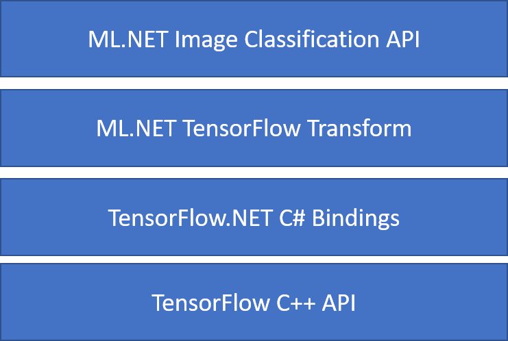

# Tutorial: Automated visual inspection using transfer learning with ML.NET's Image Classification API

Learn how to train a custom deep learning model using transfer learning and the ML.NET Image Classification API to classify images of concrete surfaces as cracked or uncracked.

> [!NOTE]
> The ML.NET Image Classification API is currently in preview.

In this tutorial, you learn how to:
> [!div class="checklist"]
>
> - Understand the problem
> - Learn about ML.NET Image Classification API
> - Understand the pretrained model
> - Use transfer learning to train a custom TensorFlow image classification model
> - Classify images with the custom model

## Image Classification Transfer Learning Sample Overview

This sample is a .NET Core console application that classifies images using a pre-trained deep learning TensorFlow model. The code for this sample can be found on the [dotnet/machinelearning-samples repository](https://github.com/dotnet/machinelearning-samples) on GitHub.

## Understand the problem

Image classification is a computer vision problem. Image classification takes an image as input and categorizes it into a prescribed class. Some scenarios where image classification is useful include:

- Facial Recognition
- Emotion detection
- Medical diagnosis
- Landmark detection

This tutorial trains a custom image classification model to perform automated visual inspection of bridge decks to identify structures that are damaged by cracks.

## ML.NET Image Classification API

ML.NET provides various ways of performing image classification. This tutorial focuses on the Image Classification API. The Image Classification API makes use of [TensorFlow.NET](https://github.com/SciSharp/TensorFlow.NET), a low-level library that provides C# bindings for the TensorFlow C++ API.



### What is transfer learning?

Transfer learning is the process of using knowledge gained while solving one problem and applying it to a different but related problem.

Training a deep learning model from scratch requires setting several parameters, a large amount of labeled training data and a vast amount of compute resources (hundreds of GPU hours). Using a pre-trained model along with transfer learning allows you to shortcut the training process. 

### Training process

The Image Classification API starts the training process by loading a pre-trained TensorFlow model. The training process consists of two steps:

1. Bottleneck phase
2. Training phase


#### Bottleneck phase

During the bottleneck phase, the set of training images are loaded and the pixel values are used as as input, or features, for the frozen layers of the pre-trained model. The frozen layers include all of the layers in the neural network up to the penultimate layer, informally known as the bottleneck layer. These layers are referred to as frozen because no training will occur on these layers and operations are pass-through. It's at these frozen layers that the lower-level patterns that help a model differentiate between the different classes are computed. The larger the number of layers, the more computationally intensive this step is. Fortunately, since this is a one-time calculation, the results can be cached and used in later runs when experimenting with different parameters.

#### Training phase

Once the output values from the bottleneck phase are computed, they are used as input to retrain the final layer of the model. This process is iterative and runs for the number of times specified by model parameters. During each run, the loss and accuracy are evaluated and the appropriate adjustments are made to improve the model with the goal of minimizing the loss and maximizing the accuracy. Once training is finished, two model formats are output. One of them is the `.pb` version of the model and the other is the `.zip` ML.NET serialized version of the model. When working in environemnts supported by ML.NET, it is recommended to use the `.zip` version of the model. However, in environemnts where ML.NET is not supported, you have the option of using the `.pb` version.

## Understand the pretrained model

The pre-trained model used in this tutorial is the 101-layer variant of the Residual Network (ResNet) v2 model. The original model is trained to classify images into a thousand categories. The model takes as input an image of size 224 x 224 and outputs the class probabilities for each of the classes it's trained on. Part of this model is used to train a new model using custom images to make predictions between two classes. 

## Create console application

Now that you have a general understanding of transfer learning and the Image Classification API, it's time to build the application

1. Create a **.NET Core Console Application** called "DeepLearning_ImageClassification_API"
1. Install the **Microsoft.ML 1.4.0-preview2** NuGet Package:
    1. In Solution Explorer, right-click on your project and select **Manage NuGet Packages**.
    1. Choose "nuget.org" as the Package source.
    1. Select the **Browse** tab.
    1. Check the **Include prerelease** checkbox.
    1. search for **Microsoft.ML**.
    1. Select the **Install** button.
    1. Select the **OK** button on the **Preview Changes** dialog and then select the **I Accept** button on the **License Acceptance** dialog if you agree with the license terms for the packages listed.
    1. Repeat these steps for **Microsoft.ML.Dnn 0.16.0-preview2** and **Microsoft.ML.ImageAnalytics 1.4.0-preview2**.

### Prepare and understand the data

> [!NOTE]
> The datasets for this tutorial are from Maguire, Marc; Dorafshan, Sattar; and Thomas, Robert J., "SDNET2018: A concrete crack image dataset for machine learning applications" (2018). Browse all Datasets. Paper 48. https://digitalcommons.usu.edu/all_datasets/48

SDNET2018 is an image dataset that contains annotations for cracked and non-cracked concrete structures (bridge decks, walls, and pavement). 


The data is organized in three sub-directories:

- D contains bridge deck images
- P contains pavement images
- W contains wall images

Each of these subdirectories contains two additional pre-fixed sub-directories:

- C is the prefix used for cracked surfaces
- U is the prefix used for uncracked surfaces

In this tutorial, only bridge deck images are used.

1. Download the [SDNET2018](https://digitalcommons.usu.edu/cgi/viewcontent.cgi?filename=2&article=1047&context=all_datasets&type=additional) dataset and unzip.
1. Create a directory named "assets" in your project to save your dataset files.
1. Copy all the sub-directories inside the *D* sub-directory of the recently unzipped *SDNET2018* directory.

### Create inut and output classes

1. Open the *Program.cs* file and add the following additional using statements to the top of the file:

    ```csharp
    using System;
    using System.Collections.Generic;
    using System.Linq;
    using System.IO;
    using Microsoft.ML;
    using static Microsoft.ML.DataOperationsCatalog;
    using Microsoft.ML.Transforms;
    ```

1. Create classes for your input and output data

    1. Below the `Program` class in *Program.cs*, define the schema of your input data in a new class called `ModelInput`.

        ```csharp
        class ModelInput
        {
            public string ImagePath { get; set; }

            public string Label { get; set; }
        }
        ```

    `ModelInput` contains the following properties:

    - `ImagePath` is the fully-qualified path where the image is stored.
    - `Label` is the category the image belongs to. This is the value to predict.

    1. Then, below the `ModelInput` class, define the schema of your output data in a new class called `ModelOutput`. 

        ```csharp
        class ModelOutput
        {
            public string ImagePath { get; set; }

            public string Label { get; set; }

            public string PredictedLabel { get; set; }
        }
        ```

    `ModelOutput` contains the following properties:

    - `ImagePath` is the fully-qualified path where the image is stored.
    - `Label` is the original category the image belongs to. This is the value to predict. 
    - `PredictedLabel` is the index of the predicted label. The pre-trained model returns a list of class probabilities and the `PredictedLabel` is the index of the class with the highest probability. 

### Define paths and initialize variables

1. Inside the `Main` method, define the location of your assets.

    ```csharp
    var projectDirectory = Path.GetFullPath(Path.Combine(AppContext.BaseDirectory, "../../../"));
    var assetsRelativePath = Path.Combine(projectDirectory, "assets");
    ```

1. Then, initialize the `mlContext` variable with a new instance of [MLContext](xref:Microsoft.ML.MLContext).

    ```csharp
    MLContext mlContext = new MLContext();
    ```

The [MLContext](xref:Microsoft.ML.MLContext) class is a starting point for all ML.NET operations, and initializing mlContext creates a new ML.NET environment that can be shared across the model creation workflow objects. It's similar, conceptually, to `DBContext` in Entity Framework.

## Load the data

### Create data loading utility method

The images are stored in two sub-directories. Before loading the data, it needs to be format into a list if `ImageInput` objects. To do so, create the `LoadImagesFromDirectory` method below the `Main` method.

```csharp
public static IEnumerable<ModelInput> LoadImagesFromDirectory(string folder, bool useFolderNameAsLabel = true)
{

}
```

1. Inside the `LoadImagesDirectory` add the following code to get all of the file paths from the sub-directories.

    ```csharp
    var files = Directory.GetFiles(folder, "*",
        searchOption: SearchOption.AllDirectories);
    ```

1. Then, iterate through each of the files using a `foreach` statement

    ```csharp
    foreach (var file in files)
    {

    }
    ```

1. Inside the `foreach` statement, check that the file extensions are supported. The Image Classification API supports JPEG and PNG formats.

    ```csharp
    if ((Path.GetExtension(file) != ".jpg") && (Path.GetExtension(file) != ".png"))
        continue;
    ```

1. Then, get the label for the file. If the `useFolderNameAsLabel` parameter is set to `true`, then the parent directory where the file is saved is used as the label. Otherwise, it expects the label to be a prefix of the file name or the file name itself.

    ```csharp
    var label = Path.GetFileName(file);
    if (useFolderNameAsLabel)
        label = Directory.GetParent(file).Name;
    else
    {
        for (int index = 0; index < label.Length; index++)
        {
            if (!char.IsLetter(label[index]))
            {
                label = label.Substring(0, index);
                break;
            }
        }
    }
    ```

1. Finally, create a new instance of `ModelInput`

    ```csharp
    yield return new ModelInput()
    {
        ImagePath = file,
        Label = label
    };
    ```

### Prepare the data

1. Back in the `Main` method, use the `LoadFromDirectory` utility method to get the list of images used for training.

    ```csharp
    IEnumerable<ModelInput> images = LoadImagesFromDirectory(folder: assetsRelativePath, useFolderNameAsLabel: true);
    ```

1. Then, load the images into an [`IDataView`](xref:Microsoft.ML.IDataView) using the [`LoadFromEnumerable`](xref:Microsoft.ML.DataOperationsCatalog.LoadFromEnumerable*) method,

    ```csharp
    IDataView imageData = mlContext.Data.LoadFromEnumerable(images);
    ```

1. The way in which the data is loaded is in the order it was read from the directories. To balance the data, shuffle it using the [`ShuffleRows`](xref:Microsoft.ML.DataOperationsCatalog.ShuffleRows*) method.

    ```csharp
    IDataView shuffledData = mlContext.Data.ShuffleRows(imageData);
    ```

1. Machine learning models expect input to be in numerical format. Therefore, some pre-processing needs to be done on the data prior to training. Create an [`EstimatorChain`](xref:Microsoft.ML.Data.EstimatorChain%601) made up of the [`MapValueToKey`](xref:Microsoft.ML.ConversionsExtensionsCatalog.MapValueToKey*) and [`LoadImages`](xref:Microsoft.ML.ImageEstimatorsCatalog.LoadImages*) transforms. The `MapValueToKey` transform takes the categorical value in the `Label` column, converts it to a numerical `KeyType` value and stores it in a new column called `LabelAsKey`. The `LoadImages` takes the values from the `ImagePath` column along with the `imageFolder` parameter to load images for training. Setting the `useImageType` to `false` converts the images into a `byte[]`. 

    ```csharp
    var preprocessingPipeline = mlContext.Transforms.Conversion.MapValueToKey(
            inputColumnName:"Label",
            outputColumnName:"LabelAsKey")
        .Append(mlContext.Transforms.LoadImages(
            outputColumnName:"Image", 
            imageFolder: assetsRelativePath,
            useImageType: false,
            inputColumnName:"ImagePath"));
    ```

1. Use the [`Fit`](xref:Microsoft.ML.Data.EstimatorChain%601.Fit*) method to apply the data to the `preprocessingPipeline` [`EstimatorChain`](xref:Microsoft.ML.Data.EstimatorChain%601) followed by the [`Transform`](xref:Microsoft.ML.Data.TransformerChain`1.Transform*) method which returns an [`IDataView`](xref:Microsoft.ML.IDataView) containing the pre-processed data.

    ```csharp
    IDataView preProcessedData = preprocessingPipeline
                                    .Fit(shuffledData)
                                    .Transform(shuffledData);
    ```

1. To train a model, it's important to have a training dataset as well as a validation dataset. The model is trained on the training set. How well it makes predictions on unseen data is measured by the performance against the validation set. Based on the results of that performance, the model makes adjustments to what it has learned in an effort to improve. The validation set can come from either splitting your original dataset or from another source that has already been set aside for this purpose. In this case, the pre-processed dataset is split into training, validation and test sets.

    ```csharp
    TrainTestData trainSplit = mlContext.Data.TrainTestSplit(data: preProcessedData, testFraction:0.3);
    TrainTestData validationTestSplit = mlContext.Data.TrainTestSplit(trainSplit.TestSet);
    ```

    The code sample above performs two splits. First, the pre-processed data is split and 70% is used for training while the remaining 30% is used for validation. Then, the 30% validation set is further split into validation and test sets where 90% is used for validation and 10% is used for testing. 

    A way to think about the purpose of these data partitions is taking an exam. When studying for an exam, you review your notes, books or other resources to get get a grasp on the concepts that are on the exam. This is what the train set is for. Then, you might take a mock exam to validate your knowledge. This is where the validation set comes in handy. You want to check whether you have a good grasp of the concepts before taking the actual exam. Based on those results, you take note of what you got wrong or didn't understand well and incorporate your changes as you review for the real exam. Finally, you take the exam. This is what the test set is used for. You've never seen the questions that are on the exam and now use what you learned from training and validation to apply your knowledge to the task at hand. 

1. Assign the partitions their respective values for the train, validation and test data.

    ```csharp
    IDataView trainSet = trainSplit.TrainSet;
    IDataView validationSet = validationTestSplit.TrainSet;
    IDataView testSet = validationTestSplit.TestSet;
    ```

### Define the training pipeline

Model training consist of a couple of steps. First, Image Classification API is used to train the model. Then, the encoded labels in the `PredictedLabel` column are converted back to their original categorical value using the `MapKeyToValue` transform. 

1. Define the training [`EstimatorChain`](xref:Microsoft.ML.Data.EstimatorChain%601) pipeline that consists of both the `mapLabelEstimator` and the `ImageClassification` transforms.

    ```csharp
    var trainingPipeline = mlContext.Model.ImageClassification(
            featuresColumnName: "Image",
            labelColumnName: "LabelAsKey",
            arch: ImageClassificationEstimator.Architecture.ResnetV2101,
            epoch: 100,
            batchSize: 20,
            testOnTrainSet: false,
            metricsCallback: (metrics) => Console.WriteLine(metrics),
            validationSet: validationSet,
            reuseTrainSetBottleneckCachedValues: true,
            reuseValidationSetBottleneckCachedValues: true,
            disableEarlyStopping:false)
        .Append(mlContext.Transforms.Conversion.MapKeyToValue("PredictedLabel"));
    ```

    The `ImageClassification` estimator takes in several parameters:

    - `featuresColumnName` is the column that is used as input for the model.
    - `labelColumnName` is the column for the value to predict.
    - `arch` defines which of the pre-trained model architectures to use. This tutorial uses the 101-layer variant of the ResNetv2 model.
    - `epoch` specifies the maximum number of iterations over the entire dataset throughout the training process. The higher the number, the longer the model trains for an potentially the better model that is produced.
    - `batchSize` is the number of samples to use at a time for training. During one epoch, multiple batches equal to the batchSize are used to train and update the model. The lower the number, the less memory required when each batch is processed.
    - `testOnTrainSet` tells the model to measure performance against the training set when no validation set is present.
    - `metricsCallback` binds a function to track the progress during training.
    - `validationSet` is the [`IDataView`](xref:Microsoft.ML.IDataView) containing the validation data.
    - `reuseTrainSetBottleneckCachedValues` tells the model whether to use the cached values from the bottleneck phase in subsequent runs. The bottleneck phase is a one-time pass-through computation that is computationally intensive the first time it is performed. If the training data does not change and you want to experiment using a different number of epochs or batch size, using the cached values significantly reduces the amount of time required to train a model.
    - `reuseValidationSetBottleneckCachedValues` is similar to `reuseTrainSetBottleneckCachedValues` only that in this case it's for the validation dataset.
    - `disableEarlyStopping` tells the Image Classification whether to employ an early stopping strategy. As the model searches for the optimal values that will help it make accurate predictions during training, performance may increase or decrease. Ultimately, if the model reaches the last epoch, it may be the case that the patterns it learned from training are sub-optimal. Early stopping monitors training for these drops in performance and stops the training process in an effort to preserve an optimal version of the model.

1. Use the [`Fit`](xref:Microsoft.ML.Data.EstimatorChain%601.Fit*) method to train your model.

    ```csharp
    ITransformer trainedModel = trainingPipeline.Fit(trainSet);
    ```

## Use the model

Now that you have trained your model, it's time to use it.

### Classify images

Create a new method called `ClassifyImages` below the `Main` method to make and output image predictions.

```csharp
public static void ClassifyImages(MLContext mlContext, IDataView data, ITransformer trainedModel)
{

}
```

1. Start off by generating an [`IDataView`](xref:Microsoft.ML.IDataView) containing the predictions by using the [`Transform`](xref:Microsoft.ML.ITransformer.Transform*) method. Add the following code inside the `ClassifyImages` method.

    ```csharp
    IDataView predictionData = trainedModel.Transform(data);
    ```

1. In order to iterate over the predictions, convert the `predictionData` [`IDataView`](xref:Microsoft.ML.IDataView) into an [`IEnumerable`](xref:System.Collections.Generic.IEnumerable%601) using the [`CreateEnumerable`](xref:Microsoft.ML.DataOperationsCatalog.CreateEnumerable*) method and then get the first ten observations.

    ```csharp
    IEnumerable<ModelOutput> predictions = mlContext.Data.CreateEnumerable<ModelOutput>(predictionData, reuseRowObject: true).Take(10);
    ```

1. Iterate and output the original and predicted labels for the predictions.

    ```csharp
    foreach (var prediction in predictions)
    {
        string imageName = Path.GetFileName(prediction.ImagePath); 
        Console.WriteLine($"Image: {imageName} | Actual Value: {prediction.Label} | Predicted Value: {prediction.PredictedLabel}");
    }
    ```

1. Finally, inside the `Main` method, call `ClassifyImages` using the test set of images.

    ```csharp
    ClassifyImages(mlContext, testSet, trainedModel);
    ```

## Run the application

Run your console app. The output should be similar to that below. You may see warnings or processing messages, but these messages have been removed from the following results for clarity. For brevity, the output has been condensed.

**Bottleneck phase**

No value is printed for the image name because the images are loaded as a `byte[]` therefore there is no image name to display.

```test
Phase: Bottleneck Computation, Dataset used:      Train, Image Index: 279, Image Name:
Phase: Bottleneck Computation, Dataset used:      Train, Image Index: 280, Image Name:
Phase: Bottleneck Computation, Dataset used: Validation, Image Index:   1, Image Name:
Phase: Bottleneck Computation, Dataset used: Validation, Image Index:   2, Image Name:
```

**Training phase**

```text
Phase: Training, Dataset used: Validation, Batch Processed Count:   6, Epoch:  21, Accuracy:  0.6797619
Phase: Training, Dataset used: Validation, Batch Processed Count:   6, Epoch:  22, Accuracy:  0.7642857
Phase: Training, Dataset used: Validation, Batch Processed Count:   6, Epoch:  23, Accuracy:  0.7916667
```

**Classify images output**

```text
Image: 7001-220.jpg | Actual Value: UD | Predicted Value: UD
Image: 7001-49.jpg | Actual Value: UD | Predicted Value: UD
Image: 7004-167.jpg | Actual Value: CD | Predicted Value: UD
```

Upon inspection of the *7001-220.jpg* image, you can see that it in fact is not cracked. 


Congratulations! You've now successfully built a deep learning model for classifying images.

## Next steps

In this tutorial, you learned how to:
> [!div class="checklist"]
>
> - Understand the problem
> - Learn about ML.NET Image Classification API
> - Understand the pretrained model
> - Use transfer learning to train a custom TensorFlow image classification model
> - Classify images with the custom model

### Improve the model

If you're not satisfied with the results of your model, you can try to improve its performance by trying some of the following approaches:

- **More Data**: The more examples a model learns from, the better it performs. 
- **Augment the data**: A common technique to add variety to the data is to augment the data by taking an image and applying different transforms (rotate, flip, shift, crop). This adds more varied examples for the model to learn from. 
- **Train for a longer time**: The longer you train, the more tuned the model will be. Increasing the number of epochs may improve the performance of your model.
- **Experiment with the hyper-parameters**: In addition to the parameters used in this tutorial, other parameters can be tuned to potentially improve performance. Changing the learning rate, which determines the magnitude of updates made to the model after each epoch may improve performance.
- **Use a different model architecture**: Depending on what your data looks like, the model that can best learn its features may differ. If you're not satisfied with the performance of your model, try changing the architecture. 