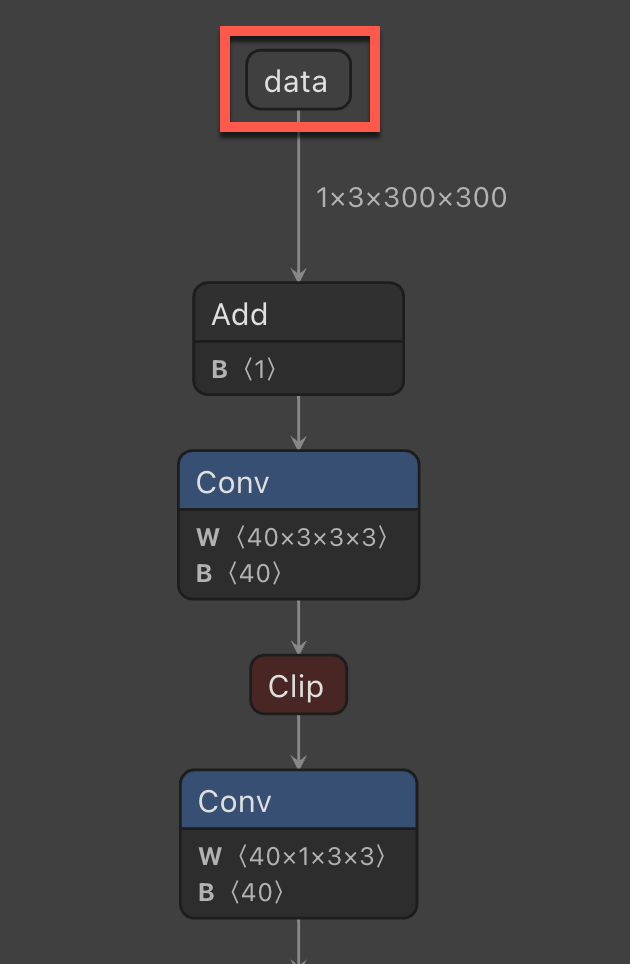
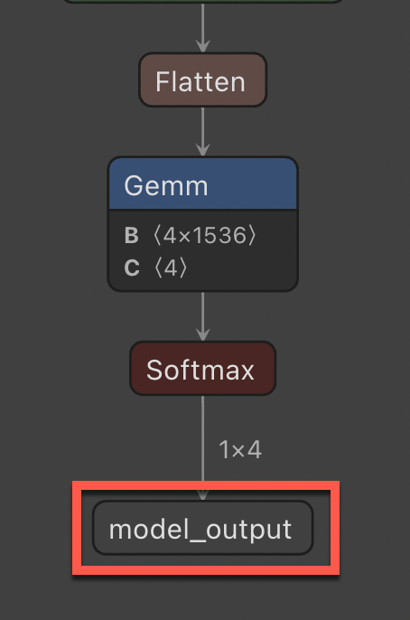
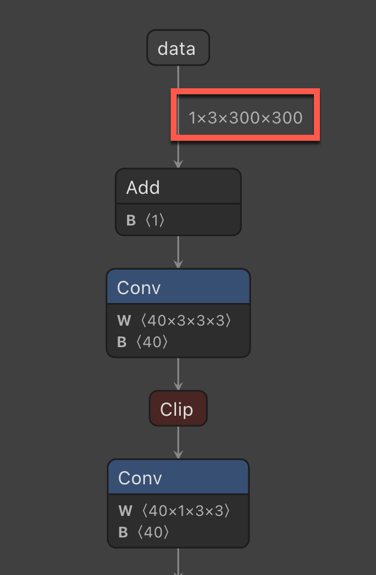

# Tutorial: Categorize an image in ML.NET from Custom Vision ONNX model

Learn how to use ML.NET to categorize images using an ONNX model trained in the Microsoft Custom Vision service.

The Microsoft Custom Vision service is an AI service that allows you to upload your own images and it will train a model for you. You can then export the model to ONNX format and use it in ML.NET to make predictions.

In this tutorial, you will learn how to:
> [!div class="checklist"]
>
> * Understand the problem
> * Use the Custom Vision service to create an ONNX model
> * Incorporate the ONNX model into the ML.NET pipeline
> * Train the ML.NET model
> * Classify a test image

A sample for the ML.NET pipeline and testing of an image can be found [here]().

## Prerequisites

* [Visual Studio 2022](https://visualstudio.microsoft.com/downloads/).
* [Download the dataset](https://data.mendeley.com/datasets/4drtyfjtfy/1) of weather images.
* Azure account. If you don't have one, [create a free Azure account](https://aka.ms/AMLFree).

## Select the right machine learning task

### Data

The multi-class weather dataset is used to help analyze outdoor weather. You can download the dataset [here](https://data.mendeley.com/datasets/4drtyfjtfy/1).

> [!NOTE]
> Ajayi, Gbeminiyi (2018), “Multi-class Weather Dataset for Image Classification”, Mendeley Data, V1, doi: 10.17632/4drtyfjtfy.1

## Create the Model

### Create the Custom Vision Project

Log into the [Microsoft Custom Vision service](https://www.customvision.ai/) and select "New Project".

In the "New Project" dialog, fill out the following required items:

- Set the "Name" of the Custom Vision project as **WeatherRecognition**.
- Select the "Resource" you will use. This is an Azure resource that will be created for the Custom Vision project. If none is listed, one can be created by selecting the **Create new** link.
- Set the "Project type" as **Classification**.
- Set the "Classification Types" as **Multiclass** since there will be one class per image.
- Set the "Domain" as **General (compact)**. The compact domain will allow you to download the ONNX model.
- For "Export capabilities" select **Basic platforms** to allow the export of the ONNX model.

Once the above fields are filled out click the **Create project** button.

### Add images

With the project created, click on the **Add images** button to start adding images for the model to train on. Select the stop sign images in the file browser that will display.

A popup will display where you can add tags that to those images. Set the tag as **stop-sign** and click the **Upload** button. Once the images have uploaded click the **Done** button to close the popup.

### Train the model

With the images uploaded and tagged the model can now be trained. Click on the **Train** button. For the "Training type" select **Quick training** and click on the **Train** button.

A popup will display asking what type of training to use. Select **Quick training** and click the **Train** button.

### Download the ONNX model

Once training is completed click on the "Export" button. When the popup displays click on the "ONNX" selection to download the ONNX model.

### Analyze ONNX model

Unzip the ONNX file from Custom Vision. The folder will contain several files, but the two that we will use in this tutorial are the following:

- **labels.txt** is a text file containing the labels that were defined in the Custom Vision service.
- **model.onnx** is the ONNX model that we will use to make predictions in ML.NET.

In order to build our ML.NET pipeline we will need the names of the input and output column names. To get this we can use Netron, a [web](https://netron.app/) and [desktop](https://github.com/lutzroeder/netron/releases/) app that can analyze ONNX models and show its architecture.

1. When using either the web or desktop app of Netron, open the ONNX model in the app. Once it opens it will display a graph. This graph will tell you a few things that you will need in order to build the ML.NET pipeline.

    - **Input column name** - The input column name required when applying the ONNX model in ML.NET.

        

    - **Output column name** - The output column name required when applying the ONNX model in ML.NET.

        

    - **Image size** - The size required when resizing images in the ML.NET pipeline.

        

## Create a project

1. Create a C# **Console Application** called "WeatherRecognition". Click the **Next** button.

1. Choose .NET 6 as the framework to use. Click the **Create** button.

1. Install the **Microsoft.ML NuGet Package**:

    [!INCLUDE [mlnet-current-nuget-version](../../../includes/mlnet-current-nuget-version.md)]

    - In Solution Explorer, right-click on your project and select **Manage NuGet Packages**.
    - Choose "nuget.org" as the Package source, select the Browse tab, search for **Microsoft.ML**.
    - Select the **Install** button.
    - Select the **OK** button on the **Preview Changes** dialog.
    - Select the **I Accept** button on the **License Acceptance** dialog if you agree with the license terms for the packages listed.
    - Repeat these steps for **Microsoft.ML.ImageAnalytics**, and **Microsoft.Onnx.Transformer**.

## Reference the ONNX model

Reference the two files from the ONNX model in the Visual Studio solution - **labels.txt** and **model.onnx**. Right click them and in the properties set the **Copy to output directory** setting to "Copy if newer".

## Create input and prediction classes

1. Add a new class to your project and name it 'WeatherRecognitionInput'. Then add the following property to the class.

    ```csharp
    [ImageType(300, 300)]
    public Bitmap Image { get; set; }
    ```

    The `Image` property contains the bitmap of the image used for prediction. And the `ImageType` attribute tells ML.NET that the property is an image with dimensions of 300 and 300 which was determined by what we saw in Netron when analyzing the model.

1. Add another class to your project and name it 'WeatherRecognitionPrediction'. Then add the following property to the class.

    ```csharp
    [ColumnName("model_output")]
    public float[] PredictedLabels { get; set; }
    ```

    The `PredictedLabels` property contains the predictions of each labels. The type is a float array, so each item in the array will be the prediction of each label. The `ColumnName` attribute tells ML.NET that this column in the model is the name given, which is `model_output`.

## Predict on an image

### Add using statements

In the "Program.cs" file, add the following usings to the top of the file.

```csharp
using Microsoft.ML;
using Microsoft.ML.Transforms.Image;
using System.Drawing;
using WeatherRecognition;
```

### Create objects

1. Below the using statements create the `MLContext` object.

    ```csharp
    var context = new MLContext();
    ```

1. Create an empty list of the `WeatherRecognitionInput` class.

    ```csharp
    var emptyData = new List<WeatherRecognitionInput>();
    ```

1. Create an `IDataView` on the `WeatherRecognitionInput` list.

    ```csharp
    var data = context.Data.LoadFromEnumerable(emptyData);
    ```

## Build the pipeline

With the empty `IDataView` created the pipeline can be built to do the predictions of any new images. The pipeline will consist of several steps.

1. Resize the incoming images.

The image being sent to the model for prediction will often be in a different aspect ratio as the images that were trained on the model. To keep the image consistent for accurate predictions, we resize the image to 300x300. We also give the `imageColumnName` as the name of the `WeatherRecognitionInput.Image` property. We do this with the `context.Transforms.ResizeImages` method. This method is an extension method from the `Microsoft.ML.ImageAnalytics` NuGet package.

```csharp
var pipeline = context.Transforms.ResizeImages(resizing: ImageResizingEstimator.ResizingKind.Fill, outputColumnName: "data", imageWidth: 300, imageHeight: 300, inputColumnName: nameof(WeatherRecognitionInput.Image))
```

1. Extract the pixels of the image

Once the image has been resized, we would need to extract the pixels of the image. We append the `context.Transforms.ExtractPixels` method that is also an extension method from the `Microsoft.ML.ImageAnalytics` NuGet package. We give it an `outputColumnName` as a parameter.

```csharp
.Append(context.Transforms.ExtractPixels(outputColumnName: "data"))
```

1. Apply the ONNX model to the image to make a prediction. This takes a few parameters:

    - **modelFile** - The path to the ONNX model file
    - **outputColumnName** - The name of the output column name, which can be found when analyzing the ONNX model in Netron.
    - **inputColumnName** - The name of the input column name, which can also be found when analyzing the ONNX model in Netron.

```csharp
.Append(context.Transforms.ApplyOnnxModel(modelFile: "./model/model.onnx", outputColumnName: "model_output", inputColumnName: "data"));
```

## Fit the model

Now that we have a pipeline defined, we need to use it to build the ML.NET model. We first would use the `Fit` method on the pipeline and pass in the `IDataView` that was built off the empty list of `WeatherRecognitionInput` objects.

```csharp
var model = pipeline.Fit(data);
```

Next, in order to make predictions, we would need to create a prediction engine. This is a generic method, so it will take in the input and output classes that were created earlier. Then, pass in the model as its parameter.

```csharp
var predictionEngine = context.Model.CreatePredictionEngine<WeatherRecognitionInput, WeatherRecognitionPrediction>(model);
```

## Extract the labels

In order to get accurate predictions, we would need to extract the labels that we also got from Custom Vision. This will be in the **labels.txt** file that was included in the zip file along with the ONNX model.

To read the file we'll use the `File.ReadAllLines` method. This will return the labels as an array.

```csharp
var labels = File.ReadAllLines("./model/labels.txt");
```

## Predict on a test image

Now we can use the model to predict on a new image. In the project, there is a "test" folder that we can read from to get all test images to predict on. This folder contains a sunrise image from [Unsplash](https://unsplash.com/) To get those images, we  use the `Directory.GetFiles` method.

```csharp
var testFiles = Directory.GetFiles("./test");
```

With the test files retrieved, we can loop through them and make a prediction on them with our model and output the result.

```csharp
Bitmap testImage;

foreach (var image in testFiles)
{
    using (var stream = new FileStream(image, FileMode.Open))
    {
        testImage = (Bitmap)Image.FromStream(stream);
    }

    var prediction = predictionEngine.Predict(new WeatherRecognitionInput { Image = testImage });

    var maxValue = prediction.PredictedLabels.Max();
    var maxIndex = prediction.PredictedLabels.ToList().IndexOf(maxValue);

    var predictedLabel = labels[maxIndex];

    Console.WriteLine($"Prediction for file {image}: {predictedLabel}");
}
```

## Next steps

In this tutorial you learned how to:

> [!div class="checklist"]
>
> * Understand the problem
> * Use the Custom Vision service to create an ONNX model
> * Incorporate the ONNX model into the ML.NET pipeline
> * Train the ML.NET model
> * Classify a test image

Try one of the other image classification tutorials:

- [Image Classification with Transfer Learning](image-classification-api-transfer-learning.md)
- [Image Classification with Model Builder](image-classification-model-builder.md)
- [Image CLassification with Tensorflow Model](image-classification.md)
