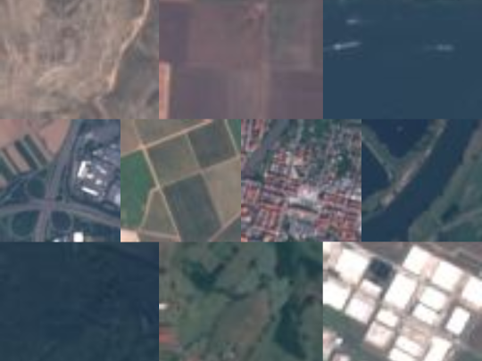
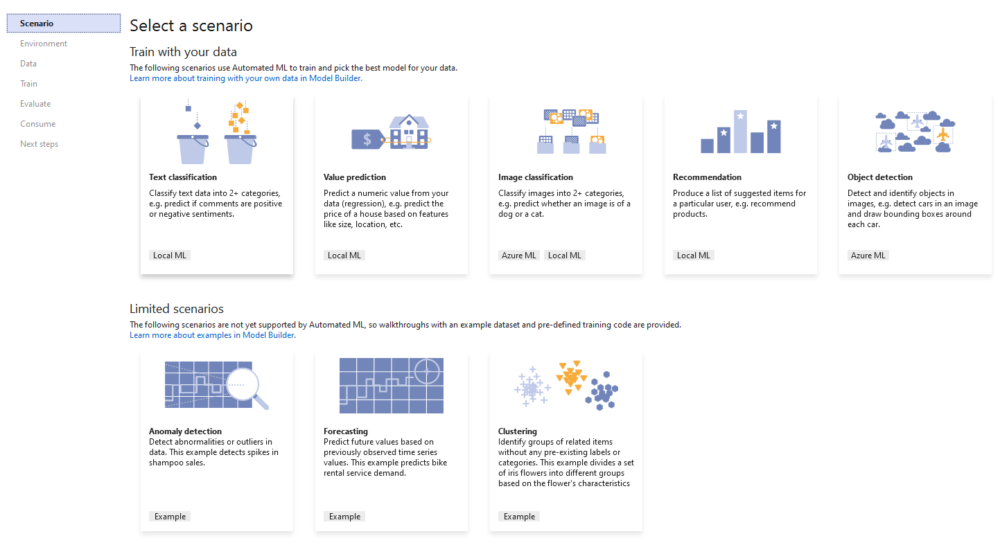

# Train an image classification model in Azure using Model Builder

Learn how to train an image classification model in Azure using Model Builder to categorize land use from satellite images.

This tutorial shows you how to create a C# class library to categorize land use based on satellite images with Model Builder.

In this tutorial, you:

> [!div class="checklist"]
>
> - Prepare and understand the data
> - Create a Model Builder config file
> - Choose a scenario
> - Load the data
> - Create an experiment in Azure
> - Train the model
> - Evaluate the model
> - Consume the model

> [!NOTE]
> Model Builder is currently in Preview.

## Prerequisites

- For a list of pre-requisites and installation instructions, visit the [Model Builder installation guide](../how-to-guides/install-model-builder.md).
- Azure account. If you don't have one, [create a free Azure account](https://aka.ms/AMLFree).
- ASP.NET and web development workload.

## Model Builder image classification overview

This sample creates C# class library that categorizes land use from map satellite imagery using a deep learning model trained on Azure with Model Builder. You can find the source code for this tutorial in the [dotnet/machinelearning-samples](https://github.com/dotnet/machinelearning-samples/tree/main/samples/modelbuilder/ImageClassification_Azure_LandUse) GitHub repository

## Create a C# Class Library

Create a **C# Class Library** called "LandUse".

## Prepare and understand the data

> [!NOTE]
> The data for this tutorial is from:
>
> - Eurosat: A novel dataset and deep learning benchmark for land use and land cover classification. Patrick Helber, Benjamin Bischke, Andreas Dengel, Damian Borth. IEEE Journal of Selected Topics in Applied Earth Observations and Remote Sensing, 2019.
> - Introducing EuroSAT: A Novel Dataset and Deep Learning Benchmark for Land Use and Land Cover Classification. Patrick Helber, Benjamin Bischke, Andreas Dengel. 2018 IEEE International Geoscience and Remote Sensing Symposium, 2018.

The EuroSAT dataset contains a collection of satellite images divided into ten categories (rural, industrial, river, etc.). The original dataset contains 27,000 images. For convenience, this tutorial only uses 2,000 of those images.

  

1. Download the subset of the [EuroSAT dataset](https://github.com/dotnet/machinelearning-samples/blob/main/samples/modelbuilder/ImageClassification_Azure_LandUse/assets.zip) and save it anywhere on your computer.
1. Unzip it.

## Create a Model Builder config file

When first adding Model Builder to the solution it will prompt you to create an `mbconfig` file. The `mbconfig` file keeps track of everything you do in Model Builder to allow you to reopen the session.

1. In Solution Explorer, right-click the **LandUse** project, and select **Add > Machine Learning Model...**.
1. In the dialog, name the Model Builder project **LandUse**, and click **Add**.

## Choose a scenario



To train your model, you need to select from the list of available machine learning scenarios provided by Model Builder.

For this sample, the task is image classification. In the scenario step of the Model Builder tool, select the **Image Classification** scenario.

## Select an environment

Model Builder can run the training on different environments depending on the scenario that was selected.

Select **Azure** as your environment and click the **Set up workspace** button.

### Create experiment in Azure

An Azure Machine Learning experiment is a resource that needs to be created before running Model Builder training on Azure.

The experiment encapsulates the configuration and results for one or more machine learning training runs. Experiments belong to a specific workspace. The first time an experiment is created, its name is registered in the workspace. Any subsequent runs - if the same experiment name is used - are logged as part of the same experiment. Otherwise, a new experiment is created.

In the Create New Experiment dialog, choose your subscription from the **Subscription** dropdown.

### Create workspace

A workspace is an Azure Machine Learning resource that provides a central place for all Azure Machine Learning resources and artifacts created as part of a training run.

1. In the Create New Experiment dialog, select the **New** link next to the **Machine Learning Workspace name** dropdown.
1. In the Create A New Workspace dialog, type "landuse-wkspc" in the **Machine Learning Workspace name** text box.
1. Choose **East US** from the **Regions** dropdown. A region is the geographic location of the data center where your workspace and resources are deployed to. It is recommended that you choose a location close to where you or your customers are.
1. Select the **New** link next to the **Resource Groups** dropdown.
    1. In the Create New Resource Group dialog, type "landuse-rg" in the **Resource Group name** text box.
    1. Select **OK**.
1. Choose your newly created resource group from the **Resource Groups** dropdown.
1. Select **Create**.

    The provisioning process takes a few minutes. A request is made to Azure to provision the following cloud resources:

    - Azure Machine Learning workspace
    - Azure Storage Account
    - Azure Application Insights
    - Azure Container Registry
    - Azure Key Vault

1. Once the provisioning process is complete, choose your newly created workspace from the **Machine Learning Workspace name** dropdown in the Create New Experiment dialog.

### Create compute

An Azure Machine Learning compute is a cloud-based Linux VM used for training.

1. In the Create New Experiment dialog, select the **New** link next to the **Compute name** dropdown.
1. In the Create New Compute dialog, type "landuse-cpt" in the **Compute name** text box.
1. Choose **Standard_NC24** from the **Compute size** dropdown. Model Builder uses GPU-optimized compute types. Visit the [NC-series Linux VM documentation](/azure/virtual-machines/nc-series?toc=/azure/virtual-machines/linux/toc.json&bc=/azure/virtual-machines/linux/breadcrumb/toc.json) for more details on GPU optimized compute types.
1. Select **Create**. The compute resources may take a few minutes to provision.
1. Once the provisioning process is complete, choose your newly created workspace from the **Compute name** dropdown in the Create New Experiment dialog.
1. Select the **Next step** button to load in the data.

## Load the data

1. In the data step of the Model Builder tool, select the button next to the **Select a folder** text box.
1. Use File Explorer to browse and select the unzipped directory containing the images.
1. Select the **Next step** button to move to the next step in the Model Builder tool.

## Train the model

Training on Azure is only available for the Model Builder image classification scenario. The algorithm used to train these models is a Deep Neural Network based on the ResNet50 architecture. During the model training process, Model Builder trains separate models using ResNet50 algorithm and settings to find the best performing model for your dataset.

### Start training

Once you've configured your workspace and compute type, it's time to finish creating the experiment and start training.

1. Click the **Start Training** button.

    The training process takes some time and the amount of time may vary depending on the size of compute selected as well as amount of data. The first time a model is trained, you can expect a slightly longer training time because resources have to be provisioned. You can track the progress of your runs by selecting the **Monitor current run in Azure portal** link in Visual Studio.

    Throughout the training process, progress data is displayed in the Progress section of the train step.

    - Status displays the completion status of the training process.
    - Best accuracy displays the accuracy of the best performing model found by Model Builder so far. Higher accuracy means the model predicted more correctly on test data.
    - Algorithm displays the name of the best performing algorithm performed found by Model Builder so far.

1. Once training is complete, select the **Next step** button to move to evaluate the model.

### Evaluate the model

The result of the training step is one model that had the best performance. In the evaluate step of the Model Builder tool, the **Details** tab in the output section, will contain the algorithm used by the best performing model in the **Algorithm** entry along with metrics in the **Accuracy** entry in the **Best model** details.

If you're not satisfied with your accuracy metrics, some easy ways to try and improve model accuracy are to use more data or augment the existing data. Otherwise, select the **Next step** button to move to the final step in the Model Builder tool.

## (Optional) Consume the model

This step will have project templates that you can use to consume the model. This step is optional and you can choose the method that best suits your needs on how to serve the model.

- Console App
- Web API

### Console App

When adding a console app to your solution, you will be prompted to name the project.

1. Name the console project **LandUse_Console**.
1. Click **Add to solution** to add the project to your current solution.
1. Run the application.

    The output generated by the program should look similar to the snippet below:

    ```bash
    Predicted Label value: AnnualCrop

    Predicted Label scores: [0.9941197,3.3146807E-06,4.4344174E-06,0.000101028825,7.763133E-06,0.0015898133,0.0040994748,1.6308518E-06,6.265567E-05,1.0236401E-05]
    ```

### Web API

When adding a web API to your solution, you will be prompted to name the project.

1. Name the Web API project **LandUse_API**.
1. Click **Add to solution** to add the project to your current solution.
1. Run the application.
1. Open PowerShell and enter the following code where PORT is the port your application is listening on.

    ```powershell
    $body = @{
         ImageSource = <Image location on your local machine>
    }

     Invoke-RestMethod "https://localhost:<PORT>/predict" -Method Post -Body ($body | ConvertTo-Json) -ContentType "application/json"
    ```

1. If successful, the output should look similar to the text below.

    ```powershell
    output1                                           prediction score
    -------                                           ---------- -----
    {9.508701, -3.1025503, -2.8115153, 0.31449434...} AnnualCrop {0.9941197, 3.3146807E-06, 4.4344174E-06, 0.00010102882...
    ```

## Clean up resources

If you no longer plan to use the Azure resources you created, delete them. This prevents you from being charged for unutilized resources that are still running.

1. Navigate to the [Azure portal](https://portal.azure.com/) and select **Resource groups** in the portal menu.
1. From the list of resource groups, select the resource group you created. In this case, it's "landuse-rg".
1. Select **Delete resource group**.
1. Type the resource group name, "landuse-rg", into the text box and then select **Enter**.

## Next steps

In this tutorial you learned how to:

> [!div class="checklist"]
>
> - Prepare and understand the data
> - Create a Model Builder config file
> - Choose a scenario
> - Load the data
> - Create an experiment in Azure
> - Train the model
> - Evaluate the model
> - Consume the model

Try one of the other Model Builder scenarios:

- [Predict NYC taxi fares](predict-prices-with-model-builder.md)
- [Analyze sentiment of website comments in a Razor Pages application](sentiment-analysis-model-builder.md)
- [Categorize the severity of restaurant health violations](health-violation-classification-model-builder.md)
