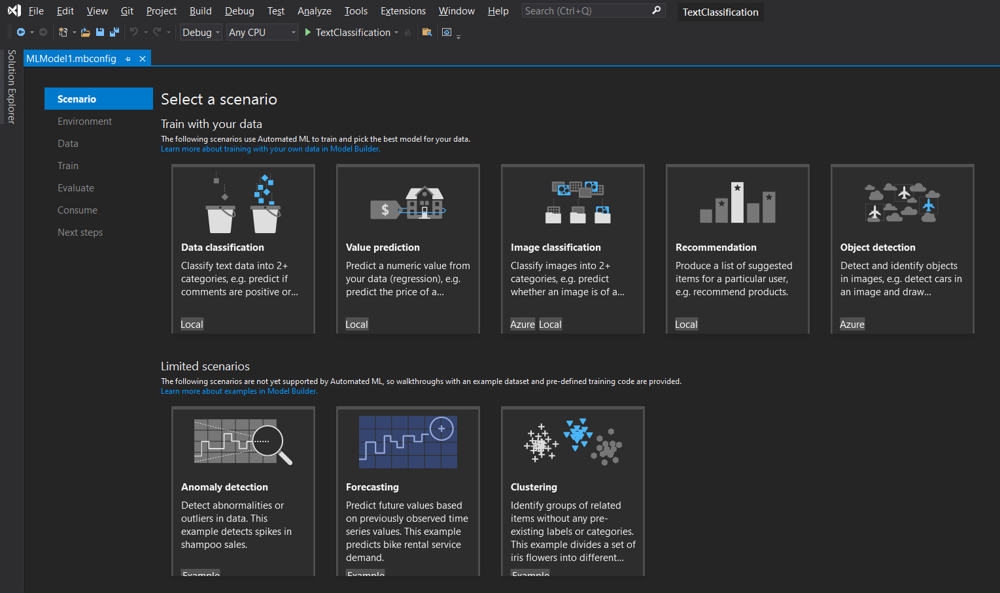
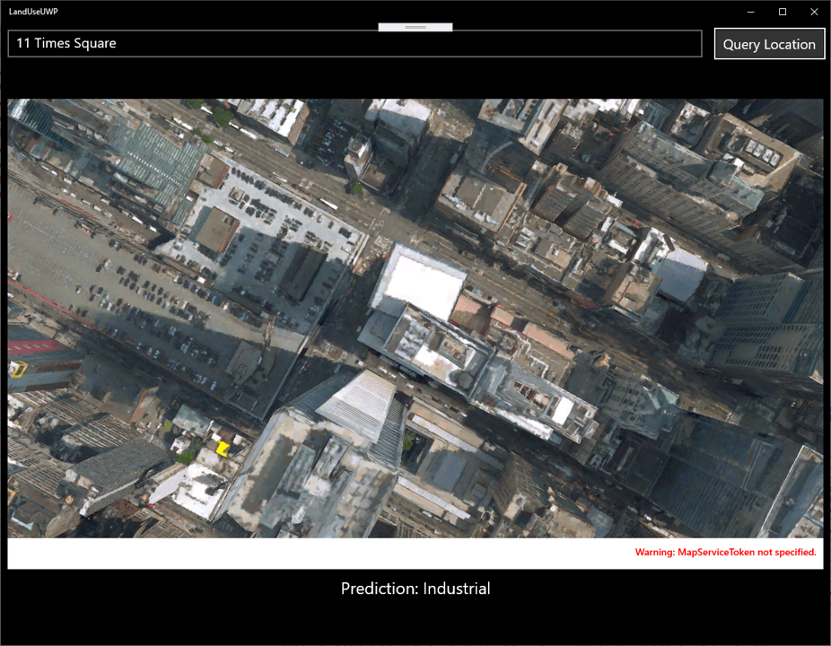

# Train an image classification model in Azure using Model Builder

Learn how to train an image classification model in Azure using Model Builder to categorize land use from satellite images.

This tutorial shows you how to create a Universal Windows Platform (UWP) application that hosts a model in an C# ASP.NET Core Web API to categorize land use based on satellite images.

In this tutorial, you:

> [!div class="checklist"]
>
> - Create an ASP.NET Core Web API
> - Prepare and understand the data
> - Create a Model Builder config file
> - Choose a scenario
> - Load the data
> - Create an experiment in Azure
> - Train the model
> - Evaluate the model
> - Add the code to make predictions
> - Consume the model in UWP application

> [!NOTE]
> Model Builder is currently in Preview.

## Prerequisites

- For a list of pre-requisites and installation instructions, visit the [Model Builder installation guide](https://docs.microsoft.com/dotnet/machine-learning/how-to-guides/install-model-builder).
- Azure account. If you don't have one, [create a free Azure account](https://aka.ms/AMLFree).
- ASP.NET and web development workload.
- Universal Windows Platform development workload.

## Model Builder image classification overview

This sample creates a UWP application that categorizes land use from map satellite imagery using a deep learning model trained on Azure with Model Builder. The model itself is hosted as a web service in an ASP.NET Core Web API. You can find the source code for this tutorial in the [dotnet/machinelearning-samples](https://github.com/dotnet/machinelearning-samples/tree/master/samples/modelbuilder/ImageClassification_Azure_LandUse) GitHub repository

## Create solution

1. In Visual Studio, select **File > New > Project** from the menu bar.
1. In the New Project dialog, type "Solution" into the search box.
1. Select the **Blank Solution** template, then select the **Next** button.
1. In the **Name** text box, type "LandUse".
1. Select **Create**.

## Create a Console Project

1. In Solution Explorer, right-click the **LandUse** solution, then select **Add > New Project**.
1. In the New Project dialog, type "Console" into the search box.
1. Select the **Console Application** C# project template, then select the **Next** button.
1. In the **Name** text box, type "LandUse".
1. Select **Next**.
1. In the "Additional Information" window, click **Create** to accept the default target framework.

## Prepare and understand the data

> [!NOTE]
> The data for this tutorial is from:
>
> - Eurosat: A novel dataset and deep learning benchmark for land use and land cover classification. Patrick Helber, Benjamin Bischke, Andreas Dengel, Damian Borth. IEEE Journal of Selected Topics in Applied Earth Observations and Remote Sensing, 2019.
> - Introducing EuroSAT: A Novel Dataset and Deep Learning Benchmark for Land Use and Land Cover Classification. Patrick Helber, Benjamin Bischke, Andreas Dengel. 2018 IEEE International Geoscience and Remote Sensing Symposium, 2018.

The EuroSAT dataset contains a collection of satellite images divided into ten categories (rural, industrial, river, etc.). The original dataset contains 27,000 images. For convenience, this tutorial only uses 2,000 of those images.

  

1. Download the subset of the [EuroSAT dataset](https://github.com/dotnet/machinelearning-samples/blob/master/samples/modelbuilder/ImageClassification_Azure_LandUse/assets.zip) and save it anywhere on your computer.
1. Unzip it.

## Create a Model Builder config file

When first adding Model Builder to the solution it will prompt you to create an `mbconfig` file. The `mbconfig` file keeps track of everything you do in Model Builder to allow you to reopen the session.

1. In Solution Explorer, right-click the **LandUse** project, and select **Add > Machine Learning**.
1. In the dialog, name the Model Builder project **LandUse**, and click **Add**.

## Choose a scenario



To train your model, you need to select from the list of available machine learning scenarios provided by Model Builder.

1. For this sample, the scenario is image classification. In the scenario step of the Model Builder tool, select the **Image Classification** scenario.

## Select an enviornment

Model Builder can run the training on different environments depending on the scenario that was selected.

1. Select "Azure" as your environment and click the **Set up workspace** button.

### Create experiment in Azure

An Azure Machine Learning experiment is a resource that needs to be created before running Model Builder training on Azure.

The experiment encapsulates the configuration and results for one or more machine learning training runs. Experiments belong to a specific workspace. The first time an experiment is created, its name is registered in the workspace. Any subsequent runs - if the same experiment name is used - are logged as part of the same experiment. Otherwise, a new experiment is created.

1. In the Create New Experiment dialog, choose your subscription from the **Subscription** dropdown.

### Create workspace

A workspace is an Azure Machine Learning resource that provides a central place for all Azure Machine Learning resources and artifacts created as part of training run.

1. In the Create New Experiment dialog, select the **New** link next to the **Machine Learning Workspace name** dropdown.
1. In the Create A New Workspace dialog, type "landuse-wkspc" in the **Machine Learning Workspace name** text box.
1. Choose **East US** from the **Regions** dropdown. A region is the geographic location of the data center where your workspace and resources are deployed to. It is recommended that you choose a location close to where you or your customers are.
1. Select the **New** link next to the **Resource Groups** dropdown.
    1. In the Create New Resource Group dialog, type "landuse-rg" in the **Resource Group name** text box.
    1. Select **OK**.
1. Choose your newly created resource group from the **Resource Groups** dropdown.
1. Select **Create**.

    The provisioning process takes a few minutes. A request is made to Azure to provision the following cloud resources:

    - Enterprise Azure Machine Learning workspace
    - Azure Storage Account
    - Azure Application Insights
    - Azure Container Registry
    - Azure Key Vault

1. Once the provisioning process is complete, choose your newly created workspace from the **Machine Learning Workspace name** dropdown in the Create New Experiment dialog.

### Create compute

An Azure Machine Learning compute is a cloud-based Linux VM used for training.

1. In the Create New Experiment dialog, select the **New** link next to the **Compute name** dropdown.
1. In the Create New Compute dialog, type "landuse-cpt" in the **Compute name** text box.
1. Choose **Standard_NC24** from the **Compute size** dropdown. Model Builder uses GPU-optimized compute types. Visit the [NC-series Linux VM documentation](https://docs.microsoft.com/azure/virtual-machines/nc-series?toc=/azure/virtual-machines/linux/toc.json&bc=/azure/virtual-machines/linux/breadcrumb/toc.json) for more details on GPU optimized compute types.
1. Select **Create**. The compute resources may take a few minutes to provision.
1. Once the provisioning process is complete, choose your newly created workspace from the **Compute name** dropdown in the Create New Experiment dialog.
1. Select the **Next step** button to load in the data.

## Load the data

1. In the data step of the Model Builder tool, select the button next to the **Select a folder** text box.
1. Use File Explorer to browse and select the unzipped directory containing the images.
1. Select the **Next step** button to move to the next step in the Model Builder tool.

## Train the model

Training on Azure is only available for the Model Builder image classification scenario. The algorithm used to train these models is a Deep Neural Network based on the ResNet50 architecture. During the model training process, Model Builder trains separate models using ResNet50 algorithm and settings to find the best performing model for your dataset.

### Start training

Once you've configured your workspace and compute type, it's time to finish creating the experiment and start training.

1. Click the **Start Training** button.

    The training process takes some time and the amount of time may vary depending on the size of compute selected as well as amount of data. The first time a model is trained, you can expect a slightly longer training time because resources have to be provisioned. You can track the progress of your runs by selecting the **Monitor current run in Azure portal** link in Visual Studio.

    Throughout the training process, progress data is displayed in the Progress section of the train step.

    - Status displays the completion status of the training process.
    - Best accuracy displays the accuracy of the best performing model found by Model Builder so far. Higher accuracy means the model predicted more correctly on test data.
    - Algorithm displays the name of the best performing algorithm performed found by Model Builder so far.

1. Once training is complete, select the **Next step** button to move to evaluate the model.

### Evaluate the model

The result of the training step is one model that had the best performance. In the evaluate step of the Model Builder tool, the **Details** tab in the output section, will contain the algorithm used by the best performing model in the **Algorithm** entry along with metrics in the **Best model Accuracy** entry.

If you're not satisfied with your accuracy metrics, some easy ways to try and improve model accuracy are to use more data or augment the existing data. Otherwise, select the **Next step** button to move to the final step in the Model Builder tool.

### Add the code to make predictions

This step will have project templates that you can use to consume the model. We will use the Web API project template.

1. Click the **Add to solution** button for the Web API project template.
1. Name the project "LandUseApi" and click the **Add to solution** button to add the project to your solution.

## Consume the model in UWP application

The UWP application is the interface users interact with. When a user searches for an address, a satellite image of the location renders and is categorized by the model hosted in the ASP.NET Core Web API.

### Create UWP Application

1. In Solution Explorer, right-click the **LandUse** solution, and select **Add > New Project**.
1. In the New Project dialog, type "Universal Windows" into the search box.
1. Select the **Blank App (Universal Windows)** C# project template, then select the **Next** button.
1. In the **Project name** text box, type "LandUseUWP".
1. Select **Create**.
1. The target version/minimum version dialog appears. Keep the default settings, then select **OK**.

### Install NuGet packages

To serialize JSON requests and responses in the `LandUseUWP` UWP application, install the **System.Text.Json** NuGet package.

1. In Solution Explorer, right-click the `LandUseUWP` project and select **Manage NuGet Packages**.
Choose "nuget.org" as the Package source.
1. Select the **Browse** tab and search for **System.Text.Json**.
1. Select the package in the list, and select the **Install** button.
1. Select the **OK** button on the Preview Changes dialog
1. Select the **I Accept** button on the License Acceptance dialog if you agree with the license terms for the packages listed.

### Design the layout of the main page

This application only contains a single page.

1. Open the *MainPage.xaml* file and replace the contents of the file with the following.

    :::code language="xaml" source="~/machinelearning-samples/samples/modelbuilder/ImageClassification_Azure_LandUse/LandUseUWP/MainPage.xaml":::

### Add interactivity to the application

1. Open the *MainPage.xaml.cs* file.
1. Replace the using statements at the top of the file with the following:

    :::code language="csharp" source="~/machinelearning-samples/samples/modelbuilder/ImageClassification_Azure_LandUse/LandUseUWP/MainPage.xaml.cs" range="1-17":::

1. Start by setting a starting point for the map control. Create a new method called `SatelliteMap_Loaded` inside the `MainPage` class.

    :::code language="csharp" source="~/machinelearning-samples/samples/modelbuilder/ImageClassification_Azure_LandUse/LandUseUWP/MainPage.xaml.cs" range="34-40":::

1. Under the `SatelliteMap_Loaded` method, add a new method called `QueryLocation_Click`. This method performs a series of actions when the user clicks the `QueryLocation` button in the main page.

    ```csharp
    private async void QueryLocation_Click(object sender, RoutedEventArgs e)
    {

    }
    ```

1. When the `QueryLocation` button is clicked, the first thing that happens is, the address is reverse geo-coded using the [Nominatim API](https://nominatim.org/) to get the latitude and longitude of the location the user provides. Define a class to store the geo-coded coordinates.

    1. In Solution Explorer, right-click the **LandUseUWP** project, and select **Add > Class**.
    1. In the **Name** text box, type "Coordinates".
    1. Select **Add**. The *Coordinates.cs* file opens in the editor.

    Replace the using statements at the top of the file with the following:

    :::code language="csharp" source="~/machinelearning-samples/samples/modelbuilder/ImageClassification_Azure_LandUse/LandUseUWP/Coordinates.cs" range="1-6":::

    Replace the contents of the `Coordinates` class with the following:

    :::code language="csharp" source="~/machinelearning-samples/samples/modelbuilder/ImageClassification_Azure_LandUse/LandUseUWP/Coordinates.cs" range="10-17":::

1. In the *MainPage.xaml.cs* file, create a new method called `GetCoordinatesAsync` below the `QueryLocation_Click` method and add the following code.

    :::code language="csharp" source="~/machinelearning-samples/samples/modelbuilder/ImageClassification_Azure_LandUse/LandUseUWP/MainPage.xaml.cs" range="61-95":::

    The application tries to find the coordinates for the provided address. If address is not found, a default location is returned and a dialog opens informing the user the address was not found.

1. Call the `GetCoordinatesAsync` method inside the `QueryLocation_Clicked` method using the user provided address as input.

    :::code language="csharp" source="~/machinelearning-samples/samples/modelbuilder/ImageClassification_Azure_LandUse/LandUseUWP/MainPage.xaml.cs" range="45":::

1. Then, update the map using the coordinates of the new location. Create a new method called `UpdateMapLocationAsync` below the `GetCoordinatesAsync` method.

    :::code language="csharp" source="~/machinelearning-samples/samples/modelbuilder/ImageClassification_Azure_LandUse/LandUseUWP/MainPage.xaml.cs" range="97-106":::

1. Call the `UpdateMapLocationAsync` method inside the `QueryLocation_Clicked` by supplying the coordinates of the new location to the `SatelliteMap` control.

    :::code language="csharp" source="~/machinelearning-samples/samples/modelbuilder/ImageClassification_Azure_LandUse/LandUseUWP/MainPage.xaml.cs" range="48":::

1. The model requires an image as input. When the application updates the map, take a snapshot of the control. Create a new method called `GetMapAsImageAsync` to create an image of the map control below the `UpdateMapLocationAsync` method.

    :::code language="csharp" source="~/machinelearning-samples/samples/modelbuilder/ImageClassification_Azure_LandUse/LandUseUWP/MainPage.xaml.cs" range="108-127":::

1. Call the `GetMapAsImageAsync` method inside the `QueryLocation_Clicked`.

    :::code language="csharp" source="~/machinelearning-samples/samples/modelbuilder/ImageClassification_Azure_LandUse/LandUseUWP/MainPage.xaml.cs" range="51":::

1. Now that you have a satellite image, you can consume the ASP.NET Core Web API to classify it. Create a new method called `ClassifyImageAsync` below the `GetMapAsImageAsync` method.

    :::code language="csharp" source="~/machinelearning-samples/samples/modelbuilder/ImageClassification_Azure_LandUse/LandUseUWP/MainPage.xaml.cs" range="129-149":::

1. Call the `ClassifyImageAsync` method from the `QueryLocation_Click` method. Use the satellite image from the map control as input.

    :::code language="csharp" source="~/machinelearning-samples/samples/modelbuilder/ImageClassification_Azure_LandUse/LandUseUWP/MainPage.xaml.cs" range="54-55":::

1. Finally, display the prediction in the main page of the application.

    :::code language="csharp" source="~/machinelearning-samples/samples/modelbuilder/ImageClassification_Azure_LandUse/LandUseUWP/MainPage.xaml.cs" range="58":::

1. The complete `QueryLocation_Click` method should look like the following:

    :::code language="csharp" source="~/machinelearning-samples/samples/modelbuilder/ImageClassification_Azure_LandUse/LandUseUWP/MainPage.xaml.cs" range="42-59":::

## Run the application

1. In the Visual Studio toolbar menu, open the **Debug Target** context menu.
1. Choose the **LandUseAPI** debug target.
1. Select the **Debug Target** button to start the web API server.
1. Once the `LandUseAPI` application is running, in Solution Explorer, right-click the **LandUseUWP** project and select **Debug > Start New Instance**.
1. When the UWP application launches, replace the default text in the address bar with "11 Times Square".
1. Select the **Query Location** button next to the address bar. The image is classified and the text **Prediction: Industrial** should appear below the map.

    

Congratulations! You have now built an application that uses Model Builder to train an image classification model in Azure.

## Clean up resources

If you no longer plan to use the Azure resources you created, delete them. This prevents you from being charged for unutilized resources that are still running.

1. Navigate to the [Azure portal](portal.azure.com) and select **Resource groups** in the portal menu.
1. From the list of resource groups, select the resource group you created. In this case, it's "landuse-rg".
1. Select **Delete resource group**.
1. Type the resource group name, "landuse-rg", into the text box and then select **Enter**.

## Next steps

In this tutorial you learned how to:

> [!div class="checklist"]
>
> - Create an ASP.NET Core Web API
> - Prepare and understand the data
> - Create a Model Builder config file
> - Choose a scenario
> - Load the data
> - Create an experiment in Azure
> - Train the model
> - Evaluate the model
> - Add the code to make predictions
> - Consume the model in UWP application

Try one of the other Model Builder scenarios:

- [Predict NYC taxi fares](predict-prices-with-model-builder.md)
- [Analyze sentiment of website comments in a Razor Pages application](sentiment-analysis-model-builder.md)
- [Categorize the severity of restaurant health violations](health-violation-classification-model-builder.md)