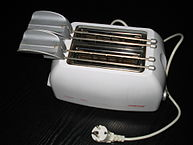
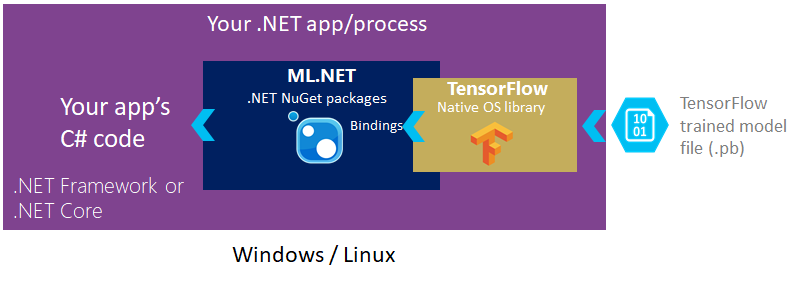
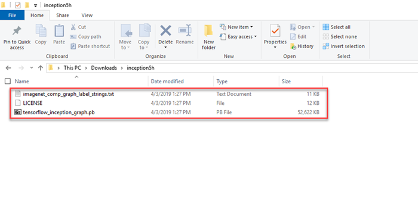

# Tutorial: Train an ML.NET classification model to categorize images

Learn how to train a classification model to categorize images using a pre-trained TensorFlow model for image processing.

The TensorFlow model was trained to classify images into a thousand categories. Because the TensorFlow model knows how to recognize patterns in images, the ML.NET model can make use of part of it in its pipeline to convert raw images into features or inputs to train a classification model.

In this tutorial, you learn how to:
> [!div class="checklist"]
>
> * Understand the problem
> * Incorporate the pre-trained TensorFlow model into the ML.NET pipeline
> * Train and evaluate the ML.NET model
> * Classify a test image

You can find the source code for this tutorial at the [dotnet/samples](https://github.com/dotnet/samples/tree/main/machine-learning/tutorials/TransferLearningTF) repository. By default, the .NET project configuration for this tutorial targets .NET core 2.2.

## Prerequisites

* [Visual Studio 2022](https://visualstudio.microsoft.com/downloads/).
* [The tutorial assets directory .ZIP file](https://github.com/dotnet/samples/blob/main/machine-learning/tutorials/TransferLearningTF/image-classifier-assets.zip)
* [The InceptionV1 machine learning model](https://storage.googleapis.com/download.tensorflow.org/models/inception5h.zip)

## Select the right machine learning task

### Deep learning

[Deep learning](https://en.wikipedia.org/wiki/Deep_learning) is a subset of Machine Learning, which is revolutionizing areas like computer vision and speech recognition.

Deep learning models are trained by using large sets of [labeled data](https://en.wikipedia.org/wiki/Labeled_data) and [neural networks](https://en.wikipedia.org/wiki/Artificial_neural_network) that contain multiple learning layers. Deep learning:

* Performs better on some tasks like computer vision.
* Requires huge amounts of training data.

Image classification is a specific classification task that allows us to automatically classify images into categories such as:

* Detecting a human face in an image or not.
* Detecting cats vs. dogs.

 Or as in the following images, determining if an image is a food, toy, or appliance:




>[!Note]
> The preceding images belong to Wikimedia Commons and are attributed as follows:
>
> * "220px-Pepperoni_pizza.jpg" Public Domain, <https://commons.wikimedia.org/w/index.php?curid=79505>,
> * "119px-Nalle_-_a_small_brown_teddy_bear.jpg" By [Jonik](https://commons.wikimedia.org/wiki/User:Jonik) - Self-photographed, CC BY-SA 2.0, <https://commons.wikimedia.org/w/index.php?curid=48166>.
> * "193px-Broodrooster.jpg" By [M.Minderhoud](https://nl.wikipedia.org/wiki/Gebruiker:Michiel1972) - Own work, CC BY-SA 3.0, <https://commons.wikimedia.org/w/index.php?curid=27403>

Training an [image classification](https://en.wikipedia.org/wiki/Outline_of_object_recognition) model from scratch requires setting millions of parameters, a ton of labeled training data and a vast amount of compute resources (hundreds of GPU hours). While not as effective as training a custom model from scratch, using a pre-trained model allows you to shortcut this process by working with thousands of images vs. millions of labeled images and build a customized model fairly quickly (within an hour on a machine without a GPU). This tutorial scales that process down even further, using only a dozen training images.

The `Inception model` is trained to classify images into a thousand categories, but for this tutorial, you need to classify images in a smaller category set, and only those categories. You can use the `Inception model`'s ability to recognize and classify images to the new limited categories of your custom image classifier.

* Food
* Toy
* Appliance

This tutorial uses the TensorFlow [Inception](https://storage.googleapis.com/download.tensorflow.org/models/inception5h.zip) deep learning model, a popular image recognition model trained on the `ImageNet` dataset. The TensorFlow model classifies entire images into a thousand classes, such as “Umbrella”, “Jersey”, and “Dishwasher”.

Because the `Inception model` has already been pre-trained on thousands of different images, internally it contains the [image features](https://en.wikipedia.org/wiki/Feature_(computer_vision)) needed for image identification. We can make use of these internal image features in the model to train a new model with far fewer classes.

As shown in the following diagram, you add a reference to the ML.NET NuGet packages in your .NET Core or .NET Framework applications. Under the covers, ML.NET includes and references the native `TensorFlow` library that allows you to write code that loads an existing trained `TensorFlow` model file.



### Multiclass classification

After using the TensorFlow inception model to extract features suitable as input for a classical machine learning algorithm, we add an ML.NET [multi-class classifier](../resources/tasks.md#multiclass-classification).

The specific trainer used in this case is the [multinomial logistic regression algorithm](https://en.wikipedia.org/wiki/Multinomial_logistic_regression).

The algorithm implemented by this trainer performs well on problems with a large number of features, which is the case for a deep learning model operating on image data.

See [Deep learning vs. machine learning](/azure/machine-learning/concept-deep-learning-vs-machine-learning) for more information.

### Data

There are two data sources: the `.tsv` file, and the image files.  The `tags.tsv` file contains two columns: the first one is defined as `ImagePath` and the second one is the `Label` corresponding to the image. The following example file doesn't have a header row, and looks like this:

<!-- markdownlint-disable MD010 -->
```tsv
broccoli.jpg	food
pizza.jpg	food
pizza2.jpg	food
teddy2.jpg	toy
teddy3.jpg	toy
teddy4.jpg	toy
toaster.jpg	appliance
toaster2.png	appliance
```
<!-- markdownlint-enable MD010 -->

The training and testing images are located in the assets folders that you'll download in a zip file. These images belong to Wikimedia Commons.
> *[Wikimedia Commons](https://commons.wikimedia.org/w/index.php?title=Main_Page&oldid=313158208), the free media repository.* Retrieved 10:48, October 17, 2018 from:
> <https://commons.wikimedia.org/wiki/Pizza>
> <https://commons.wikimedia.org/wiki/Toaster>
> <https://commons.wikimedia.org/wiki/Teddy_bear>

## Setup

### Create a project

1. Create a C# **Console Application** called "TransferLearningTF". Click the **Next** button.

1. Choose .NET 6 as the framework to use. Click the **Create** button.

1. Install the **Microsoft.ML NuGet Package**:

    [!INCLUDE [mlnet-current-nuget-version](../../../includes/mlnet-current-nuget-version.md)]

    * In Solution Explorer, right-click on your project and select **Manage NuGet Packages**.
    * Choose "nuget.org" as the Package source, select the Browse tab, search for **Microsoft.ML**.
    * Select the **Install** button.
    * Select the **OK** button on the **Preview Changes** dialog.
    * Select the **I Accept** button on the **License Acceptance** dialog if you agree with the license terms for the packages listed.
    * Repeat these steps for **Microsoft.ML.ImageAnalytics**, **SciSharp.TensorFlow.Redist**, and **Microsoft.ML.TensorFlow**.

### Download assets

1. Download [The project assets directory zip file](https://github.com/dotnet/samples/blob/main/machine-learning/tutorials/TransferLearningTF/image-classifier-assets.zip), and unzip.

1. Copy the `assets` directory into your *TransferLearningTF* project directory. This directory and its subdirectories contain the data and support files (except for the Inception model, which you'll download and add in the next step) needed for this tutorial.

1. Download the [Inception model](https://storage.googleapis.com/download.tensorflow.org/models/inception5h.zip), and unzip.

1. Copy the contents of the `inception5h` directory just unzipped into your *TransferLearningTF* project `assets/inception` directory. This directory contains the model and additional support files needed for this tutorial, as shown in the following image:

   

1. In Solution Explorer, right-click each of the files in the asset directory and subdirectories and select **Properties**. Under **Advanced**, change the value of **Copy to Output Directory** to **Copy if newer**.

### Create classes and define paths

1. Add the following additional `using` statements to the top of the *Program.cs* file:

    [!code-csharp[AddUsings](./snippets/image-classification/csharp/Program.cs#AddUsings)]

1. Add the following code to the line right below the using statements to specify the asset paths:

    [!code-csharp[DeclareGlobalVariables](./snippets/image-classification/csharp/Program.cs#DeclareGlobalVariables)]

1. Create classes for your input data, and predictions.

    [!code-csharp[DeclareImageData](./snippets/image-classification/csharp/Program.cs#DeclareImageData)]

    `ImageData` is the input image data class and has the following <xref:System.String> fields:

    * `ImagePath` contains the image file name.
    * `Label` contains a value for the image label.

1. Add a new class to your project for `ImagePrediction`:

    [!code-csharp[DeclareImagePrediction](./snippets/image-classification/csharp/Program.cs#DeclareImagePrediction)]

    `ImagePrediction` is the image prediction class and has the following fields:

    * `Score` contains the confidence percentage for a given image classification.
    * `PredictedLabelValue` contains a value for the predicted image classification label.

    `ImagePrediction` is the class used for prediction after the model has been trained. It has a `string` (`ImagePath`) for the image path. The `Label` is used to reuse and train the model. The `PredictedLabelValue` is used during prediction and evaluation. For evaluation, an input with training data, the predicted values, and the model are used.

### Initialize variables

1. Initialize the `mlContext` variable with a new instance of `MLContext`.  Replace the `Console.WriteLine("Hello World!")` line with the following code:

    [!code-csharp[CreateMLContext](./snippets/image-classification/csharp/Program.cs#CreateMLContext)]

    The <xref:Microsoft.ML.MLContext> class is a starting point for all ML.NET operations, and initializing `mlContext` creates a new ML.NET environment that can be shared across the model creation workflow objects. It's similar, conceptually, to `DBContext` in Entity Framework.

### Create a struct for Inception model parameters

1. The Inception model has several parameters you need to pass in. Create a struct to map the parameter values to friendly names with the following code, just after initializing the `mlContext` variable:

    [!code-csharp[InceptionSettings](./snippets/image-classification/csharp/Program.cs#InceptionSettings)]

### Create a display utility method

Since you'll display the image data and the related predictions more than once, create a display utility method to handle displaying the image and prediction results.

1. Create the `DisplayResults()` method, just after the `InceptionSettings` struct, using the following code:

    ```csharp
    void DisplayResults(IEnumerable<ImagePrediction> imagePredictionData)
    {

    }
    ```

1. Fill in the body of the `DisplayResults` method:

    [!code-csharp[DisplayPredictions](./snippets/image-classification/csharp/Program.cs#DisplayPredictions)]

### Create a method to make a prediction

1. Create the `ClassifySingleImage()` method, just before the `DisplayResults()` method, using the following code:

    ```csharp
    void ClassifySingleImage(MLContext mlContext, ITransformer model)
    {

    }
    ```

1. Create an `ImageData` object that contains the fully qualified path and image file name for the single `ImagePath`. Add the following code as the next  lines in the `ClassifySingleImage()` method:

    [!code-csharp[LoadImageData](./snippets/image-classification/csharp/Program.cs#LoadImageData)]

1. Make a single prediction, by adding the following code as the next line in the `ClassifySingleImage` method:

    [!code-csharp[PredictSingle](./snippets/image-classification/csharp/Program.cs#PredictSingle)]

    To get the prediction, use the [Predict()](xref:Microsoft.ML.PredictionEngine%602.Predict%2A) method. The [PredictionEngine](xref:Microsoft.ML.PredictionEngine%602) is a convenience API, which allows you to perform a prediction on a single instance of data. [`PredictionEngine`](xref:Microsoft.ML.PredictionEngine%602) is not thread-safe. It's acceptable to use in single-threaded or prototype environments. For improved performance and thread safety in production environments, use the `PredictionEnginePool` service, which creates an [`ObjectPool`](xref:Microsoft.Extensions.ObjectPool.ObjectPool%601) of [`PredictionEngine`](xref:Microsoft.ML.PredictionEngine%602) objects for use throughout your application. See this guide on how to [use `PredictionEnginePool` in an ASP.NET Core Web API](../how-to-guides/serve-model-web-api-ml-net.md#register-predictionenginepool-for-use-in-the-application).

    > [!NOTE]
    > `PredictionEnginePool` service extension is currently in preview.

1. Display the prediction result as the next line of code in the `ClassifySingleImage()` method:

   [!code-csharp[DisplayPrediction](./snippets/image-classification/csharp/Program.cs#DisplayPrediction)]

## Construct the ML.NET model pipeline

An ML.NET model pipeline is a chain of estimators. No execution happens during pipeline construction. The estimator objects are created but not executed.

1. Add a method to generate the model

    This method is the heart of the tutorial. It creates a pipeline for the model, and trains the pipeline to produce the ML.NET model. It also evaluates the model against some previously unseen test data.

    Create the `GenerateModel()` method, just after the `InceptionSettings` struct and just before the `DisplayResults()` method, using the following code:

    ```csharp
    ITransformer GenerateModel(MLContext mlContext)
    {

    }
    ```

1. Add the estimators to load, resize, and extract the pixels from the image data:

    [!code-csharp[ImageTransforms](./snippets/image-classification/csharp/Program.cs#ImageTransforms)]

    The image data needs to be processed into the format that the TensorFlow model expects. In this case, the images are loaded into memory, resized to a consistent size, and the pixels are extracted into a numeric vector.

1. Add the estimator to load the TensorFlow model, and score it:

    [!code-csharp[ScoreTensorFlowModel](./snippets/image-classification/csharp/Program.cs#ScoreTensorFlowModel)]

    This stage in the pipeline loads the TensorFlow model into memory, then processes the vector of pixel values through the TensorFlow model network. Applying inputs to a deep learning model, and generating an output using the model, is referred to as **Scoring**. When using the model in its entirety, scoring makes an inference, or prediction.

    In this case, you use all of the TensorFlow model except the last layer, which is the layer that makes the inference. The output of the penultimate layer is labeled `softmax_2_preactivation`. The output of this layer is effectively a vector of features that characterize the original input images.

    This feature vector generated by the TensorFlow model will be used as input to an ML.NET training algorithm.

1. Add the estimator to map the string labels in the training data to integer key values:

    [!code-csharp[MapValueToKey](./snippets/image-classification/csharp/Program.cs#MapValueToKey)]

    The ML.NET trainer that is appended next requires its labels to be in `key` format rather than arbitrary strings. A key is a number that has a one to one mapping to a string value.

1. Add the ML.NET training algorithm:

    [!code-csharp[AddTrainer](./snippets/image-classification/csharp/Program.cs#AddTrainer)]

1. Add the estimator to map the predicted key value back into a string:

    [!code-csharp[MapKeyToValue](./snippets/image-classification/csharp/Program.cs#MapKeyToValue)]

## Train the model

1. Load the training data using the [LoadFromTextFile](xref:Microsoft.ML.TextLoaderSaverCatalog.LoadFromTextFile(Microsoft.ML.DataOperationsCatalog,System.String,Microsoft.ML.Data.TextLoader.Options)) wrapper. Add the following code as the next line in the `GenerateModel()` method:

    [!code-csharp[LoadData](./snippets/image-classification/csharp/Program.cs#LoadData "Load the data")]

    Data in ML.NET is represented as an [IDataView interface](xref:Microsoft.ML.IDataView). `IDataView` is a flexible, efficient way of describing tabular data (numeric and text). Data can be loaded from a text file or in real time (for example, SQL database or log files) to an `IDataView` object.

1. Train the model with the data loaded above:

    [!code-csharp[TrainModel](./snippets/image-classification/csharp/Program.cs#TrainModel)]

    The `Fit()` method trains your model by applying the training dataset to the pipeline.

## Evaluate the accuracy of the model

1. Load and transform the test data, by adding the following code to the next line of the `GenerateModel` method:

    [!code-csharp[LoadAndTransformTestData](./snippets/image-classification/csharp/Program.cs#LoadAndTransformTestData "Load and transform test data")]

    There are a few sample images that you can use to evaluate the model. Like the training data, these need to be loaded into an `IDataView`, so that they can be transformed by the model.

1. Add the following code to the `GenerateModel()` method to evaluate the model:

    [!code-csharp[Evaluate](./snippets/image-classification/csharp/Program.cs#Evaluate)]

    Once you have the prediction set, the [Evaluate()](xref:Microsoft.ML.RecommendationCatalog.Evaluate%2A) method:

    * Assesses the model (compares the predicted values with the test dataset `labels`).
    * Returns the model performance metrics.

1. Display the model accuracy metrics

    Use the following code to display the metrics, share the results, and then act on them:

    [!code-csharp[DisplayMetrics](./snippets/image-classification/csharp/Program.cs#DisplayMetrics)]

    The following metrics are evaluated for image classification:

    * `Log-loss` - see [Log Loss](../resources/glossary.md#log-loss). You want Log-loss to be as close to zero as possible.
    * `Per class Log-loss`. You want per class Log-loss to be as close to zero as possible.

1. Add the following code to return the trained model as the next line:

    [!code-csharp[SaveModel](./snippets/image-classification/csharp/Program.cs#ReturnModel)]

## Run the application!

1. Add the call to `GenerateModel` after the creation of the <xref:Microsoft.ML.MLContext> class:

    [!code-csharp[CallGenerateModel](./snippets/image-classification/csharp/Program.cs#CallGenerateModel)]

1. Add the call to the `ClassifySingleImage()` method after the call to the `GenerateModel()` method:

    [!code-csharp[CallClassifySingleImage](./snippets/image-classification/csharp/Program.cs#CallClassifySingleImage)]

1. Run your console app (Ctrl + F5). Your results should be similar to the following output.  You may see warnings or processing messages, but these messages have been removed from the following results for clarity.

    ```console
    =============== Training classification model ===============
    Image: broccoli2.jpg predicted as: food with score: 0.8955513
    Image: pizza3.jpg predicted as: food with score: 0.9667718
    Image: teddy6.jpg predicted as: toy with score: 0.9797683
    =============== Classification metrics ===============
    LogLoss is: 0.0653774699265059
    PerClassLogLoss is: 0.110315812569315 , 0.0204391272836966 , 0
    =============== Making single image classification ===============
    Image: toaster3.jpg predicted as: appliance with score: 0.9646884
    ```

Congratulations! You've now successfully built a classification model in ML.NET to categorize images by using a pre-trained TensorFlow for image processing.

You can find the source code for this tutorial at the [dotnet/samples](https://github.com/dotnet/samples/tree/main/machine-learning/tutorials/TransferLearningTF) repository.

In this tutorial, you learned how to:
> [!div class="checklist"]
>
> * Understand the problem
> * Incorporate the pre-trained TensorFlow model into the ML.NET pipeline
> * Train and evaluate the ML.NET model
> * Classify a test image

Check out the Machine Learning samples GitHub repository to explore an expanded image classification sample.
> [!div class="nextstepaction"]
> [dotnet/machinelearning-samples GitHub repository](https://github.com/dotnet/machinelearning-samples/)
