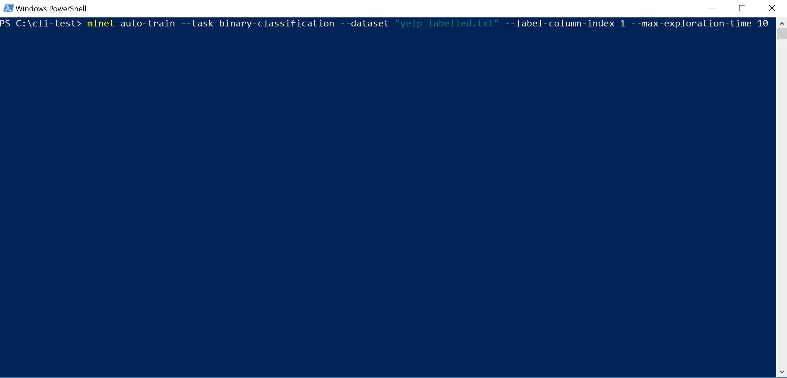
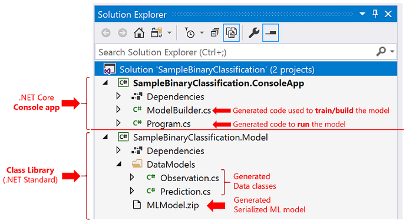
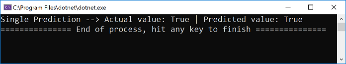
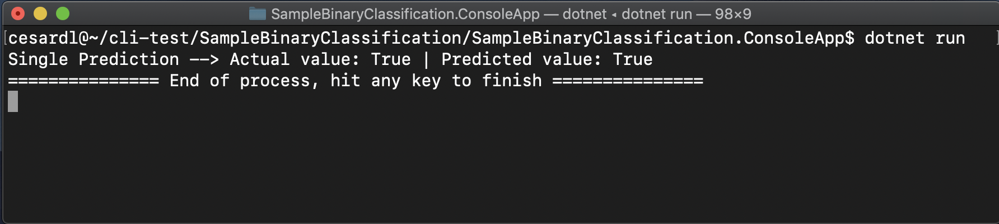

# Analyze sentiment using the ML.NET CLI

Learn how to use ML.NET CLI to automatically generate an ML.NET model and underlying C# code. You provide your dataset and the machine learning task you want to implement, and the CLI uses the AutoML engine to create model generation and deployment source code, as well as the binary model.

In this tutorial, you will do the following steps:
> [!div class="checklist"]
>
> - Prepare your data for the selected machine learning task
> - Run the 'mlnet auto-train' command from the CLI
> - Review the quality metric results
> - Understand the generated C# code to use the model in your application
> - Explore the generated C# code that was used to train the model

> [!NOTE]
> This topic refers to the ML.NET CLI tool, which is currently in Preview, and material may be subject to change. For more information, visit the [ML.NET](https://dotnet.microsoft.com/apps/machinelearning-ai/ml-dotnet) page.

The ML.NET CLI is part of ML.NET and its main goal is to "democratize" ML.NET for .NET developers when learning ML.NET so you don't need to code from scratch to get started.

You can run the ML.NET CLI on any command-prompt (Windows, Mac, or Linux) to generate good quality ML.NET models and source code based on training datasets you provide.

## Pre-requisites

- [.NET Core 2.2 SDK](https://dotnet.microsoft.com/download/dotnet-core/2.2) or later
- (Optional) [Visual Studio 2017 or 2019](https://visualstudio.microsoft.com/vs/)
- [ML.NET CLI](../how-to-guides/install-ml-net-cli.md)

You can either run the generated C# code projects from Visual Studio or with `dotnet run` (.NET Core CLI).

## Prepare your data

We are going to use an existing dataset used for a 'Sentiment Analysis' scenario, which is a binary classification machine learning task. You can use your own dataset in a similar way, and the model and code will be generated for you.

1. Download [The UCI Sentiment Labeled Sentences dataset zip file (see citations in the following note)](https://archive.ics.uci.edu/ml/machine-learning-databases/00331/sentiment%20labelled%20sentences.zip), and unzip it on any folder you choose.

    > [!NOTE]
    > The datasets this tutorial uses a dataset from the 'From Group to Individual Labels using Deep Features', Kotzias et al,. KDD 2015, and hosted at the UCI Machine Learning Repository - Dua, D. and Karra Taniskidou, E. (2017). UCI Machine Learning Repository [http://archive.ics.uci.edu/ml]. Irvine, CA: University of California, School of Information and Computer Science.

2. Copy the `yelp_labelled.txt` file into any folder you previously created (such as `/cli-test`).

3. Open your preferred command prompt and move to the folder where you copied the dataset file. For example:

    ```console
    > cd /cli-test
    ```

    Using any text editor such as Visual Studio Code, you can open, and explore the `yelp_labelled.txt` dataset file. You can see that the structure is:

    - The file has no header. You will use the column's index.

    - There are just two columns:

        | Text (Column index 0) | Label (Column index 1)|
        |--------------------------|-------|
        | Wow... Loved this place. | 1 |
        | Crust is not good. | 0 |
        | Not tasty and the texture was just nasty. | 0 |
        | ...MANY MORE TEXT ROWS... | ...(1 or 0)... |

    Make sure you close the dataset file from the editor.

    Now, you are ready to start using the CLI for this 'Sentiment Analysis' scenario.

    > [!NOTE]
    > After finishing this tutorial you can also try with your own datasets as long as they are ready to be used for any of the ML tasks currently supported by the ML.NET CLI Preview which are *'Binary Classification', 'Multi-class Classification' and 'Regression'*).

## Run the 'mlnet auto-train' command

1. Run the following ML.NET CLI command:

    ```console
    > mlnet auto-train --task binary-classification --dataset "yelp_labelled.txt" --label-column-index 1 --has-header false --max-exploration-time 10
    ```

    This command runs the **`mlnet auto-train` command**:
    - for an **ML task** of type **`binary-classification`**
    - uses the **dataset file `yelp_labelled.txt`** as training and testing dataset (internally the CLI will either use cross-validation or split it in two datasets, one for training and one for testing)
    - where the **objective/target column** you want to predict (commonly called **'label'**) is the **column with index 1** (that is the second column, since the index is zero-based)
    - does **not use a file header** with column names since this particular dataset file doesn't have a header
    - the **targeted exploration time** for the experiment is **10 seconds**

    You will see output from the CLI, similar to:

    <!-- markdownlint-disable MD023 MD025 -->

    # [Windows](#tab/windows)

    

    # [macOS Bash](#tab/macosbash)

    

    In this particular case, in only 10 seconds and with the small dataset provided, the CLI tool was able to run quite a few iterations, meaning training multiple times based on different combinations of algorithms/configuration with different internal data transformations and algorithm's hyper-parameters. 

    Finally, the "best quality" model found in 10 seconds is a model using a particular trainer/algorithm with any specific configuration. Depending on the exploration time, the command can produce a different result. The selection is based on the multiple metrics shown, such as `Accuracy`.

    **Understanding the model's quality metrics**

    The first and easiest metric to evaluate a binary-classification model is the accuracy, which is simple to understand. "Accuracy is the proportion of correct predictions with a test data set.". The closer to 100% (1.00), the better.

    However, there are cases where just measuring with the Accuracy metric is not enough, especially when the label (0 and 1 in this case) is unbalanced in the test dataset.

    For additional metrics and more **detailed information about the metrics** such as Accuracy, AUC, AUCPR, F1-score used to evaluate the different models, you can read [Understanding ML.NET metrics](../resources/metrics.md)

    > [!NOTE]
    > You can try this very same dataset and specify a few minutes for `--max-exploration-time` (for instance three minutes so you specify 180 seconds) which will find a better "best model" for you with a different training pipeline configuration for this dataset (which is pretty small, 1000 rows). 
        
    In order to find a "best/good quality" model that is a "production-ready model" targeting larger datasets, you should make experiments with the CLI usually specifying much more exploration time depending on the size of the dataset. In fact, in many cases you might require multiple hours of exploration time especially if the dataset is large on rows and columns. 

1. The previous command execution has generated the following assets:

    - A serialized model .zip ("best model") ready to use. 
    - C# code to run/score that generated model (To make predictions in your end-user apps with that model).
    - C# training code used to generate that model (Learning purposes).
    - A log file with all the iterations explored having specific detailed information about each algorithm tried with its combination of hyper-parameters and data transformations. 

    The first two assets (.ZIP file model and C# code to run that model) can directly be used in your end-user apps (ASP.NET Core web app, services, desktop app, etc.) to make predictions with that generated ML model.

    The third asset, the training code, shows you what ML.NET API code was used by the CLI to train the generated model, so you can investigate what specific trainer/algorithm and hyper-parameters were selected by the CLI.

Those enumerated assets are explained in the following steps of the tutorial.

## Explore the generated C# code to use for running the model to make predictions

1. In Visual Studio (2017 or 2019) open the solution generated in the folder named `SampleBinaryClassification` within your original destination folder (in the tutorial was named `/cli-test`). You should see a solution similar to:

    > [!NOTE]
    > In the tutorial we suggest to use Visual Studio, but you can also explore the generated C# code (two projects) with any text editor and run the generated console app with the `dotnet CLI` on macOS, Linux or Windows machine.

    

    - The generated **class library** containing the serialized ML model (.zip file) and the data classes (data models) is something you can directly use in your end-user application, even by directly referencing that class library (or moving the code, as you prefer).
    - The generated **console app** contains execution code that you must review and then you usually reuse the 'scoring code' (code that runs the ML model to make predictions) by moving that simple code (just a few lines) to your end-user application where you want to make the predictions. 

1. Open the **ModelInput.cs** and **ModelOutput.cs** class files within the class library project. You will see that these classes are 'data classes' or POCO classes used to hold data. It is 'boilerplate code' but useful to have it generated if your dataset has tens or even hundreds of columns. 
    - The `ModelInput` class is used when reading data from the dataset. 
    - The `ModelOutput` class is used to get the prediction result (prediction data).

1. Open the Program.cs file and explore the code. In just a few lines, you are able to run the model and make a sample prediction.

    ```csharp
    static void Main(string[] args)
    {
        MLContext mlContext = new MLContext();

        // Training code used by ML.NET CLI and AutoML to generate the model
        //ModelBuilder.CreateModel();

        ITransformer mlModel = mlContext.Model.Load(MODEL_FILEPATH, out DataViewSchema inputSchema);
        var predEngine = mlContext.Model.CreatePredictionEngine<ModelInput, ModelOutput>(mlModel);

        // Create sample data to do a single prediction with it 
        ModelInput sampleData = CreateSingleDataSample(mlContext, DATA_FILEPATH);

        // Try a single prediction
        ModelOutput predictionResult = predEngine.Predict(sampleData);

        Console.WriteLine($"Single Prediction --> Actual value: {sampleData.Label} | Predicted value: {predictionResult.Prediction}");
    }
    ```

- The first line of code simply creates an `MLContext` object needed whenever you run ML.NET code. 

- The second line of code is commented because you don't need to train the model since it was already trained for you by the CLI tool and saved into the model's serialized .ZIP file. But if you want to see *"how the model was trained"* by the CLI, you could uncomment that line and run/debug the training code used for that particular ML model.

- In the third line of code, you load the model from the serialized model .ZIP file with the `mlContext.Model.Load()` API by providing the path to that model .ZIP file.

- In the fourth line of code you load create the `PredictionEngine` object with the `mlContext.Model.CreatePredictionEngine<TSrc,TDst>(ITransformer mlModel)` API. You need the `PredictionEngine` object whenever you want to make a prediction targeting a single sample of data (In this case, a single piece of text to predict its sentiment).

- The fifth line of code is where you create that *single sample data* to be used for the prediction by calling the function `CreateSingleDataSample()`. Since the CLI tool doesn't know what kind of sample data to use, within that function it is loading the first row of the dataset. However, for this case you can also create you own 'hard-coded' data instead of the current implementation of the `CreateSingleDataSample()` function by updating this simpler code implementing that function:

    ```csharp
    private static ModelInput CreateSingleDataSample()
    {
        ModelInput sampleForPrediction = new ModelInput() { Col0 = "The ML.NET CLI is great for getting started. Very cool!", Label = true };
        return sampleForPrediction;
    }
    ```

1. Run the project, either using the original sample data loaded from the first row of the dataset or by providing your own custom hard-coded sample data. You should get a prediction comparable to:

    # [Windows](#tab/windows)

    Run the console app from Visual Studio by hitting F5 (Play button):

    )

    # [macOS Bash](#tab/macosbash)

    Run the console app from the command-prompt by typing the following commands:

     ```console
     > cd SampleBinaryClassification
     > cd SampleBinaryClassification.ConsoleApp

     > dotnet run
     ```

    )

    ---

1. Try changing the hard-coded sample data to other sentences with different sentiment and see how the model predicts positive or negative sentiment. 

## Infuse your end-user applications with ML model predictions

You can use similar 'ML model scoring code' to run the model in your end-user application and make predictions. 

For instance, you could directly move that code to any Windows desktop application such as **WPF** and **WinForms** and run the model in the same way than it was done in the console app.

However, the way you implement those lines of code to run an ML model should be optimized (that is, cache the model .zip file and load it once) and have singleton objects instead of creating them on every request, especially if your application needs to be scalable such as a web application or distributed service, as explained in the following section.

### Running ML.NET models in scalable ASP.NET Core web apps and services (multi-threaded apps)

The creation of the model object (`ITransformer` loaded from a model's .zip file) and the `PredictionEngine` object should be optimized especially when running on scalable web apps and distributed services. For the first case, the model object (`ITransformer`) the optimization is straightforward. Since the `ITransformer` object is thread-safe, you can cache the object as a singleton or static object so you load the model once.

For the second object, the `PredictionEngine` object, it is not so easy because the `PredictionEngine` object is not thread-safe, therefore you cannot instantiate this object as singleton or static object in an ASP.NET Core app. This thread-safe and scalability problem is deeply discussed in this [Blog Post](https://devblogs.microsoft.com/cesardelatorre/how-to-optimize-and-run-ml-net-models-on-scalable-asp-net-core-webapis-or-web-apps/). 

However, things got a lot easier for you than what's explained in that blog post. We worked on a simpler approach for you and have created a nice **'.NET Core Integration Package'** that you can  easily use in your ASP.NET Core apps and services by registering it in the application DI services (Dependency Injection services) and then directly use it from your code. Check the following tutorial and example for doing that:

- [Tutorial: Running ML.NET models on scalable ASP.NET Core web apps and WebAPIs](https://aka.ms/mlnet-tutorial-netcoreintegrationpkg)
- [Sample: Scalable ML.NET model on ASP.NET Core WebAPI](https://aka.ms/mlnet-sample-netcoreintegrationpkg)

## Explore the generated C# code that was used to train the "best quality" model 

For more advanced learning purposes, you can also explore the generated C# code that was used by the CLI tool to train the generated model.

That 'training model code' is currently generated in the custom class generated named `ModelBuilder` so you can investigate that training code.

More importantly, for this particular scenario (Sentiment Analysis model) you can also compare that generated training code with the code explained in the following tutorial:

- Compare: [Tutorial: Use ML.NET in a sentiment analysis binary classification scenario](sentiment-analysis.md).

It is interesting to compare the chosen algorithm and pipeline configuration in the tutorial with the code generated by the CLI tool. Depending on how much time you spend iterating and searching for better models, the chosen algorithm might be different along with its particular hyper-parameters and pipeline configuration.

## See also

- [Automate model training with the ML.NET CLI](../automate-training-with-cli.md)
- [Tutorial: Running ML.NET models on scalable ASP.NET Core web apps and WebAPIs](https://aka.ms/mlnet-tutorial-netcoreintegrationpkg)
- [Sample: Scalable ML.NET model on ASP.NET Core WebAPI](https://aka.ms/mlnet-sample-netcoreintegrationpkg)
- [ML.NET CLI auto-train command reference guide](../reference/ml-net-cli-reference.md) 
- [How to install the ML.NET Command-Line Interface (CLI) tool](../how-to-guides/install-ml-net-cli.md)
- [Telemetry in ML.NET CLI](../resources/ml-net-cli-telemetry.md)

## Next steps

In this tutorial, you learned how to:
> [!div class="checklist"]
>
> - Prepare your data for the selected ML task (problem to solve)
> - Run the 'mlnet auto-train' command in the CLI tool
> - Review the quality metric results
> - Understand the generated C# code to run the model (Code to use in your end-user app)
> - Explore the generated C# code that was used to train the "best quality" model (Learning purposes)

> [!div class="nextstepaction"]
> [Automate model training with the ML.NET CLI](../automate-training-with-cli.md)
