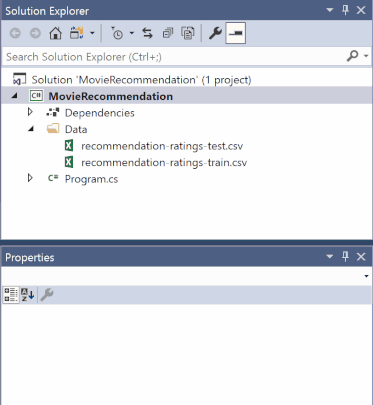
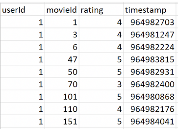

# Tutorial: Build a movie recommender using matrix factorization with ML.NET

This tutorial shows you how to build a movie recommender with ML.NET in a .NET Core console application. The steps use C# and Visual Studio 2019.

In this tutorial, you learn how to:
> [!div class="checklist"]
>
> * Select a machine learning algorithm
> * Prepare and load your data
> * Build and train a model
> * Evaluate a model
> * Deploy and consume a model

You can find the source code for this tutorial at the [dotnet/samples](https://github.com/dotnet/samples/tree/main/machine-learning/tutorials/MovieRecommendation) repository.

## Machine learning workflow

You will use the following steps to accomplish your task, as well as any other ML.NET task:

1. [Load your data](#load-your-data)
2. [Build and train your model](#build-and-train-your-model)
3. [Evaluate your model](#evaluate-your-model)
4. [Use your model](#use-your-model)

## Prerequisites

- [Visual Studio 2022](https://visualstudio.microsoft.com/downloads/).

## Select the appropriate machine learning task

There are several ways to approach recommendation problems, such as recommending a list of movies or recommending a list of related products, but in this case you will predict what rating (1-5) a user will give to a particular movie and recommend that movie if it's higher than a defined threshold (the higher the rating, the higher the likelihood of a user liking a particular movie).

## Create a console application

### Create a project

1. Create a C# **Console Application** called "MovieRecommender". Click the **Next** button.

2. Choose .NET 6 as the framework to use. Click the **Create** button.

3. Create a directory named *Data* in your project to store the data set:

    In **Solution Explorer**, right-click the project and select **Add** > **New Folder**. Type "Data" and hit Enter.

4. Install the **Microsoft.ML** and **Microsoft.ML.Recommender** NuGet Packages:

    [!INCLUDE [mlnet-current-nuget-version](../../../includes/mlnet-current-nuget-version.md)]

    In **Solution Explorer**, right-click the project and select **Manage NuGet Packages**. Choose "nuget.org" as the Package source, select the **Browse** tab, search for **Microsoft.ML**, select the package in the list, and select the **Install** button. Select the **OK** button on the **Preview Changes** dialog and then select the **I Accept** button on the **License Acceptance** dialog if you agree with the license terms for the packages listed. Repeat these steps for **Microsoft.ML.Recommender**.

5. Add the following `using` statements at the top of your *Program.cs* file:

    [!code-csharp[UsingStatements](./snippets/movie-recommendation/csharp/Program.cs#UsingStatements "Add necessary usings")]

### Download your data

1. Download the two datasets and save them to the *Data* folder you previously created:

   * Right click on [*recommendation-ratings-train.csv*](https://raw.githubusercontent.com/dotnet/machinelearning-samples/main/samples/csharp/getting-started/MatrixFactorization_MovieRecommendation/Data/recommendation-ratings-train.csv) and select "Save Link (or Target) As..."
   * Right click on [*recommendation-ratings-test.csv*](https://raw.githubusercontent.com/dotnet/machinelearning-samples/main/samples/csharp/getting-started/MatrixFactorization_MovieRecommendation/Data/recommendation-ratings-test.csv) and select "Save Link (or Target) As..."

     Make sure you either save the \*.csv files to the *Data* folder, or after you save it elsewhere, move the \*.csv files to the *Data* folder.

2. In Solution Explorer, right-click each of the \*.csv files and select **Properties**. Under **Advanced**, change the value of **Copy to Output Directory** to **Copy if newer**.

   

## Load your data

The first step in the ML.NET process is to prepare and load your model training and testing data.

The recommendation ratings data is split into `Train` and `Test` datasets. The `Train` data is used to fit your model. The `Test` data is used to make predictions with your trained model and evaluate model performance. It's common to have an 80/20 split with `Train` and `Test` data.

Below is a preview of the data from your \*.csv files:



In the \*.csv files, there are four columns:

* `userId`
* `movieId`
* `rating`
* `timestamp`

In machine learning, the columns that are used to make a prediction are called [Features](../resources/glossary.md#feature), and the column with the returned prediction is called the [Label](../resources/glossary.md#label).

You want to predict movie ratings, so the rating column is the `Label`. The other three columns, `userId`, `movieId`, and `timestamp` are all `Features` used to predict the `Label`.

| Features      | Label         |
| ------------- |:-------------:|
| `userId`        |    `rating`     |
| `movieId`      |               |
| `timestamp`     |               |

It's up to you to decide which `Features` are used to predict the `Label`. You can also use methods like [permutation feature importance](../how-to-guides/explain-machine-learning-model-permutation-feature-importance-ml-net.md) to help with selecting the best `Features`.

In this case, you should eliminate the `timestamp` column as a `Feature` because the timestamp does not really affect how a user rates a given movie and thus would not contribute to making a more accurate prediction:

| Features      | Label         |
| ------------- |:-------------:|
| `userId`        |    `rating`     |
| `movieId`      |               |

Next you must define your data structure for the input class.

Add a new class to your project:

1. In **Solution Explorer**, right-click the project, and then select **Add > New Item**.

2. In the **Add New Item dialog box**, select **Class** and change the **Name** field to *MovieRatingData.cs*. Then, select the **Add** button.

The *MovieRatingData.cs* file opens in the code editor. Add the following `using` statement to the top of *MovieRatingData.cs*:

```csharp
using Microsoft.ML.Data;
```

Create a class called `MovieRating` by removing the existing class definition and adding the following code in *MovieRatingData.cs*:

[!code-csharp[MovieRatingClass](./snippets/movie-recommendation/csharp/MovieRatingData.cs#MovieRatingClass "Add the Movie Rating class")]

`MovieRating` specifies an input data class. The [LoadColumn](xref:Microsoft.ML.Data.LoadColumnAttribute.%23ctor%28System.Int32%29) attribute specifies which columns (by column index) in the dataset should be loaded. The `userId` and `movieId` columns are your `Features` (the inputs you will give the model to predict the `Label`), and the rating column is the `Label` that you will predict (the output of the model).

Create another class, `MovieRatingPrediction`, to represent predicted results by adding the following code after the `MovieRating` class in *MovieRatingData.cs*:

[!code-csharp[PredictionClass](./snippets/movie-recommendation/csharp/MovieRatingData.cs#PredictionClass "Add the Movie Prediction Class")]

In *Program.cs*, replace the `Console.WriteLine("Hello World!")` with the following code:

[!code-csharp[MLContext](./snippets/movie-recommendation/csharp/Program.cs#MLContext "Add MLContext")]

The [MLContext class](xref:Microsoft.ML.MLContext) is a starting point for all ML.NET operations, and initializing `mlContext` creates a new ML.NET environment that can be shared across the model creation workflow objects. It's similar, conceptually, to `DBContext` in Entity Framework.

At the bottom of the file, create a method called `LoadData()`:

```csharp
(IDataView training, IDataView test) LoadData(MLContext mlContext)
{

}
```

> [!NOTE]
> This method will give you an error until you add a return statement in the following steps.

Initialize your data path variables, load the data from the \*.csv files, and return the `Train` and `Test` data as `IDataView` objects by adding the following as the next line of code in `LoadData()`:

[!code-csharp[LoadData](./snippets/movie-recommendation/csharp/Program.cs#LoadData "Load data from data paths")]

Data in ML.NET is represented as an [IDataView interface](xref:Microsoft.ML.IDataView). `IDataView` is a flexible, efficient way of describing tabular data (numeric and text). Data can be loaded from a text file or in real time (for example, SQL database or log files) to an `IDataView` object.

The [LoadFromTextFile()](xref:Microsoft.ML.TextLoaderSaverCatalog.LoadFromTextFile%60%601%28Microsoft.ML.DataOperationsCatalog,System.String,System.Char,System.Boolean,System.Boolean,System.Boolean,System.Boolean%29) defines the data schema and reads in the file. It takes in the data path variables and returns an `IDataView`. In this case, you provide the path for your `Test` and `Train` files and indicate both the text file header (so it can use the column names properly) and the comma character data separator (the default separator is a tab).

Add the following code to call your `LoadData()` method and return the `Train` and `Test` data:

[!code-csharp[LoadDataMain](./snippets/movie-recommendation/csharp/Program.cs#LoadDataMain "Add LoadData method")]

## Build and train your model

Create the `BuildAndTrainModel()` method, just after the `LoadData()` method, using the following code:

```csharp
ITransformer BuildAndTrainModel(MLContext mlContext, IDataView trainingDataView)
{

}
```

> [!NOTE]
> This method will give you an error until you add a return statement in the following steps.

Define the data transformations by adding the following code to `BuildAndTrainModel()`:

[!code-csharp[DataTransformations](./snippets/movie-recommendation/csharp/Program.cs#DataTransformations "Define data transformations")]

Since `userId` and `movieId` represent users and movie titles, not real values, you use the [MapValueToKey()](xref:Microsoft.ML.ConversionsExtensionsCatalog.MapValueToKey%2A) method to transform each `userId` and each `movieId` into a numeric key type `Feature` column (a format accepted by recommendation algorithms) and add them as new dataset columns:

| userId | movieId | Label | userIdEncoded | movieIdEncoded |
| ------------- |:-------------:| -----:|-----:|-----:|
| 1 | 1 | 4 | userKey1 | movieKey1 |
| 1 | 3 | 4 | userKey1 | movieKey2 |
| 1 | 6 | 4 | userKey1 | movieKey3 |

Choose the machine learning algorithm and append it to the data transformation definitions by adding the following as the next line of code in `BuildAndTrainModel()`:

[!code-csharp[AddAlgorithm](./snippets/movie-recommendation/csharp/Program.cs#AddAlgorithm "Add the training algorithm with options")]

The [MatrixFactorizationTrainer](xref:Microsoft.ML.RecommendationCatalog.RecommendationTrainers.MatrixFactorization%28Microsoft.ML.Trainers.MatrixFactorizationTrainer.Options%29) is your recommendation training algorithm.  [Matrix Factorization](https://en.wikipedia.org/wiki/Matrix_factorization_(recommender_systems)) is a common approach to recommendation when you have data on how users have rated products in the past, which is the case for the datasets in this tutorial. There are other recommendation algorithms for when you have different data available (see the [Other recommendation algorithms](#other-recommendation-algorithms) section below to learn more).

In this case, the `Matrix Factorization` algorithm uses a method called "collaborative filtering", which assumes that if User 1 has the same opinion as User 2 on a certain issue, then User 1 is more likely to feel the same way as User 2 about a different issue.

For instance, if User 1 and User 2 rate movies similarly, then User 2 is more likely to enjoy a movie that User 1 has watched and rated highly:

| | `Incredibles 2 (2018)` | `The Avengers (2012)` | `Guardians of the Galaxy (2014)` |
| -------------:|-------------:| -----:|-----:|
| **User 1** | Watched and liked movie | Watched and liked movie | Watched and liked movie |
| **User 2** | Watched and liked movie | Watched and liked movie | Has not watched -- RECOMMEND movie |

The `Matrix Factorization` trainer has several [Options](xref:Microsoft.ML.Trainers.MatrixFactorizationTrainer.Options), which you can read more about in the [Algorithm hyperparameters](#algorithm-hyperparameters) section below.

Fit the model to the `Train` data and return the trained model by adding the following as the next line of code in the `BuildAndTrainModel()` method:

[!code-csharp[FitModel](./snippets/movie-recommendation/csharp/Program.cs#FitModel "Call the Fit method and return back the trained model")]

The [Fit()](xref:Microsoft.ML.Trainers.MatrixFactorizationTrainer.Fit%28Microsoft.ML.IDataView,Microsoft.ML.IDataView%29) method trains your model with the provided training dataset. Technically, it executes the `Estimator` definitions by transforming the data and applying the training, and it returns back the trained model, which is a `Transformer`.

For more information on the model training workflow in ML.NET, see [What is ML.NET and how does it work?](../how-does-mldotnet-work.md#code-workflow).

Add the following as the next line of code below the call to the `LoadData()` method to call your `BuildAndTrainModel()` method and return the trained model:

[!code-csharp[BuildTrainModelMain](./snippets/movie-recommendation/csharp/Program.cs#BuildTrainModelMain "Add BuildAndTrainModel method")]

## Evaluate your model

Once you have trained your model, use your test data to evaluate how your model is performing.

Create the `EvaluateModel()` method, just after the `BuildAndTrainModel()` method, using the following code:

```csharp
void EvaluateModel(MLContext mlContext, IDataView testDataView, ITransformer model)
{

}
```

Transform the `Test` data by adding the following code to `EvaluateModel()`:

[!code-csharp[Transform](./snippets/movie-recommendation/csharp/Program.cs#Transform "Transform the test data")]

The [Transform()](xref:Microsoft.ML.ITransformer.Transform%2A) method makes predictions for multiple provided input rows of a test dataset.

Evaluate the model by adding the following as the next line of code in the `EvaluateModel()` method:

[!code-csharp[Evaluate](./snippets/movie-recommendation/csharp/Program.cs#Evaluate "Evaluate the model using predictions from the test data")]

Once you have the prediction set, the [Evaluate()](xref:Microsoft.ML.RecommendationCatalog.Evaluate%2A) method assesses the model, which compares the predicted values with the actual `Labels` in the test dataset and returns metrics on how the model is performing.

Print your evaluation metrics to the console by adding the following as the next line of code in the `EvaluateModel()` method:

[!code-csharp[PrintMetrics](./snippets/movie-recommendation/csharp/Program.cs#PrintMetrics "Print the evaluation metrics")]

Add the following as the next line of code below the call to the `BuildAndTrainModel()` method to call your `EvaluateModel()` method:

[!code-csharp[EvaluateModelMain](./snippets/movie-recommendation/csharp/Program.cs#EvaluateModelMain "Add EvaluateModel method")]

The output so far should look similar to the following text:

```console
=============== Training the model ===============
iter      tr_rmse          obj
   0       1.5403   3.1262e+05
   1       0.9221   1.6030e+05
   2       0.8687   1.5046e+05
   3       0.8416   1.4584e+05
   4       0.8142   1.4209e+05
   5       0.7849   1.3907e+05
   6       0.7544   1.3594e+05
   7       0.7266   1.3361e+05
   8       0.6987   1.3110e+05
   9       0.6751   1.2948e+05
  10       0.6530   1.2766e+05
  11       0.6350   1.2644e+05
  12       0.6197   1.2541e+05
  13       0.6067   1.2470e+05
  14       0.5953   1.2382e+05
  15       0.5871   1.2342e+05
  16       0.5781   1.2279e+05
  17       0.5713   1.2240e+05
  18       0.5660   1.2230e+05
  19       0.5592   1.2179e+05
=============== Evaluating the model ===============
Rms: 0.994051469730769
RSquared: 0.412556298844873
```

In this output, there are 20 iterations. In each iteration, the measure of error decreases and converges closer and closer to 0.

The `root of mean squared error` (RMS or RMSE) is used to measure the differences between the model predicted values and the test dataset observed values. Technically it's the square root of the average of the squares of the errors. The lower it is, the better the model is.

`R Squared` indicates how well data fits a model. Ranges from 0 to 1. A value of 0 means that the data is random or otherwise can't be fit to the model. A value of 1 means that the model exactly matches the data. You want your `R Squared` score to be as close to 1 as possible.

Building successful models is an iterative process. This model has initial lower quality as the tutorial uses small datasets to provide quick model training. If you aren't satisfied with the model quality, you can try to improve it by providing larger training datasets or by choosing different training algorithms with different hyper-parameters for each algorithm. For more information, check out the [Improve your model](#improve-your-model) section below.

## Use your model

Now you can use your trained model to make predictions on new data.

Create the `UseModelForSinglePrediction()` method, just after the `EvaluateModel()` method, using the following code:

```csharp
void UseModelForSinglePrediction(MLContext mlContext, ITransformer model)
{

}
```

Use the `PredictionEngine` to predict the rating by adding the following code to `UseModelForSinglePrediction()`:

[!code-csharp[PredictionEngine](./snippets/movie-recommendation/csharp/Program.cs#PredictionEngine "Create Prediction Engine")]

The [PredictionEngine](xref:Microsoft.ML.PredictionEngine%602) is a convenience API, which allows you to perform a prediction on a single instance of data. [`PredictionEngine`](xref:Microsoft.ML.PredictionEngine%602) is not thread-safe. It's acceptable to use in single-threaded or prototype environments. For improved performance and thread safety in production environments, use the `PredictionEnginePool` service, which creates an [`ObjectPool`](xref:Microsoft.Extensions.ObjectPool.ObjectPool%601) of [`PredictionEngine`](xref:Microsoft.ML.PredictionEngine%602) objects for use throughout your application. See this guide on how to [use `PredictionEnginePool` in an ASP.NET Core Web API](../how-to-guides/serve-model-web-api-ml-net.md#register-predictionenginepool-for-use-in-the-application).

> [!NOTE]
> `PredictionEnginePool` service extension is currently in preview.

Create an instance of `MovieRating` called `testInput` and pass it to the Prediction Engine by adding the following as the next lines of code in the `UseModelForSinglePrediction()` method:

[!code-csharp[MakeSinglePrediction](./snippets/movie-recommendation/csharp/Program.cs#MakeSinglePrediction "Make a single prediction with the Prediction Engine")]

The [Predict()](xref:Microsoft.ML.PredictionEngine%602.Predict%2A) function makes a prediction on a single column of data.

You can then use the `Score`, or the predicted rating, to determine whether you want to recommend the movie with movieId 10 to user 6. The higher the `Score`, the higher the likelihood of a user liking a particular movie. In this case, let’s say that you recommend movies with a predicted rating of > 3.5.

To print the results, add the following as the next lines of code in the `UseModelForSinglePrediction()` method:

[!code-csharp[PrintResults](./snippets/movie-recommendation/csharp/Program.cs#PrintResults "Print the recommendation prediction results")]

Add the following as the next line of code after the call to the `EvaluateModel()` method to call your `UseModelForSinglePrediction()` method:

[!code-csharp[UseModelMain](./snippets/movie-recommendation/csharp/Program.cs#UseModelMain "Add UseModelForSinglePrediction method")]

The output of this method should look similar to the following text:

```console
=============== Making a prediction ===============
Movie 10 is recommended for user 6
```

### Save your model

To use your model to make predictions in end-user applications, you must first save the model.

Create the `SaveModel()` method, just after the `UseModelForSinglePrediction()` method, using the following code:

```csharp
void SaveModel(MLContext mlContext, DataViewSchema trainingDataViewSchema, ITransformer model)
{

}
```

Save your trained model by adding the following code in the `SaveModel()` method:

[!code-csharp[SaveModel](./snippets/movie-recommendation/csharp/Program.cs#SaveModel "Save the model to a zip file")]

This method saves your trained model to a .zip file (in the "Data" folder), which can then be used in other .NET applications to make predictions.

Add the following as the next line of code after the call to the `UseModelForSinglePrediction()` method to call your `SaveModel()` method:

[!code-csharp[SaveModelMain](./snippets/movie-recommendation/csharp/Program.cs#SaveModelMain "Create SaveModel method")]

### Use your saved model

Once you have saved your trained model, you can consume the model in different environments. See [Save and load trained models](../how-to-guides/save-load-machine-learning-models-ml-net.md) to learn how to operationalize a trained machine learning model in apps.

## Results

After following the steps above, run your console app (Ctrl + F5). Your results from the single prediction above should be similar to the following. You may see warnings or processing messages, but these messages have been removed from the following results for clarity.

```console
=============== Training the model ===============
iter      tr_rmse          obj
   0       1.5382   3.1213e+05
   1       0.9223   1.6051e+05
   2       0.8691   1.5050e+05
   3       0.8413   1.4576e+05
   4       0.8145   1.4208e+05
   5       0.7848   1.3895e+05
   6       0.7552   1.3613e+05
   7       0.7259   1.3357e+05
   8       0.6987   1.3121e+05
   9       0.6747   1.2949e+05
  10       0.6533   1.2766e+05
  11       0.6353   1.2636e+05
  12       0.6209   1.2561e+05
  13       0.6072   1.2462e+05
  14       0.5965   1.2394e+05
  15       0.5868   1.2352e+05
  16       0.5782   1.2279e+05
  17       0.5713   1.2227e+05
  18       0.5637   1.2190e+05
  19       0.5604   1.2178e+05
=============== Evaluating the model ===============
Rms: 0.977175077487166
RSquared: 0.43233349213192
=============== Making a prediction ===============
Movie 10 is recommended for user 6
=============== Saving the model to a file ===============
```

Congratulations! You've now successfully built a machine learning model for recommending movies. You can find the source code for this tutorial at the [dotnet/samples](https://github.com/dotnet/samples/tree/main/machine-learning/tutorials/MovieRecommendation) repository.

## Improve your model

There are several ways that you can improve the performance of your model so that you can get more accurate predictions.

### Data

Adding more training data that has enough samples for each user and movie id can help improve the quality of the recommendation model.

[Cross validation](../how-to-guides/train-machine-learning-model-cross-validation-ml-net.md) is a technique for evaluating models that randomly splits up data into subsets (instead of extracting out test data from the dataset like you did in this tutorial) and takes some of the groups as train data and some of the groups as test data. This method outperforms making a train-test split in terms of model quality.

### Features

In this tutorial, you only use the three `Features` (`user id`, `movie id`, and `rating`) that are provided by the dataset.

While this is a good start, in reality you might want to add other attributes or `Features` (for example, age, gender, geo-location, etc.) if they are included in the dataset. Adding more relevant `Features` can help improve the performance of your recommendation model.

If you are unsure about which `Features` might be the most relevant for your machine learning task, you can also make use of Feature Contribution Calculation (FCC) and [permutation feature importance](../how-to-guides/explain-machine-learning-model-permutation-feature-importance-ml-net.md), which ML.NET provides to discover the most influential `Features`.

### Algorithm hyperparameters

While ML.NET provides good default training algorithms, you can further fine-tune performance by changing the algorithm's [hyperparameters](../resources/glossary.md#hyperparameter).

For `Matrix Factorization`, you can experiment with hyperparameters such as [NumberOfIterations](xref:Microsoft.ML.Trainers.MatrixFactorizationTrainer.Options.NumberOfIterations) and [ApproximationRank](xref:Microsoft.ML.Trainers.MatrixFactorizationTrainer.Options.ApproximationRank) to see if that gives you better results.

For instance, in this tutorial the algorithm options are:

```csharp
var options = new MatrixFactorizationTrainer.Options
{
    MatrixColumnIndexColumnName = "userIdEncoded",
    MatrixRowIndexColumnName = "movieIdEncoded",
    LabelColumnName = "Label",
    NumberOfIterations = 20,
    ApproximationRank = 100
};
```

### Other Recommendation Algorithms

The matrix factorization algorithm with collaborative filtering is only one approach for performing movie recommendations. In many cases, you may not have the ratings data available and only have movie history available from users. In other cases, you may have more than just the user’s rating data.

| Algorithm       | Scenario           | Sample  |
| ------------- |:-------------:| -----:|
| One Class Matrix Factorization | Use this when you only have userId and movieId. This style of recommendation is based upon the co-purchase scenario, or products frequently bought together, which means it will recommend to customers a set of products based upon their own purchase order history. | [>Try it out](https://github.com/dotnet/machinelearning-samples/tree/main/samples/csharp/getting-started/MatrixFactorization_ProductRecommendation) |
| Field Aware Factorization Machines | Use this to make recommendations when you have more Features beyond userId, productId, and rating (such as product description or product price). This method also uses a collaborative filtering approach. | [>Try it out](https://github.com/dotnet/machinelearning-samples/tree/main/samples/csharp/end-to-end-apps/Recommendation-MovieRecommender) |

### New user scenario

One common problem in collaborative filtering is the cold start problem, which is when you have a new user with no previous data to draw inferences from. This problem is often solved by asking new users to create a profile and, for instance, rate movies they have seen in the past. While this method puts some burden on the user, it provides some starting data for new users with no rating history.

## Resources

The data used in this tutorial is derived from [MovieLens Dataset](http://files.grouplens.org/datasets/movielens/).

## Next steps

In this tutorial, you learned how to:

> [!div class="checklist"]
>
> * Select a machine learning algorithm
> * Prepare and load your data
> * Build and train a model
> * Evaluate a model
> * Deploy and consume a model

Advance to the next tutorial to learn more
> [!div class="nextstepaction"]
> [Sentiment Analysis](sentiment-analysis.md)
