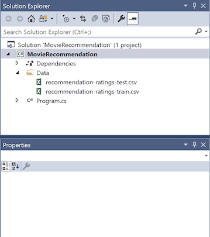
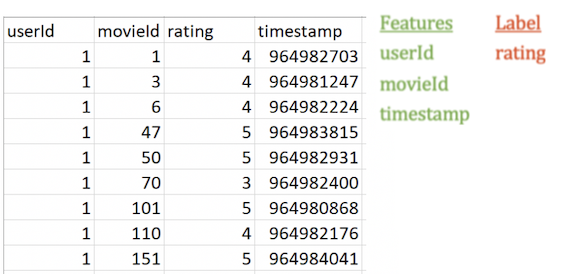
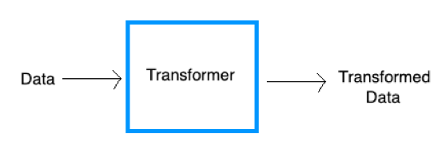
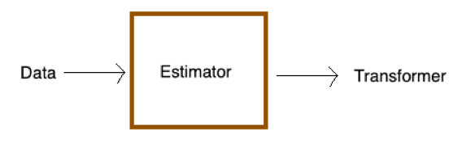

# Tutorial: Create a Movie Recommender with ML.NET

This sample tutorial illustrates using ML.NET to build a movie recommender via a .NET Core console application using C# in Visual Studio 2017.

In this tutorial, you learn how to:
> [!div class="checklist"]
> * Select a machine learning algorithm
> * Prepare and load your data
> * Build and train a model
> * Evaluate a model
> * Deploy and consume a model

> [!NOTE]
> This topic refers to ML.NET, which is currently in Preview, and material may be subject to change. For more information, visit [the ML.NET introduction](https://www.microsoft.com/net/learn/apps/machine-learning-and-ai/ml-dotnet).

This tutorial and related sample are currently using **ML.NET version 0.11**. For more information, see the release notes at the [dotnet/machinelearning GitHub repo](https://github.com/dotnet/machinelearning/tree/master/docs/release-notes).

You can find the source code for this tutorial at the [dotnet/samples](https://github.com/dotnet/samples/tree/master/machine-learning/tutorials/MovieRecommendation) repository.

## Machine learning workflow
You will use the following steps to accomplish your task, as well as any other ML.NET task:

1. [Load your data](#load-your-data)
2. [Build and train your model](#build-and-train-your-model)
3. [Evaluate your model](#evaluate-your-model)
4. [Use your model](#use-your-model)

## Prerequisites

* [Visual Studio 2017 15.6 or later](https://visualstudio.microsoft.com/downloads/?utm_medium=microsoft&utm_source=docs.microsoft.com&utm_campaign=button+cta&utm_content=download+vs2017) with the ".NET Core cross-platform development" workload installed.

* Download the following datasets from [MovieLens Dataset](http://files.grouplens.org/datasets/movielens/ml-latest-small.zip).

   * The [movie recommendation ratings train comma separated file (recommendation-ratings-train.csv)](https://github.com/dotnet/machinelearning-samples/blob/master/samples/csharp/getting-started/MatrixFactorization_MovieRecommendation/Data/recommendation-ratings-train.csv)
   * The [movie recommendation ratings test comma separated file (recommendation-ratings-test.csv)](https://github.com/dotnet/machinelearning-samples/blob/master/samples/csharp/getting-started/MatrixFactorization_MovieRecommendation/Data/recommendation-ratings-test.csv).

     (See more detailed instructions on how to do this [below](#download-your-data)).

## Select the appropriate machine learning task

There are several ways to approach recommendation problems, such as recommending a list of movies or recommending a list of related products, but in this case you will predict what rating (1-5) a user will give to a particular movie and recommend that movie if it is higher than a defined threshold (the higher the rating, the higher the likelihood of a user liking a particular movie).

## Create a console application

### Create a project

1. Open Visual Studio 2017. Select **File** > **New** > **Project** from the menu bar. In the **New Project** dialog, select the **Visual C#** node followed by the **.NET Core** node. Then select the **Console App (.NET Core)** project template. In the **Name** text box, type "MovieRecommender" and then select the **OK** button.

2. Create a directory named *Data* in your project to store the data set:

    In **Solution Explorer**, right-click the project and select **Add** > **New Folder**. Type "Data" and hit Enter.

3. Install the **Microsoft.ML** and **Microsoft.ML.Recommender** NuGet Packages:

    In **Solution Explorer**, right-click the project and select **Manage NuGet Packages**. Choose "nuget.org" as the Package source, select the **Browse** tab, search for **Microsoft.ML**, select that package in the list, and select the **Install** button. Select the **OK** button on the **Preview Changes** dialog and then select the **I Accept** button on the **License Acceptance** dialog if you agree with the license terms for the packages listed. Repeat these steps for **Microsoft.ML.Recommender**.

  > [!NOTE]
  > This tutorial uses **Microsoft.ML v0.11.0** and **Microsoft.ML.Recommender v0.11.0**.
    
4. Add the following `using` statements at the top of your *Program.cs* file:
    
[!code-csharp[UsingStatements](../../../samples/machine-learning/tutorials/MovieRecommendation/Program.cs#UsingStatements "Add necessary usings")]

### Download your data

1. Download the two datasets and save them to the *Data* folder you previously created:

*   Right click on [*recommendation-ratings-train.csv*](https://raw.githubusercontent.com/dotnet/machinelearning-samples/master/samples/csharp/getting-started/MatrixFactorization_MovieRecommendation/Data/recommendation-ratings-train.csv) and select "Save Link (or Target) As..."
*   Right click on [*recommendation-ratings-test.csv*](https://github.com/dotnet/machinelearning-samples/blob/master/samples/csharp/getting-started/MatrixFactorization_MovieRecommendation/Data/recommendation-ratings-test.csv) and select "Save Link (or Target) As..."

     Make sure you either save the \*.csv files to the *Data* folder, or after you save it elsewhere, move the \*.csv files to the *Data* folder.

2. In Solution Explorer, right-click each of the \*.csv files and select **Properties**. Under **Advanced**, change the value of **Copy to Output Directory** to **Copy if newer**.

   

## Load your data

The first step in the ML.NET process is to prepare and load your model training and testing data.

The recommendation ratings data is split into `Train` and `Test` datasets. You will use your `Train` data to fit your model, and then you will use your `Test` data to make predictions with your trained model and evaluate how your model is performing. It is common to have an 80/20 split with `Train` and `Test` data.

In *recommendation-ratings-train.csv*, there are four columns:

* `userId`
* `movieId`
* `rating`
* `timestamp`

In machine learning, the columns that are used to make a prediction are called [Features](../resources/glossary.md#feature), and the column with the returned prediction is called the [Label](../resources/glossary.md#label).

You want to predict movie ratings, so the rating column is the `Label`. The other three columns, `userId`, `movieId`, and `timestamp` are all `Features` used to predict the `Label`.

Below is a preview of your `Train` dataset and the split of columns into `Features` and `Label`:


It is up to you to decide which `Features` you think can best be used to predict the `Label`. You can also use methods like [Feature Permutation Importance](../how-to-guides/determine-global-feature-importance-in-model.md) to help with selecting the best `Features`. In this case, you should eliminate the `timestamp` column as a `Feature` because the timestamp does not really affect how a user rates a given movie and thus would not contribute to making a more accurate prediction.

Next you must define your data structure for the input class.

Add a new class to your project:

1. In **Solution Explorer**, right-click the project, and then select **Add > New Item**.

2. In the **Add New Item dialog box**, select **Class** and change the **Name** field to *MovieRatingData.cs*. Then, select the **Add** button.

The *MovieRatingData.cs* file opens in the code editor. Add the following `using` statement to the top of *MovieRatingData.cs*:

```csharp
using Microsoft.ML.Data;
```

Remove the existing class definition and add the following code:

[!code-csharp[MovieRatingClass](../../../samples/machine-learning/tutorials/MovieRecommendation/Program.cs#MovieRatingClass "Add Movie Rating class")]

`MovieRating` specifies an input data class. The [LoadColumn attribute](xref:Microsoft.ML.Data.LoadColumnAttribute.%23ctor%28System.Int32%29) specifies which columns (by column index) in the dataset should be loaded. The `userId` and `movieId` columns are your `Features` (the inputs you will give the model to predict the `Label`), and the rating column is the `Label` that you will predict (the output of the model).

Add the following class in *MovieRatingData.cs* to represent predicted results:

[!code-csharp[PredictionClass](../../../samples/machine-learning/tutorials/MovieRecommendation/Program.cs#PredictionClass "Add the Movie Prediction Class")]

In *Program.cs*, add the following code inside `Main()`:

[!code-csharp[MLContext](../../../samples/machine-learning/tutorials/MovieRecommendation/Program.cs#MLContext "Add MLContext")]

The [MLContext class](xref:Microsoft.ML.MLContext) is a starting point for all ML.NET operations, and initializing `mlContext` creates a new ML.NET environment that can be shared across the model creation workflow objects. It is similar, conceptually, to `DBContext` in Entity Framework.

Outside of `Main()`, create and define a method called `LoadData()`:

[!code-csharp[LoadData](../../../samples/machine-learning/tutorials/MovieRecommendation/Program.cs#LoadData "Load data from data paths")]

Data in ML.NET is represented as an [IDataView class](xref:Microsoft.Data.DataView.IDataView). `IDataView` is a flexible, efficient way of describing tabular data (numeric and text). Data can be loaded from a text file or in real time (e.g. SQL database or log files) to an `IDataView` object.

You use [LoadFromTextFile() method](xref:Microsoft.ML.TextLoaderSaverCatalog.LoadFromTextFile%60%601%28Microsoft.ML.DataOperationsCatalog,System.String,System.Char,System.Boolean,System.Boolean,System.Boolean,System.Boolean%29) to define the data schema. It takes in the data path variables and returns an `IDataView`. In this case, you provide the path for your `Test` and `Train` files and indicate both the text file header (so it can use the column names properly) and the comma character data separator (the default separator is a tab).

Add the following as the next line of code in the `Main()` method to call your `LoadData()` method and return the `Train` and `Test` data:

[!code-csharp[LoadDataMain](../../../samples/machine-learning/tutorials/MovieRecommendation/Program.cs#LoadDataMain "Add LoadData method to Main")]


## Build and train your model

There are three major concepts in ML.NET: [Data](../basic-concepts-model-training-in-mldotnet.md#data), [Transformers](../basic-concepts-model-training-in-mldotnet.md#transformer), and [Estimators](../basic-concepts-model-training-in-mldotnet.md#estimator).

Machine learning training algorithms require data in a certain format. `Transformers` are used to transform tabular data to a compatible format.



You create `Transformers` in ML.NET by creating `Estimators`. `Estimators` take in data and return `Transformers`.



The recommendation training algorithm you will use for training your model is an an example of an `Estimator`.

Build an `Estimator` with the following steps:

1. Outside of `Main()`, create and define a method called `BuildAndTrainModel()`:

2. Add the following as the next line of code in the `Main()` method to call your `BuildAndTrainModel()` method and return the trained model:
   
   [!code-csharp[BuildTrainModelMain](../../../samples/machine-learning/tutorials/MovieRecommendation/Program.cs#BuildTrainModelMain "Add BuildAndTrainModel method in Main")]


2. Create and start defining the method `BuildandTrainModel()` outside of `Main()` by defining the data transformations:

   [!code-csharp[DataTransformations](../../../samples/machine-learning/tutorials/MovieRecommendation/Program.cs#DataTransformations "Define data transormations")]

    Since `userId` and `movieId` represent users and movie titles, not real values, you use the [MapValueToKey() method](xref:Microsoft.ML.ConversionsExtensionsCatalog.MapValueToKey%2A) to transform each `userId` and each `movieId` into a numeric key type `Feature` column (a format accepted by recommendation algorithms) and add them as new dataset columns:

    | userID | movieID | Label | userIdEncoded | movieIdEncoded |
    | ------------- |:-------------:| -----:|-----:|-----:|
    | 1 | 1 | 4 | key | key |
    | 1 | 3 | 4 | key | key |
    | 1 | 6 | 4 | key | key |

3. After defining the data tranformations in your `BuildAndTrainModel()` method, append the training algorithm (in this case, a `Matrix Factorization Trainer`), train the model with the `Train` dataset, and return the trained model:

    [!code-csharp[TrainModel](../../../samples/machine-learning/tutorials/MovieRecommendation/Program.cs#TrainModel "Add algorithm with set options and train model")]

The `Matrix Factorization` trainer has several [options](xref:Microsoft.ML.Trainers.MatrixFactorizationTrainer.Options) including:

**Input and output columns**
* <xref:Microsoft.ML.Trainers.MatrixFactorizationTrainer.Options.MatrixColumnIndexColumnName> (`userIdEncoded`)
* <xref:Microsoft.ML.Trainers.MatrixFactorizationTrainer.Options.MatrixRowIndexColumnName> (`movieIdEncoded`)
* <xref:Microsoft.ML.Trainers.MatrixFactorizationTrainer.Options.LabelColumnName> (`Label`)

**[Hyperparameters](../resources/glossary.md#hyperparameter)**

* <xref:Microsoft.ML.Trainers.MatrixFactorizationTrainer.Options.NumberOfIterations> 
* <xref:Microsoft.ML.Trainers.MatrixFactorizationTrainer.Options.ApproximationRank> 

For more information on hyperparameters, see the [Improve your model](#improve-your-model) step below).

Finally, the [Fit()](xref:Microsoft.ML.Trainers.MatrixFactorizationTrainer.Fit%28Microsoft.Data.DataView.IDataView,Microsoft.Data.DataView.IDataView%29) method trains your model with the provided training dataset. Technically, it executes the `Estimator` definitions by transforming the data and applying the training, and it returns back the trained model, which is a `Transformer`.

### Matrix Factorization
[Matrix Factorization](xref:Microsoft.ML.RecommendationCatalog.RecommendationTrainers.MatrixFactorization%28Microsoft.ML.Trainers.MatrixFactorizationTrainer.Options%29) is one of the training algorithms for recommendation scenarios. It is a common approach to recommendation when you have data on how users have rated products in the past, which is the case for the datasets in this tutorial. There are other recommendation algorithms for when you have different data available (see the [Other Recommendation Engines](#other-recommendation-engines) section below to learn more). 

In this case, the `Matrix Factorization` algorithm uses a method called "collaborative filtering", which assumes that if User 1 has the same opinion as User 2 on a certain issue, then User 1 is more likely to feel the same way as User 2 about a different issue.

E.g. if User 1 and User 2 rate movies similarly, then User 2 is more likely to enjoy a movie that User 1 has watched and rated highly:

|       | Incredibles 2 (2018) | The Avengers (2012) | Guardians of the Galaxy (2014) |
| -------------:|-------------:| -----:|-----:|
| User 1 | Watched and liked movie | Watched and liked movie | Watched and liked movie |
| User 2 | Watched and liked movie | Watched and liked movie | Has not watched -- RECOMMEND movie |


## Evaluate your model

Once you have trained your model, use your test data to evaluate how your model is performing. 

Outside of `Main()`, create and define a method called `EvaluateModel()`:

[!code-csharp[EvaluateModel](../../../samples/machine-learning/tutorials/MovieRecommendation/Program.cs#EvaluateModel "Evaluate the model and print metrics")]

The [Transform()](xref:Microsoft.ML.ITransformer.Transform%2A) method makes predictions for multiple provided input rows of a test dataset. Once you have the prediction set, you call the [Evaluate()](xref:Microsoft.ML.RecommendationCatalog.Evaluate%2A) method to assess the model, which compares the predicted values with the actual `Labels` in the test dataset and returns metrics on how the model is performing.

The print statements display your evaluation metrics in the console, which should look similar to the following:

```console
=============== Training the model ===============
iter      tr_rmse          obj
   0       1.5390   3.1236e+05
   1       0.9225   1.6025e+05
   2       0.8690   1.5031e+05
   3       0.8410   1.4575e+05
   4       0.8141   1.4236e+05
   5       0.7852   1.3909e+05
   6       0.7546   1.3607e+05
   7       0.7260   1.3350e+05
   8       0.6988   1.3102e+05
   9       0.6744   1.2936e+05
  10       0.6530   1.2766e+05
  11       0.6353   1.2638e+05
  12       0.6201   1.2542e+05
  13       0.6060   1.2464e+05
  14       0.5955   1.2390e+05
  15       0.5864   1.2329e+05
======= Evaluating the model =======
Rms: 0.981309770322365
RSquared: 0.427519426849609
```

In this output, there are 20 iterations. In each iteration, the measure of error decreases and converges closer and closer to 0.

The `root of mean squared error` (RMS or RMSE) is frequently used to measure the differences between values predicted by a model and the values actually observed in a test dataset. Technically it is the square root of the average of the squares of the errors. You want your RMSE score to be as close to 1 as possible.

`R Squared` is the variation percentage in the predicted values explained by your model. It's a value between 0 and 1, and the closer the value is to 0, the better the model is.

Add the following as the next line of code in the `Main()` method to call your `EvaluateModel()` method:

[!code-csharp[EvaluateModelMain](../../../samples/machine-learning/tutorials/MovieRecommendation/Program.cs#TEvaluateModelMain "Add EvaluateModel method in Main")]


## Use your model

Now you can use your trained model to make predictions on new data.

Outside of `Main()`, create and define a method called `UseModelForSinglePrediction()`:

[!code-csharp[PredictionEngine](../../../samples/machine-learning/tutorials/MovieRecommendation/Program.cs#PredictionEngine "Create Prediction Engine")]

The [PredictionEngine class](xref:Microsoft.ML.PredictionEngine%602) is a convenience API, which allows you to pass a single instance of data and then perform a prediction on this single instance of data.

Add the following as the next lines in the`UseModelForSinglePrediction()` method to create an instance of `MovieRating` and pass it to the `Prediction Engine`:

[!code-csharp[MakeSinglePrediction](../../../samples/machine-learning/tutorials/MovieRecommendation/Program.cs#MakeSinglePrediction "Make a single prediction with the Prediction Engine")]

The [Predict() function](xref:Microsoft.ML.PredictionEngine%602.Predict%2A) makes a prediction on a single column of data (in this case on the `testInput`). 

You can then use the `Score`, or the predicted rating, to determine whether you want to recommend the movie with movieId 10 to user 6. The higher the `Score`, the higher the likelihood of a user liking a particular movie. In this case, let’s say that you recommend movies with a predicted rating of > 3.5.

Add the following as the next lines in the `UseModelForSinglePrediction()` method to print the results:

[!code-csharp[PrintResults](../../../samples/machine-learning/tutorials/MovieRecommendation/Program.cs#PrintResults "Print the recommendation prediction results")]

Add the following as the next line of code in the `Main()` method to call your `UseModelForSinglePrediction()` method:

[!code-csharp[UseModelMain](../../../samples/machine-learning/tutorials/MovieRecommendation/Program.cs#UseModelMain "Add UseModelForSinglePrediction method in Main")]

### Save your model
To use your model to make predictions in end-user applications, you must first save the model.

Outside of `Main()`, create and define a method called `SaveModel()`:

[!code-csharp[SaveModel](../../../samples/machine-learning/tutorials/MovieRecommendation/Program.cs#SaveModel "Save the model to a zip file")]

This saves the model to a .zip file, which can then be loaded into and used in your other .NET applications.

Add the following as the next line of code in the `Main()` method to call your `SaveModel()` method:

[!code-csharp[SaveModelMain](../../../samples/machine-learning/tutorials/MovieRecommendation/Program.cs#SaveModelMain "Create SaveModel method in Main")]

### Use your saved model
Once you have saved your trained model, you can consume the model in different environments (see the ["How-to guide"](https://docs.microsoft.com/en-us/dotnet/machine-learning/how-to-guides/consuming-model-ml-net) to learn how to operationalize a trained machine learning model in apps).

## Results

After following the steps above, run your console app (Ctrl + F5). Your results from the single prediction above should be similar to the following. You may see warnings or processing messages, but these messages have been removed from the following results for clarity.

```console
=============== Training the model ===============
iter      tr_rmse          obj
   0       1.5390   3.1236e+05
   1       0.9225   1.6025e+05
   2       0.8690   1.5031e+05
   3       0.8410   1.4575e+05
   4       0.8141   1.4236e+05
   5       0.7852   1.3909e+05
   6       0.7546   1.3607e+05
   7       0.7260   1.3350e+05
   8       0.6988   1.3102e+05
   9       0.6744   1.2936e+05
  10       0.6530   1.2766e+05
  11       0.6353   1.2638e+05
  12       0.6201   1.2542e+05
  13       0.6060   1.2464e+05
  14       0.5955   1.2390e+05
  15       0.5864   1.2329e+05
======= Evaluating the model =======
Rms: 0.981309770322365
RSquared: 0.427519426849609
=============== Making a prediction      ===============
Movie 10 is recommended for user 6
======= Saving the model to a file =======
```

Congratulations! You've now successfully built a machine learning model for recommending movies. You can find the source code for this tutorial at the [dotnet/samples](https://github.com/dotnet/samples/tree/master/machine-learning/tutorials/MovieRecommendation) repository.

## Improve your model

There are several ways that you can improve the performance of your model so that you can get more accurate predictions.

### Data 

Adding more training data that has enough samples for each user and movie id can help improve the quality of the recommendation model.

[Cross validation](https://docs.microsoft.com/en-us/dotnet/machine-learning/how-to-guides/train-cross-validation-ml-net) is a technique for evaluating models that randomly splits up data into subsets (instead of extracting out test data from the dataset like you did in this tutorial) and takes some of the groups as train data and some of the groups as test data. This method outperforms making a train-test split in terms of model quality.

### Features

In this tutorial, you only use the three `Features` (`user id`, `movie id`, and `rating`) that are provided by the dataset. 

While this is a good start, in reality you might want to add other attributes or `Features` (e.g. age, gender, geo-location, etc.) if they are included in the dataset. Adding more relevant `Features` can help improve the performance of your recommendation model. 

If you are unsure about which `Features` might be the most relevant for your machine learning task, you can also make use of Feature Contribution Calculation (FCC) and [Feature Permutation Importance](../how-to-guides/determine-global-feature-importance-in-model.md), which ML.NET provides to discover the most influential `Features`.

### Algorithm

While ML.NET provides good default training algorithms, you can further fine-tune performance by changing parameters on these individual algorithms.

For `Matrix Factorization`, you can experiment with Learning Rate, ApproximationRank, NumberOfIterations, and several other options to see if that gives you better results.

Here is an example of how to fine-tune the `Matrix Factorization Trainer` options:

```CSharp
var options = new MatrixFactorizationTrainer.Options
{
  MatrixColumnIndexColumnName = "userIdEncoded",
  MatrixRowIndexColumnName = "movieIdEncoded",
  LabelColumnName = "Label",
  NumberOfThreads = 1,
  ApproximationRank = 32,
  LearningRate = 0.3
};
```

### New user scenario
One common problem in collaborative filtering is the cold start problem, which is when you have a new user with no previous data to draw inferences from. This is often solved by asking new users to create a profile and, for instance, rate movies they have seen in the past. While this puts some burden on the user, it provides some starting data for new users with no rating history.

## Other Recommendation Engines
This is only one approach for performing movie recommendations. In many cases, you may not have the ratings data available and only have movie history available from users. In other cases, you may have more than just the user’s rating data.

| Algorithm       | Scenario           | Sample  |
| ------------- |:-------------:| -----:|
| One Class Matrix Factorization | Use this when you only have userId and movieId. This style of recommendation is based upon the co-purchase scenario, or products frequently bought together, which means it will recommend to customers a set of products based upon their own purchase order history. | [>Try it out](https://github.com/dotnet/machinelearning-samples/tree/master/samples/csharp/getting-started/MatrixFactorization_ProductRecommendation) |
| Field Aware Factorization Machines | Use this to make recommendations when you have more Features beyond userId, productId, and rating (such as product description or product price). This also uses a collaborative filtering approach. | [>Try it out](https://github.com/dotnet/machinelearning-samples/tree/master/samples/csharp/end-to-end-apps/Recommendation-MovieRecommender) |

## Other ML.NET Scenarios
Try out another tutorial to use ML.NET for other Machine Learning scenarios:

| [Taxi fare prediction (regression)](../tutorials/taxi-fare) | [Sentiment analysis (binary classification)](../tutorials/sentiment-analysis.md) | [Issue classification (multi-class classification)](..tutorials/github-issue-classification.md) |
| ------------- |:-------------:| -----:|

## Next steps
In this tutorial, you learned how to:

> [!div class="checklist"]
> * Select a machine learning algorithm
> * Prepare and load your data
> * Build and train a model
> * Evaluate a model
> * Deploy and consume a model

Advance to the next tutorial to learn more
> [!div class="nextstepaction"]
> [Sentiment Analysis](sentiment-analysis.md)
