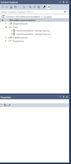
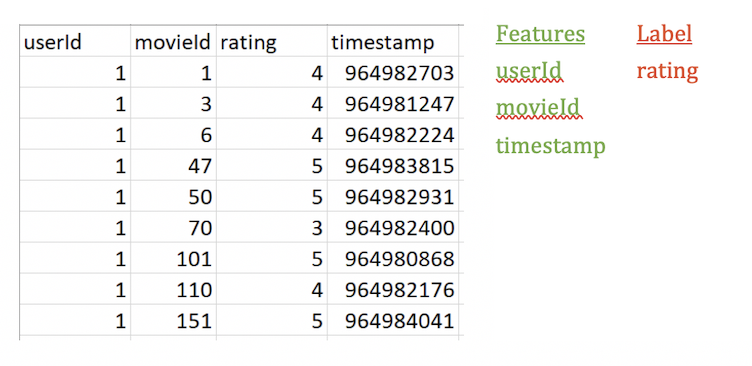
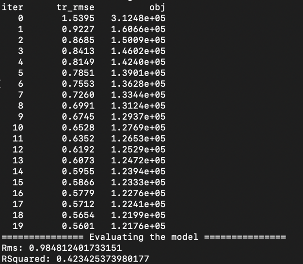

# Tutorial: Create a Movie Recommender with ML.NET

This sample tutorial illustrates using ML.NET to build a movie recommender via a .NET Core console application using C# in Visual Studio 2017.

In this tutorial, you learn how to:
> [!div class="checklist"]
> * Select a machine learning algorithm
> * Prepare your data
> * Train the model
> * Evaluate the model
> * Deploy and consume the model

> [!NOTE]
> This topic refers to ML.NET, which is currently in Preview, and material may be subject to change. For more information, visit [the ML.NET introduction](https://www.microsoft.com/net/learn/apps/machine-learning-and-ai/ml-dotnet).

You will do this by following these steps:

1. Load data
1. Build and train model
1. Evaluate model
1. Deploy and consume model
  
You can find the source code for this tutorial at the [dotnet/samples](https://github.com/dotnet/samples/tree/master/machine-learning/tutorials/MovieRecommendation) repository.

## Prerequisites

* [Visual Studio 2017 15.6 or later](https://visualstudio.microsoft.com/downloads/?utm_medium=microsoft&utm_source=docs.microsoft.com&utm_campaign=button+cta&utm_content=download+vs2017) with the ".NET Core cross-platform development" workload installed.

* The [movie recommendation ratings train comma separated file (recommendation-ratings-train.csv)](https://github.com/dotnet/machinelearning-samples/blob/master/samples/csharp/getting-started/MatrixFactorization_MovieRecommendation/Data/recommendation-ratings-train.csv)
* The [movie recommendation ratings test comma separated file (recommendation-ratings-test.csv)](https://github.com/dotnet/machinelearning-samples/blob/master/samples/csharp/getting-started/MatrixFactorization_MovieRecommendation/Data/recommendation-ratings-test.csv).

The original data comes from [MovieLens Dataset](http://files.grouplens.org/datasets/movielens/ml-latest-small.zip).

* Basic understanding of Machine Learning terminology (take a look at our Machine Learning Crash Course).

## Select the appropriate machine learning task

There are several ways to approach recommendation problems, such as recommending a list of movies or recommending a list of related products, but in this case you will predict what rating (1-5) a user will give to a particular movie and recommend that movie if it is higher than a defined threshold (the higher the rating, the higher the likelihood of a user liking a particular movie).

## Create a console application

### Create a project

1. Open Visual Studio 2017. Select **File** > **New** > **Project** from the menu bar. In the **New Project** dialog, select the **Visual C#** node followed by the **.NET Core** node. Then select the **Console App (.NET Core)** project template. In the **Name** text box, type "TaxiFarePrediction" and then select the **OK** button.

1. Create a directory named *Data* in your project to store the data set and model files:

    In **Solution Explorer**, right-click the project and select **Add** > **New Folder**. Type "Data" and hit Enter.

1. Install the **Microsoft.ML** and **Microsoft.ML.Recommender** NuGet Packages:

    In **Solution Explorer**, right-click the project and select **Manage NuGet Packages**. Choose "nuget.org" as the Package source, select the **Browse** tab, search for **Microsoft.ML**, select that package in the list, and select the **Install** button. Select the **OK** button on the **Preview Changes** dialog and then select the **I Accept** button on the **License Acceptance** dialog if you agree with the license terms for the packages listed. Repeat these steps for **Microsoft.ML.Recommender**.


Add the following using statements at the top of your Program.cs file:

```CSharp
using System;
using System.IO;
using Microsoft.ML;
using Microsoft.ML.Trainers;
using Microsoft.ML.Data;
using Microsoft.Data.DataView;
using Microsoft.ML.Core.Data;
```

## 1. Load data

The first step in the ML.NET process is to prepare and load your model training and testing data :

1. Download [*recommendation-ratings-train.csv*](https://github.com/dotnet/machinelearning-samples/blob/master/samples/csharp/getting-started/MatrixFactorization_MovieRecommendation/Data/recommendation-ratings-train.csv) and [*recommendation-ratings-test.csv*](https://github.com/dotnet/machinelearning-samples/blob/master/samples/csharp/getting-started/MatrixFactorization_MovieRecommendation/Data/recommendation-ratings-test.csv) datasets and save them to the *Data* folder previously created.
> [!NOTE]
> The original data comes from [MovieLens Dataset](http://files.grouplens.org/datasets/movielens/ml-latest-small.zip).

2. In Solution Explorer, right-click each of the \*.csv files and select **Properties**. Under **Advanced**, change the value of **Copy to Output Directory** to **Copy if newer**.



The recommendation ratings data is split into `Train` and `Test` datasets. You will use your `Train` data to fit your model, and then you will use your `Test` data to make predictions with your trained model and evaluate how your model is performing. It is common to have an 80/20 split with `Train` and `Test` data, but there are other more advanced methods that don’t involve extracting test data from the dataset (e.g. [cross validation](https://docs.microsoft.com/en-us/dotnet/machine-learning/how-to-guides/train-cross-validation-ml-net)).

In *recommendation-ratings-train.csv*, there are four columns:

* `userId`
* `movieId`
* `rating`
* `timestamp`

In machine learning, the columns that are used to make a prediction are called [Features](../resources/glossary.md#feature), and the column with the returned prediction is called the [Label](../resources/glossary.md#label).

You want to predict movie ratings, so the rating column is the `Label`. The other three columns, `userId`, `movieId`, and `timestamp` are all `Features` used to predict the `Label`.



It is up to you to decide which Features you think can best be used to predict the Label (you can read more about feature selection *here*). In this case, you should eliminate the `timestamp` column as a `Feature` because the timestamp does not really affect how a user rates a given movie and thus would not contribute to making a more accurate prediction.

Create a new class, `MovieRating`, which specifies an input data class. LoadColumn specifies which columns (by column index) in the dataset should be loaded. The userId and movieId columns are your Features (the inputs you will give the model to predict the Label), and the rating column is the Label that you will predict (the output of the model).

Define your data structures by adding the following code before the Program class:

```CSharp
public class MovieRating
{
  [LoadColumn(0)]
  public float userId;
  [LoadColumn(1)]
  public float movieId;
  [LoadColumn(2)]
  public float Label;
}
```

<xref:Microsoft.ML.MLContext> is a starting point for all ML.NET operations, and initializing `mlContext` creates a new ML.NET environment that can be shared across the model creation workflow objects. It is similar to DBContext in Entity Framework.

Add the following code inside Main():

```csharp
var mlContext = new MLContext();
```

After you initialize `mlContext`, add the following code to initialize the data path variables: 

```csharp
var trainingDataPath = Path.Combine(Environment.CurrentDirectory, "Data", "recommendation-ratings-train.csv");
var testDataPath = Path.Combine(Environment.CurrentDirectory, "Data", "recommendation-ratings-test.csv");
```

Data in ML.NET is represented as an <xref:Microsoft.Data.DataView.IDataView>. `IDataView` is a flexible, efficient way of describing tabular data (numeric and text). Data can be loaded from a text file or in real time (e.g. SQL database or log files) to an `IDataView` object.

The `MLContext.Data.ReadFromTextFile()` is a wrapper for the <xref:Microsoft.ML.TextLoaderSaverCatalog.ReadFromTextFile%2A> method, you define the data schema, which is loaded later when training the model due to its lazy loading approach.

In this case, you provide the path for your files (`Test` and `Train`), and indicate the text file header (so it can use the column names properly) and a comma character data separator (the default separator is a tab).

```csharp
IDataView trainingDataView = mlContext.Data.ReadFromTextFile<MovieRating>(trainingDataPath, hasHeader: true, separatorChar: ',');
IDataView testDataView = mlContext.Data.ReadFromTextFile<MovieRating>(testDataPath, hasHeader: true, separatorChar: ',');
```

## 2. Build and train model

There are three major concepts with ML.NET: [`Data`](../basic-concepts-model-training-in-mldotnet.md#data), [`Transformers`](../basic-concepts-model-training-in-mldotnet.md#transformer), and [`Estimators`](../basic-concepts-model-training-in-mldotnet.md#estimator).

Machine learning training algorithms require data in a certain format. `Transformers` are used to transform tabular data to a compatible format.


You create `Transformers` in ML.NET by creating `Estimators`. `Estimators` take in data and return `Transformers`.


`MatrixFactorization`, the recommendation training algorithm you will use for training your model, is an an example of an `Estimator`.

Build an `Estimator` with the following steps:

1. First, define the data transformations:

```csharp
IEstimator<ITransformer> estimator = mlContext.Transforms.Conversion.MapValueToKey(outputColumnName: "userIdEncoded", inputColumnName: "userId")
.Append(mlContext.Transforms.Conversion.MapValueToKey(outputColumnName: "movieIdEncoded", inputColumnName: "movieId"));
```

Since `userId` and `movieId` represent users and movie titles, not real values, you use `MapValueToKey()` to transform each `userId` and each `movieId` into a numeric key type Feature column (a format accepted by recommendation algorithms) and add them as new dataset columns:

| userID | movieID | Label | userIdEncoded | movieIdEncoded |
| ------------- |:-------------:| -----:|-----:|-----:|
| 1 | 1 | 4 | key | key |
| 1 | 3 | 4 | key | key |
| 1 | 6 | 4 | key | key |

2. Then add the training algorithm (in this case, a Matrix Factorization Trainer) and train the model:

```csharp
var options = new MatrixFactorizationTrainer.Options
{
  MatrixColumnIndexColumnName = "userIdEncoded",
  MatrixRowIndexColumnName = "movieIdEncoded",
  LabelColumnName = "Label",
  NumIterations = 20,
  K = 100
};

estimator = estimator.Append(mlContext.Recommendation().Trainers.MatrixFactorization(options));
```

The `Matrix Factorization` trainer has several options, including the input columns (`userIdEncoded` and `movieIdEncoded`) and the output column (`Label`). NumIterations and K are hyperparameters for improving the quality of the model (see *"Improve your model"* step below for more information).

Finally the `Fit()` method trains your model with the provided training dataset. Technically, it executes the `Estimator` defitinions by transforming the data and applying the training, and it returns back the trained model, which is a `Transformer`.

### Matrix Factorization
Matrix factorization is one of the training algorithms for recommendation scenarios; it is a common approach to recommendation when you have data on how users have rated products in the past. In this case, the algorithm uses a method called collaborative filtering, which assumes that if user 1 has the same opinion as user 2 on a certain issue, then user 1 is more likely to feel the same way as user 2 about a different issue.

E.g. if User 1 and User 2 rate movies similarly, then User 2 is more likely to enjoy a movie that User 1 has watched and rated highly:

|       | Incredibles 2 (2018) | The Avengers (2012) | Guardians of the Galaxy (2014) |
| -------------:|-------------:| -----:|-----:|
| User 1 | Watched and liked movie | Watched and liked movie | Watched and liked movie |
| User 2 | Watched and liked movie | Watched and liked movie | Has not watched -- RECOMMEND movie |

To learn more in detail about these Transformers and Estimators, refer to *ML.NET High-Level Concepts*.

## 3. Evaluate model

Once you have trained your model, use your test data to evaluate how your model is performing. Add the following code after your `Fit()` method:

```CSharp
Console.WriteLine("======= Evaluating the model =======");

var prediction = model.Transform(testDataView);

var metrics = mlContext.Recommendation().Evaluate(prediction, 
label: "Label", score: "Score");

Console.WriteLine("Rms: " + metrics.Rms);
Console.WriteLine("RSquared: " + metrics.RSquared);
```

The `Transform()` method makes predictions for multiple provided input rows of a test dataset. Once you have the prediction set, you call the `Evaluate()` method to assess the model, which compares the predicted values with the actual labels in the test dataset and returns metrics on how the model is performing.

The print statements display your evaluation metrics in the console, which should look similar to the following:


In this output, there are 20 iterations. In each iteration, the measure of error decreases and converges closer and closer to 0.

The `root of mean squared error` (RMS or RMSE) is frequently used to measure the differences between values predicted by a model and the values actually observed in a test dataset. Technically it is the square root of the average of the squares of the errors. You want your RMSE score to be as close to 0 as possible.

`R Squared` is the variation percentage in the predicted values explained by your model. It's a value between 0 and 1, and the closer the value is to 1, the better the model is.

Next, save your trained model for use in end-user applications. Add the following code in your model training console app:

```CSharp
Console.WriteLine("======= Saving the model to a file =======");
using (var fs = new FileStream("moviePredictionModel.zip",
  FileMode.Create, FileAccess.Write, FileShare.Write))

mlContext.Model.Save(model, fs);
```

This is how you save the model to a .zip file, which can then be loaded into and used in your other .NET applications.

## 4. Deploy and consume model

To use the model in another .NET application (or in a different method just for trying the model), follow these steps:

1. Add a class for the result returned from the prediction operations
2. Create an ML.NET context
3. Create new file stream with the path to the model file
4. Load the model from the stream
5. Make predictions using the prediction engine

### 1. Add a prediction operations result class

To load your trained model into another app, add this class:

```CSharp
public class MovieRatingPrediction
{
  public float Label;
  public float Score;
}
```
### 2-4. Create MLContext, create new file stream, and load the model from stream 
Next, load the model that you saved previously by adding the following code to your end-user application:

```csharp
MLContext mlContext = new MLContext();

ITransformer trainedModel;

using (FileStream stream = new FileStream(_movieService.GetModelPath(),
FileMode.Open, FileAccess.Read, FileShare.Read))
{
  trainedModel = mlContext.Model.Load(stream);
}
```

### 5. Make predictions using the prediction engine

After loading the model from a file stream, create a `Prediction Engine` based on your trained model:

```csharp
Console.WriteLine("======= Making a prediction =======");

var predictionengine = 
trainedModel.CreatePredictionEngine<MovieRating, MovieRatingPrediction>(mlContext);
```

The <xref:Microsoft.ML.PredictionEngine%602> is a convenience API, which allows you to pass a single instance of data and then perform a prediction on this single instance of data.

Finally, create an instance of `MovieRating` and pass it to the `Prediction Engine`:

```csharp
var testInput = new MovieRating { userId = 6, movieId = 10 };

var movieRatingPrediction = predictionengine.Predict(testInput);
```
The `Predict()` function makes a prediction on a single column of data (in this case on the testInput). 

You can then use the `Score`, or predicted rating, to determine whether you want to recommend the movie with movieId 10 to user 6. The higher the `Score`, the higher the likelihood of a user liking a particular movie. In this case, let’s say that we recommend movies with a predicted rating of > 3.5:

```csharp
if (Math.Round(movieRatingPrediction.Score, 1) > 3.5)
{
  Console.WriteLine("Movie " + testInput.movieId + " is recommended for user " + testInput.userId);
}
else
{
  Console.WriteLine("Movie " + testInput.movieId + " is not recommended for user " + testInput.userId);
}
```

## Results

Your results should be similar to the following. You may see warnings or processing messages, but these messages have been removed from the following results for clarity.

```console
Movie 6 is recommended for user 10
Movie 8 is not recommended for user 6
```

Congratulations! You've now successfully built a machine learning model for recommending movies. You can find the source code for this tutorial at the [dotnet/samples](https://github.com/dotnet/samples/tree/master/machine-learning/tutorials/MovieRecommendation) repository.

## Next steps

In this tutorial, you learned how to:

> [!div class="checklist"]
> * Understand the problem
> * Select a machine learning algorithm
> * Prepare your data
> * Train the model
> * Evaluate the model
> * Deploy and consume the model

### Improve your model

There are several ways that you can improve the performance of your model so that you can get more accurate predictions.

#### Data 

Adding more training data that has enough samples for each user and movie id can help improve the quality of the recommendation model.

Cross validation is a technique for evaluating models that randomly splits up data into subsets and takes some of the groups as train data and some of the groups as test data. This method outperforms making a train-test split in terms of model quality.

#### Features

In this tutorial, you only use the three `Features` (`user id`, `movie id`, and `rating`) that are provided by the dataset. 

While this is a good start, in reality you might want to add other attributes or `Features` (e.g. age, gender, geo-location, etc.) if they are included in the dataset. Adding more relevant `Features` can help improve the performance of your recommendation model. 

If you are unsure about which `Features` might be the most relevant for your machine learning task, you can also make use of Feature Contribution Calculation (FCC), which ML.NET provides to discover the most influential `Features`.

#### Algorithm

While ML.NET provides good default training algorithms, you can further fine-tune performance by changing parameters on these individual algorithms.

For `Matrix Factorization`, you can experiment with learning rate, K, and NumIterations to see if that gives you better results. You can learn more about these parameters and fine-tuning `Matrix Factorization` here.

Here is an example of how to fine-tune the `Matrix Factorization Trainer` options:

```CSharp
var options = new MatrixFactorizationTrainer.Options
{
  MatrixColumnIndexColumnName = "userIdEncoded",
  MatrixRowIndexColumnName = "movieIdEncoded",
  LabelColumnName = "Label",
  NumIterations = 20,
  K = 100,
  NumberOfThreads = 1,
  ApproximationRank = 32,
  LearningRate = 0.3
};
```

#### New user scenario
One common problem in collaborative filtering is the cold start problem, which is when you have a new user with no previous data to draw inferences from. This is often solved by asking new users to create a profile and, for instance, rate movies they have seen in the past. While this puts some burden on the user, it provides some starting data for new users with no rating history.

### Other Recommendation Engines
This is only one approach for performing movie recommendations. In many cases, you may not have the ratings data available and only have movie history available from users. In other cases, you may have more than just user’s rating data.

| Algorithm       | Scenario           | Tutorial  |
| ------------- |:-------------:| -----:|
| One Class Matrix Factorization | Use this when you only have userId and movieId. This style of recommendation is based upon the co-purchase scenario, or products frequently bought together, which means it will recommend to customers a set of products based upon their own purchase order history. | >Try it out |
| Field Aware Factorization Machines | Use this to make recommendations when you have more Features beyond userId, productId, and rating (such as product description or product price). This also uses a collaborative filtering approach. | >Try it out |

### Other ML.NET Scenarios
Try out another tutorial to use ML.NET for other Machine Learning scenarios:

| [Taxi fare prediction (regression)](https://docs.microsoft.com/en-us/dotnet/machine-learning/tutorials/taxi-fare) | [Sentiment analysis (binary classification)](https://docs.microsoft.com/en-us/dotnet/machine-learning/tutorials/sentiment-analysis) | [Issue classification (multi-class classification)](https://docs.microsoft.com/en-us/dotnet/machine-learning/tutorials/github-issue-classification) |
| ------------- |:-------------:| -----:|

OR 

Advance to the next tutorial to learn more
> [!div class="nextstepaction"]
> [Taxi Fare Predictor](taxi-fare.md)
