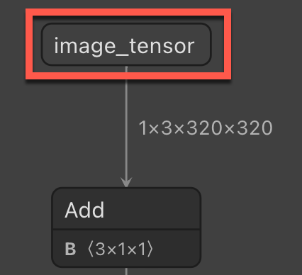
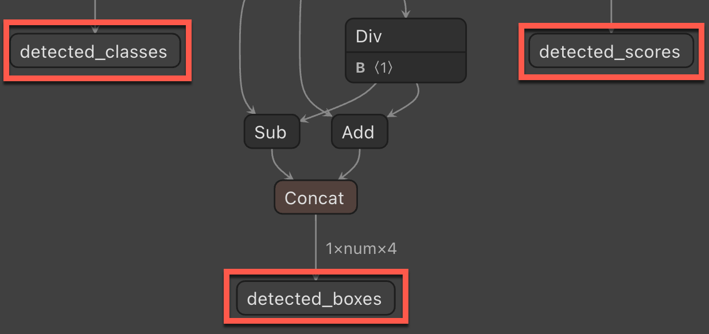
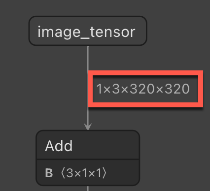

# Tutorial: Categorize an image in ML.NET from Custom Vision ONNX model

Learn how to use ML.NET to detect objects in images using an ONNX model trained in the Microsoft Custom Vision service.

The Microsoft Custom Vision service is an AI service that trains a model based on images that you upload. You can then export the model to ONNX format and use it in ML.NET to make predictions.

In this tutorial, you learn how to:

> [!div class="checklist"]
>
> - Use the Custom Vision service to create an ONNX model
> - Incorporate the ONNX model into the ML.NET pipeline
> - Train the ML.NET model
> - Detect stop signs in test images

## Prerequisites

- [Visual Studio 2022](https://visualstudio.microsoft.com/downloads/).
- [Download the dataset](https://aka.ms/mlnet-object-detection-tutorial-dataset) of 50 stop-sign images.
- Azure account. If you don't have one, [create a free Azure account](https://aka.ms/AMLFree).

## Create the model

### Create the Custom Vision project

Log into the [Microsoft Custom Vision service](https://www.customvision.ai/) and select **New Project**.

In the **New Project** dialog, fill out the following required items:

- Set the **Name** of the Custom Vision project as **StopSignDetection**.
- Select the **Resource** you'll use. This is an Azure resource that will be created for the Custom Vision project. If none is listed, one can be created by selecting the **Create new** link.
- Set the **Project type** as **Object Detection**.
- Set the **Classification Types** as **Multiclass** since there will be one class per image.
- Set the **Domain** as **General (compact) \[S1]**. The compact domain allows you to download the ONNX model.
- For **Export capabilities**, select **Basic platforms** to allow the export of the ONNX model.

Once the above fields are filled out, select **Create project**.

### Add images

1. With the project created, choose **Add images** to start adding images for the model to train on. Select the stop-sign images that you downloaded.
1. Select the first image that's shown. You can select objects in the image that you want the model to detect. Select the stop sign in the image. A popup displays and sets the tag as **stop-sign**.
1. Repeat for all of the remaining images. Some images have more than one stop sign, so be sure to mark all that are in the images.

### Train the model

With the images uploaded and tagged, the model can now be trained. Select **Train**.

A popup displays asking what type of training to use. Choose **Quick training** and then select **Train**.

### Download the ONNX model

Once training is completed, click on the **Export** button. When the popup displays, select **ONNX** to download the ONNX model.

## Inspect ONNX model

Unzip the downloaded ONNX file. The folder contains several files, but the two that you'll use in this tutorial are:

- **labels.txt**, which is a text file containing the labels that were defined in the Custom Vision service.
- **model.onnx**, which is the ONNX model that you'll use to make predictions in ML.NET.

To build the ML.NET pipeline, you'll need the names of the input and output column names. To get this information, use Netron, a [web](https://netron.app/) and [desktop](https://github.com/lutzroeder/netron/releases/) app that can analyze ONNX models and show their architecture.

1. When using either the web or desktop app of Netron, open the ONNX model in the app. Once it opens, it displays a graph. This graph tells you a few things that you'll need to build the ML.NET pipeline for predictions.

   - **Input column name** - The input column name required when applying the ONNX model in ML.NET.

     

   - **Output column name** - The output column name required when applying the ONNX model in ML.NET.

     

   - **Image size** - The size required when resizing images in the ML.NET pipeline.

     

## Create a C# console project

1. In Visual Studio, create a C# Console Application called "StopSignDetection". Choose .NET 8 as the target framework.

1. Install the following NuGet packages for the project:

   - **Microsoft.ML**
   - **Microsoft.ML.ImageAnalytics**
   - **Microsoft.Onnx.Transformer**

   [!INCLUDE [mlnet-current-nuget-version](../../../includes/mlnet-current-nuget-version.md)]

## Reference the ONNX model

Find the two files from the ONNX model (*labels.txt* and *model.onnx*) in the Visual Studio **Solution Explorer**. Right-click them and, in the Properties window, set **Copy to output directory** to **Copy if newer**.

## Create input and prediction classes

1. Add a new class to your project and name it `StopSignInput`. Then, add the following struct to the class:

    ```csharp
    public struct ImageSettings
    {
        public const int imageHeight = 320;
        public const int imageWidth = 320;
    }
    ```

1. Next, add the following property to the class.

    ```csharp
    public class StopSignInput
    {
        [ImageType(ImageSettings.imageHeight, ImageSettings.imageWidth)]
        public Bitmap Image { get; set; }
    }
    ```

    The `Image` property contains the bitmap of the image used for prediction. The `ImageType` attribute tells ML.NET that the property is an image with dimensions of 320 and 320, which was determined using Netron.

1. Add another class to your project and name it `StopSignPrediction`. Then, add the following properties to the class.

    ```csharp
    public class StopSignPrediction
    {
        [ColumnName("detected_classes")]
        public long[] PredictedLabels { get; set; }

        [ColumnName("detected_boxes")]
        public float[] BoundingBoxes { get; set; }

        [ColumnName("detected_scores")]
        public float[] Scores { get; set; }
    }
    ```

    The `PredictedLabels` property contains the predictions of labels for each detected object. The type is a float array, so each item in the array is the prediction of each label. The `ColumnName` attribute tells ML.NET that this column in the model is the name given, which is `detected_classes`.

    The `BoundingBoxes` property contains the bounding boxes for each detected object. The type is a float array and each detected object comes in with four items in the array for the bounding box. The `ColumnName` attribute tells ML.NET that this column in the model is the name given, which is `detected_boxes`.

    The `Scores` property contains the confidence scores of each predicted object and its label. The type is a float array, so each item in the array is the confidence score of each label. The `ColumnName` attribute tells ML.NET that this column in the model is the name given, which is `detected_scores`.

## Use the model to make predictions

### Add using directives

In the *Program.cs* file, add the following `using` directives to the top of the file.

```csharp
using Microsoft.ML;
using Microsoft.ML.Transforms.Image;
using System.Drawing;
using WeatherRecognition;
```

### Create objects

1. Create the `MLContext` object.

    ```csharp
    var context = new MLContext();
    ```

1. Create an `IDataView` with an new empty `StopSignInput` list.

    ```csharp
    var data = context.Data.LoadFromEnumerable(new List<StopSignInput>());
    ```

1. For consistency, save the predicted images to the assembly path.

    ```csharp
    var root = new FileInfo(typeof(Program).Assembly.Location);
    var assemblyFolderPath = root.Directory.FullName;
    ```

## Build the pipeline

With the empty `IDataView` created, the pipeline can be built to do the predictions of any new images. The pipeline consists of several steps:

1. Resize the incoming images.

   The image being sent to the model for prediction will often be in a different aspect ratio to the images that were trained on the model. To keep the image consistent for accurate predictions, resize the image to 320x320. To do so, use the `ResizeImages` method and set the `imageColumnName` as the name of the `StopSignInput.Image` property.

   ```csharp
   var pipeline = context.Transforms.ResizeImages(resizing: ImageResizingEstimator.ResizingKind.Fill, outputColumnName: "image_tensor", imageWidth: ImageSettings.imageWidth, imageHeight: ImageSettings.imageHeight, inputColumnName: nameof(StopSignInput.Image))
   ```

1. Extract the pixels of the image.

   Once the image has been resized, you need to extract the pixels of the image. Append the `ExtractPixels` method to your pipeline and specify the name of the column to output the pixels to using the `outputColumnName` parameter.

   ```csharp
   .Append(context.Transforms.ExtractPixels(outputColumnName: "image_tensor"))
   ```

1. Apply the ONNX model to the image to make a prediction. This takes a few parameters:

    - **modelFile** - The path to the ONNX model file
    - **outputColumnNames** - A string array containing the names of all of the output column names, which can be found when analyzing the ONNX model in Netron.
    - **inputColumnNames** - A string array containing the names of all of the input column name, which can also be found when analyzing the ONNX model in Netron.

   ```csharp
   .Append(context.Transforms.ApplyOnnxModel(outputColumnNames: new string[] { "detected_boxes", "detected_scores", "detected_classes" }, inputColumnNames: new string[] { "image_tensor" }, modelFile: "./Model/model.onnx"));
   ```

## Fit the model

Now that you've defined a pipeline, you can use it to build the ML.NET model. Use the `Fit` method on the pipeline and pass in the empty `IDataView`.

```csharp
var model = pipeline.Fit(data);
```

Next, to make predictions, use the model to create a prediction engine. This is a generic method, so it takes in the `StopSignInput` and `StopSignPrediction` classes that were created earlier.

```csharp
var predictionEngine = context.Model.CreatePredictionEngine<StopSignInput, StopSignPrediction>(model);
```

## Extract the labels

To map the model outputs to its labels, you need to extract the labels provided by Custom Vision. These labels are in the *labels.txt* file that was included in the zip file with the ONNX model.

Call the `ReadAllLines` method to read all the labels form the file.

```csharp
var labels = File.ReadAllLines("./model/labels.txt");
```

## Predict on a test image

Now you can use the model to predict on new images. In the project, there is a *test* folder that you can use to make predictions. This folder contains two random images with a stop sign in it from [Unsplash](https://unsplash.com/). One image has one stop sign while the other has two stop signs. Use the `GetFiles` method to read the file paths of the images in the directory.

```csharp
var testFiles = Directory.GetFiles("./test");
```

Loop through the file paths to make a prediction with the model and output the result.

1. Create a `foreach` loop to loop through the test images.

    ```csharp
    Bitmap testImage;

    foreach (var image in testFiles)
    {

    }
    ```

1. In the `foreach` loop, generate the predicted image name based on the name of the original test image.

    ```csharp
    var predictedImage = $"{Path.GetFileName(image)}-predicted.jpg";
    ```

1. Also in the `foreach` loop, create a `FileStream` of the image and convert it to a `Bitmap`.

    ```csharp
    using (var stream = new FileStream(image, FileMode.Open))
    {
        testImage = (Bitmap)Image.FromStream(stream);
    }
    ```

1. Also in the `foreach` loop, call the `Predict` method on the prediction engine.

    ```csharp
    var prediction = predictionEngine.Predict(new StopSignInput { Image = testImage });
    ```

1. With the prediction, you can get the bounding boxes. Use the <xref:System.Linq.Enumerable.Chunk%2A> method to determine how many objects the model has detected. Do this by taking the count of the predicted bounding boxes and dividing that by the number of labels that were predicted. For example, if you had three objects detected in an image, there would be 12 items in the `BoundingBoxes` array and three labels predicted. The `Chunk` method would then give you three arrays of four to represent the bounding boxes for each object.

    ```csharp
    var boundingBoxes = prediction.BoundingBoxes.Chunk(prediction.BoundingBoxes.Count() / prediction.PredictedLabels.Count());
    ```

1. Next, capture the original width and height of the images used for prediction.

    ```csharp
    var originalWidth = testImage.Width;
    var originalHeight = testImage.Height;
    ```

1. Calculate where in the image to draw the boxes. For that, create a `for` loop based on the count of the bounding boxes chunk.

    ```csharp
    for (int i = 0; i < boundingBoxes.Count(); i++)
    {
    }
    ```

1. Within the `for` loop, calculate the position of the x and y coordinates as well as the width and height of the box to draw on the image. The first thing you need to do is get the set of bounding boxes using the `ElementAt` method.

    ```csharp
    var boundingBox = boundingBoxes.ElementAt(i);
    ```

1. With the current bounding box, you can now calculate where to draw the box. Use the original image width for the first and third elements of the bounding box, and the original image height for the second and fourth elements.

    ```csharp
    var left = boundingBox[0] * originalWidth;
    var top = boundingBox[1] * originalHeight;
    var right = boundingBox[2] * originalWidth;
    var bottom = boundingBox[3] * originalHeight;
    ```

1. Calculate the width and the height of the box to draw around the detected object within the image. The x and y items are the `left` and `top` variables from the previous calculation. Use the `Math.Abs` method to get the absolute value from the width and height calculations in case it's negative.

    ```csharp
    var x = left;
    var y = top;
    var width = Math.Abs(right - left);
    var height = Math.Abs(top - bottom);
    ```

1. Next, get the predicted label from the array of labels.

    ```csharp
    var label = labels[prediction.PredictedLabels[i]];
    ```

1. Create a graphic based on the test image using the `Graphics.FromImage` method.

    ```csharp
    using var graphics = Graphics.FromImage(testImage);
    ```

1. Draw on the image using the bounding box information. First, draw the rectangle around the detected objects using the `DrawRectangle` method that takes in a `Pen` object to determine the color and width of the rectangle, and pass in the `x`, `y`, `width`, and `height` variables.

    ```csharp
    graphics.DrawRectangle(new Pen(Color.NavajoWhite, 8), x, y, width, height);
    ```

1. Then, display the predicted label inside the box with the `DrawString` method that takes in the string to print out and a `Font` object to determine how to draw the string and where to place it.

    ```csharp
    graphics.DrawString(label, new Font(FontFamily.Families[0], 18f), Brushes.NavajoWhite, x + 5, y + 5);
    ```

1. After the `for` loop, check if the predicted file already exists. If it does, delete it. Then, save it to the defined output path.

    ```csharp
    if (File.Exists(predictedImage))
    {
        File.Delete(predictedImage);
    }

    testImage.Save(Path.Combine(assemblyFolderPath, predictedImage));
    ```

## Next steps

Try one of the other image classification tutorials:

- [Image Classification with Transfer Learning](image-classification-api-transfer-learning.md)
- [Image Classification with Model Builder](image-classification-model-builder.md)
- [Image CLassification with Tensorflow Model](image-classification.md)
