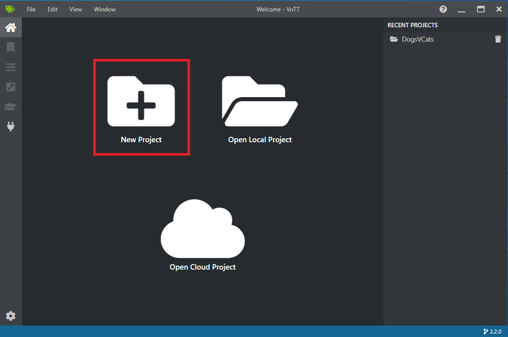
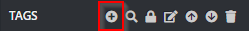
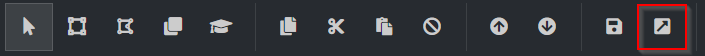

# Tutorial: Detect stop signs in images with Model Builder

Learn how to build an object detection model using ML.NET Model Builder and Azure Machine Learning to detect and locate stop signs in images.

In this tutorial, you learn how to:

> [!div class="checklist"]
>
> - Prepare and understand the data
> - Create a Model Builder config file
> - Choose the scenario
> - Choose the training environment
> - Load the data
> - Train the model
> - Evaluate the model
> - Use the model for predictions

> [!NOTE]
> Model Builder is currently in Preview.

## Prerequisites

For a list of prerequisites and installation instructions, visit the [Model Builder installation guide](../how-to-guides/install-model-builder.md).

## Model Builder object detection overview

Object detection is a computer vision problem. While closely related to image classification, object detection performs image classification at a more granular scale. Object detection both locates _and_ categorizes entities within images. Object detection models are commonly trained using deep learning and neural networks. See [Deep learning vs machine learning](/azure/machine-learning/concept-deep-learning-vs-machine-learning) for more information.

Use object detection when images contain multiple objects of different types.


Some use cases for object detection include:

- Self-Driving Cars
- Robotics
- Face Detection
- Workplace Safety
- Object Counting
- Activity Recognition

This sample creates a C# .NET Core console application that detects stop signs in images using a machine learning model built with Model Builder. You can find the source code for this tutorial at the [dotnet/machinelearning-samples](https://github.com/dotnet/machinelearning-samples/tree/main/samples/modelbuilder/ObjectDetection_StopSigns) GitHub repository.

## Prepare and understand the data

The Stop Sign dataset consists of 50 images downloaded from [Unsplash](https://unsplash.com/), each of which contain at least one stop sign.

### Create a new VoTT project

1. [Download the dataset](https://aka.ms/mlnet-object-detection-tutorial-dataset) of 50 stop sign images and unzip.
1. [Download VoTT](https://github.com/Microsoft/VoTT/releases) (Visual Object Tagging Tool).
1. Open VoTT and select **New Project**.

    

1. In **Project Settings**, change the **Display Name** to "StopSignObjDetection".
1. Change the **Security Token** to *Generate New Security Token*.
1. Next to **Source Connection**, select **Add Connection**.
1. In **Connection Settings**, change the **Display Name** for the source connection to "StopSignImages", and select *Local File System* as the **Provider**. For the **Folder Path**, select the *Stop-Signs* folder which contains the 50 training images, and then select **Save Connection**.

    

1. In **Project Settings**, change the **Source Connection** to *StopSignImages* (the connection you just created).
1. Change the **Target Connection** to *StopSignImages* as well. Your **Project Settings** should now look similar to this screenshot:

    

1. Select **Save Project**.

### Add tag and label images

You should now see a window with preview images of all the training images on the left, a preview of the selected image in the middle, and a **Tags** column on the right. This screen is the **Tags editor**.

1. Select the first (plus-shaped) icon in the **Tags** toolbar to add a new tag.

    

1. Name the tag "Stop-Sign" and hit <kbd>Enter</kbd> on your keyboard.

    

1. Click and drag to draw a rectangle around each stop sign in the image. If the cursor does not let you draw a rectangle, try selecting the **Draw Rectangle** tool from the toolbar on the top, or use the keyboard shortcut <kbd>R</kbd>.
1. After drawing your rectangle, select the **Stop-Sign** tag that you created in the previous steps to add the tag to the bounding box.
1. Click on the preview image for the next image in the dataset and repeat this process.
1. Continue steps 3-4 for every stop sign in every image.

    

### Export your VoTT JSON

Once you have labeled all of your training images, you can export the file that will be used by Model Builder for training.

1. Select the fourth icon in the left toolbar (the one with the diagonal arrow in a box) to go to the **Export Settings**.
1. Leave the **Provider** as *VoTT JSON*.
1. Change the **Asset State** to *Only tagged Assets*.
1. Uncheck **Include Images**. If you include the images, then the training images will be copied to the export folder that is generated, which is not necessary.
1. Select **Save Export Settings**.

    

1. Go back to the **Tags editor** (the second icon in the left toolbar shaped like a ribbon). In the top toolbar, select the **Export Project** icon (the last icon shaped like an arrow in a box), or use the keyboard shortcut <kbd>Ctrl</kbd>+<kbd>E</kbd>.

    

This export will create a new folder called *vott-json-export* in your *Stop-Sign-Images* folder and will generate a JSON file named *StopSignObjDetection-export* in that new folder. You will use this JSON file in the next steps for training an object detection model in Model Builder.

## Create a console application

In Visual Studio, create a **C# .NET Core console application** called *StopSignDetection*.

## Create an `mbconfig` file

1. In **Solution Explorer**, right-click the *StopSignDetection* project, and select **Add** > **Machine Learning Model...** to open the Model Builder UI.
1. In the dialog, name the Model Builder project **StopSignDetection**, and click **Add**.

## Choose a scenario

For this sample, the scenario is object detection. In the **Scenario** step of Model Builder, select the **Object Detection** scenario.


> If you don't see *Object Detection* in the list of scenarios, you may need to [update your version of Model Builder](https://marketplace.visualstudio.com/items?itemName=MLNET.07).

## Choose the training environment

Currently, Model Builder supports training object detection models with Azure Machine Learning only, so the Azure training environment is selected by default.


To train a model using Azure ML, you must create an Azure ML experiment from Model Builder.

An **Azure ML experiment** is a resource that encapsulates the configuration and results for one or more machine learning training runs.

To create an Azure ML experiment, you first need to configure your environment in Azure. An experiment needs the following to run:

- An Azure subscription
- A **workspace**: an Azure ML resource that provides a central place for all Azure ML resources and artifacts created as part of a training run.
- A **compute**: an Azure Machine Learning compute is a cloud-based Linux VM used for training. Learn more about [compute types supported by Model Builder](../resources/azure-training-concepts-model-builder.md#what-is-an-azure-machine-learning-compute).

### Set up an Azure ML workspace

To configure your environment:

1. Select the **Set up workspace** button.
1. In the **Create new experiment** dialog, select your Azure subscription.
1. Select an existing workspace or create a new Azure ML workspace.

    When you create a new workspace, the following resources are provisioned:

    - Azure Machine Learning workspace
    - Azure Storage
    - Azure Application Insights
    - Azure Container Registry
    - Azure Key Vault

    As a result, this process may take a few minutes.

1. Select an existing compute or create a new Azure ML compute. This process may take a few minutes.
1. Leave the default experiment name and select **Create**.

    

The first experiment is created, and the experiment name is registered in the workspace. Any subsequent runs (if the same experiment name is used ) are logged as part of the same experiment. Otherwise, a new experiment is created.

If you’re satisfied with your configuration, select the **Next step** button in Model Builder to move to the **Data** step.

## Load the data

In the **Data** step of Model Builder, you will select your training dataset.

> [!IMPORTANT]
> Model Builder currently only accepts the format of JSON [generated by VoTT](../how-to-guides/label-images-for-object-detection-using-vott.md).

1. Select the button inside **Input** section and use the File Explorer to find the `StopSignObjDetection-export.json` which should be located in the *Stop-Signs/vott-json-export* directory.

    

1. If your data looks correct in the **Data Preview**, select **Next step** to move on to the **Train** step.

## Train the model

The next step is to train your model.

In the Model Builder **Train** screen, select the **Start training** button.

At this point, your data is uploaded to Azure Storage and the training process begins in Azure ML.

>The training process takes some time, and the amount of time may vary depending on the size of compute selected as well as the amount of data. The first time a model is trained in Azure, you can expect a slightly longer training time because resources have to be provisioned. For this sample of 50 images, training took about 16 minutes.

You can track the progress of your runs in the Azure Machine Learning portal by selecting the **Monitor current run in Azure portal** link in Visual Studio.

Once training is complete, select the **Next step** button to move on to the **Evaluate** step.

## Evaluate the model

In the Evaluate screen, you get an overview of the results from the training process, including the model accuracy.


In this case, the accuracy says 100%, which means that the model is more than likely *overfit* due to too few images in the dataset.

You can use the **Try your model** experience to quickly check whether your model is performing as expected.

Select **Browse an image** and provide a test image, preferably one that the model did not use as part of training.


The score shown on each detected bounding box indicates the **confidence** of the detected object. For instance, in the screenshot above, the score on the bounding box around the stop sign indicates that the model is 99% sure that the detected object is a stop sign.

The **Score threshold**, which can be increased or decreased with the threshold slider, will add and remove detected objects based on their scores. For instance, if the threshold is .51, then the model will only show objects that have a confidence score of .51 or above. As you increase the threshold, you will see less detected objects, and as you decrease the threshold, you will see more detected objects.

If you're not satisfied with your accuracy metrics, one easy way to try to improve model accuracy is to use more data. Otherwise, select the **Next step** link to move on to the **Consume** step in Model Builder.

## (Optional) Consume the model

This step will have project templates that you can use to consume the model. This step is optional and you can choose the method that best suits your needs on how to serve the model.

- Console App
- Web API

### Console App

When adding a console app to your solution, you will be prompted to name the project.

1. Name the console project **StopSignDetection_Console**.
1. Click **Add to solution** to add the project to your current solution.
1. Run the application.

    The output generated by the program should look similar to the snippet below:

    ```bash
    Predicted Boxes:

    Top: 73.225296, Left: 256.89764, Right: 533.8884, Bottom: 484.24243, Label: stop-sign, Score: 0.9970765
    ```

### Web API

When adding a web API to your solution, you will be prompted to name the project.

1. Name the Web API project **StopSignDetection_API**.
1. Click **Add to solution** to add the project to your current solution.
1. Run the application.
1. Open PowerShell and enter the following code where PORT is the port your application is listening on.

    ```powershell
    $body = @{
         ImageSource = <Image location on your local machine>
     }

     Invoke-RestMethod "https://localhost:<PORT>/predict" -Method Post -Body ($body | ConvertTo-Json) -ContentType "application/json"
    ```

1. If successful, the output should look similar to the text below.

    ```powershell
    boxes                                      labels scores       boundingBoxes
    -----                                      ------ ------       -------------
    {339.97797, 154.43184, 472.6338, 245.0796} {1}    {0.99273646} {}
    ```

    - The `boxes` column gives the bounding box coordinates of the object that was detected. The values here belong to the left, top, right, and bottom coordinates respectively.
    - The `labels` are the index of the predicted labels. In this case, the value 1 is a stop sign.
    - The `scores` defines how confident the model is that the bounding box belongs to that label.

    > [!NOTE]
    > **(Optional)** The bounding box coordinates are normalized for a width of 800 pixels and a height of 600 pixels. To scale the bounding box coordinates for your image in further post-processing, you need to:
    >
    >    1. Multiply the top and bottom coordinates by the original image height, and multiply the left and right coordinates by the original image width.
    >    1. Divide the top and bottom coordinates by 600, and divide the left and right coordinates by 800.
    >
    >    For example, given the original image dimensions,`actualImageHeight` and `actualImageWidth`, and a `ModelOutput` called `prediction`, the following code snippet shows how to scale the `BoundingBox` coordinates:
    >
    >    ```csharp
    >    var top = originalImageHeight * prediction.Top / 600;
    >    var bottom = originalImageHeight * prediction.Bottom / 600;
    >    var left = originalImageWidth * prediction.Left / 800;
    >    var right = originalImageWidth * prediction.Right / 800;
    >    ```
    >
    > An image may have more than one bounding box, so the same process needs to be applied to each of the bounding boxes in the image.

Congratulations! You've successfully built a machine learning model to detect stop signs in images using Model Builder. You can find the source code for this tutorial at the [dotnet/machinelearning-samples](https://github.com/dotnet/machinelearning-samples/tree/main/samples/modelbuilder/ObjectDetection_StopSigns) GitHub repository.

## Additional resources

To learn more about topics mentioned in this tutorial, visit the following resources:

- [Model Builder Scenarios](../automate-training-with-model-builder.md#scenario)
- [Object Detection using ONNX in ML.NET](object-detection-onnx.md)
