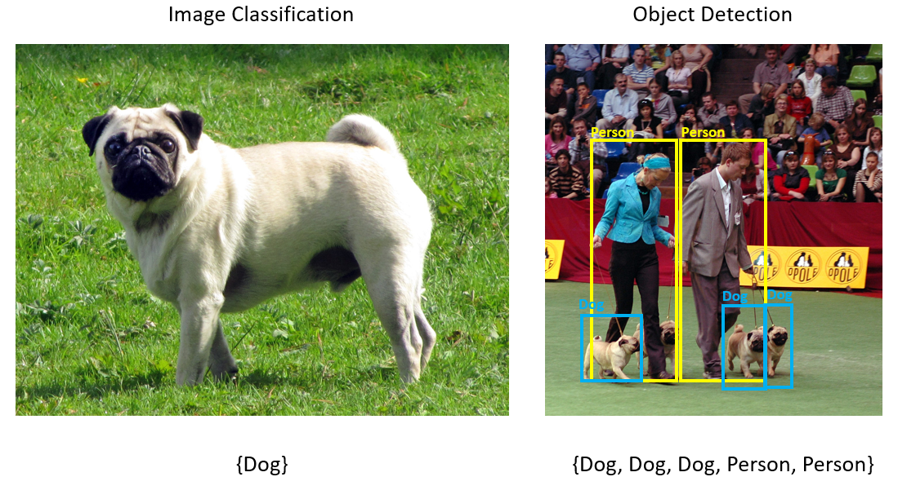
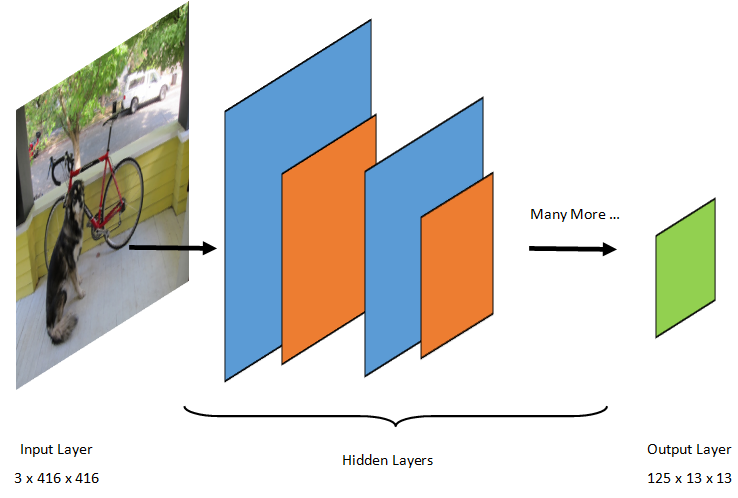
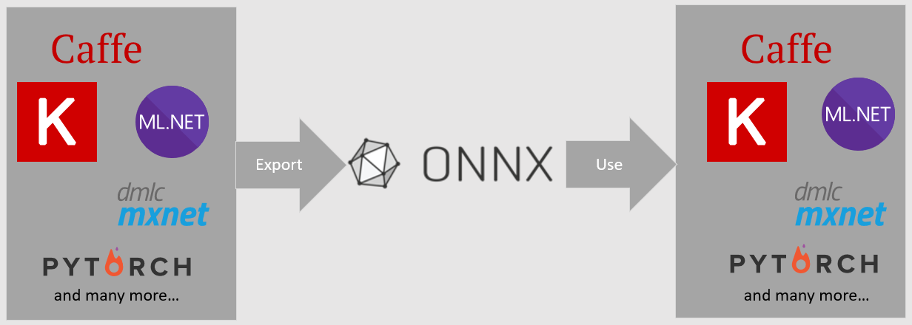
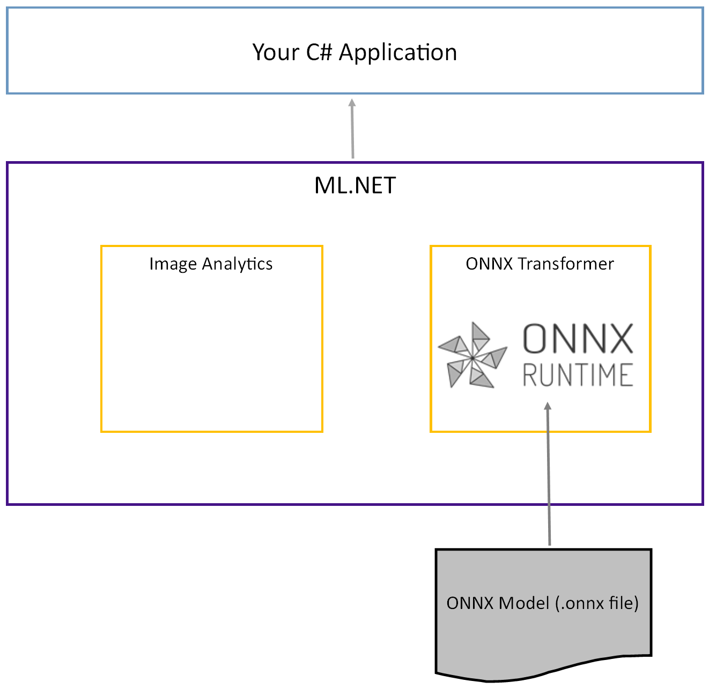
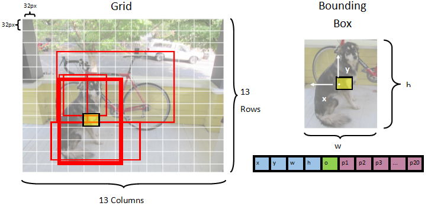
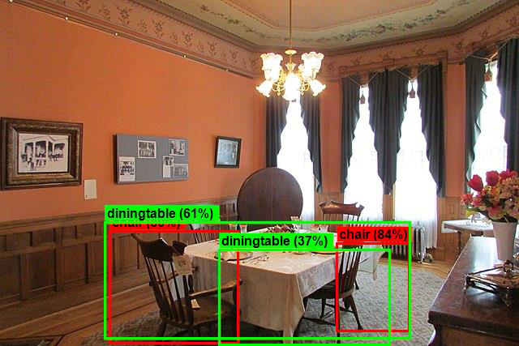

# Tutorial: Detect objects using ONNX in ML.NET

Learn how to use a pre-trained ONNX model in ML.NET to detect objects in images.

Training an object detection model from scratch requires setting millions of parameters, a large amount of labeled training data and a vast amount of compute resources (hundreds of GPU hours). Using a pre-trained model allows you to shortcut the training process.

In this tutorial, you learn how to:
> [!div class="checklist"]
>
> - Understand the problem
> - Learn what ONNX is and how it works with ML.NET
> - Understand the model
> - Reuse the pre-trained model
> - Detect objects with a loaded model

## Pre-requisites

- [Visual Studio 2022](https://visualstudio.microsoft.com/downloads/).
- [Microsoft.ML NuGet Package](https://www.nuget.org/packages/Microsoft.ML/)
- [Microsoft.ML.ImageAnalytics NuGet Package](https://www.nuget.org/packages/Microsoft.ML.ImageAnalytics/)
- [Microsoft.ML.OnnxTransformer NuGet Package](https://www.nuget.org/packages/Microsoft.ML.OnnxTransformer/)
- [Tiny YOLOv2 pre-trained model](https://github.com/onnx/models/tree/master/vision/object_detection_segmentation/tiny-yolov2)
- [Netron](https://github.com/lutzroeder/netron) (optional)

## ONNX object detection sample overview

This sample creates a .NET core console application that detects objects within an image using a pre-trained deep learning ONNX model. The code for this sample can be found on the [dotnet/machinelearning-samples repository](https://github.com/dotnet/machinelearning-samples/tree/main/samples/csharp/getting-started/DeepLearning_ObjectDetection_Onnx) on GitHub.

## What is object detection?

Object detection is a computer vision problem. While closely related to image classification, object detection performs image classification at a more granular scale. Object detection both locates _and_ categorizes entities within images. Object detection models are commonly trained using deep learning and neural networks. See [Deep learning vs machine learning](/azure/machine-learning/concept-deep-learning-vs-machine-learning) for more information.

Use object detection when images contain multiple objects of different types.



Some use cases for object detection include:

- Self-Driving Cars
- Robotics
- Face Detection
- Workplace Safety
- Object Counting
- Activity Recognition

## Select a deep learning model

Deep learning is a subset of machine learning. To train deep learning models, large quantities of data are required. Patterns in the data are represented by a series of layers. The relationships in the data are encoded as connections between the layers containing weights. The higher the weight, the stronger the relationship. Collectively, this series of layers and connections are known as artificial neural networks. The more layers in a network, the "deeper" it is, making it a deep neural network.

There are different types of neural networks, the most common being Multi-Layered Perceptron (MLP), Convolutional Neural Network (CNN) and Recurrent Neural Network (RNN). The most basic is the MLP, which maps a set of inputs to a set of outputs. This neural network is good when the data does not have a spatial or time component. The CNN makes use of convolutional layers to process spatial information contained in the data. A good use case for CNNs is image processing to detect the presence of a feature in a region of an image (for example, is there a nose in the center of an image?). Finally, RNNs allow for the persistence of state or memory to be used as input. RNNs are used for time-series analysis, where the sequential ordering and context of events is important.

### Understand the model

Object detection is an image-processing task. Therefore, most deep learning models trained to solve this problem are CNNs. The model used in this tutorial is the Tiny YOLOv2 model, a more compact version of the YOLOv2 model described in the paper: ["YOLO9000: Better, Faster, Stronger" by Redmon and Farhadi](https://arxiv.org/pdf/1612.08242.pdf). Tiny YOLOv2 is trained on the Pascal VOC dataset and is made up of 15 layers that can predict 20 different classes of objects. Because Tiny YOLOv2 is a condensed version of the original YOLOv2 model, a tradeoff is made between speed and accuracy. The different layers that make up the model can be visualized using tools like Netron. Inspecting the model would yield a mapping of the connections between all the layers that make up the neural network, where each layer would contain the name of the layer along with the dimensions of the respective input / output. The data structures used to describe the inputs and outputs of the model are known as tensors. Tensors can be thought of as containers that store data in N-dimensions. In the case of Tiny YOLOv2, the name of the input layer is `image` and it expects a tensor of dimensions `3 x 416 x 416`. The name of the output layer is `grid` and generates an output tensor of dimensions `125 x 13 x 13`.



The YOLO model takes an image `3(RGB) x 416px x 416px`. The model takes this input and passes it through the different layers to produce an output. The output divides the input image into a `13 x 13` grid, with each cell in the grid consisting of `125` values.

### What is an ONNX model?

The Open Neural Network Exchange (ONNX) is an open source format for AI models. ONNX supports interoperability between frameworks. This means you can train a model in one of the many popular machine learning frameworks like PyTorch, convert it into ONNX format and consume the ONNX model in a different framework like ML.NET. To learn more, visit the [ONNX website](https://onnx.ai/).



The pre-trained Tiny YOLOv2 model is stored in ONNX format, a serialized representation of the layers and learned patterns of those layers. In ML.NET, interoperability with ONNX is achieved with the [`ImageAnalytics`](xref:Microsoft.ML.Transforms.Image) and [`OnnxTransformer`](xref:Microsoft.ML.Transforms.Onnx.OnnxTransformer) NuGet packages. The [`ImageAnalytics`](xref:Microsoft.ML.Transforms.Image) package contains a series of transforms that take an image and encode it into numerical values that can be used as input into a prediction or training pipeline. The [`OnnxTransformer`](xref:Microsoft.ML.Transforms.Onnx.OnnxTransformer) package leverages the ONNX Runtime to load an ONNX model and use it to make predictions based on input provided.



## Set up the .NET Console project

Now that you have a general understanding of what ONNX is and how Tiny YOLOv2 works, it's time to build the application.

### Create a console application

1. Create a C# **Console Application** called "ObjectDetection". Click the **Next** button.

1. Choose .NET 6 as the framework to use. Click the **Create** button.

1. Install the **Microsoft.ML NuGet Package**:

    [!INCLUDE [mlnet-current-nuget-version](../../../includes/mlnet-current-nuget-version.md)]

    - In Solution Explorer, right-click on your project and select **Manage NuGet Packages**.
    - Choose "nuget.org" as the Package source, select the Browse tab, search for **Microsoft.ML**.
    - Select the **Install** button.
    - Select the **OK** button on the **Preview Changes** dialog and then select the **I Accept** button on the **License Acceptance** dialog if you agree with the license terms for the packages listed.
    - Repeat these steps for **Microsoft.ML.ImageAnalytics**, **Microsoft.ML.OnnxTransformer** and **Microsoft.ML.OnnxRuntime**.

### Prepare your data and pre-trained model

1. Download [The project assets directory zip file](https://github.com/dotnet/machinelearning-samples/raw/main/samples/csharp/getting-started/DeepLearning_ObjectDetection_Onnx/ObjectDetectionConsoleApp/assets.zip) and unzip.

1. Copy the `assets` directory into your *ObjectDetection* project directory. This directory and its subdirectories contain the image files (except for the Tiny YOLOv2 model, which you'll download and add in the next step) needed for this tutorial.

1. Download the Tiny YOLOv2 model from the [ONNX Model Zoo](https://github.com/onnx/models/tree/master/vision/object_detection_segmentation/tiny-yolov2).

1. Copy the `model.onnx` file into your *ObjectDetection* project `assets\Model` directory and rename it to `TinyYolo2_model.onnx`. This directory contains the model needed for this tutorial.

1. In Solution Explorer, right-click each of the files in the asset directory and subdirectories and select **Properties**. Under **Advanced**, change the value of **Copy to Output Directory** to **Copy if newer**.

### Create classes and define paths

Open the *Program.cs* file and add the following additional `using` statements to the top of the file:

[!code-csharp [ProgramUsings](~/machinelearning-samples/samples/csharp/getting-started/DeepLearning_ObjectDetection_Onnx/ObjectDetectionConsoleApp/Program.cs#L1-L7)]

Next, define the paths of the various assets.

1. First, create the `GetAbsolutePath` method at the bottom of the **Program.cs** file.

    [!code-csharp [GetAbsolutePath](~/machinelearning-samples/samples/csharp/getting-started/DeepLearning_ObjectDetection_Onnx/ObjectDetectionConsoleApp/Program.cs#L66-L74)]

1. Then, below the using statements, create fields to store the location of your assets.

    [!code-csharp [AssetDefinition](~/machinelearning-samples/samples/csharp/getting-started/DeepLearning_ObjectDetection_Onnx/ObjectDetectionConsoleApp/Program.cs#L17-L21)]

Add a new directory to your project to store your input data and prediction classes.

In **Solution Explorer**, right-click the project, and then select **Add** > **New Folder**. When the new folder appears in the Solution Explorer, name it "DataStructures".

Create your input data class in the newly created *DataStructures* directory.

1. In **Solution Explorer**, right-click the *DataStructures* directory, and then select **Add** > **New Item**.
1. In the **Add New Item** dialog box, select **Class** and change the **Name** field to *ImageNetData.cs*. Then, select the **Add** button.

    The *ImageNetData.cs* file opens in the code editor. Add the following `using` statement to the top of *ImageNetData.cs*:

    [!code-csharp [ImageNetDataUsings](~/machinelearning-samples/samples/csharp/getting-started/DeepLearning_ObjectDetection_Onnx/ObjectDetectionConsoleApp/DataStructures/ImageNetData.cs#L1-L4)]

    Remove the existing class definition and add the following code for the `ImageNetData` class to the *ImageNetData.cs* file:

    [!code-csharp [ImageNetDataClass](~/machinelearning-samples/samples/csharp/getting-started/DeepLearning_ObjectDetection_Onnx/ObjectDetectionConsoleApp/DataStructures/ImageNetData.cs#L8-L23)]

    `ImageNetData` is the input image data class and has the following <xref:System.String> fields:

    - `ImagePath` contains the path where the image is stored.
    - `Label` contains the name of the file.

    Additionally, `ImageNetData` contains a method `ReadFromFile` that loads multiple image files stored in the `imageFolder` path specified and returns them as a collection of `ImageNetData` objects.

Create your prediction class in the *DataStructures* directory.

1. In **Solution Explorer**, right-click the *DataStructures* directory, and then select **Add** > **New Item**.
1. In the **Add New Item** dialog box, select **Class** and change the **Name** field to *ImageNetPrediction.cs*. Then, select the **Add** button.

    The *ImageNetPrediction.cs* file opens in the code editor. Add the following `using` statement to the top of *ImageNetPrediction.cs*:

    [!code-csharp [ImageNetPredictionUsings](~/machinelearning-samples/samples/csharp/getting-started/DeepLearning_ObjectDetection_Onnx/ObjectDetectionConsoleApp/DataStructures/ImageNetPrediction.cs#L1)]

    Remove the existing class definition and add the following code for the `ImageNetPrediction` class to the *ImageNetPrediction.cs* file:

    [!code-csharp [ImageNetPredictionClass](~/machinelearning-samples/samples/csharp/getting-started/DeepLearning_ObjectDetection_Onnx/ObjectDetectionConsoleApp/DataStructures/ImageNetPrediction.cs#L5-L9)]

    `ImageNetPrediction` is the prediction data class and has the following `float[]` field:

    - `PredictedLabel` contains the dimensions, objectness score, and class probabilities for each of the bounding boxes detected in an image.

### Initialize variables

The [MLContext class](xref:Microsoft.ML.MLContext) is a starting point for all ML.NET operations, and initializing `mlContext` creates a new ML.NET environment that can be shared across the model creation workflow objects. It's similar, conceptually, to `DBContext` in Entity Framework.

Initialize the `mlContext` variable with a new instance of `MLContext` by adding the following line below the `outputFolder` field.

[!code-csharp [InitMLContext](~/machinelearning-samples/samples/csharp/getting-started/DeepLearning_ObjectDetection_Onnx/ObjectDetectionConsoleApp/Program.cs#L24)]

## Create a parser to post-process model outputs

The model segments an image into a `13 x 13` grid, where each grid cell is `32px x 32px`. Each grid cell contains 5 potential object bounding boxes. A bounding box has  25 elements:



- `x` the x position of the bounding box center relative to the grid cell it's associated with.
- `y` the y position of the bounding box center relative to the grid cell it's associated with.
- `w` the width of the bounding box.
- `h` the height of the bounding box.
- `o` the confidence value that an object exists within the bounding box, also known as objectness score.
- `p1-p20` class probabilities for each of the 20 classes predicted by the model.

In total, the 25 elements describing each of the 5 bounding boxes make up the 125 elements contained in each grid cell.

The output generated by the pre-trained ONNX model is a float array of length `21125`, representing the elements of a tensor with dimensions `125 x 13 x 13`. In order to transform the predictions generated by the model into a tensor, some post-processing work is required. To do so, create a set of classes to help parse the output.

Add a new directory to your project to organize the set of parser classes.

1. In **Solution Explorer**, right-click the project, and then select **Add** > **New Folder**. When the new folder appears in the Solution Explorer, name it "YoloParser".

### Create bounding boxes and dimensions

The data output by the model contains coordinates and dimensions of the bounding boxes of objects within the image. Create a base class for dimensions.

1. In **Solution Explorer**, right-click the *YoloParser* directory, and then select **Add** > **New Item**.
1. In the **Add New Item** dialog box, select **Class** and change the **Name** field to *DimensionsBase.cs*. Then, select the **Add** button.

    The *DimensionsBase.cs* file opens in the code editor. Remove all `using` statements and existing class definition.

    Add the following code for the `DimensionsBase` class to the *DimensionsBase.cs* file:

    [!code-csharp [DimensionsBaseClass](~/machinelearning-samples/samples/csharp/getting-started/DeepLearning_ObjectDetection_Onnx/ObjectDetectionConsoleApp/YoloParser/DimensionsBase.cs#L3-L9)]

    `DimensionsBase` has the following `float` properties:

    - `X` contains the position of the object along the x-axis.
    - `Y` contains the position of the object along the y-axis.
    - `Height` contains the height of the object.
    - `Width` contains the width of the object.

Next, create a class for your bounding boxes.

1. In **Solution Explorer**, right-click the *YoloParser* directory, and then select **Add** > **New Item**.
1. In the **Add New Item** dialog box, select **Class** and change the **Name** field to *YoloBoundingBox.cs*. Then, select the **Add** button.

    The *YoloBoundingBox.cs* file opens in the code editor. Add the following `using` statement to the top of *YoloBoundingBox.cs*:

    [!code-csharp [YoloBoundingBoxUsings](~/machinelearning-samples/samples/csharp/getting-started/DeepLearning_ObjectDetection_Onnx/ObjectDetectionConsoleApp/YoloParser/YoloBoundingBox.cs#L1)]

    Just above the existing class definition, add a new class definition called `BoundingBoxDimensions` that inherits from the `DimensionsBase` class to contain the dimensions of the respective bounding box.

    [!code-csharp [BoundingBoxDimClass](~/machinelearning-samples/samples/csharp/getting-started/DeepLearning_ObjectDetection_Onnx/ObjectDetectionConsoleApp/YoloParser/YoloBoundingBox.cs#L5)]

    Remove the existing `YoloBoundingBox` class definition and add the following code for the `YoloBoundingBox` class to the *YoloBoundingBox.cs* file:

    [!code-csharp [YoloBoundingBoxClass](~/machinelearning-samples/samples/csharp/getting-started/DeepLearning_ObjectDetection_Onnx/ObjectDetectionConsoleApp/YoloParser/YoloBoundingBox.cs#L7-L21)]

    `YoloBoundingBox` has the following properties:

    - `Dimensions` contains dimensions of the bounding box.
    - `Label` contains the class of object detected within the bounding box.
    - `Confidence` contains the confidence of the class.
    - `Rect` contains the rectangle representation of the bounding box's dimensions.
    - `BoxColor` contains the color associated with the respective class used to draw on the image.

### Create the parser

Now that the classes for dimensions and bounding boxes are created, it's time to create the parser.

1. In **Solution Explorer**, right-click the *YoloParser* directory, and then select **Add** > **New Item**.
1. In the **Add New Item** dialog box, select **Class** and change the **Name** field to *YoloOutputParser.cs*. Then, select the **Add** button.

    The *YoloOutputParser.cs* file opens in the code editor. Add the following `using` statement to the top of *YoloOutputParser.cs*:

    [!code-csharp [YoloParserUsings](~/machinelearning-samples/samples/csharp/getting-started/DeepLearning_ObjectDetection_Onnx/ObjectDetectionConsoleApp/YoloParser/YoloOutputParser.cs#L1-L4)]

    Inside the existing `YoloOutputParser` class definition, add a nested class that contains the dimensions of each of the cells in the image. Add the following code for the `CellDimensions` class that inherits from the `DimensionsBase` class at the top of the `YoloOutputParser` class definition.

    [!code-csharp [YoloParserUsings](~/machinelearning-samples/samples/csharp/getting-started/DeepLearning_ObjectDetection_Onnx/ObjectDetectionConsoleApp/YoloParser/YoloOutputParser.cs#L10)]

1. Inside the `YoloOutputParser` class definition, add the following constants and fields.

    [!code-csharp [ParserVarDefinitions](~/machinelearning-samples/samples/csharp/getting-started/DeepLearning_ObjectDetection_Onnx/ObjectDetectionConsoleApp/YoloParser/YoloOutputParser.cs#L12-L21)]

    - `ROW_COUNT` is the number of rows in the grid the image is divided into.
    - `COL_COUNT` is the number of columns in the grid the image is divided into.
    - `CHANNEL_COUNT` is the total number of values contained in one cell of the grid.
    - `BOXES_PER_CELL` is the number of bounding boxes in a cell,
    - `BOX_INFO_FEATURE_COUNT` is the number of features contained within a box (x,y,height,width,confidence).
    - `CLASS_COUNT` is the number of class predictions contained in each bounding box.
    - `CELL_WIDTH` is the width of one cell in the image grid.
    - `CELL_HEIGHT` is the height of one cell in the image grid.
    - `channelStride` is the starting position of the current cell in the grid.

    When the model makes a prediction, also known as scoring, it divides the `416px x 416px` input image into a grid of cells the size of `13 x 13`. Each cell contains is `32px x 32px`. Within each cell, there are 5 bounding boxes each containing 5 features (x, y, width, height, confidence). In addition, each bounding box contains the probability of each of the classes, which in this case is 20. Therefore, each cell contains 125 pieces of information (5 features + 20 class probabilities).

Create a list of anchors below `channelStride` for all 5 bounding boxes:

[!code-csharp [ParserAnchors](~/machinelearning-samples/samples/csharp/getting-started/DeepLearning_ObjectDetection_Onnx/ObjectDetectionConsoleApp/YoloParser/YoloOutputParser.cs#L23-L26)]

Anchors are pre-defined height and width ratios of bounding boxes. Most object or classes detected by a model have similar ratios. This is valuable when it comes to creating bounding boxes. Instead of predicting the bounding boxes, the offset from the pre-defined dimensions is calculated therefore reducing the computation required to predict the bounding box. Typically these anchor ratios are calculated based on the dataset used. In this case, because the dataset is known and the values have been pre-computed, the anchors can be hard-coded.

Next, define the labels or classes that the model will predict. This model predicts 20 classes, which is a subset of the total number of classes predicted by the original YOLOv2 model.

Add your list of labels below the `anchors`.

[!code-csharp [ParserLabels](~/machinelearning-samples/samples/csharp/getting-started/DeepLearning_ObjectDetection_Onnx/ObjectDetectionConsoleApp/YoloParser/YoloOutputParser.cs#L28-L34)]

There are colors associated with each of the classes. Assign your class colors below your `labels`:

[!code-csharp [ParserColors](~/machinelearning-samples/samples/csharp/getting-started/DeepLearning_ObjectDetection_Onnx/ObjectDetectionConsoleApp/YoloParser/YoloOutputParser.cs#L36-L59)]

### Create helper functions

There are a series of steps involved in the post-processing phase. To help with that, several helper methods can be employed.

The helper methods used in by the parser are:

- `Sigmoid` applies the sigmoid function that outputs a number between 0 and 1.
- `Softmax` normalizes an input vector into a probability distribution.
- `GetOffset` maps elements in the one-dimensional model output to the corresponding position in a `125 x 13 x 13` tensor.
- `ExtractBoundingBoxes` extracts the bounding box dimensions using the `GetOffset` method from the model output.
- `GetConfidence` extracts the confidence value that states how sure the model is that it has detected an object and uses the `Sigmoid` function to turn it into a percentage.
- `MapBoundingBoxToCell` uses the bounding box dimensions and maps them onto its respective cell within the image.
- `ExtractClasses` extracts the class predictions for the bounding box from the model output using the `GetOffset` method and turns them into a probability distribution using the `Softmax` method.
- `GetTopResult` selects the class from the list of predicted classes with the highest probability.
- `IntersectionOverUnion` filters overlapping bounding boxes with lower probabilities.

Add the code for all the helper methods below your list of `classColors`.

[!code-csharp [ParserHelperMethods](~/machinelearning-samples/samples/csharp/getting-started/DeepLearning_ObjectDetection_Onnx/ObjectDetectionConsoleApp/YoloParser/YoloOutputParser.cs#L61-L151)]

Once you have defined all of the helper methods, it's time to use them to process the model output.

Below the `IntersectionOverUnion` method, create the `ParseOutputs` method to process the output generated by the model.

```csharp
public IList<YoloBoundingBox> ParseOutputs(float[] yoloModelOutputs, float threshold = .3F)
{

}
```

Create a list to store your bounding boxes and define variables inside the `ParseOutputs` method.

[!code-csharp [BBoxList](~/machinelearning-samples/samples/csharp/getting-started/DeepLearning_ObjectDetection_Onnx/ObjectDetectionConsoleApp/YoloParser/YoloOutputParser.cs#L155)]

Each image is divided into a grid of `13 x 13` cells. Each cell contains five bounding boxes. Below the `boxes` variable, add code to process all of the boxes in each of the cells.

```csharp
for (int row = 0; row < ROW_COUNT; row++)
{
    for (int column = 0; column < COL_COUNT; column++)
    {
        for (int box = 0; box < BOXES_PER_CELL; box++)
        {

        }
    }
}
```

Inside the inner-most loop, calculate the starting position of the current box within the one-dimensional model output.

[!code-csharp [ChannelDef](~/machinelearning-samples/samples/csharp/getting-started/DeepLearning_ObjectDetection_Onnx/ObjectDetectionConsoleApp/YoloParser/YoloOutputParser.cs#L163)]

Directly below that, use the `ExtractBoundingBoxDimensions` method to get the dimensions of the current bounding box.

[!code-csharp [GetBBoxDims](~/machinelearning-samples/samples/csharp/getting-started/DeepLearning_ObjectDetection_Onnx/ObjectDetectionConsoleApp/YoloParser/YoloOutputParser.cs#L165)]

Then, use the `GetConfidence` method to get the confidence for the current bounding box.

[!code-csharp [GetConfidence](~/machinelearning-samples/samples/csharp/getting-started/DeepLearning_ObjectDetection_Onnx/ObjectDetectionConsoleApp/YoloParser/YoloOutputParser.cs#L167)]

After that, use the `MapBoundingBoxToCell` method to map the current bounding box to the current cell being processed.

[!code-csharp [MapBoundingBoxes](~/machinelearning-samples/samples/csharp/getting-started/DeepLearning_ObjectDetection_Onnx/ObjectDetectionConsoleApp/YoloParser/YoloOutputParser.cs#L169)]

Before doing any further processing, check whether your confidence value is greater than the threshold provided. If not, process the next bounding box.

[!code-csharp [CheckThreshold1](~/machinelearning-samples/samples/csharp/getting-started/DeepLearning_ObjectDetection_Onnx/ObjectDetectionConsoleApp/YoloParser/YoloOutputParser.cs#L171-L172)]

Otherwise, continue processing the output. The next step is to get the probability distribution of the predicted classes for the current bounding box using the `ExtractClasses` method.

[!code-csharp [ExtractClasses](~/machinelearning-samples/samples/csharp/getting-started/DeepLearning_ObjectDetection_Onnx/ObjectDetectionConsoleApp/YoloParser/YoloOutputParser.cs#L174)]

Then, use the `GetTopResult` method to get the value and index of the class with the highest probability for the current box and compute its score.

[!code-csharp [GetTopResult](~/machinelearning-samples/samples/csharp/getting-started/DeepLearning_ObjectDetection_Onnx/ObjectDetectionConsoleApp/YoloParser/YoloOutputParser.cs#L176-L177)]

Use the `topScore` to once again keep only those bounding boxes that are above the specified threshold.

[!code-csharp [CheckThreshold2](~/machinelearning-samples/samples/csharp/getting-started/DeepLearning_ObjectDetection_Onnx/ObjectDetectionConsoleApp/YoloParser/YoloOutputParser.cs#L179-L180)]

Finally, if the current bounding box exceeds the threshold, create a new `BoundingBox` object and add it to the `boxes` list.

[!code-csharp [AddBBoxToList](~/machinelearning-samples/samples/csharp/getting-started/DeepLearning_ObjectDetection_Onnx/ObjectDetectionConsoleApp/YoloParser/YoloOutputParser.cs#L182-L194)]

Once all cells in the image have been processed, return the `boxes` list. Add the following return statement below the outer-most for-loop in the `ParseOutputs` method.

[!code-csharp [ReturnBoxes](~/machinelearning-samples/samples/csharp/getting-started/DeepLearning_ObjectDetection_Onnx/ObjectDetectionConsoleApp/YoloParser/YoloOutputParser.cs#L198)]

### Filter overlapping boxes

Now that all of the highly confident bounding boxes have been extracted from the model output, additional filtering needs to be done to remove overlapping images. Add a method called `FilterBoundingBoxes` below the `ParseOutputs` method:

```csharp
public IList<YoloBoundingBox> FilterBoundingBoxes(IList<YoloBoundingBox> boxes, int limit, float threshold)
{

}
```

Inside the `FilterBoundingBoxes` method, start off by creating an array equal to the size of detected boxes and marking all slots as active or ready for processing.

[!code-csharp [InitActiveSlots](~/machinelearning-samples/samples/csharp/getting-started/DeepLearning_ObjectDetection_Onnx/ObjectDetectionConsoleApp/YoloParser/YoloOutputParser.cs#L203-L207)]

Then, sort the list containing your bounding boxes in descending order based on confidence.

[!code-csharp [SortBoxes](~/machinelearning-samples/samples/csharp/getting-started/DeepLearning_ObjectDetection_Onnx/ObjectDetectionConsoleApp/YoloParser/YoloOutputParser.cs#L209-L211)]

After that, create a list to hold the filtered results.

[!code-csharp [InitFilterResult](~/machinelearning-samples/samples/csharp/getting-started/DeepLearning_ObjectDetection_Onnx/ObjectDetectionConsoleApp/YoloParser/YoloOutputParser.cs#L213)]

Begin processing each bounding box by iterating over each of the bounding boxes.

```csharp
for (int i = 0; i < boxes.Count; i++)
{

}
```

Inside of this for-loop, check whether the current bounding box can be processed.

```csharp
if (isActiveBoxes[i])
{

}
```

If so, add the bounding box to the list of results. If the results exceed the specified limit of boxes to be extracted, break out of the loop. Add the following code inside the if-statement.

[!code-csharp [AddFirstBBoxToResults](~/machinelearning-samples/samples/csharp/getting-started/DeepLearning_ObjectDetection_Onnx/ObjectDetectionConsoleApp/YoloParser/YoloOutputParser.cs#L219-L223)]

Otherwise, look at the adjacent bounding boxes. Add the following code below the box limit check.

```csharp
for (var j = i + 1; j < boxes.Count; j++)
{

}
```

Like the first box, if the adjacent box is active or ready to be processed, use the `IntersectionOverUnion` method to check whether the first box and the second box exceed the specified threshold. Add the following code to your innermost for-loop.

[!code-csharp [IOUBBox](~/machinelearning-samples/samples/csharp/getting-started/DeepLearning_ObjectDetection_Onnx/ObjectDetectionConsoleApp/YoloParser/YoloOutputParser.cs#L227-L239)]

Outside of the inner-most for-loop that checks adjacent bounding boxes, see whether there are any remaining bounding boxes to be processed. If not, break out of the outer for-loop.

[!code-csharp [CheckActiveSlots](~/machinelearning-samples/samples/csharp/getting-started/DeepLearning_ObjectDetection_Onnx/ObjectDetectionConsoleApp/YoloParser/YoloOutputParser.cs#L242-L243)]

Finally, outside of the initial for-loop of the `FilterBoundingBoxes` method, return the results:

[!code-csharp [ReturnFilteredBBox](~/machinelearning-samples/samples/csharp/getting-started/DeepLearning_ObjectDetection_Onnx/ObjectDetectionConsoleApp/YoloParser/YoloOutputParser.cs#L246)]

Great! Now it's time to use this code along with the model for scoring.

## Use the model for scoring

Just like with post-processing, there are a few steps in the scoring steps. To help with this, add a class that will contain the scoring logic to your project.

1. In **Solution Explorer**, right-click the project, and then select **Add** > **New Item**.
1. In the **Add New Item** dialog box, select **Class** and change the **Name** field to *OnnxModelScorer.cs*. Then, select the **Add** button.

    The *OnnxModelScorer.cs* file opens in the code editor. Add the following `using` statement to the top of *OnnxModelScorer.cs*:

    [!code-csharp [ScorerUsings](~/machinelearning-samples/samples/csharp/getting-started/DeepLearning_ObjectDetection_Onnx/ObjectDetectionConsoleApp/OnnxModelScorer.cs#L1-L7)]

    Inside the `OnnxModelScorer` class definition, add the following variables.

    [!code-csharp [InitScorerVars](~/machinelearning-samples/samples/csharp/getting-started/DeepLearning_ObjectDetection_Onnx/ObjectDetectionConsoleApp/OnnxModelScorer.cs#L13-L17)]

    Directly below that, create a constructor for the `OnnxModelScorer` class that will initialize the previously defined variables.

    [!code-csharp [ScorerCtor](~/machinelearning-samples/samples/csharp/getting-started/DeepLearning_ObjectDetection_Onnx/ObjectDetectionConsoleApp/OnnxModelScorer.cs#L19-L24)]

    Once you have created the constructor, define a couple of structs that contain variables related to the image and model settings. Create a struct called `ImageNetSettings` to contain the height and width expected as input for the model.

    [!code-csharp [ImageNetSettingStruct](~/machinelearning-samples/samples/csharp/getting-started/DeepLearning_ObjectDetection_Onnx/ObjectDetectionConsoleApp/OnnxModelScorer.cs#L26-L30)]

    After that, create another struct called `TinyYoloModelSettings` that contains the names of the input and output layers of the model. To visualize the name of the input and output layers of the model, you can use a tool like [Netron](https://github.com/lutzroeder/netron).

    [!code-csharp [YoloSettingsStruct](~/machinelearning-samples/samples/csharp/getting-started/DeepLearning_ObjectDetection_Onnx/ObjectDetectionConsoleApp/OnnxModelScorer.cs#L32-L43)]

    Next, create the first set of methods use for scoring. Create the `LoadModel` method inside of your `OnnxModelScorer` class.

    ```csharp
    private ITransformer LoadModel(string modelLocation)
    {

    }
    ```

    Inside the `LoadModel` method, add the following code for logging.

    [!code-csharp [LoadModelLog](~/machinelearning-samples/samples/csharp/getting-started/DeepLearning_ObjectDetection_Onnx/ObjectDetectionConsoleApp/OnnxModelScorer.cs#L47-L49)]

    ML.NET pipelines need to know the data schema to operate on when the [`Fit`](xref:Microsoft.ML.IEstimator%601.Fit%2A) method is called. In this case, a process similar to training will be used. However, because no actual training is happening, it is acceptable to use an empty [`IDataView`](xref:Microsoft.ML.IDataView). Create a new [`IDataView`](xref:Microsoft.ML.IDataView) for the pipeline from an empty list.

    [!code-csharp [LoadEmptyIDV](~/machinelearning-samples/samples/csharp/getting-started/DeepLearning_ObjectDetection_Onnx/ObjectDetectionConsoleApp/OnnxModelScorer.cs#L52)]

    Below that, define the pipeline. The pipeline will consist of four transforms.

    - [`LoadImages`](xref:Microsoft.ML.ImageEstimatorsCatalog.LoadImages%2A) loads the image as a Bitmap.
    - [`ResizeImages`](xref:Microsoft.ML.ImageEstimatorsCatalog.ResizeImages%2A) rescales the image to the size specified (in this case, `416 x 416`).
    - [`ExtractPixels`](xref:Microsoft.ML.ImageEstimatorsCatalog.ExtractPixels%2A) changes the pixel representation of the image from a Bitmap to a numerical vector.
    - [`ApplyOnnxModel`](xref:Microsoft.ML.OnnxCatalog.ApplyOnnxModel%2A) loads the ONNX model and uses it to score on the data provided.

    Define your pipeline in the `LoadModel` method below the `data` variable.

    [!code-csharp [ScoringPipeline](~/machinelearning-samples/samples/csharp/getting-started/DeepLearning_ObjectDetection_Onnx/ObjectDetectionConsoleApp/OnnxModelScorer.cs#L55-L58)]

    Now it's time to instantiate the model for scoring. Call the [`Fit`](xref:Microsoft.ML.IEstimator%601.Fit%2A) method on the pipeline and return it for further processing.

    [!code-csharp [FitReturnModel](~/machinelearning-samples/samples/csharp/getting-started/DeepLearning_ObjectDetection_Onnx/ObjectDetectionConsoleApp/OnnxModelScorer.cs#L61-L63)]

Once the model is loaded, it can then be used to make predictions. To facilitate that process, create a method called `PredictDataUsingModel` below the `LoadModel` method.

```csharp
private IEnumerable<float[]> PredictDataUsingModel(IDataView testData, ITransformer model)
{

}
```

Inside the `PredictDataUsingModel`, add the following code for logging.

[!code-csharp [PredictDataLog](~/machinelearning-samples/samples/csharp/getting-started/DeepLearning_ObjectDetection_Onnx/ObjectDetectionConsoleApp/OnnxModelScorer.cs#L68-L71)]

Then, use the [`Transform`](xref:Microsoft.ML.ITransformer.Transform%2A) method to score the data.

[!code-csharp [ScoreImages](~/machinelearning-samples/samples/csharp/getting-started/DeepLearning_ObjectDetection_Onnx/ObjectDetectionConsoleApp/OnnxModelScorer.cs#L73)]

Extract the predicted probabilities and return them for additional processing.

[!code-csharp [ReturnModelOutput](~/machinelearning-samples/samples/csharp/getting-started/DeepLearning_ObjectDetection_Onnx/ObjectDetectionConsoleApp/OnnxModelScorer.cs#L75-L77)]

Now that both steps are set up, combine them into a single method. Below the `PredictDataUsingModel` method, add a new method called `Score`.

[!code-csharp [ScoreMethod](~/machinelearning-samples/samples/csharp/getting-started/DeepLearning_ObjectDetection_Onnx/ObjectDetectionConsoleApp/OnnxModelScorer.cs#L80-L85)]

Almost there! Now it's time to put it all to use.

## Detect objects

Now that all of the setup is complete, it's time to detect some objects. Start off by adding references to the scorer and parser in your *Program.cs* class.

[!code-csharp [ReferenceScorerParser](~/machinelearning-samples/samples/csharp/getting-started/DeepLearning_ObjectDetection_Onnx/ObjectDetectionConsoleApp/Program.cs#L8-L9)]

### Score and parse model outputs

Below the creation of the `mlContext` variable, add a try-catch statement.

```csharp
try
{

}
catch (Exception ex)
{
    Console.WriteLine(ex.ToString());
}
```

Inside of the `try` block, start implementing the object detection logic. First, load the data into an [`IDataView`](xref:Microsoft.ML.IDataView).

[!code-csharp [LoadData](~/machinelearning-samples/samples/csharp/getting-started/DeepLearning_ObjectDetection_Onnx/ObjectDetectionConsoleApp/Program.cs#L29-L30)]

Then, create an instance of `OnnxModelScorer` and use it to score the loaded data.

[!code-csharp [ScoreData](~/machinelearning-samples/samples/csharp/getting-started/DeepLearning_ObjectDetection_Onnx/ObjectDetectionConsoleApp/Program.cs#L33-L36)]

Now it's time for the post-processing step. Create an instance of `YoloOutputParser` and use it to process the model output.

[!code-csharp [ParsePredictions](~/machinelearning-samples/samples/csharp/getting-started/DeepLearning_ObjectDetection_Onnx/ObjectDetectionConsoleApp/Program.cs#L39-L44)]

Once the model output has been processed, it's time to draw the bounding boxes on the images.

### Visualize predictions

After the model has scored the images and the outputs have been processed, the bounding boxes have to be drawn on the image. To do so, add a method called `DrawBoundingBox` below the `GetAbsolutePath` method inside of *Program.cs*.

```csharp
void DrawBoundingBox(string inputImageLocation, string outputImageLocation, string imageName, IList<YoloBoundingBox> filteredBoundingBoxes)
{

}
```

First, load the image and get the height and width dimensions in the `DrawBoundingBox` method.

[!code-csharp [LoadImage](~/machinelearning-samples/samples/csharp/getting-started/DeepLearning_ObjectDetection_Onnx/ObjectDetectionConsoleApp/Program.cs#L78-L81)]

Then, create a for-each loop to iterate over each of the bounding boxes detected by the model.

```csharp
foreach (var box in filteredBoundingBoxes)
{

}
```

Inside of the for-each loop, get the dimensions of the bounding box.

[!code-csharp [GetBBoxDimensions](~/machinelearning-samples/samples/csharp/getting-started/DeepLearning_ObjectDetection_Onnx/ObjectDetectionConsoleApp/Program.cs#L86-L89)]

Because the dimensions of the bounding box correspond to the model input of `416 x 416`, scale the bounding box dimensions to match the actual size of the image.

[!code-csharp [ScaleImage](~/machinelearning-samples/samples/csharp/getting-started/DeepLearning_ObjectDetection_Onnx/ObjectDetectionConsoleApp/Program.cs#L92-L95)]

Then, define a template for text that will appear above each bounding box. The text will contain the class of the object inside of the respective bounding box as well as the confidence.

[!code-csharp [DefineBBoxText](~/machinelearning-samples/samples/csharp/getting-started/DeepLearning_ObjectDetection_Onnx/ObjectDetectionConsoleApp/Program.cs#L98)]

In order to draw on the image, convert it to a [`Graphics`](xref:System.Drawing.Graphics) object.

```csharp
using (Graphics thumbnailGraphic = Graphics.FromImage(image))
{

}
```

Inside the `using` code block, tune the graphic's [`Graphics`](xref:System.Drawing.Graphics) object settings.

[!code-csharp [TuneGraphicSettings](~/machinelearning-samples/samples/csharp/getting-started/DeepLearning_ObjectDetection_Onnx/ObjectDetectionConsoleApp/Program.cs#L102-L104)]

Below that, set the font and color options for the text and bounding box.

[!code-csharp [SetColorOptions](~/machinelearning-samples/samples/csharp/getting-started/DeepLearning_ObjectDetection_Onnx/ObjectDetectionConsoleApp/Program.cs#L106-L114)]

Create and fill a rectangle above the bounding box to contain the text using the [`FillRectangle`](xref:System.Drawing.Graphics.FillRectangle%2A) method. This will help contrast the text and improve readability.

[!code-csharp [DrawTextBackground](~/machinelearning-samples/samples/csharp/getting-started/DeepLearning_ObjectDetection_Onnx/ObjectDetectionConsoleApp/Program.cs#L117)]

Then, Draw the text and bounding box on the image using the [`DrawString`](xref:System.Drawing.Graphics.DrawString%2A) and [`DrawRectangle`](xref:System.Drawing.Graphics.DrawRectangle%2A) methods.

[!code-csharp [DrawClassAndBBox](~/machinelearning-samples/samples/csharp/getting-started/DeepLearning_ObjectDetection_Onnx/ObjectDetectionConsoleApp/Program.cs#L118-L121)]

Outside of the for-each loop, add code to save the images in the `outputDirectory`.

[!code-csharp [SaveImage](~/machinelearning-samples/samples/csharp/getting-started/DeepLearning_ObjectDetection_Onnx/ObjectDetectionConsoleApp/Program.cs#L125-L130)]

For additional feedback that the application is making predictions as expected at run time, add a method called `LogDetectedObjects` below the `DrawBoundingBox` method in the *Program.cs* file to output the detected objects to the console.

[!code-csharp [LogOutputs](~/machinelearning-samples/samples/csharp/getting-started/DeepLearning_ObjectDetection_Onnx/ObjectDetectionConsoleApp/Program.cs#L133-L143)]

Now that you have helper methods to create visual feedback from the predictions, add a for-loop to iterate over each of the scored images.

```csharp
for (var i = 0; i < images.Count(); i++)
{

}
```

Inside of the for-loop, get the name of the image file and the bounding boxes associated with it.

[!code-csharp [GetImageFileName](~/machinelearning-samples/samples/csharp/getting-started/DeepLearning_ObjectDetection_Onnx/ObjectDetectionConsoleApp/Program.cs#L49-L50)]

Below that, use the `DrawBoundingBox` method to draw the bounding boxes on the image.

[!code-csharp [DrawBBoxes](~/machinelearning-samples/samples/csharp/getting-started/DeepLearning_ObjectDetection_Onnx/ObjectDetectionConsoleApp/Program.cs#L52)]

Lastly, use the `LogDetectedObjects` method to output predictions to the console.

[!code-csharp [LogPredictionsOutput](~/machinelearning-samples/samples/csharp/getting-started/DeepLearning_ObjectDetection_Onnx/ObjectDetectionConsoleApp/Program.cs#L54)]

After the try-catch statement, add additional logic to indicate the process is done running.

[!code-csharp [EndProcessLog](~/machinelearning-samples/samples/csharp/getting-started/DeepLearning_ObjectDetection_Onnx/ObjectDetectionConsoleApp/Program.cs#L62-L63)]

That's it!

## Results

After following the previous steps, run your console app (Ctrl + F5). Your results should be similar to the following output. You may see warnings or processing messages, but these messages have been removed from the following results for clarity.

```console
=====Identify the objects in the images=====

.....The objects in the image image1.jpg are detected as below....
car and its Confidence score: 0.9697262
car and its Confidence score: 0.6674225
person and its Confidence score: 0.5226039
car and its Confidence score: 0.5224892
car and its Confidence score: 0.4675332

.....The objects in the image image2.jpg are detected as below....
cat and its Confidence score: 0.6461141
cat and its Confidence score: 0.6400049

.....The objects in the image image3.jpg are detected as below....
chair and its Confidence score: 0.840578
chair and its Confidence score: 0.796363
diningtable and its Confidence score: 0.6056048
diningtable and its Confidence score: 0.3737402

.....The objects in the image image4.jpg are detected as below....
dog and its Confidence score: 0.7608147
person and its Confidence score: 0.6321323
dog and its Confidence score: 0.5967442
person and its Confidence score: 0.5730394
person and its Confidence score: 0.5551759

========= End of Process..Hit any Key ========
```

To see the images with bounding boxes, navigate to the `assets/images/output/` directory. Below is a sample from one of the processed images.



Congratulations! You've now successfully built a machine learning model for object detection by reusing a pre-trained `ONNX` model in ML.NET.

You can find the source code for this tutorial at the [dotnet/machinelearning-samples](https://github.com/dotnet/machinelearning-samples/tree/main/samples/csharp/getting-started/DeepLearning_ObjectDetection_Onnx) repository.

In this tutorial, you learned how to:
> [!div class="checklist"]
>
> - Understand the problem
> - Learn what ONNX is and how it works with ML.NET
> - Understand the model
> - Reuse the pre-trained model
> - Detect objects with a loaded model

Check out the Machine Learning samples GitHub repository to explore an expanded object detection sample.
> [!div class="nextstepaction"]
> [dotnet/machinelearning-samples GitHub repository](https://github.com/dotnet/machinelearning-samples/tree/main/samples/csharp/getting-started/DeepLearning_ObjectDetection_Onnx)
