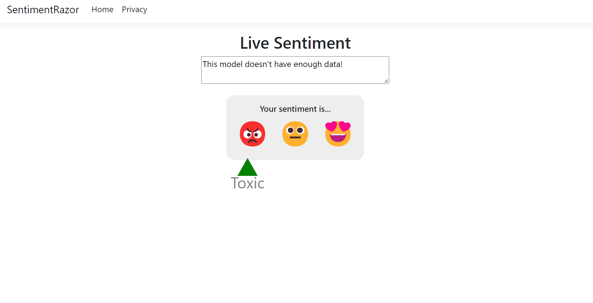

# Tutorial: Analyze sentiment of website comments in a web application using ML.NET Model Builder

Learn how to analyze sentiment from comments in real time inside a web application.

This tutorial shows you how to create an ASP.NET Core Razor Pages application that classifies sentiment from website comments in real time.

In this tutorial, you learn how to:

> [!div class="checklist"]
>
> - Create an ASP.NET Core Razor Pages application
> - Prepare and understand the data
> - Choose a scenario
> - Load the data
> - Train the model
> - Evaluate the model
> - Use the model for predictions

> [!NOTE]
> Model Builder is currently in Preview.

You can find the source code for this tutorial at the [dotnet/machinelearning-samples](https://github.com/dotnet/machinelearning-samples) repository.

## Pre-requisites

For a list of pre-requisites and installation instructions, visit the [Model Builder installation guide](../how-to-guides/install-model-builder.md).

## Create a Razor Pages application

1. Create an **ASP.NET Core Razor Pages Application**.

    1. Open Visual Studio and select **File > New > Project** from the menu bar.
    1. In the New Project dialog, select the **Visual C#** node followed by the **Web** node.
    1. Then select the **ASP.NET Core Web Application** project template.
    1. In the **Name** text box, type "SentimentRazor".
    1. Make sure **Place solution and project in the same directory** is **unchecked** (VS 2019), or **Create directory for solution** is **checked** (VS 2017).
    1. Select the **OK** button.
    1. Choose **Web Application** in the window that displays the different types of ASP.NET Core Projects, and then select the **OK** button.

## Prepare and understand the data

Download [Wikipedia detox dataset](https://raw.githubusercontent.com/dotnet/machinelearning/main/test/data/wikipedia-detox-250-line-data.tsv). When the webpage opens, right-click on the page, select **Save As** and save the file anywhere on your computer.

Each row in the *wikipedia-detox-250-line-data.tsv* dataset represents a different review left by a user on Wikipedia. The first column represents the sentiment of the text (0 is non-toxic, 1 is toxic), and the second column represents the comment left by the user. The columns are separated by tabs. The data looks like the following:

| Sentiment | SentimentText |
| :---: | :---: |
1 | ==RUDE== Dude, you are rude upload that carl picture back, or else.
1 | == OK! ==  IM GOING TO VANDALIZE WILD ONES WIKI THEN!!!
0 | I hope this helps.

## Choose a scenario


To train your model, you need to select from the list of available machine learning scenarios provided by Model Builder.

1. In **Solution Explorer**, right-click the *SentimentRazor* project, and select **Add** > **Machine Learning Model...**.
1. For this sample, the scenario is sentiment analysis. In the *scenario* step of the Model Builder tool, select the **Sentiment Analysis** scenario.

## Load the data

Model Builder accepts data from two sources, a SQL Server database or a local file in `csv` or `tsv` format.

1. In the data step of the Model Builder tool, select **File** from the data source dropdown.
1. Select the button next to the **Select a file** text box and use File Explorer to browse and select the *wikipedia-detox-250-line-data.tsv* file.
1. Choose **Sentiment** in the **Column to predict (Label)** dropdown.
1. Leave the default values for the **Input Columns (Features)** dropdown.
1. Select the **Train** link to move to the next step in the Model Builder tool.

## Train the model

The machine learning task used to train the sentiment analysis model in this tutorial is binary classification. During the model training process, Model Builder trains separate models using different binary classification algorithms and settings to find the best performing model for your dataset.

The time required for the model to train is proportionate to the amount of data. Model Builder automatically selects a default value for **Time to train (seconds)** based on the size of your data source.

1. Although Model Builder sets the value of **Time to train (seconds)** to 10 seconds, increase it to 30 seconds. Training for a longer period of time allows Model Builder to explore a larger number of algorithms and combination of parameters in search of the best model.
1. Select **Start Training**.

    Throughout the training process, progress data is displayed in the `Progress` section of the train step.

    - Status displays the completion status of the training process.
    - Best accuracy displays the accuracy of the best performing model found by Model Builder so far. Higher accuracy means the model predicted more correctly on test data.
    - Best algorithm displays the name of the best performing algorithm performed found by Model Builder so far.
    - Last algorithm displays the name of the algorithm most recently used by Model Builder to train the model.

1. Once training is complete, select the **evaluate** link to move to the next step.

## Evaluate the model

The result of the training step will be one model that has the best performance. In the evaluate step of the Model Builder tool, the output section will contain the algorithm used by the best-performing model in the **Best Model** entry along with metrics in **Best Model Accuracy**. Additionally, a summary table containing the top five models and their metrics is shown.

If you're not satisfied with your accuracy metrics, some easy ways to try to improve model accuracy are to increase the amount of time to train the model or use more data. Otherwise, select the **code** link to move to the final step in the Model Builder tool.

## Add the code to make predictions

Two projects will be created as a result of the training process.

### Reference the trained model

1. In the *code* step of the Model Builder tool, select **Add Projects** to add the autogenerated projects to the solution.

    The following projects should appear in the **Solution Explorer**:

    - *SentimentRazorML.ConsoleApp*: A .NET Core Console application that contains the model training and prediction code.
    - *SentimentRazorML.Model*: A .NET Standard class library containing the data models that define the schema of input and output model data as well as the saved version of the best performing model during training.

    For this tutorial, only the *SentimentRazorML.Model* project is used because predictions will be made in the *SentimentRazor* web application rather than in the console. Although the *SentimentRazorML.ConsoleApp* won't be used for scoring, it can be used to retrain the model using new data at a later time. Retraining is outside the scope of this tutorial though.

### Configure the PredictionEngine pool

To make a single prediction, you have to create a <xref:Microsoft.ML.PredictionEngine%602>. <xref:Microsoft.ML.PredictionEngine%602> is not thread-safe. Additionally, you have to create an instance of it everywhere it's needed within your application. As your application grows, this process can become unmanageable. For improved performance and thread safety, use a combination of dependency injection and the `PredictionEnginePool` service, which creates an <xref:Microsoft.Extensions.ObjectPool.ObjectPool%601> of <xref:Microsoft.ML.PredictionEngine%602> objects for use throughout your application.

1. Install the *Microsoft.Extensions.ML* NuGet package:

    1. In **Solution Explorer**, right-click the project and select **Manage NuGet Packages**.
    1. Choose "nuget.org" as the Package source.
    1. Select the **Browse** tab and search for **Microsoft.Extensions.ML**.
    1. Select the package in the list, and select the **Install** button.
    1. Select the **OK** button on the **Preview Changes** dialog
    1. Select the **I Accept** button on the **License Acceptance** dialog if you agree with the license terms for the packages listed.

1. Open the *Startup.cs* file in the *SentimentRazor* project.
1. Add the following using statements to reference the *Microsoft.Extensions.ML* NuGet package and *SentimentRazorML.Model* project:

    ```csharp
    using System.IO;
    using Microsoft.Extensions.ML;
    using SentimentRazorML.Model;
    ```

1. Create a global variable to store the location of the trained model file.

    ```csharp
    private readonly string _modelPath;
    ```

1. The model file is stored in the build directory alongside the assembly files of your application. To make it easier to access, create a helper method called `GetAbsolutePath` after the `Configure` method

    ```csharp
    public static string GetAbsolutePath(string relativePath)
    {
        FileInfo _dataRoot = new FileInfo(typeof(Program).Assembly.Location);
        string assemblyFolderPath = _dataRoot.Directory.FullName;

        string fullPath = Path.Combine(assemblyFolderPath, relativePath);
        return fullPath;
    }
    ```

1. Use the `GetAbsolutePath` method in the `Startup` class constructor to set the `_modelPath`.

    ```csharp
    _modelPath = GetAbsolutePath("MLModel.zip");
    ```

1. Configure the `PredictionEnginePool` for your application in the `ConfigureServices` method:

    ```csharp
    services.AddPredictionEnginePool<ModelInput, ModelOutput>()
            .FromFile(_modelPath);
    ```

### Create sentiment analysis handler

Predictions will be made inside the main page of the application. Therefore, a method that takes the user input and uses the `PredictionEnginePool` to return a prediction needs to be added.

1. Open the *Index.cshtml.cs* file located in the *Pages* directory and add the following using statements:

    ```csharp
    using Microsoft.Extensions.ML;
    using SentimentRazorML.Model;
    ```

    In order to use the `PredictionEnginePool` configured in the `Startup` class, you have to inject it into the constructor of the model where you want to use it.

1. Add a variable to reference the `PredictionEnginePool` inside the `IndexModel` class.

    ```csharp
    private readonly PredictionEnginePool<ModelInput, ModelOutput> _predictionEnginePool;
    ```

1. Create a constructor in the `IndexModel` class and inject the `PredictionEnginePool` service into it.

    ```csharp
    public IndexModel(PredictionEnginePool<ModelInput, ModelOutput> predictionEnginePool)
    {
        _predictionEnginePool = predictionEnginePool;
    }
    ```

1. Create a method handler that uses the `PredictionEnginePool` to make predictions from user input received from the web page.

    1. Below the `OnGet` method, create a new method called `OnGetAnalyzeSentiment`

        ```csharp
        public IActionResult OnGetAnalyzeSentiment([FromQuery] string text)
        {

        }
        ```

    1. Inside the `OnGetAnalyzeSentiment` method, return *Neutral* sentiment if the input from the user is blank or null.

        ```csharp
        if (String.IsNullOrEmpty(text)) return Content("Neutral");
        ```

    1. Given a valid input, create a new instance of `ModelInput`.

        ```csharp
        var input = new ModelInput { SentimentText = text };
        ```

    1. Use the `PredictionEnginePool` to predict sentiment.

        ```csharp
        var prediction = _predictionEnginePool.Predict(input);
        ```

    1. Convert the predicted `bool` value into toxic or not toxic with the following code.

        ```csharp
        var sentiment = Convert.ToBoolean(prediction.Prediction) ? "Toxic" : "Not Toxic";
        ```

    1. Finally, return the sentiment back to the web page.

        ```csharp
        return Content(sentiment);
        ```

### Configure the web page

The results returned by the `OnGetAnalyzeSentiment` will be dynamically displayed on the `Index` web page.

1. Open the *Index.cshtml* file in the *Pages* directory and replace its contents with the following code:

    [!code-cshtml [IndexPage](~/machinelearning-samples/samples/modelbuilder/BinaryClassification_Sentiment_Razor/SentimentRazor/Pages/Index.cshtml)]

1. Next, add css styling code to the end of the *site.css* page in the *wwwroot\css* directory:

    [!code-css [CssStyling](~/machinelearning-samples/samples/modelbuilder/BinaryClassification_Sentiment_Razor/SentimentRazor/wwwroot/css/site.css#L61-L105)]

1. After that, add code to send inputs from the web page to the `OnGetAnalyzeSentiment` handler.

    1. In the *site.js* file located in the *wwwroot\js* directory, create a function called `getSentiment` to make a GET HTTP request with the user input to the `OnGetAnalyzeSentiment` handler.

        [!code-javascript [GetSentimentMethod](~/machinelearning-samples/samples/modelbuilder/BinaryClassification_Sentiment_Razor/SentimentRazor/wwwroot/js/site.js#L5-L10)]

    1. Below that, add another function called `updateMarker` to dynamically update the position of the marker on the web page as sentiment is predicted.

        [!code-javascript [UpdateMarkerMethod](~/machinelearning-samples/samples/modelbuilder/BinaryClassification_Sentiment_Razor/SentimentRazor/wwwroot/js/site.js#L12-L15)]

    1. Create an event handler function called `updateSentiment` to get the input from the user, send it to the `OnGetAnalyzeSentiment` function using the `getSentiment` function and update the marker with the `updateMarker` function.

        [!code-javascript [UpdateSentimentMethod](~/machinelearning-samples/samples/modelbuilder/BinaryClassification_Sentiment_Razor/SentimentRazor/wwwroot/js/site.js#L17-L34)]

    1. Finally, register the event handler and bind it to the `textarea` element with the `id=Message` attribute.

        [!code-javascript [UpdateSentimentEvtHandler](~/machinelearning-samples/samples/modelbuilder/BinaryClassification_Sentiment_Razor/SentimentRazor/wwwroot/js/site.js#L36)]

## Run the application

Now that your application is set up, run the application, which should launch in your browser.

When the application launches, enter *Model Builder is cool!* into the text area. The predicted sentiment displayed should be *Not Toxic*.



If you need to reference the Model Builder generated projects at a later time inside of another solution, you can find them inside the `C:\Users\%USERNAME%\AppData\Local\Temp\MLVSTools` directory.

## Next steps

In this tutorial, you learned how to:
> [!div class="checklist"]
>
> - Create an ASP.NET Core Razor Pages application
> - Prepare and understand the data
> - Choose a scenario
> - Load the data
> - Train the model
> - Evaluate the model
> - Use the model for predictions

### Additional Resources

To learn more about topics mentioned in this tutorial, visit the following resources:

- [Model Builder Scenarios](../automate-training-with-model-builder.md#scenario)
- [Binary Classification](../resources/glossary.md#binary-classification)
- [Binary Classification Model Metrics](../resources/metrics.md#evaluation-metrics-for-binary-classification)
