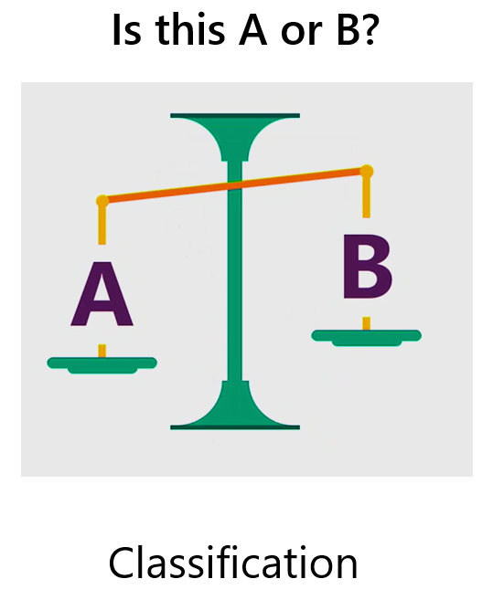

# Tutorial: Use ML.NET in a sentiment analysis binary classification scenario

This sample tutorial illustrates using ML.NET to create a sentiment classifier to predict either positive or negative sentiment via a .NET Core console application using C# in Visual Studio 2017. In the world of machine learning, this type of prediction is known as binary classification.

> [!NOTE]
> This topic refers to ML.NET, which is currently in Preview, and material may be subject to change. For more information, visit [the ML.NET introduction](https://www.microsoft.com/net/learn/apps/machine-learning-and-ai/ml-dotnet).

This tutorial and related sample are currently using **ML.NET version 0.11**. For more information, see the release notes at the [dotnet/machinelearning GitHub repo](https://github.com/dotnet/machinelearning/tree/master/docs/release-notes)

In this tutorial, you learn how to:
> [!div class="checklist"]
> * Understand the problem
> * Select the appropriate machine learning algorithm
> * Prepare your data
> * Transform the data
> * Train the model
> * Evaluate the model
> * Predict with the trained model
> * Deploy and Predict with a loaded model

## Sentiment analysis sample overview

The sample is a console app that uses ML.NET to train a model that classifies and predicts sentiment as either positive or negative. The Yelp sentiment dataset is from University of California, Irvine (UCI), which is split into a train dataset and a test dataset. The sample evaluates the model with the test dataset for quality analysis. 

You can find the source code for this tutorial at the [dotnet/samples](https://github.com/dotnet/samples/tree/master/machine-learning/tutorials/SentimentAnalysis) repository.

## Prerequisites

* [Visual Studio 2017 15.6 or later](https://visualstudio.microsoft.com/downloads/?utm_medium=microsoft&utm_source=docs.microsoft.com&utm_campaign=inline+link&utm_content=download+vs2017) with the ".NET Core cross-platform development" workload installed.

* [The UCI Sentiment Labeled Sentences dataset zip file](https://archive.ics.uci.edu/ml/machine-learning-databases/00331/sentiment%20labelled%20sentences.zip)

### Understand the problem

The problem for this tutorial is to understand incoming website comment sentiment to take the appropriate action.

You can break down the problem to the sentiment text and sentiment value for the data you want to train the model with, and a predicted sentiment value that you can evaluate and then use operationally.

You then need to **determine** the sentiment, which helps you with the machine learning task selection.

## Select the appropriate machine learning algorithm

With this problem, you know the following facts:

Training data: website comments can be positive (1) or negative (0) (**sentiment**).

Predict the **sentiment** of a new website comment, either positive or negative, such as in the following examples:

* I love the wait staff here. They rock.
* This place has the worst soup.

The classification machine learning algorithm is best suited for this scenario.

### About the classification algorithm



Classification is a machine learning algorithm that uses data to **determine** the category, type, or class of an item or row of data. For example, you can use classification to:

* Identify sentiment as positive or negative.
* Classify email as spam, junk, or good.
* Determine whether a patient's lab sample is cancerous.
* Categorize customers by their propensity to respond to a sales campaign.

Classification algorithms are frequently one of the following types:

* Binary: either A or B.
* Multiclass: multiple categories that can be predicted by using a single model.

Because the website comments need to be classified as either positive or negative, you use the Binary Classification algorithm.

## Create a console application

1. Open Visual Studio 2017. Select **File** > **New** > **Project** from the menu bar. In the **New Project** dialog, select the **Visual C#** node followed by the **.NET Core** node. Then select the **Console App (.NET Core)** project template. In the **Name** text box, type "SentimentAnalysis" and then select the **OK** button.

2. Create a directory named *Data* in your project to save your data set files:

    In **Solution Explorer**, right-click on your project and select **Add** > **New Folder**. Type "Data" and hit Enter.

3. Install the **Microsoft.ML NuGet Package**:

    In Solution Explorer, right-click on your project and select **Manage NuGet Packages**. Choose "nuget.org" as the Package source, select the Browse tab, search for **Microsoft.ML**, select that package in the list, and select the **Install** button. Select the **OK** button on the **Preview Changes** dialog and then select the **I Accept** button on the **License Acceptance** dialog if you agree with the license terms for the packages listed.

### Prepare your data

1. Download [The UCI Sentiment Labeled Sentences dataset zip file (see citations in the following note)](https://archive.ics.uci.edu/ml/machine-learning-databases/00331/sentiment%20labelled%20sentences.zip), and unzip.

2. Copy the `yelp_labelled.txt` file into the *Data* directory you created.

> [!NOTE]
> The datasets this tutorial uses are from the 'From Group to Individual Labels using Deep Features', Kotzias et. al,. KDD 2015, and hosted at the UCI Machine Learning Repository - Dua, D. and Karra Taniskidou, E. (2017). UCI Machine Learning Repository [http://archive.ics.uci.edu/ml]. Irvine, CA: University of California, School of Information and Computer Science.

3. In Solution Explorer, right-click the `yelp_labeled.txt` file and select **Properties**. Under **Advanced**, change the value of **Copy to Output Directory** to **Copy if newer**.

### Create classes and define paths

Add the following additional `using` statements to the top of the *Program.cs* file:

[!code-csharp[AddUsings](~/samples/machine-learning/tutorials/SentimentAnalysis/Program.cs#AddUsings "Add necessary usings")]

You need to create two global fields to hold the recently downloaded dataset file path and the saved model file path:

* `_dataPath` has the path to the dataset used to train the model.
* `_modelPath` has the path where the trained model is saved.

Add the following code to the line right above the `Main` method to specify those paths:

[!code-csharp[Declare global variables](~/samples/machine-learning/tutorials/SentimentAnalysis/Program.cs#DeclareGlobalVariables "Declare global variables")]

You need to create some classes for your input data and predictions. Add a new class to your project:

1. In **Solution Explorer**, right-click the project, and then select **Add** > **New Item**.

1. In the **Add New Item** dialog box, select **Class** and change the **Name** field to *SentimentData.cs*. Then, select the **Add** button.

    The *SentimentData.cs* file opens in the code editor. Add the following `using` statement to the top of *SentimentData.cs*:

[!code-csharp[AddUsings](~/samples/machine-learning/tutorials/SentimentAnalysis/SentimentData.cs#AddUsings "Add necessary usings")]

Remove the existing class definition and add the following code, which has two classes `SentimentData` and `SentimentPrediction`, to the *SentimentData.cs* file:

[!code-csharp[DeclareTypes](~/samples/machine-learning/tutorials/SentimentAnalysis/SentimentData.cs#DeclareTypes "Declare data record types")]

The input dataset class, `SentimentData`, has a `string` for the comment (`SentimentText`) and a `bool` (`Sentiment`) that has a value for sentiment of either positive (1) or negative (0). Both fields have [LoadColumn](xref:Microsoft.ML.Data.LoadColumnAttribute.%23ctor%28System.Int32%29) attributes attached to them, which describes the data file order of each field.  In addition, the `Sentiment` property has a [ColumnName](xref:Microsoft.ML.Data.ColumnNameAttribute.%23ctor%2A) attribute to designate it as the `Label` field. The following example file doesn't have a header row, and looks like this:

|SentimentText                         |Sentiment (Label) |
|--------------------------------------|----------|
|Waitress was a little slow in service.|    0     |
|Crust is not good.                    |    0     |
|Wow... Loved this place.              |    1     |
|Service was very prompt.              |    1     |

`SentimentPrediction` is the prediction class used after the model training. It has a single boolean (`Sentiment`) and a `PredictedLabel` `ColumnName` attribute. The `Label` is used to create and train the model, and it's also used with the split out test dataset to evaluate the model. The `PredictedLabel` is used during prediction and evaluation. For evaluation, training data, the predicted values, and the model are used.

The [MLContext class](xref:Microsoft.ML.MLContext) is a starting point for all ML.NET operations, and initializing `mlContext` creates a new ML.NET environment that can be shared across the model creation workflow objects. It's similar, conceptually, to `DBContext` in Entity Framework.

### Initialize variables in Main

Replace the `Console.WriteLine("Hello World!")` line with the following code in the `Main` method:

[!code-csharp[CreateMLContext](~/samples/machine-learning/tutorials/SentimentAnalysis/Program.cs#CreateMLContext "Create the ML Context")]

The previous code creates a variable called `mlContext` and initializes it with a new instance of `MLContext`.

Add the following as the next line of code in the `Main` method:

[!code-csharp[CallLoadData](~/samples/machine-learning/tutorials/SentimentAnalysis/Program.cs#CallLoadData)]

The `LoadData` method executes the following tasks:

* Loads the data.
* Splits the loaded dataset into train and test datasets.
* Returns the split train and test datasets.

Create the `LoadData` method, just after the `Main` method, using the following code:

```csharp
public static TrainCatalogBase.TrainTestData LoadData(MLContext mlContext)
{

}
```

## Load the data

There are three major concepts in ML.NET: [Data](../basic-concepts-model-training-in-mldotnet.md#data), [Transformers](../basic-concepts-model-training-in-mldotnet.md#transformer), and [Estimators](../basic-concepts-model-training-in-mldotnet.md#estimator).

Data in ML.NET is represented as an [IDataView class](xref:Microsoft.ML.IDataView). `IDataView` is a flexible, efficient way of describing tabular data (numeric and text). Data can be loaded from a text file or in real time (for example, SQL database or log files) to an `IDataView` object.
Add the following code as the first line of the `LoadData` method:

[!code-csharp[LoadData](~/samples/machine-learning/tutorials/SentimentAnalysis/Program.cs#LoadData "loading dataset")]

The [LoadFromTextFile()](xref:Microsoft.ML.TextLoaderSaverCatalog.LoadFromTextFile%60%601%28Microsoft.ML.DataOperationsCatalog,System.String,System.Char,System.Boolean,System.Boolean,System.Boolean,System.Boolean%29) defines the data schema and reads in the file. It takes in the data path variables and returns an `IDataView`.

### Split the dataset for model training and testing

Next, you need both a training dataset to train the model and a test dataset to evaluate the model.

To split the loaded data into the needed datasets, add the following code as the next line in the `LoadData` method:

[!code-csharp[SplitData](~/samples/machine-learning/tutorials/SentimentAnalysis/Program.cs#SplitData "Split the Data")]

The previous code uses the [TrainTestSplit()](xref:Microsoft.ML.DataOperationsCatalog.TrainTestSplit%2A) method to split the loaded dataset into train and test datasets and return them inside of the [TrainTestData](xref:Microsoft.ML.DataOperationsCatalog.TrainTestData) class. Specify the test set percentage of data with the `testFraction`parameter. The default is 10% but you use 20% in this case to evaluate more data.  

Return the `splitDataView` at the end of the `LoadData` method:

[!code-csharp[ReturnSplitData](~/samples/machine-learning/tutorials/SentimentAnalysis/Program.cs#ReturnSplitData)]

## Build and train the model

Add the following call to the `BuildAndTrainModel`method as the next line of code in the `Main` method:

[!code-csharp[CallBuildAndTrainModel](~/samples/machine-learning/tutorials/SentimentAnalysis/Program.cs#CallBuildAndTrainModel)]

The `BuildAndTrainModel` method executes the following tasks:

* Extracts and transforms the data.
* Trains the model.
* Predicts sentiment based on test data.
* Returns the model.

Create the `BuildAndTrainModel` method, just after the `Main` method, using the following code:

```csharp
public static ITransformer BuildAndTrainModel(MLContext mlContext, IDataView splitTrainSet)
{

}
```

Notice that two parameters are passed into the Train method; a `MLContext` for the context (`mlContext`), and an `IDataView`for the training dataset (`splitTrainSet`).

## Extract and transform the data

Pre-processing and cleaning data are important tasks that occur before a dataset is used effectively for machine learning. Raw data is often noisy and unreliable, and may be missing values. Using data without these modeling tasks can produce misleading results.

Call `FeaturizeText` as the next line of code:

[!code-csharp[FeaturizeText](~/samples/machine-learning/tutorials/SentimentAnalysis/Program.cs#FeaturizeText "Featurize the text")]

The `FeaturizeText()` method in the previous code converts the text column (`SentimentText`) into a numeric key type `Features` column used by the machine learning algorithm and adds it as a new dataset column:

|SentimentText                         |Sentiment |Features              |
|--------------------------------------|----------|----------------------|
|Waitress was a little slow in service.|    0     |[0.76, 0.65, 0.44, …] |
|Crust is not good.                    |    0     |[0.98, 0.43, 0.54, …] |
|Wow... Loved this place.              |    1     |[0.35, 0.73, 0.46, …] |
|Service was very prompt.              |    1     |[0.39, 0, 0.75, …]    |

>[!WARNING]
> ML.NET Version 0.10 changed the order of the Transform parameters. This will not error out until you run the application and build the model. Use the parameter names for Transforms as illustrated in the previous code snippet.

This is the preprocessing/featurization step. Using additional components available in ML.NET can enable better results with your model.

## Choose a learning algorithm

Choose the machine learning algorithm and append it to the data transformation definitions by adding the following as the next line of code in `BuildAndTrainModel()`:

[!code-csharp[FastTreeBinaryClassificationTrainer](~/samples/machine-learning/tutorials/SentimentAnalysis/Program.cs#AddTrainer "Add a FastTreeBinaryClassificationTrainer")]

The [FastTreeBinaryClassificationTrainer](xref:Microsoft.ML.Trainers.FastTree.FastTreeBinaryClassificationTrainer) is your classification training algorithm. This is appended to the `estimator` and accepts the featurized `SentimentText` (`Features`) and the `Label` input parameters to learn from the historic data.

## Train the model

Fit the model to the `Train` data and return the trained model by adding the following as the next line of code in the `BuildAndTrainModel()` method:

[!code-csharp[TrainModel](~/samples/machine-learning/tutorials/SentimentAnalysis/Program.cs#TrainModel "Train the model")]

The [Fit()](xref:Microsoft.ML.Trainers.MatrixFactorizationTrainer.Fit%28Microsoft.ML.IDataView,Microsoft.ML.IDataView%29) method trains your model with the provided training dataset. It executes the `Estimator` definitions by transforming the data and applying the training, and it returns back the trained model, which is a `Transformer`.

### Return the model trained to use for evaluation

 Return the model at the end of the `BuildAndTrainModel` method:

[!code-csharp[ReturnModel](~/samples/machine-learning/tutorials/SentimentAnalysis/Program.cs#ReturnModel "Return the model")]

## Evaluate the model

After your model is trained, use your test data to evaluate how your model is performing for quality assurance and validation. Create the `Evaluate` method, just after `BuildAndTrainModel`, with the following code:

```csharp
public static void Evaluate(MLContext mlContext, ITransformer model, IDataView splitTestSet)
{

}
```

The `Evaluate` method executes the following tasks:

* Loads the test dataset.
* Creates the BinaryClassification evaluator.
* Evaluates the model and creates metrics.
* Displays the metrics.

Add a call to the new method from the `Main` method, right under the `Train` method call, using the following code:

[!code-csharp[CallEvaluate](~/samples/machine-learning/tutorials/SentimentAnalysis/Program.cs#CallEvaluate "Call the Evaluate method")]

Transform the `splitTestSet` data by adding the following code to `Evaluate()`:

[!code-csharp[PredictWithTransformer](~/samples/machine-learning/tutorials/SentimentAnalysis/Program.cs#TransformData "Predict using the Transformer")]

The previous code uses the [Transform()](xref:Microsoft.ML.ITransformer.Transform%2A) method to make predictions for multiple provided input rows of a test dataset.

Evaluate the model by adding the following as the next line of code in the `Evaluate()` method:

[!code-csharp[ComputeMetrics](~/samples/machine-learning/tutorials/SentimentAnalysis/Program.cs#Evaluate "Compute Metrics")]

Once you have the prediction set (`predictions`), the [Evaluate()](xref:Microsoft.ML.BinaryClassificationCatalog.Evaluate%2A) method assesses the model, which compares the predicted values with the actual `Labels` in the test dataset and returns a[CalibratedBinaryClassificationMetrics](xref:Microsoft.ML.Data.CalibratedBinaryClassificationMetrics) object on how the model is performing.

### Displaying the metrics for model validation

Use the following code to display the metrics, share the results, and then act on them:

[!code-csharp[DisplayMetrics](~/samples/machine-learning/tutorials/SentimentAnalysis/Program.cs#DisplayMetrics "Display selected metrics")]

To save your model to a .zip file before returning, add the following code to call the `SaveModelAsFile` method as the next line in `Evaluate`:

[!code-csharp[SaveModel](~/samples/machine-learning/tutorials/SentimentAnalysis/Program.cs#CallSaveModel "Save the model")]

## Save the model as a.zip file

Create the `SaveModelAsFile` method, just after the `Evaluate` method, using the following code:

```csharp
private static void SaveModelAsFile(MLContext mlContext, ITransformer model)
{

}
```

The `SaveModelAsFile` method executes the following tasks:

* Saves the model as a .zip file.

Next, create a method to save the model so that it can be reused and consumed in other applications. The `ITransformer` has a <xref:Microsoft.ML.Data.TransformerChain%601.SaveTo(Microsoft.ML.IHostEnvironment,System.IO.Stream)> method that takes in the `_modelPath` global field, and a <xref:System.IO.Stream>. To save this as a zip file, you'll create the `FileStream` immediately before calling the `SaveTo` method. Add the following code to the `SaveModelAsFile` method as the next line:

[!code-csharp[SaveToMethod](~/samples/machine-learning/tutorials/SentimentAnalysis/Program.cs#SaveModel "Add the SaveTo Method")]

You could also display where the file was written by writing a console message with the `_modelPath`, using the following code:

```csharp
Console.WriteLine("The model is saved to {0}", _modelPath);
```

## Predict the test data outcome with the saved model

Create the `UseModelWithSingleItem` method, just after the `Evaluate` method, using the following code:

```csharp
private static void UseModelWithSingleItem(MLContext mlContext, ITransformer model)
{

}
```

The `UseModelWithSingleItem` method executes the following tasks:

* Creates a single comment of test data.
* Predicts sentiment based on test data.
* Combines test data and predictions for reporting.
* Displays the predicted results.

Add a call to the new method from the `Main` method, right under the `Evaluate` method call, using the following code:

[!code-csharp[CallUseModelWithSingleItem](~/samples/machine-learning/tutorials/SentimentAnalysis/Program.cs#CallUseModelWithSingleItem "Call the UseModelWithSingleItem method")]

The [PredictionEngine](xref:Microsoft.ML.PredictionEngine%602) is a convenience API, which allows you to pass in and then perform a prediction on a single instance of data. add the following code to create as the first line in the `Predict` Method:

[!code-csharp[CreatePredictionEngine](~/samples/machine-learning/tutorials/SentimentAnalysis/Program.cs#CreatePredictionEngine1 "Create the PredictionEngine")]
  
Add a comment to test the trained model's prediction in the `Predict` method by creating an instance of `SentimentData`:

[!code-csharp[PredictionData](~/samples/machine-learning/tutorials/SentimentAnalysis/Program.cs#CreateTestIssue1 "Create test data for single prediction")]

Pass the test comment data to the `Prediction Engine` by adding the following as the next lines of code in the `CallUseModelWithSingleItem()` method:

[!code-csharp[Predict](~/samples/machine-learning/tutorials/SentimentAnalysis/Program.cs#Predict "Create a prediction of sentiment")]

The [Predict()](xref:Microsoft.ML.PredictionEngine%602.Predict%2A) function makes a prediction on a single column of data.

### Use the model: prediction

Display `SentimentText` and corresponding sentiment prediction in order to share the results and act on them accordingly.  Create a display for the results using the following <xref:System.Console.WriteLine?displayProperty=nameWithType> code:

[!code-csharp[OutputPrediction](~/samples/machine-learning/tutorials/SentimentAnalysis/Program.cs#OutputPrediction "Display prediction output")]

## Deploy and Predict with a loaded model

Create the `UseLoadedModelWithBatchItems` method, just before the `SaveModelAsFile` method, using the following code:

```csharp
public static void UseLoadedModelWithBatchItems(MLContext mlContext)
{

}
```

The `UseLoadedModelWithBatchItems` method executes the following tasks:

* Creates batch test data.
* Predicts sentiment based on test data.
* Combines test data and predictions for reporting.
* Displays the predicted results.

Add a call to the new method from the `Main` method, right under the `UseModelWithSingleItem` method call, using the following code:

[!code-csharp[CallPredictModelLoaded](~/samples/machine-learning/tutorials/SentimentAnalysis/Program.cs#CallUseLoadedModelWithBatchItems "Call the CallUseLoadedModelWithBatchItems method")]

Add some comments to test the trained model's predictions in the `UseLoadedModelWithBatchItems` method:

[!code-csharp[PredictionData](~/samples/machine-learning/tutorials/SentimentAnalysis/Program.cs#CreateTestIssues "Create test data for predictions")]

Load the model

[!code-csharp[LoadTheModel](~/samples/machine-learning/tutorials/SentimentAnalysis/Program.cs#LoadModel "Load the model")]

Now that you have a model, you can use that to predict the  comment data sentiment using the [Transform()](xref:Microsoft.ML.ITransformer.Transform%2A) method. To get a prediction, use `Predict` on new data.  Add the following code to the `UseLoadedModelWithBatchItems` method for the predictions:

[!code-csharp[Predict](~/samples/machine-learning/tutorials/SentimentAnalysis/Program.cs#Prediction "Create predictions of sentiments")]

### Use the loaded model for prediction

Display `SentimentText` and corresponding sentiment prediction in order to share the results and act on them accordingly. This is called operationalization, using the returned data as part of the operational policies. Create a header for the results using the following <xref:System.Console.WriteLine?displayProperty=nameWithType> code:

[!code-csharp[OutputHeaders](~/samples/machine-learning/tutorials/SentimentAnalysis/Program.cs#AddInfoMessage "Display prediction outputs")]

Before displaying the predicted results, combine the sentiment and prediction together to see the original comment with its predicted sentiment. The following code uses the <xref:System.Linq.Enumerable.Zip%2A> method to make that happen, so add that code next:

[!code-csharp[BuildTuples](~/samples/machine-learning/tutorials/SentimentAnalysis/Program.cs#BuildSentimentPredictionPairs "Build the pairs of sentiment data and predictions")]

Now that you've combined the `SentimentText` and `Sentiment` into a class, you can display the results using the <xref:System.Console.WriteLine?displayProperty=nameWithType> method:

[!code-csharp[DisplayPredictions](~/samples/machine-learning/tutorials/SentimentAnalysis/Program.cs#DisplayResults "Display the predictions")]

Because inferred tuple element names are a new feature in C# 7.1 and the default language version of the project is C# 7.0, you need to change the language version to C# 7.1 or higher.
To do that, right-click on the project node in **Solution Explorer** and select **Properties**. Select the **Build** tab and select the **Advanced** button. In the dropdown, select  **C# 7.1** (or a higher version). Select the **OK** button.

## Results

Your results should be similar to the following. As the pipeline processes, it displays messages. You may see warnings, or processing messages. These have been removed from the following results for clarity.

```console
Model quality metrics evaluation
--------------------------------
Accuracy: 83.96%
Auc: 90.51%
F1Score: 84.21%

=============== End of model evaluation ===============
The model is saved to C:\Tutorials\SentimentAnalysis\bin\Debug\netcoreapp2.1\Data\Model.zip

=============== Prediction Test of model with a single sample and test dataset ===============

Sentiment: This was a very bad steak | Prediction: Negative | Probability: 0.1136748
=============== End of Predictions ===============


=============== Prediction Test of loaded model with a multiple samples ===============

Sentiment: This was a horrible meal | Prediction: Negative | Probability: 0.1468145
Sentiment: I love this spaghetti. | Prediction: Positive | Probability: 0.9963465
=============== End of predictions ===============

=============== End of process ===============
Press any key to continue . . .

```

Congratulations! You've now successfully built a machine learning model for classifying and predicting messages sentiment.

Building successful models is an iterative process. This model has initial lower quality as the tutorial uses small datasets to provide quick model training. If you aren't satisfied with the model quality, you can try to improve it by providing larger training datasets or by choosing different training algorithms with different hyper-parameters for each algorithm.

You can find the source code for this tutorial at the [dotnet/samples](https://github.com/dotnet/samples/tree/master/machine-learning/tutorials/SentimentAnalysis) repository.

## Next steps

In this tutorial, you learned how to:
> [!div class="checklist"]
> * Understand the problem
> * Select the appropriate machine learning algorithm
> * Prepare your data
> * Transform the data
> * Train the model
> * Evaluate the model
> * Predict with the trained model
> * Deploy and Predict with a loaded model

Advance to the next tutorial to learn more
> [!div class="nextstepaction"]
> [Issue Classification](github-issue-classification.md)
