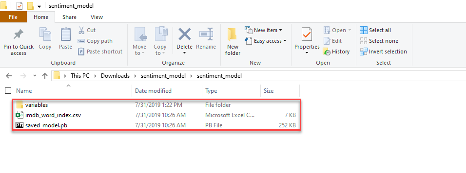

# Tutorial: Analyze sentiment of website comments with binary classification using TensorFlow in ML.NET

This tutorial shows you how to use a pre-trained TensorFlow model to classify sentiment in website comments. The binary sentiment classifier is a C# console application developed using Visual Studio.

The TensorFlow model used in this tutorial was trained using movie reviews from the IMDB database. Once you have finished developing the application, you will be able to supply movie review text and the application will tell you whether the review has positive or negative sentiment.

In this tutorial, you learn how to:
> [!div class="checklist"]
> * Load a pre-trained TensorFlow model
> * Transform website comment text into features suitable for the model
> * Use the model to make a prediction

You can find the source code for this tutorial at the [dotnet/samples](https://github.com/dotnet/samples/tree/master/machine-learning/tutorials/TextClassificationTF) repository.

## Prerequisites

* [Visual Studio 2017 15.6 or later](https://visualstudio.microsoft.com/downloads/?utm_medium=microsoft&utm_source=docs.microsoft.com&utm_campaign=inline+link&utm_content=download+vs2019) with the ".NET Core cross-platform development" workload installed.

* [The sentiment_analysis machine learning model Zip file](https://github.com/dotnet/machinelearning-testdata/blob/master/Microsoft.ML.TensorFlow.TestModels/sentiment_model)

## Setup

1. Create a **.NET Core Console Application** called "TextClassificationTF".

2. Create a directory named *Data* in your project to save your data set files.

3. Install the **Microsoft.ML NuGet Package**:

    In Solution Explorer, right-click on your project and select **Manage NuGet Packages**. Choose "nuget.org" as the package source, and then select the **Browse** tab. Search for **Microsoft.ML**, select the package you want, and then select the **Install** button. Proceed with the installation by agreeing to the license terms for the package you choose. Repeat these steps for **Microsoft.ML.TensorFlow**.

> [!NOTE]
> The model for this tutorial is from the [dotnet/machinelearning-testdata](https://github.com/dotnet/machinelearning-testdata/tree/master/Microsoft.ML.TensorFlow.TestModels/sentiment_model) GitHub repo. The model is in 'SavedModel' format.

### Download the dataset and model

1. Download the [sentiment_model zip file](https://github.com/dotnet/samples/blob/master/machine-learning/models/textclassificationtf/sentiment_model.zip?raw=true), and unzip.

    The zip file contains:

    - `imdb_word_index.csv`: a mapping from individual words to an integer value. The mapping is used to generate the input features for the TensorFlow model
    - `saved_model.pb`: the TensorFlow model itself. The model takes a fixed length (size 600) integer array of features representing the text in an IMDB review string, and outputs a value indicating whether the text has positive or negative sentiment 

2. Copy the contents of the innermost `sentiment_model` directory into your *TextClassificationTF* project `sentiment_model` directory. This directory contains the model and additional support files needed for this tutorial, as shown in the following image:

   

3. In Solution Explorer, right-click each of the files in the `sentiment_model` directory and subdirectory and select **Properties**. Under **Advanced**, change the value of **Copy to Output Directory** to **Copy if newer**.

### Create classes and define paths

1. Add the following additional `using` statements to the top of the *Program.cs* file:

   [!code-csharp[AddUsings](../../../samples/machine-learning/tutorials/TextClassificationTF/Program.cs#AddUsings "Add necessary usings")]

1. Create two global fields to hold the recently downloaded dataset file path and the saved model file path:

    * `_modelPath` is the file path of the trained model.
    * `FeatureLength` is the length of the integer feature array that the model is expecting.

    Add the following code to the line right above the `Main` method to add these variables:

   [!code-csharp[DeclareGlobalVariables](../../../samples/machine-learning/tutorials/TextClassificationTF/Program.cs#DeclareGlobalVariables "Declare global variables")]

1. Next, create classes for your input data and predictions. Add a new class to your project:

    * In **Solution Explorer**, right-click the project, and then select **Add** > **New Item**.

    * In the **Add New Item** dialog box, select **Class** and change the **Name** field to *IMDBData.cs*. Then, select the **Add** button.

1. The *IMDBData.cs* file opens in the code editor. Add the following `using` statement to the top of *IMDBData.cs*:

   [!code-csharp[AddUsings](~/samples/machine-learning/tutorials/TextClassificationTF/IMDBData.cs#AddUsings "Add necessary usings")]

1. Remove the existing class definition and add the following code, which has two classes `IMDBSentiment` and `IMDBPrediction`, to the *IMDBData.cs* file:

   [!code-csharp[DeclareTypes](~/samples/machine-learning/tutorials/TextClassificationTF/IMDBData.cs#DeclareTypes "Declare data record types")]

### Model the input data and output predictions

Movie reviews are free form text. Your application converts the text into the input format expected by the model in a number of discrete stages.

1. The first is to split the text into separate words and use the provided mapping file to map each word onto an integer encoding. The result of this transformation is a variable length integer array with a length corresponding to the number of words in the sentence.

    |Property| Value|Type|
    |-------------|-----------------------|------|
    |SentimentText|this film is really bad|string|
    |VariableLengthFeatures|14,22,9,66,78,... |int[]|

    This data is modeled using the following classes:

    - The input data class, `IMDBSentiment`, has a `string` for user comments (`SentimentText`) and an `integer` array (`VariableLengthFeatures`)  In addition, the `VariableLengthFeatures` property has a [VectorType](xref:Microsoft.ML.Data.VectorTypeAttribute.%23ctor%2A) attribute to designate the vector type.  All of the vector elements must be the same type. In data sets with a large number of columns, loading multiple columns as a single vector reduces the number of data passes when you apply data transformations.

1. Create a class called `IntermediateFeatures` to hold the fixed-length feature data.
    
    The following example illustrates IntermediateFeatures:

    |Property| Value|Type|
    |-------------|-----------------------|------|
    |SentimentText|this film is really bad|string|
    |Features|14,22,9,66,78,... |int[600]|

   Add the `IntermediateFeatures` class definition after the `Main()` method:

    [!code-csharp[DeclareIntermediateFeatures](~/samples/machine-learning/tutorials/TextClassificationTF/Program.cs#DeclareIntermediateFeatures)]

1. `IMDBPrediction` is the prediction class used after the model training. `IMDBPrediction` has a single `float` array (`Prediction`) and a `VectorType` attribute.

### Create the MLContext for the application

The [MLContext class](xref:Microsoft.ML.MLContext) is a starting point for all ML.NET operations. Initializing `mlContext` creates a new ML.NET environment that can be shared across the model creation workflow objects. It's similar, conceptually, to `DBContext` in Entity Framework.

1. Replace the `Console.WriteLine("Hello World!")` line in the `Main` method with the following code to declare and initialize the mlContext variable:

   [!code-csharp[CreateMLContext](~/samples/machine-learning/tutorials/TextClassificationTF/Program.cs#CreateMLContext "Create the ML Context")]

1. Create a dictionary to encode words as integers by using the [`LoadFromTextFile`](xref:Microsoft.ML.TextLoaderSaverCatalog.LoadFromTextFile%2A) method to load mapping data from a file, as seen in the following table:

    |Word     |Index    |
    |---------|---------|
    |kids     |  362    |
    |want     |  181    |
    |wrong    |  355    |
    |effects  |  302    |
    |feeling  |  547    |

    Add the following code below the creation of the MLContext object:

    [!code-csharp[CreateLookupMap](~/samples/machine-learning/tutorials/TextClassificationTF/Program.cs#CreateLookupMap)]

1. Add an `Action` to resize the word integer array to a fixed size, with the next lines of code:

   [!code-csharp[ResizeFeatures](~/samples/machine-learning/tutorials/TextClassificationTF/Program.cs#ResizeFeatures)]

## Load the pre-trained TensorFlow model

1. Add code to load the TensorFlow model:

    [!code-csharp[LoadTensorFlowModel](~/samples/machine-learning/tutorials/TextClassificationTF/Program.cs#LoadTensorFlowModel)]

    Once the model is loaded, you can extract its input and output schema. The schemas are displayed for interest and learning only. You do not need this code for the final application to function:

    [!code-csharp[GetModelSchema](~/samples/machine-learning/tutorials/TextClassificationTF/Program.cs#GetModelSchema)]

    The input schema is the fixed-length array of integer encoded words. The output schema is a float array of probabilities of being negative, or positive sentiment. These values will sum to 1, as the probability of being positive is the complement of the probability of the sentiment being negative.

## Create the ML.NET pipeline

1. Create the pipeline and split the input text into words using [TokenizeIntoWords](xref:Microsoft.ML.TextCatalog.TokenizeIntoWords%2A) transform to break the text into words as the next line of code:

   [!code-csharp[TokenizeIntoWords](~/samples/machine-learning/tutorials/TextClassificationTF/Program.cs#TokenizeIntoWords)]

   The [TokenizeIntoWords](xref:Microsoft.ML.TextCatalog.TokenizeIntoWords%2A) transform uses spaces to parse the text/string into words. It creates a new column and splits each input string to a vector of substrings based on the user-defined separator.

1. Map the words onto their integer encoding using the lookup table that you declared above:

    [!code-csharp[MapValue](~/samples/machine-learning/tutorials/TextClassificationTF/Program.cs#MapValue)]

1. Resize the variable length integer encodings to the fixed-length one required by the model:

    [!code-csharp[CustomMapping](~/samples/machine-learning/tutorials/TextClassificationTF/Program.cs#CustomMapping)]

1. Classify the input with the loaded TensorFlow model:

    [!code-csharp[ScoreTensorFlowModel](~/samples/machine-learning/tutorials/TextClassificationTF/Program.cs#ScoreTensorFlowModel)]

1. Create a new column for the output prediction:

    [!code-csharp[SnippetCopyColumns](~/samples/machine-learning/tutorials/TextClassificationTF/Program.cs#SnippetCopyColumns)]

    The TensorFlow model output is called `Prediction/Softmax`. Copy that into a column called `Prediction` for convenience.

## Create the ML.NET model from the pipeline

1. Add the code to create the model from the pipeline:

    [!code-csharp[SnippetCreateModel](~/samples/machine-learning/tutorials/TextClassificationTF/Program.cs#SnippetCreateModel)]  

    An ML.NET model is created from the chain of estimators in the pipeline by calling the `Fit` method. In this case, we are not fitting any data to create the model, as the TensorFlow model has already been previously trained. We supply an empty data view object to satisfy the requirements of the `Fit` method.

## Use the model to make a prediction

1. Add the `PredictSentiment` skeleton below the `Main` method.

    ```csharp
        public static void PredictSentiment(MLContext mlContext, ITransformer model)
        {

        }
    ```

1. Add the following code to create the `PredictionEngine` as the first line in the `PredictSentiment()` Method:

    [!code-csharp[CreatePredictionEngine](~/samples/machine-learning/tutorials/TextClassificationTF/Program.cs#CreatePredictionEngine)]

    The [PredictionEngine](xref:Microsoft.ML.PredictionEngine%602) is a convenience API, which allows you to pass in and then perform a prediction on a single instance of data.

1. Add a comment to test the trained model's prediction in the `Predict()` method by creating an instance of `IMDBSentiment`:

    [!code-csharp[CreateTestData](~/samples/machine-learning/tutorials/TextClassificationTF/Program.cs#CreateTestData)]

1. Pass the test comment data to the `Prediction Engine` by adding the next lines of code in the `PredictSentiment()` method:

    [!code-csharp[Predict](~/samples/machine-learning/tutorials/TextClassificationTF/Program.cs#Predict)]

1. The [Predict()](xref:Microsoft.ML.PredictionEngine%602.Predict%2A) function makes a prediction on a single row of data. The following example illustrates IMDBSentimentPrediction:

    |Property| Value|Type|
    |-------------|-----------------------|------|
    |Prediction|0.5459937,0.454006255,...|float[]|

1. Display sentiment prediction and confidence using the following code:

    [!code-csharp[DisplayPredictions](~/samples/machine-learning/tutorials/TextClassificationTF/Program.cs#DisplayPredictions)]

## Results

Your results should be similar to the following. During processing, messages are displayed. You may see warnings, or processing messages. These messages have been removed from the following results for clarity.

```console
   Number of classes: 2
   Is sentiment/review positive ? Yes
```

Congratulations! You've now successfully built a machine learning model for classifying and predicting messages sentiment by reusing a pre-trained `TensorFlow` model in ML.NET.

You can find the source code for this tutorial at the [dotnet/samples](https://github.com/dotnet/samples/tree/master/machine-learning/tutorials/TextClassificationTF) repository.

In this tutorial, you learned how to:
> [!div class="checklist"]
> * Load a pre-trained TensorFlow model
> * Transform website comment text into features suitable for the model
> * Use the model to make a prediction
