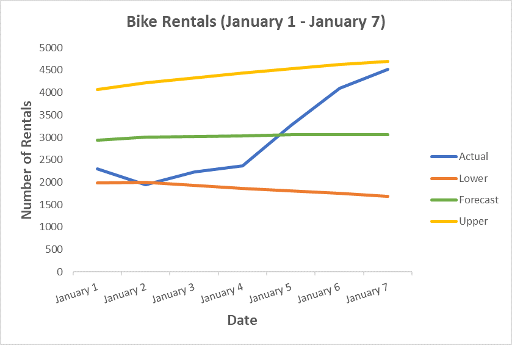

# Tutorial: Forecast bike rental service demand with time series analysis and ML.NET

Learn how to forecast demand for a bike rental service using univariate time series analysis on data stored in a SQL Server database with ML.NET.

In this tutorial, you learn how to:
> [!div class="checklist"]
>
> * Understand the problem
> * Load data from a database
> * Create a forecasting model
> * Evaluate forecasting model
> * Save a forecasting model
> * Use a forecasting model

## Prerequisites

- [Visual Studio 2022](https://visualstudio.microsoft.com/downloads/) with the ".NET Desktop Development" workload installed.

## Time series forecasting sample overview

This sample is a **C# .NET Core console application** that forecasts demand for bike rentals using a univariate time series analysis algorithm known as Singular Spectrum Analysis. The code for this sample can be found on the [dotnet/machinelearning-samples](https://github.com/dotnet/machinelearning-samples/tree/main/samples/csharp/getting-started/Forecasting_BikeSharingDemand) repository on GitHub.

## Understand the problem

In order to run an efficient operation, inventory management plays a key role. Having too much of a product in stock means unsold products sitting on the shelves not generating any revenue. Having too little product leads to lost sales and customers purchasing from competitors. Therefore, the constant question is, what is the optimal amount of inventory to keep on hand? Time-series analysis helps provide an answer to these questions by looking at historical data, identifying patterns, and using this information to forecast values some time in the future.

The technique for analyzing data used in this tutorial is univariate time-series analysis. Univariate time-series analysis takes a look at a single numerical observation over a period of time at specific intervals such as monthly sales.

The algorithm used in this tutorial is [Singular Spectrum Analysis(SSA)](http://ssa.cf.ac.uk/zhigljavsky/pdfs/SSA/SSA_encyclopedia.pdf). SSA works by decomposing a time-series into a set of principal components. These components can be interpreted as the parts of a signal that correspond to trends, noise, seasonality, and many other factors. Then, these components are reconstructed and used to forecast values some time in the future.

## Create console application

1. Create a C# **Console Application** called "BikeDemandForecasting". Click the **Next** button.

1. Choose .NET 6 as the framework to use. Click the **Create** button.

1. Install **Microsoft.ML** version NuGet package

    [!INCLUDE [mlnet-current-nuget-version](../../../includes/mlnet-current-nuget-version.md)]

    1. In Solution Explorer, right-click on your project and select **Manage NuGet Packages**.
    1. Choose "nuget.org" as the Package source, select the **Browse** tab, search for **Microsoft.ML**.
    1. Check the **Include prerelease** checkbox.
    1. Select the **Install** button.
    1. Select the **OK** button on the **Preview Changes** dialog and then select the **I Accept** button on the License Acceptance dialog if you agree with the license terms for the packages listed.
    1. Repeat these steps for **System.Data.SqlClient** and **Microsoft.ML.TimeSeries**.

### Prepare and understand the data

1. Create a directory called *Data*.
1. Download the [*DailyDemand.mdf* database file](https://github.com/dotnet/machinelearning-samples/raw/main/samples/csharp/getting-started/Forecasting_BikeSharingDemand/BikeDemandForecasting/Data/DailyDemand.mdf) and save it to the *Data* directory.

> [!NOTE]
> The data used in this tutorial comes from the [UCI Bike Sharing Dataset](http://archive.ics.uci.edu/ml/datasets/bike+sharing+dataset). Fanaee-T, Hadi, and Gama, Joao, 'Event labeling combining ensemble detectors and background knowledge', Progress in Artificial Intelligence (2013): pp. 1-15, Springer Berlin Heidelberg, [Web Link](https://link.springer.com/article/10.1007%2Fs13748-013-0040-3).

The original dataset contains several columns corresponding to seasonality and weather. For brevity and because the algorithm used in this tutorial only requires the values from a single numerical column, the original dataset has been condensed to include only the following columns:

- **dteday**: The date of the observation.
- **year**: The encoded year of the observation (0=2011, 1=2012).
- **cnt**: The total number of bike rentals for that day.

The original dataset is mapped to a database table with the following schema in a SQL Server database.

```sql
CREATE TABLE [Rentals] (
    [RentalDate] DATE NOT NULL,
    [Year] INT NOT NULL,
    [TotalRentals] INT NOT NULL
);
```

The following is a sample of the data:

| RentalDate | Year | TotalRentals |
| --- | --- | --- |
|1/1/2011|0|985|
|1/2/2011|0|801|
|1/3/2011|0|1349|

### Create input and output classes

1. Open *Program.cs* file and replace the existing `using` statements with the following:

    [!code-csharp [ProgramUsings](~/machinelearning-samples/samples/csharp/getting-started/Forecasting_BikeSharingDemand/BikeDemandForecasting/Program.cs#L1-L8)]

1. Create `ModelInput` class. Below the `Program` class, add the following code.

    [!code-csharp [ModelInputClass](~/machinelearning-samples/samples/csharp/getting-started/Forecasting_BikeSharingDemand/BikeDemandForecasting/Program.cs#L120-L127)]

    The `ModelInput` class contains the following columns:

    - **RentalDate**: The date of the observation.
    - **Year**: The encoded year of the observation (0=2011, 1=2012).
    - **TotalRentals**: The total number of bike rentals for that day.

1. Create `ModelOutput` class below the newly created `ModelInput` class.

    [!code-csharp [ModelOutputClass](~/machinelearning-samples/samples/csharp/getting-started/Forecasting_BikeSharingDemand/BikeDemandForecasting/Program.cs#L129-L136)]

    The `ModelOutput` class contains the following columns:

    - **ForecastedRentals**: The predicted values for the forecasted period.
    - **LowerBoundRentals**: The predicted minimum values for the forecasted period.
    - **UpperBoundRentals**: The predicted maximum values for the forecasted period.

### Define paths and initialize variables

1. Below the using statements define variables to store the location of your data, connection string, and where to save the trained model.

    [!code-csharp [DefinePaths](~/machinelearning-samples/samples/csharp/getting-started/Forecasting_BikeSharingDemand/BikeDemandForecasting/Program.cs#L16-L19)]

1. Initialize the `mlContext` variable with a new instance of [`MLContext`](xref:Microsoft.ML.MLContext) by adding the following line after defining the paths.

    [!code-csharp [MLContext](~/machinelearning-samples/samples/csharp/getting-started/Forecasting_BikeSharingDemand/BikeDemandForecasting/Program.cs#L21)]

    The [`MLContext`](xref:Microsoft.ML.MLContext) class is a starting point for all ML.NET operations, and initializing mlContext creates a new ML.NET environment that can be shared across the model creation workflow objects. It's similar, conceptually, to `DBContext` in Entity Framework.

## Load the data

1. Create `DatabaseLoader` that loads records of type `ModelInput`.

    [!code-csharp [CreateDBLoader](~/machinelearning-samples/samples/csharp/getting-started/Forecasting_BikeSharingDemand/BikeDemandForecasting/Program.cs#L23)]

1. Define the query to load the data from the database.

    [!code-csharp [DefineSQLQuery](~/machinelearning-samples/samples/csharp/getting-started/Forecasting_BikeSharingDemand/BikeDemandForecasting/Program.cs#L25)]

    ML.NET algorithms expect data to be of type [`Single`](xref:System.Single). Therefore, numerical values coming from the database that are not of type [`Real`](xref:System.Data.SqlDbType), a single-precision floating-point value, have to be converted to [`Real`](xref:System.Data.SqlDbType).

    The `Year` and `TotalRental` columns are both integer types in the database. Using the `CAST` built-in function, they are both cast to `Real`.

1. Create a `DatabaseSource` to connect to the database and execute the query.

    [!code-csharp [CreateDBSource](~/machinelearning-samples/samples/csharp/getting-started/Forecasting_BikeSharingDemand/BikeDemandForecasting/Program.cs#L27-L29)]

1. Load the data into an `IDataView`.

    [!code-csharp [LoadData](~/machinelearning-samples/samples/csharp/getting-started/Forecasting_BikeSharingDemand/BikeDemandForecasting/Program.cs#L31)]

1. The dataset contains two years worth of data. Only data from the first year is used for training, the second year is held out to compare the actual values against the forecast produced by the model. Filter the data using the [`FilterRowsByColumn`](xref:Microsoft.ML.DataOperationsCatalog.FilterRowsByColumn%2A) transform.

    [!code-csharp [SplitData](~/machinelearning-samples/samples/csharp/getting-started/Forecasting_BikeSharingDemand/BikeDemandForecasting/Program.cs#L33-L34)]

    For the first year, only the values in the `Year` column less than 1 are selected by setting the `upperBound` parameter to 1. Conversely, for the second year, values greater than or equal to 1 are selected by setting the `lowerBound` parameter to 1.

## Define time series analysis pipeline

1. Define a pipeline that uses the [SsaForecastingEstimator](xref:Microsoft.ML.Transforms.TimeSeries.SsaForecastingEstimator) to forecast values in a time-series dataset.

    [!code-csharp [DefinePipeline](~/machinelearning-samples/samples/csharp/getting-started/Forecasting_BikeSharingDemand/BikeDemandForecasting/Program.cs#L36-L45)]

    The `forecastingPipeline` takes 365 data points for the first year and samples or splits the time-series dataset into 30-day (monthly) intervals as specified by the `seriesLength` parameter. Each of these samples is analyzed through weekly or a 7-day window. When determining what the forecasted value for the next period(s) is, the values from previous seven days are used to make a prediction. The model is set to forecast seven periods into the future as defined by the `horizon` parameter. Because a forecast is an informed guess, it's not always 100% accurate. Therefore, it's good to know the range of values in the best and worst-case scenarios as defined by the upper and lower bounds. In this case, the level of confidence for the lower and upper bounds is set to 95%. The confidence level can be increased or decreased accordingly. The higher the value, the wider the range is between the upper and lower bounds to achieve the desired level of confidence.

1. Use the [`Fit`](xref:Microsoft.ML.Transforms.TimeSeries.SsaForecastingEstimator.Fit%2A) method to train the model and fit the data to the previously defined `forecastingPipeline`.

    [!code-csharp [TrainModel](~/machinelearning-samples/samples/csharp/getting-started/Forecasting_BikeSharingDemand/BikeDemandForecasting/Program.cs#L47)]

## Evaluate the model

Evaluate how well the model performs by forecasting next year's data and comparing it against the actual values.

1. Create a new utility method called `Evaluate` at the bottom of the **Program.cs** file.

    ```csharp
    Evaluate(IDataView testData, ITransformer model, MLContext mlContext)
    {

    }
    ```

1. Inside the `Evaluate` method, forecast the second year's data by using the [`Transform`](xref:Microsoft.ML.ITransformer.Transform%2A) method with the trained model.

    [!code-csharp [EvaluateForecast](~/machinelearning-samples/samples/csharp/getting-started/Forecasting_BikeSharingDemand/BikeDemandForecasting/Program.cs#L62)]

1. Get the actual values from the data by using the [`CreateEnumerable`](xref:Microsoft.ML.DataOperationsCatalog.CreateEnumerable%2A) method.

    [!code-csharp [GetActualRentals](~/machinelearning-samples/samples/csharp/getting-started/Forecasting_BikeSharingDemand/BikeDemandForecasting/Program.cs#L65-L67)]

1. Get the forecast values by using the [`CreateEnumerable`](xref:Microsoft.ML.DataOperationsCatalog.CreateEnumerable%2A) method.

    [!code-csharp [GetForecastRentals](~/machinelearning-samples/samples/csharp/getting-started/Forecasting_BikeSharingDemand/BikeDemandForecasting/Program.cs#L70-L72)]

1. Calculate the difference between the actual and forecast values, commonly referred to as the error.

    [!code-csharp [CalculateError](~/machinelearning-samples/samples/csharp/getting-started/Forecasting_BikeSharingDemand/BikeDemandForecasting/Program.cs#L75)]

1. Measure performance by computing the Mean Absolute Error and Root Mean Squared Error values.

    [!code-csharp [CalculateMetrics](~/machinelearning-samples/samples/csharp/getting-started/Forecasting_BikeSharingDemand/BikeDemandForecasting/Program.cs#L78-L79)]

    To evaluate performance, the following metrics are used:

    - **Mean Absolute Error**: Measures how close predictions are to the actual value. This value ranges between 0 and infinity. The closer to 0, the better the quality of the model.
    - **Root Mean Squared Error**: Summarizes the error in the model. This value ranges between 0 and infinity. The closer to 0, the better the quality of the model.

1. Output the metrics to the console.

    [!code-csharp [OutputMetrics](~/machinelearning-samples/samples/csharp/getting-started/Forecasting_BikeSharingDemand/BikeDemandForecasting/Program.cs#L82-L85)]

1. Call the `Evaluate` method below calling the `Fit()` method.

    [!code-csharp [EvaluateModel](~/machinelearning-samples/samples/csharp/getting-started/Forecasting_BikeSharingDemand/BikeDemandForecasting/Program.cs#L49)]

## Save the model

If you're satisfied with your model, save it for later use in other applications.

1. Below the `Evalute()` method create a [`TimeSeriesPredictionEngine`](xref:Microsoft.ML.Transforms.TimeSeries.TimeSeriesPredictionEngine%602). [`TimeSeriesPredictionEngine`](xref:Microsoft.ML.Transforms.TimeSeries.TimeSeriesPredictionEngine%602) is a convenience method to make single predictions.

    [!code-csharp [CreateTimeSeriesEngine](~/machinelearning-samples/samples/csharp/getting-started/Forecasting_BikeSharingDemand/BikeDemandForecasting/Program.cs#L51)]

1. Save the model to a file called `MLModel.zip` as specified by the previously defined `modelPath` variable. Use the [`Checkpoint`](xref:Microsoft.ML.Transforms.TimeSeries.TimeSeriesPredictionEngine%602.CheckPoint%2A) method to save the model.

    [!code-csharp [SaveModel](~/machinelearning-samples/samples/csharp/getting-started/Forecasting_BikeSharingDemand/BikeDemandForecasting/Program.cs#L52)]

## Use the model to forecast demand

1. Below the `Evaluate` method, create a new utility method called `Forecast`.

    ```csharp
    void Forecast(IDataView testData, int horizon, TimeSeriesPredictionEngine<ModelInput, ModelOutput> forecaster, MLContext mlContext)
    {

    }
    ```

1. Inside the `Forecast` method, use the [`Predict`](xref:Microsoft.ML.Transforms.TimeSeries.TimeSeriesPredictionEngine%602.Predict%2A) method to forecast rentals for the next seven days.

    [!code-csharp [SingleForecast](~/machinelearning-samples/samples/csharp/getting-started/Forecasting_BikeSharingDemand/BikeDemandForecasting/Program.cs#L91)]

1. Align the actual and forecast values for seven periods.

    [!code-csharp [GetForecastOutput](~/machinelearning-samples/samples/csharp/getting-started/Forecasting_BikeSharingDemand/BikeDemandForecasting/Program.cs#L93-L108)]

1. Iterate through the forecast output and display it on the console.

    [!code-csharp [DisplayForecast](~/machinelearning-samples/samples/csharp/getting-started/Forecasting_BikeSharingDemand/BikeDemandForecasting/Program.cs#L111-L116)]

## Run the application

1. Below calling the `Checkpoint()` method call the `Forecast` method.

    [!code-csharp [BuildForecast](~/machinelearning-samples/samples/csharp/getting-started/Forecasting_BikeSharingDemand/BikeDemandForecasting/Program.cs#L54)]

1. Run the application. Output similar to that below should appear on the console. For brevity, the output has been condensed.

    ```text
    Evaluation Metrics
    ---------------------
    Mean Absolute Error: 726.416
    Root Mean Squared Error: 987.658

    Rental Forecast
    ---------------------
    Date: 1/1/2012
    Actual Rentals: 2294
    Lower Estimate: 1197.842
    Forecast: 2334.443
    Upper Estimate: 3471.044

    Date: 1/2/2012
    Actual Rentals: 1951
    Lower Estimate: 1148.412
    Forecast: 2360.861
    Upper Estimate: 3573.309
    ```

Inspection of the actual and forecasted values shows the following relationships:



While the forecasted values are not predicting the exact number of rentals, they provide a more narrow range of values that allows an operation to optimize their use of resources.

Congratulations! You've now successfully built a time series machine learning model to forecast bike rental demand.

You can find the source code for this tutorial at the [dotnet/machinelearning-samples](https://github.com/dotnet/machinelearning-samples/tree/main/samples/csharp/getting-started/Forecasting_BikeSharingDemand) repository.

## Next steps

- [Machine learning tasks in ML.NET](../resources/tasks.md)
- [Improve model accuracy](../resources/improve-machine-learning-model-ml-net.md)
