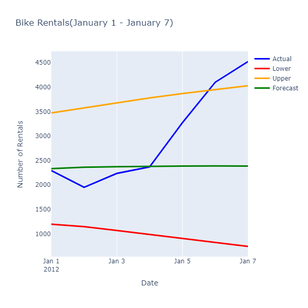

# Tutorial: Forecast bike rental service demand with ML.NET

Learn how to forecast demand for a bike rental service using univariate time-series analysis with ML.NET.

In this tutorial, you learn how to:
> [!div class="checklist"]
>
> * Understand the problem
> * Load data from a database
> * Create a time-series model
> * Use a time-series model for forecasting

## Pre-requisites

- [Visual Studio 2017 15.6 or later](https://visualstudio.microsoft.com/downloads/?utm_medium=microsoft&utm_source=docs.microsoft.com&utm_campaign=inline+link&utm_content=download+vs2017) with the ".NET Core cross-platform development" workload installed.
- [Microsoft.ML 1.4.0-preview2 NuGet Package](https://www.nuget.org/packages/Microsoft.ML/1.4.0-preview2)
- [Microsoft.ML.Experimental 0.16.0-preview2 NuGet Package](https://www.nuget.org/packages/Microsoft.ML.Experimental/0.16.0-preview2)
- [Microsoft.ML.TimeSeries 1.4.0-preview2 NuGet Package](https://www.nuget.org/packages/Microsoft.ML.TimeSeries/1.4.0-preview2)
- [System.Data.SqlClient NuGet Package](https://www.nuget.org/packages/System.Data.SqlClient/)

## Understand the problem

In order to run an efficient operation, inventory management plays a key role. Having too much of a product in stock means unsold products sitting on the shelves not generating any revenue. Having too little product leads to lost sales and customers purchasing from competitors. Therefore, the constant question is, what is the optimal amount of inventory to keep on hand? Time-series analysis helps provide an answer to this questions by looking at historical data, identifying patterns and using this information to forecast values some time in the future. 

The technique for analyzing data used in this tutorial is univariate time-series analysis. Univariate time-series analysis takes a look at a single numerical observation over a period of time at specific intervals such as montly sales. 

The algorithm used in this tutorial is [Single Spectrum Analysis](http://ssa.cf.ac.uk/zhigljavsky/pdfs/SSA/SSA_encyclopedia.pdf)(SSA). SSA works by decomposing a time-series into a set of principal components that can be interpreted as the parts of a signal that correspond to trends, noise, seasonality and many other factors.

## Set up .NET Core Console Application

### Create Console Application

1. Create a new .NET Core Console application
1. Install **Microsoft.ML** NuGet Package
    1. In Solution Explorer, right-click on your project and select **Manage NuGet Packages**.
    1. Choose "nuget.org" as the Package source, select the **Browse** tab, search for **Microsoft.ML**.
    1. Check the **Include prerelease** checkbox.
    1. Select the **Install** button.
    1. Select the **OK** button on the **Preview Changes** dialog and then select the **I Accept** button on the License Acceptance dialog if you agree with the license terms for the packages listed.
    1. Repeat these steps for **System.Data.SqlClient**, **Microsoft.ML.Experimental** and **Microsoft.ML.TimeSeries**.

### Prepare and understand the data

1. Create a directory called *Data*.
1. Download the *DailyDemand.mdf* file and save it into the *Data* directory.
1. In Solution Explorer, right-click the *DailyDemand.mdf* file and select **Properties**. Under **Advanced**, change the value of **Copy to Output Directory** to **Copy if newer**.

The data used in this tutorial comes from the [UCI Bike Sharing Dataset](https://archive.ics.uci.edu/ml/datasets/bike+sharing+dataset). Fanaee-T, Hadi, and Gama, Joao, 'Event labeling combining ensemble detectors and background knowledge', Progress in Artificial Intelligence (2013): pp. 1-15, Springer Berlin Heidelberg, [Web Link](https://link.springer.com/article/10.1007%2Fs13748-013-0040-3).

The original dataset contains several columns corresponding to seasonality and weather. For brevity and because the technique used in this tutorial only requires the values from a single numerical column, the original dataset has been enhanced to include only the following columns:  

- **dteday** the date of the observation.
- **year** the encoded year of the observation (0=2011, 1=2012).
- **cnt** the total number of bike rentals for that day.

The original dataset is mapped to a database table with the following schema in a SQL Server database.

```sql
CREATE TABLE [Rentals] (
	[RentalDate] DATE NOT NULL,
	[Year] INT NOT NULL,
	[TotalRentals] INT NOT NULL
);
```

The following is a sample of the data:

| RentalDate | Year | TotalRentals |
| --- | --- | --- |
|1/1/2011|0|985|
|1/2/2011|0|801|
|1/3/2011|0|1349|

### Create classes and define paths

1. Open *Program.cs* file and replace the exisitng `using` statements with the following:

    ```csharp
    using System;
    using System.Collections.Generic;
    using System.Data.SqlClient;
    using System.IO;
    using System.Linq;
    using Microsoft.ML;
    using Microsoft.ML.Data;
    using Microsoft.ML.Transforms.TimeSeries;
    ```

1. Create `ModelInput` class. Below the `Program` class, add the following code.

    ```csharp
    public class ModelInput
    {
        public DateTime RentalDate { get; set; }

        public float Year { get; set; }

        public float TotalRentals { get; set; }
    }
    ```

    The `ModelInput` class contains the following columns:

    - **RentalDate** the date of the observation.
    - **Year** the encoded year of the observation (0=2011, 1=2012).
    - **TotalRentals** the total number of bike rentals for that day.

1. Create `ModelOutput` class below the newly created `ModelInput` class.

    ```csharp
    public class ModelOutput
    {
        public float[] ForecastedDemand { get; set; }

        public float[] ConfidenceLowerBound { get; set; }

        public float[] ConfidenceUpperBound { get; set; }
    }
    ```

    The `ModelOutput` class contains the following columns:

    - **ForecastedDemand** the predicted values for the forecasted period.
    - **ConfidenceLowerBound** the predicted minimum values for the forecasted period.
    - **ConfidenceUpperBound** the predicted maximmum values for the forecasted period.

1. Define path where the database file is located as well as the connection string inside the `Main` method.

    ```csharp
    string dbFilePath = Path.Combine(AppDomain.CurrentDomain.BaseDirectory, "Data", "trips.mdf");
    var connectionString = $"Data Source=(LocalDB)\\MSSQLLocalDB;AttachDbFilename={dbFilePath};Integrated Security=True;Connect Timeout=30";
    ```

### Initialize variables

The [`MLContext`]() class is a starting point for all ML.NET operations, and initializing mlContext creates a new ML.NET environment that can be shared across the model creation workflow objects. It's similar, conceptually, to `DBContext` in Entity Framework.

Initialize the mlContext variable with a new instance of [`MLContext`]() by adding the following line to the `Main` method of *Program.cs*

```csharp
MLContext mlContext = new MLContext();
```

## Load the data

1. Create `DatabaseLoader` that loads records of type `ModelInput`.

    ```csharp
    DatabaseLoader loader = mlContext.Data.CreateDatabaseLoader<ModelInput>();
    ```

1. Define query to extract the data

    ML.NET algorithms expect data to be of type `Single`. Therefore, numerical values coming from the database have to be of `REAL` type.

    ```sql
    SELECT RentalDate, CAST(Year as REAL) as Year, CAST(TotalRentals as REAL) as TotalRentals FROM Rentals;
    ```

    The `Year` and `TotalRental` columns are both integer types in the database. Using the `CAST` built-in function, they are both cast to `REAL`.

1. Create a `DatabaseSource` to connect to the database and execute the query.

    ```csharp
    DatabaseSource dbSource = new DatabaseSource(SqlClientFactory.Instance,
                                                connectionString,
                                                query);
    ```

1. Load the data into an `IDataView`.

    ```csharp
    IDataView dataView = loader.Load(dbSource);
    ```

1. The dataset contains two years worth of data. Only data from the first year is used for training, the second year will be held out to compare the actual values against the forecast produced by the model. Filter the data using the `FilterRowsByColumn` transform. 

    ```csharp
    IDataView firstYearData = mlContext.Data.FilterRowsByColumn(dataView, "Year", upperBound: 1);
    IDataView secondYearData = mlContext.Data.FilterRowsByColumn(dataView, "Year", lowerBound: 1);
    ```

    For the first year, only the values in the `Year` column less than 1 are selected by setting the `upperBound` parameter to 1. Conversely, for the second year, values greater than or equal to 1 are selected by setting the `lowerBound` parameter to 1.

## Define time-series analysis pipeline

1. Define a pipeline that uses the Single Spectrum Analysis algorithm to forecast values in a time-series dataset.

    ```csharp
    var forecastingPipeline = mlContext.Forecasting.ForecastBySsa(
        outputColumnName: "ForecastedDemand",
        inputColumnName: "TotalRentals",
        windowSize: 7,
        seriesLength: 30,
        trainSize: 365,
        horizon: 7,
        confidenceLevel: 0.90f,
        confidenceLowerBoundColumn: "ConfidenceLowerBound",
        confidenceUpperBoundColumn: "ConfidenceUpperBound");
    ```

    The pipeline defines the following parameters:

    - **outputColumnName** the name of the column where forecast values are output to.
    - **inputColumnName** the name of the column containing the time-series data analyzed by the algorithm.
    - **windowsSize** the lookback period. A good rule of thumb for this value is seriesLength / 3.
    - **seriesLength** specifies the sampling size of the time-series. 
    - **trainSize** the total number of observations in the dataset. 
    - **horizon** determines how periods ahead to forecast values. 
    - **confidenceLevel** the degree of confidence to use for forecast values. The higher this value, the wider the forcasted lower and upper bounds.
    - **confidenceLowerBoundColumn** the name of the column containing the minimum forecasted values. This column states that it expects to see at least this many units.
    - **confidenceLowerBoundColumn** the name of the column containing the maximum forecasted values. This column states that it expects to see at most this many units.

    This pipeline samples or splits the time-series dataset into 30-day (monthly) intervals. Each of these samples is analyzed through weekly or 7-day windows. When determining what the forecasted value for the next period(s) is, the window containing the values from the previous 7 days is used to make a prediction. Because a forecast is an informed guess, it's not always 100% accurate. Therefore, it's good to know the range of values in the best/worst-case scenarios as defined by the upper and lower bounds as well.

1. Fit the data from the first year to the pipeline.

    ```csharp
    SsaForecastingTransformer forecaster = forecastingPipeline.Fit(firstYearData);
    ```

## Use the model to forecast rentals

1. Below the `Main` method, create a new method called `Forecast`.

    ```csharp
    private static void Forecast(IDataView testData, int horizon, ITransformer model, MLContext mlContext)
    {

    }
    ```

1. Create a `TimeSeriesPredictionEngine` to create a forecast.

    ```csharp
    TimeSeriesPredictionEngine<ModelInput, ModelOutput> forecaster =
                    model.CreateTimeSeriesEngine<ModelInput, ModelOutput>(mlContext);
    ```
1. Use the `Predict` method to forecast rentals for the next seven days.

    ```csharp
    ModelOutput forecast = forecaster.Predict();
    ```

1. Map the first seven days of the dataset containing data from 2012 to the forecasted values.

    ```csharp
    IEnumerable<string> forecastOutput =
        mlContext.Data.CreateEnumerable<ModelInput>(testData, reuseRowObject: false)
            .Take(horizon)
            .Select((ModelInput rental, int index) =>
            {
                string rentalDate = rental.RentalDate.ToShortDateString();
                float actualRentals = rental.TotalRentals;
                float lowerEstimate = Math.Max(0,forecast.ConfidenceLowerBound[index]);
                float estimate = forecast.ForecastedDemand[index];
                float upperEstimate = forecast.ConfidenceUpperBound[index];
                return $"Date: {rentalDate}\n" +
                $"Actual Rentals: {actualRentals}\n" +
                $"Lower Estimate: {lowerEstimate}\n" +
                $"Forecast: {estimate}\n" +
                $"Upper Estimate: {upperEstimate}\n";
            });
    ```

1. Iterate through the forecast output and output it to the console.

    ```csharp
    // Output predictions
    Console.WriteLine("Rental Forecast");
    Console.WriteLine("---------------------\n");
    foreach (var prediction in forecastOutput)
    {
        Console.WriteLine(prediction);
        Console.WriteLine("---------------------\n");
    }
    ```

## Run the application

1. Inside the `Main` method, call the `Forecast` method.

    ```csharp
    Forecast(secondYearData, 7, forecaster, mlContext);
    ```

1. Run the application. Output similar to that below should appear on the console. For brevity, the output has been condensed.

    ```text
    Rental Forecast
    ---------------------

    Date: 1/1/2012
    Actual Rentals: 2294
    Lower Estimate: 1982.662
    Forecast: 2936.528
    Upper Estimate: 3890.393

    ---------------------

    Date: 1/2/2012
    Actual Rentals: 1951
    Lower Estimate: 1992.866
    Forecast: 3010.385
    Upper Estimate: 4027.903

    ---------------------
    ```


Inspection of the actual and forecasted values shows the following relationships:



While the forecasted values are not exactly predicting the number, they provide a more narrow range of values that allows an operation to optimize their use of resources. 

Congratulations! You've now successfully built a time-series machine learning model for forecasting bike rental demand.

You can find the source code for this tutorial at the [dotnet/machinelearning-samples](https://github.com/dotnet/machinelearning-samples/tree/master/samples/csharp/getting-started) repository.

In this tutorial, you learned how to:
> [!div class="checklist"]
>
> * Understand the problem
> * Load data from a database
> * Create a time-series model
> * Use a time-series model for forecasting