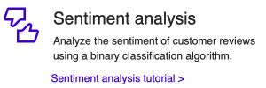
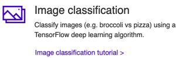

# ML.NET Documentation

ML.NET is a free, open-source and cross-platform machine learning framework that aims to make machine learning approachable and accessible for .NET developers. 

Using ML.NET, developers can leverage their existing tools and skillsets to develop and infuse custom AI into their .NET applications by creating custom machine learning models.

|  |  |
| ------------- |:-------------:| -----:|

## ML.NET Scenarios and Tutorials

You can use ML.NET for a variety of machine learning scenarios and app types. Try out one of the tutorials below to understand how to use ML.NET to build custom machine learning solutions and integrate them into your .NET applications:

| | | |
| ------------- |:-------------:| -----:|
|  |  |  |
|  |  |   |
| | |

You can find more scenarios in the [ML.NET samples repo on GitHub](https://github.com/dotnet/machinelearning-samples).
 