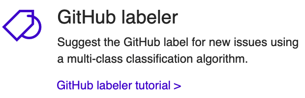
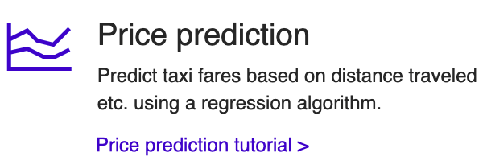
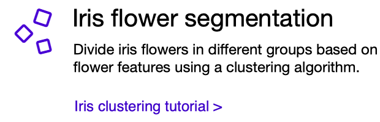

# ML.NET Documentation

ML.NET is a free, open-source and cross-platform machine learning framework for .NET developers.
 
ML.NET aims to make machine learning **approachable** and **accessible** to .NET developers, without requiring a data science background (though data scientists are welcomed and encouraged to use ML.NET too!).

|  | |
| ------------- |:-------------:| -----:|

## ML.NET Scenarios

You can use ML.NET for a variety of scenarios and app types.

Try out the following tutorials to understand how to use ML.NET to build custom machine learning solutions and integrate them into your .NET applications:

| | | |
| ------------- |:-------------:| -----:|
|  | |  |
| |  |   |
 