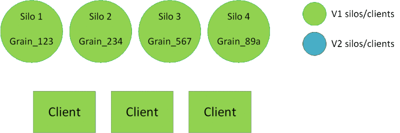

# Deploy new versions of grains

In this article, you learn how to deploy new versions of grains in .NET Orleans.

## Rolling upgrade

With the rolling upgrade methodology, you deploy newer silos directly into your environment. This is the simplest method, but interrupting an ongoing deployment and rolling back can be difficult.

Recommended configuration:

- <xref:Orleans.Configuration.GrainVersioningOptions.DefaultCompatibilityStrategy> set to <xref:Orleans.Versions.Compatibility.BackwardCompatible>.
- <xref:Orleans.Configuration.GrainVersioningOptions.DefaultVersionSelectorStrategy> set to <xref:Orleans.Versions.Selector.AllCompatibleVersions>.

```csharp
var silo = new HostBuilder()
    .UseOrleans(builder =>
    {
        builder.Configure<GrainVersioningOptions>(options =>
        {
            options.DefaultCompatibilityStrategy = nameof(BackwardCompatible);
            options.DefaultVersionSelectorStrategy = nameof(AllCompatibleVersions);
        })
    })
    .Build();
```

When using this configuration, "old" clients can talk to activations on both versions of silos. Newer clients and silos only trigger new activations on newer silos.



## Use a staging environment

With the staging environment methodology, you need a second environment (staging environment) where you deploy newer silos before stopping the production environment. The production and staging silos and clients are **part of the same cluster**. Silos from both environments must be able to communicate with each other.

Recommended configuration:

- <xref:Orleans.Configuration.GrainVersioningOptions.DefaultCompatibilityStrategy> set to <xref:Orleans.Versions.Compatibility.BackwardCompatible>.
- <xref:Orleans.Configuration.GrainVersioningOptions.DefaultVersionSelectorStrategy> set to <xref:Orleans.Versions.Selector.MinimumVersion>.

```csharp
var silo = new HostBuilder()
    .UseOrleans(builder =>
    {
        builder.Configure<GrainVersioningOptions>(options =>
        {
            options.DefaultCompatibilityStrategy = nameof(BackwardCompatible);
            options.DefaultVersionSelectorStrategy = nameof(MinimumVersion);
        })
    })
    .Build();
```

Suggested deployment steps:

1. "V1" silos and clients are deployed and running in the production slot.
2. "V2" silos and clients begin starting in the staging slot. They join the same cluster as the production slot. No "V2" activations are created yet.
3. Once the deployment in the staging slot finishes, you can redirect some traffic to the V2 clients (for smoke tests, targeted beta users, etc.). This creates V2 activations. Since grains are backward compatible and all silos are in the same cluster, no duplicate activations are created.
4. If validation is successful, proceed to VIP swap. If not, you can safely shut down the staging cluster: existing V2 activations are destroyed, and V1 activations are created if needed.
5. V1 activations naturally "migrate" to V2 silos eventually. You can safely shut down the V1 silos.

> [!WARNING]
> Remember that stateless workers aren't versioned and that streaming agents also start in the staging environment.
