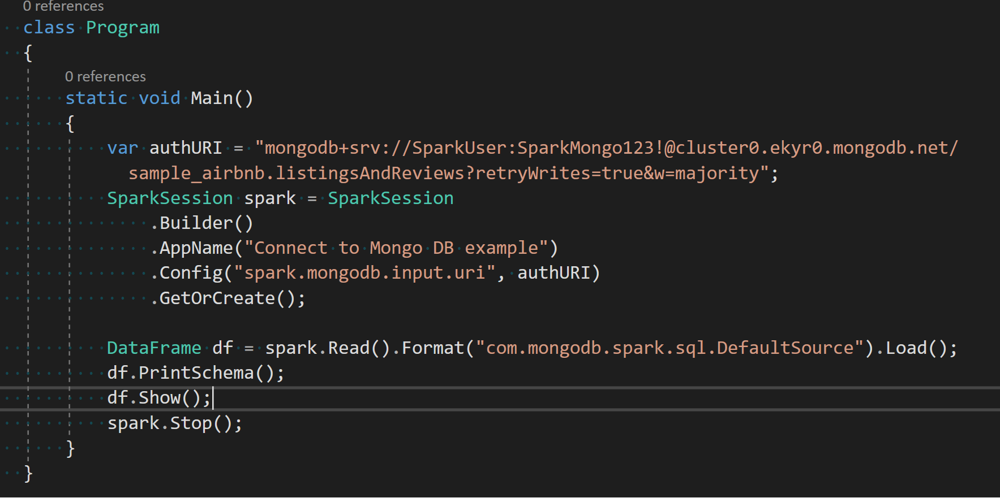

# Connect to MongoDB from .NET for Apache Spark

In this article, you learn how to connect to a MongoDB instance from your .NET for Apache Spark application.

## Set up your MongoDB instance

In order to get .NET for Apache Spark to talk to your MongoDB instance you need to make sure it is set up correctly by doing the following:

1. Create a username and password for your application to connect through, and give the user the necessary permissions/roles using the following command through mongo shell:

    ```bash
    use database
    db.createUser(
      {
        user: "mySparkUser",
        pwd: "<password>",
        roles: [ { role: "userAdminAnyDatabase", db: "admin" }, "readWriteAnyDatabase" ]
      }
    )
    ```

2. Make sure the IP address of the system your .NET for Apache Spark application is running on is whitelisted for the MongoDB server to connect to.

## Configure your .NET for Apache Spark application

1. Have the following variables set to configure your application to talk to the MongoDB instance and read from a collection.
    1. **authURI**: "Connection string authorizing your application to connect to the required MongoDB instance". The format for that is as follows:

        ```
        "mongodb+srv://<username>:<password>@<cluster_address>/<database>.<collection>"
        ```

    2. **username**: Username of the account you created in Step 1 of the previous section
    3. **password**: Password of the user account created
    4. **cluster_address**: hostname/address of your MongoDB cluster
    5. **database**: The MongoDB database you want to connect to
    6. **collection**: The MongoDB collection you want to read

2. Use the `com.mongodb.spark.sql.DefaultSource` format is `spark.Read()` as shown below in a simple code snippet:

    
